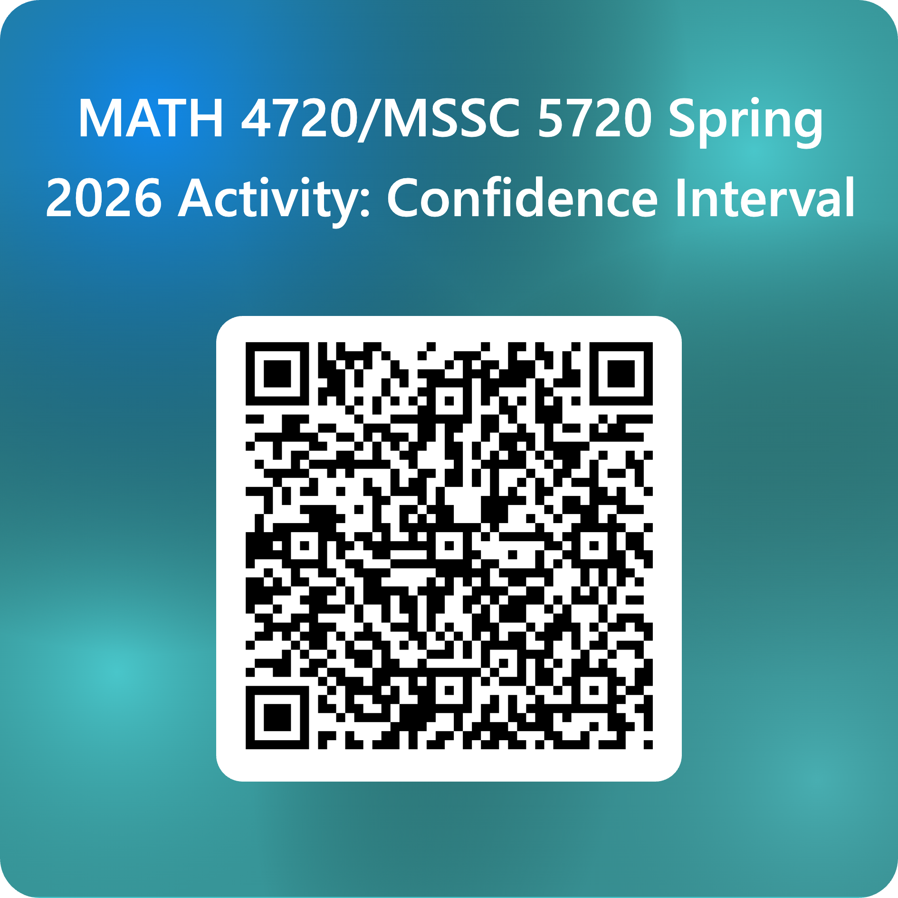

## **Objective**

You will create your own confidence interval for estimating on average how much college students sleep.


## Instructions

(1) Form a group of **four** or **five**. (This is your sample size!)

(2) Record how many hours of sleep each one of you got last night. No need to be integers. Sleeping 7.6 hours totally works! So please use decimal hours as your data. Don't know decimal hours for 7 hours 20 minutes? Use the app below for the answer!

<iframe src="https://cheyu.shinyapps.io/hours/"
        width="100%"
        height="380"
        frameborder="0"></iframe>

(3) Construct your 95\% confidence interval for mean sleeping hours using the formula

$$ \left[ \bar{x} - t_{0.025, n-1} \frac{s}{\sqrt{n}}, \, \bar{x} + t_{0.025, n-1} \frac{s}{\sqrt{n}} \right]$$

where $\bar{x}$ is the sample mean, $s$ is the sample standard deviation, $n$ is the sample size, and $t_{0.025, n-1}$ is the $t$ critical value such that $P(T > t_{0.025, n-1}) = 2.5\%$.


<!-- (4) Let's create a larger sample by considering all of your sleeping hours. Construct its 95\% confidence interval. Note that you need to obtain new $\bar{x}$, $s$, $n$, and $t_{0.025, n-1}$. -->

Go to <https://forms.office.com/r/XP8gyxNadf> to fill out your result!

```{r}
#| echo: false
#| column: body
#| out-width: 30%

```

## Discussion

(@) What does this interval mean in words?

(@) Does the CI tell us about individual sleep hours or about the average student's sleep?

(@) If we repeated this process with new samples, would every interval capture the true population mean?





<!-- | Hours | Minutes | Decimal Hours | -->
<!-- |:------:|:--------:|:--------------:| -->
<!-- | 6 | 10 | 6.17 | -->
<!-- | 6 | 20 | 6.33 | -->
<!-- | 6 | 30 | 6.50 | -->
<!-- | 6 | 40 | 6.67 | -->
<!-- | 6 | 50 | 6.83 | -->
<!-- | 7 | 10 | 7.17 | -->
<!-- | 7 | 20 | 7.33 | -->
<!-- | 7 | 30 | 7.50 | -->
<!-- | 7 | 40 | 7.67 | -->
<!-- | 7 | 50 | 7.83 | -->
<!-- | 8 | 10 | 8.17 | -->
<!-- | 8 | 20 | 8.33 | -->
<!-- | 8 | 30 | 8.50 | -->
<!-- | 8 | 40 | 8.67 | -->
<!-- | 8 | 50 | 8.83 | -->


<!-- ## Mini Check for Understanding -->

<!-- Choose the best fitting distribution for each prompt. You can use the checkboxes and compare with the answer key at the end. -->

<!-- **A.** Number of free throws made by a player out of 10 attempts.   -->
<!-- - [ ] Binomial   -->
<!-- - [ ] Poisson   -->
<!-- - [ ] Normal   -->

<!-- **B.** The time between arrivals of buses at a stop.   -->
<!-- - [ ] Binomial   -->
<!-- - [ ] Poisson   -->
<!-- - [ ] Normal   -->

<!-- **C.** Weights of pumpkins at a county fair.   -->
<!-- - [ ] Binomial   -->
<!-- - [ ] Poisson   -->
<!-- - [ ] Normal   -->

<!-- ::: callout-note -->
<!-- **Tip:** If you are counting successes out of a fixed number of trials with the same probability each time, think **Binomial**. If you are counting how many events occur in a fixed interval, think **Poisson**. If you are measuring a continuous trait with a bell shaped distribution, think **Normal**. -->
<!-- ::: -->

<!-- ## Debrief Prompts -->

<!-- - What features in a scenario tell you that the number of trials is fixed and the probability is constant -->
<!-- - What keywords suggest a count per interval -->
<!-- - When would a Binomial scenario be approximated by a Normal distribution -->

<!-- ## Answer Key -->

<!-- <details> -->
<!-- <summary>Reveal suggested answers</summary> -->

<!-- **Scenarios:**   -->
<!-- 1. **Binomial**. Fixed number of bulbs and each is defective or not with the same probability.   -->
<!-- 2. **Poisson**. Count of arrivals in a fixed time interval.   -->
<!-- 3. **Normal**. Heights are often modeled as approximately normal.   -->
<!-- 4. **Binomial**. Out of 30 students with done or not done as outcomes.   -->
<!-- 5. **Poisson**. Count of cars per fixed time interval.   -->
<!-- 6. **Normal**. IQ scores are modeled as normal by design. -->

<!-- **Mini Check for Understanding:**   -->
<!-- A. **Binomial**   -->
<!-- B. Neither Poisson nor Binomial precisely. The time between events is often modeled by the **Exponential** distribution which is related to the Poisson process.   -->
<!-- C. **Normal**   -->

<!-- </details> -->


<!-- ::: {.callout-caution collapse="true"} -->

<!-- ## For which test data point, the classification result is uncertain or unstable? -->


<!-- ::: -->


<!-- ::: {.callout-caution collapse="true"} -->

<!-- ## Which data point can be labelled as one particular category with 100% certainty, for all different $K$s? -->


<!-- ::: -->


<!-- ::: {.callout-caution collapse="true"} -->

<!-- ## For the blue point, what happened when $K$ increases? Do we change the prediction? What about uncertainty? -->


<!-- ::: -->


<!-- ::: {.callout-caution collapse="true"} -->

<!-- ## If you would like to make a classification rule or set the decision boundary to predict cats or dogs, what would the decision boundary look like? Why? -->

<!-- ::: -->


<!-- 1. **Income of households in a country** – Skewed heavily to the right, not symmetric. Better: Lognormal or Pareto.   -->
<!-- 2. **Time between buses arriving at a stop** – Waiting times are exponential, not Poisson. Better: Exponential distribution.   -->
<!-- 3. **Grades in a course (A, B, C, D, F)** – Multiple ordered categories, not just two outcomes. Better: Multinomial or ordinal logistic.   -->
<!-- 4. **Daily stock price changes** – Heavy tails with extreme values. Better: Student’s t or heavy-tailed distributions.   -->
<!-- 5. **Number of cars a family owns** – Not fixed trials, not symmetric continuous. Better: Geometric or negative binomial.   -->
<!-- 6. **Survival time of patients after surgery** – Skewed times to event, cannot be negative. Better: Exponential, Weibull, or survival analysis methods. -->
