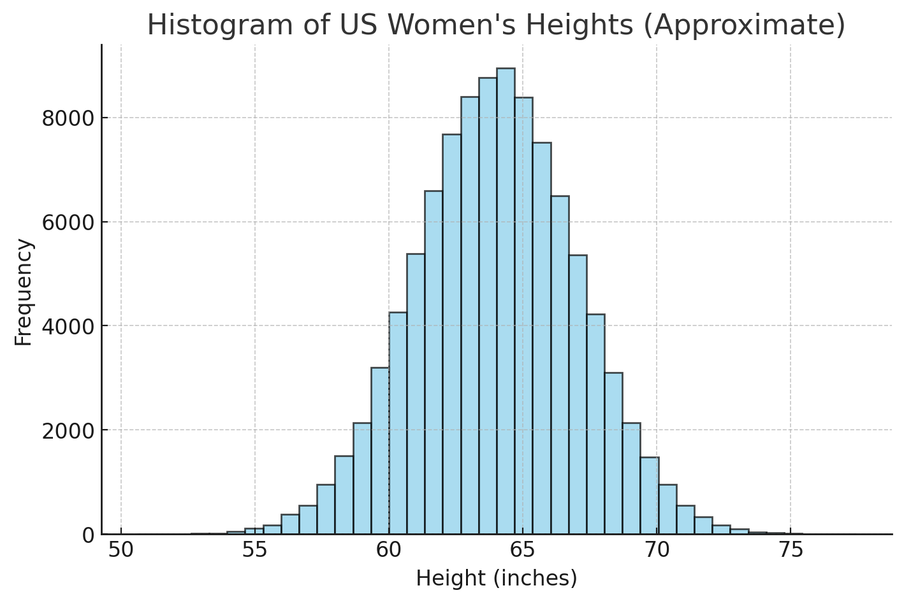
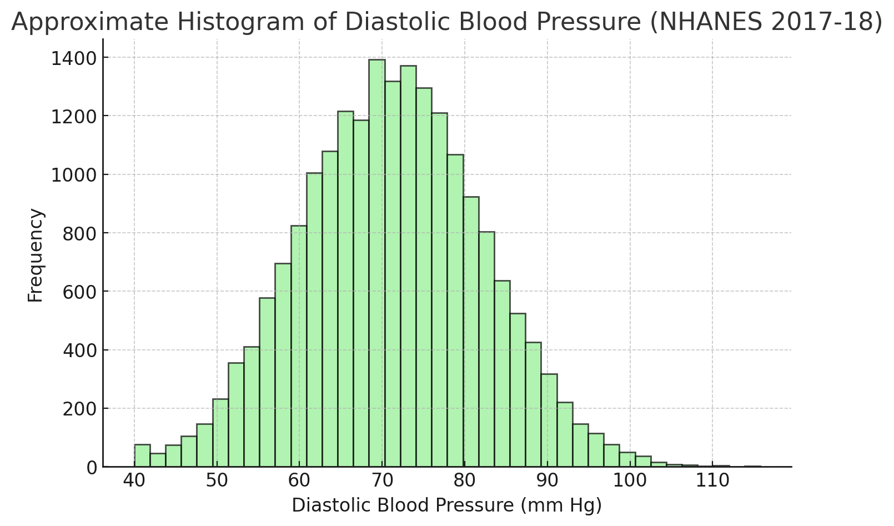

## **Objective**

You will practice identifying which type of probability distribution (**binomial**, **Poisson**, or **normal**) can approximately fit or describe a given real-world context, and explain why.


## Instructions

(1) Form a group of **four** or **five**.

(2) Scan the QR code, or go to <https://forms.office.com/r/X58MYTbEne> to fill out your names.

(3) In the form, read each scenario, choose the most appropriate distribution, or all three distributions may not be appropriate to model the scenario.

(4) The first group with the most correct answers will get a hex sticker, and share their reasoning!
<!-- # ```{r} -->
<!-- # #| echo: false -->
<!-- # #| out-width: 10% -->
<!-- # #| fig-align: left -->
<!-- # knitr::include_graphics("https://raw.githubusercontent.com/rstudio/hex-stickers/refs/heads/main/SVG/ggplot2.svg") -->
<!-- # ``` -->


```{r}
#| echo: false
#| column: margin

```

## Scenarios

(@) A quality inspector checks 20 light bulbs, each having a 5 percent chance of being defective. What distribution models the number of defective bulbs?

(@) The number of emails arriving in Dr. Yu's inbox between 2 and 3 pm. 

(@) The distribution of households income in 2010 in the USA.

```{r}
#| echo: false
#| out-width: 80%
#| fig-align: center
knitr::include_graphics("https://upload.wikimedia.org/wikipedia/commons/0/0d/Distribution_of_Annual_Household_Income_in_the_United_States_2010.png")
```

(@) The number of students who show up to class without doing their homework, out of 30 students.

<!-- (@) Time between buses arriving at a stop The Commons. -->

(@) The number of cars passing through a toll booth in a 10 minute interval.

(@) The heights of adult women in the United States.

```{r}
#| echo: false
#| out-width: 50%
#| fig-align: center
#| fig-asp: 0.5

```


(@) Students' letter grades in Dr. Yu's MATH 4720 class (A, B, C, D, F).

(@) The distribution of blood pressure of adults in Milwaukee.

```{r}
#| echo: false
#| out-width: 50%
#| fig-align: center
#| fig-asp: 0.5

```

<!-- (@) Survival time of cancer patients after chemotherapy. -->


## Quick Reference: Key Features

| Distribution | When to use | Common parameters |
|---|---|---|
| **Binomial** | Fixed number of trials, two outcomes per trial, constant probability, independent trials | $(n)$ number of trials, $(\pi)$ probability of success |
| **Poisson** | Counting events in a fixed interval of time or space, events occur independently at a constant average rate | $(\lambda)$ average rate per interval |
| **Normal** | Continuous measurements that are symmetric around a center with bell shape | $(\mu)$ mean, $(\sigma)$ standard deviation |





<!-- ## Mini Check for Understanding -->

<!-- Choose the best fitting distribution for each prompt. You can use the checkboxes and compare with the answer key at the end. -->

<!-- **A.** Number of free throws made by a player out of 10 attempts.   -->
<!-- - [ ] Binomial   -->
<!-- - [ ] Poisson   -->
<!-- - [ ] Normal   -->

<!-- **B.** The time between arrivals of buses at a stop.   -->
<!-- - [ ] Binomial   -->
<!-- - [ ] Poisson   -->
<!-- - [ ] Normal   -->

<!-- **C.** Weights of pumpkins at a county fair.   -->
<!-- - [ ] Binomial   -->
<!-- - [ ] Poisson   -->
<!-- - [ ] Normal   -->

<!-- ::: callout-note -->
<!-- **Tip:** If you are counting successes out of a fixed number of trials with the same probability each time, think **Binomial**. If you are counting how many events occur in a fixed interval, think **Poisson**. If you are measuring a continuous trait with a bell shaped distribution, think **Normal**. -->
<!-- ::: -->

<!-- ## Debrief Prompts -->

<!-- - What features in a scenario tell you that the number of trials is fixed and the probability is constant -->
<!-- - What keywords suggest a count per interval -->
<!-- - When would a Binomial scenario be approximated by a Normal distribution -->

<!-- ## Answer Key -->

<!-- <details> -->
<!-- <summary>Reveal suggested answers</summary> -->

<!-- **Scenarios:**   -->
<!-- 1. **Binomial**. Fixed number of bulbs and each is defective or not with the same probability.   -->
<!-- 2. **Poisson**. Count of arrivals in a fixed time interval.   -->
<!-- 3. **Normal**. Heights are often modeled as approximately normal.   -->
<!-- 4. **Binomial**. Out of 30 students with done or not done as outcomes.   -->
<!-- 5. **Poisson**. Count of cars per fixed time interval.   -->
<!-- 6. **Normal**. IQ scores are modeled as normal by design. -->

<!-- **Mini Check for Understanding:**   -->
<!-- A. **Binomial**   -->
<!-- B. Neither Poisson nor Binomial precisely. The time between events is often modeled by the **Exponential** distribution which is related to the Poisson process.   -->
<!-- C. **Normal**   -->

<!-- </details> -->


<!-- ::: {.callout-caution collapse="true"} -->

<!-- ## For which test data point, the classification result is uncertain or unstable? -->


<!-- ::: -->


<!-- ::: {.callout-caution collapse="true"} -->

<!-- ## Which data point can be labelled as one particular category with 100% certainty, for all different $K$s? -->


<!-- ::: -->


<!-- ::: {.callout-caution collapse="true"} -->

<!-- ## For the blue point, what happened when $K$ increases? Do we change the prediction? What about uncertainty? -->


<!-- ::: -->


<!-- ::: {.callout-caution collapse="true"} -->

<!-- ## If you would like to make a classification rule or set the decision boundary to predict cats or dogs, what would the decision boundary look like? Why? -->

<!-- ::: -->


<!-- 1. **Income of households in a country** – Skewed heavily to the right, not symmetric. Better: Lognormal or Pareto.   -->
<!-- 2. **Time between buses arriving at a stop** – Waiting times are exponential, not Poisson. Better: Exponential distribution.   -->
<!-- 3. **Grades in a course (A, B, C, D, F)** – Multiple ordered categories, not just two outcomes. Better: Multinomial or ordinal logistic.   -->
<!-- 4. **Daily stock price changes** – Heavy tails with extreme values. Better: Student’s t or heavy-tailed distributions.   -->
<!-- 5. **Number of cars a family owns** – Not fixed trials, not symmetric continuous. Better: Geometric or negative binomial.   -->
<!-- 6. **Survival time of patients after surgery** – Skewed times to event, cannot be negative. Better: Exponential, Weibull, or survival analysis methods. -->
