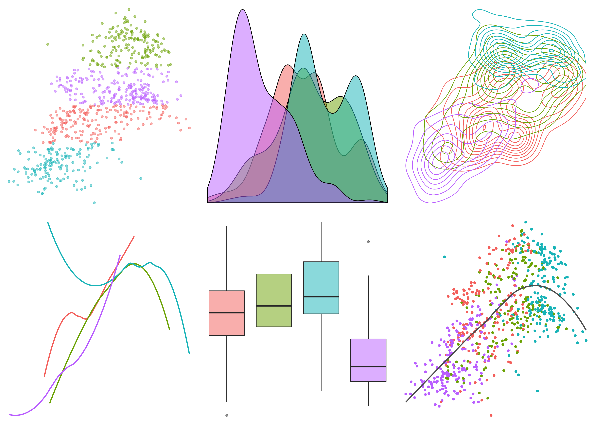

Starting from simple linear regression, this course provides a brief, yet complete foundation for the understanding of basic regression theory and applications that is a core of supervised learning in statistical machine learning. Topics include multiple linear regression, diagnostic analysis, collinearity, nonparametric regression, variable selection, generalized linear models and other selected topics. This course focus on data analysis rather than mathematical derivation. For advanced regression topics, consider MSSC 6250 Statistical Machine Learning.

{fig-alt="A series of six, generic data visualizations: a scatterplot, a density plot, a contour plot, a line plot, a box plot, and another scatterplot." width="700"}
