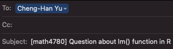

Download syllabus at [`r fontawesome::fa("file-pdf")`](/documents/syllabus-4780-102-f26.pdf)

<!-- [**Syllabus for Section 102 3:30 - 4:45 PM**](/documents/syllabus-4720-102-f25.pdf). -->

## Time and location

|          | Day     | Time           | Location       |
|----------|---------|----------------|----------------|
| Sec 104  | Tu & Th | 2 - 3:15 PM | Cudahy Hall 118 |

## Office Hours

-   My in-person office hours are TuTh 4:50 – 5:50 PM and We 12 - 1 PM in Cudahy Hall room 353.

-   We can schedule an online meeting via Microsoft Teams if you need/prefer.

## Prerequisites

- MATH 2780, MATH 4720, or an equivalent introductory statistics course.

- Programming experience is helpful because the course involves doing regression analysis using [\textsf{R}](https://www.r-project.org/about.html)/[\textsf{Python}](https://https://www.python.org/) programming language.

- Some exposure to linear algebra at the level of MATH 3100 is helpful because some matrix operations are used for modeling and computation.

- Prior coursework in MATH 4700 and MATH 4710 would also be helpful, but it is not required.

- Talk to me if you are not sure whether this is the right course for you.


## E-mail Policy

- I will attempt to reply to your email quickly, usually **within 24 hours**.

- **Expect a reply on Monday if you send a question over the weekend**. If you do not receive a response from me within two days, resend your question or comment in case there was a "mix-up" with email communication. I hope this will not happen.

- Please start your email subject line with **[math4780]** or **[mssc5780]** followed by a clear description of your question. See an example in Figure 1.


```{r}
#| echo: false
#| fig-cap: Email Subject Line Example
#| out-width: 100%

```

- Email etiquette is important. Please read this [article](https://www.insidehighered.com/views/2015/04/16/advice-students-so-they-dont-sound-silly-emails-essay) to learn more about email etiquette.

- I am more than happy to answer your questions about this course or statistics in general. However, due to time constraints, I may choose **NOT** to respond to students' emails if

    1. The student could answer their own inquiry by reading the syllabus or information on the course website or D2L.
    
    2. The student is asking for an extra-credit opportunity. The answer is "no".
    
    3. The student is requesting an extension on homework. The answer is "no".
    
    4. The student is asking for a grade to be raised for no legitimate reason. The answer is "no".
    
    5. The student is sending an email without proper etiquette.


## Textbooks and References

- **[IS] (optional)** [*Introduction to Statistics*](https://chenghanyu-introstatsbook.netlify.app/), by Dr. Cheng-Han Yu. This is a useful resource for reviewing basic probability, statistics, and simple linear regression.

- **[LRA] (optional)** [*Introduction to Linear Regression Analysis, 6th edition*](https://www.wiley.com/en-us/Introduction+to+Linear+Regression+Analysis%2C+6th+Edition-p-9781119578727), by D. C. Montgomery, E. A. Peck, and G. G. Vining. Publisher: Wiley. This is a graduate-level book that requires some knowledge of matrix algebra.

- **[CAR] (optional)** [*An R Companion to Applied Regression*](https://socialsciences.mcmaster.ca/jfox/Books/Companion/), by John Fox and Sanford Weisberg. Publisher: SAGE. This book makes regression analysis in R easier, especially through the `car` and `effects` packages.

- **[RD] (optional)** [*Regression Diagnostics*](https://socialsciences.mcmaster.ca/jfox/Books/RegressionDiagnostics/index.html), by John Fox. Publisher: SAGE. This is a concise book for learning regression diagnostics.

- **[CMR] (optional)** [*Classical and Modern Regression with Applications*](https://www.amazon.com/Classical-Regression-Applications-Duxbury-Classic/dp/0534380166), by Raymond H. Myers. Publisher: Duxbury Press. This was one of the textbooks I used when I was a master's student.

- **[AR] (optional)** [*All of Regression*](https://www.amazon.com/dp/1009702815?lv=shuf&channelId=500&plpRedirect=mhFallback), by Isabella Verdinelli and Larry Wasserman. Publisher: Cambridge University Press. This is a clear and concise graduate-level book that covers many modern regression topics.

## Course Management

- All course materials are posted on our course website <https://math4780-f26.github.io/website/>.

- Course grades are saved and managed in **[D2L](https://d2l.mu.edu/d2l/home/656221) > Assessments > Grades**.

- Coursework is submitted to **[D2L](https://d2l.mu.edu/d2l/home/656221) > Assessments > Dropbox**.

- Check **[D2L](https://d2l.mu.edu/d2l/home/656221) > News** for new announcements.


## Programming Languages

- You may use any programming language to do you work.


## Grading Policy

Students in this class may range from undergraduate students to graduate students, so it makes sense to evaluate student performance using different point scales for MATH 4780 and MSSC 5780.

For students in **MATH 4780**, the final grade is earned out of **1000 total points** distributed as follows:

| Category | Points |
| --- | ---: |
| Homework 1 to 6 | 150 |
| In-class exam | 250 |
| Final project | 400 |
| Class participation | 200 |
| **Total** | **1000** |

For students in **MSSC 5780**, the final grade is earned out of **1200 total points** distributed as follows:

| Category | Points |
| --- | ---: |
| Homework 1 to 6 | 150 |
| In-class exam | 250 |
| Final project | 400 |
| Class participation | 200 |
| MSSC work | 200 |
| **Total** | **1200** |

- You will **NOT** be allowed to complete any extra-credit projects, homework, or exams to compensate for a poor average. Everyone must be given the same opportunity to do well in this class. Individual exams will **NOT** be curved.

- The final grade is based on your percentage of points earned out of 1000 or 1200 points and the grade-percentage conversion table. $[x, y)$ means greater than or equal to $x$ and less than $y$. For example, 94.1 is in $[94, 100]$, so the grade is A, and 92.8 is in $[90, 94)$, so the grade is A-.

```{r}
#| echo: false
letter <- c("A", "A-", "B+", "B", "B-", "C+", "C", "C-",
            "D+", "D", "F")
percentage <- c("[94, 100]", "[90, 94)", "[87, 90)", "[83, 87)", "[80, 83)",
                "[77, 80)", "[73, 77)", "[70, 73)", 
                "[65, 70)", "[60, 65)", "[0, 60)")
grade_dist <- data.frame(Grade = letter, Percentage = percentage)
knitr::kable(grade_dist, longtable = TRUE, 
             caption = "Grade-Percentage Conversion")
```

- This is not a course in which most students receive a grade of A. If you want to earn a good grade, study hard. No pain, no gain.

### Homework

- Homework will be assigned through the course website.

- To submit your homework, please go to **D2L > Assessments > Dropbox** and upload your homework in **PDF** format.

- There will be 6 graded homework sets: Homework 1 to Homework 6.

- Some questions are required for MSSC 5780 students.

- You will get a better understanding of the material if you discuss it with others. However, you must submit **your own work**.

- **No late homework will be accepted, and you will not be allowed to make up missed homework.**

- **Handwriting is not allowed for the data analysis parts.**

- Generative AI (GenAI) is allowed for homework, but you **must carefully cite it or reveal your use of AI.** See @sec-genai for more details.

### In-Class Exam

- The in-class exam covers materials from **Weeks 1 to 10** on simple and multiple linear regression.

- Some questions are required for MSSC 5780 students.

- No cheat sheets or GenAI are allowed unless explicitly stated otherwise.

- **No make-up exam** will be given unless you have an [excused absence](https://bulletin.marquette.edu/policies/attendance/undergraduate/).

### Class Participation

- You will be presenting exercise problems or mini projects.

- More details will be released later.

### Final Project

- A detailed final project guideline will be released later.

- Generative AI (GenAI) is allowed for the final project, but you **must carefully cite it or reveal your use of AI.** See @sec-genai for more details.

### MSSC Work

- MSSC 5780 students will complete additional work worth 200 points.

- Details will be released later.


## Generative Artificial Intelligence (GenAI) Policy {#sec-genai}


- *You are responsible for the content of all work submitted for this course.* 

- For your homework, take-home exams, or any take-home work, you are allowed to use generative AI tools such as ChatGPT to generate a draft of text of your work.

- To avoid any academic integrity issue, you **must cite your AI usage, or screenshot your entire AI usage history**. Check the followings on how to cite it.

  + [How to cite ChatGPT](https://apastyle.apa.org/blog/how-to-cite-chatgpt)
  + [How to Cite AI-Generated Content](https://guides.lib.purdue.edu/c.php?g=1371380&p=10135074)
  
- If you use GenAI, please include the followings in your submitted work:

  + **Why/How I used AI (prompts or questions)**
  + **Generated output (screenshot or copy-paste excerpt)**
  + **How I used the output**


Here is an example.

- **Why/How I used AI (prompts and questions)**
  + *I asked ChatGPT to generate a histogram using R.*
 
- **Generated output (screenshot or copy-paste excerpt)**

```{r}
#| fig-align: center
#| echo: false
knitr::include_graphics("images/genai_screenshot.png")
```


- **How I used the output**
  + *I reviewed the suggestions, but I did not use the exact code. Instead, I change the code format and breaks value to 50.*


## Academic Integrity

- Watch the video below to learn the importance of using GenAI properly.

```{=html}
<!-- Replace host and id with yours -->
<div style="position:relative; padding-bottom:56.25%; height:0; overflow:hidden;">
  <iframe
    src="https://marquette.hosted.panopto.com/Panopto/Pages/Viewer.aspx?id=36be65f1-ba4f-457d-bad3-b1b8013b9448&start=0.5"
    title="GenAI and Academic Integrity"
    style="position:absolute; top:0; left:0; width:100%; height:90%; border:0;"
    allow="encrypted-media; fullscreen; picture-in-picture"
    allowfullscreen
  ></iframe>
</div>
```


- This course expects all students to follow University and College statements on [academic integrity](https://bulletin.marquette.edu/policies/academic-integrity/).

- **Honor Pledge and Honor Code**: *I recognize the importance of personal integrity in all aspects of life and work. I commit myself to truthfulness, honor, and responsibility, by which I earn the respect of others. I support the development of good character, and commit myself to uphold the highest standards of academic integrity as an important aspect of personal integrity. My commitment obliges me to conduct myself according to the Marquette University Honor Code*.


## Accommodation

If you need to request accommodations, or modify existing accommodations that address disability-related needs, please contact [Disability Service](https://www.marquette.edu/disability-services/).


## Important dates

-   **Sep 7:** Labor Day
-   **Sep 8:** Last day to add/swap/drop
-   **Oct 20:** In-class Midterm Exam
-   **Oct 22-23:** Midterm break
-   **Oct 27:** Midterm grade submission
-   **Nov 20:** Withdrawal deadline
-   **Nov 25-29:** Thanksgiving holiday
-   **Dec 12**: Last day of class
-   **Dec 17**: In-class Final Exam
-   **Dec 22**: Final grade submission

Click [here](https://www.marquette.edu/central/registrar/2026-fall-academic-calendar.php) for the full Marquette academic calendar.
