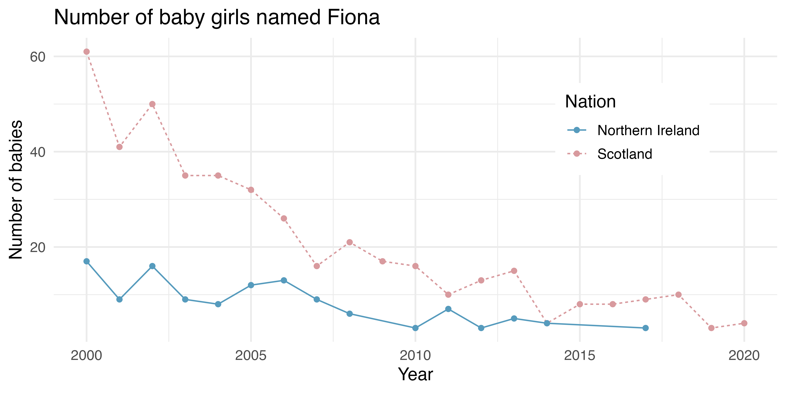

::: callout-important
[Due **Friday, Jan 23, 11:59 PM**]{.red}
:::

- Homework 1 covers Week 1 course materials.

- Please submit your work in *one* **PDF** file to **D2L > Assessments > Dropbox**. Multiple files or a file that is not in pdf format is not accepted. 

- In your homework, please number questions **in order**.

<!-- - Your homework can be handwritten or typewritten. If it is handwritten, make sure you scan your work well, and put everything in one single pdf. -->

<!-- - If you type your answers, make sure there are no typos. I grade your work based on *what you show, not what you want to show*. If you choose to handwrite your answers, write them neatly. If I can’t read your handwriting, your answer is judged as wrong. -->

- Questions started with **(MSSC)** are *required* for MSSC 5720 students, and optional for MATH 4720 students.


# Homework Questions

```{r, echo=FALSE}
## BIO 1-2 3
```
(@) **Data Type.** Identify each of the following as numerical or categorical data.
    (a) The names of the pharmaceutical companies that manufacture aspirin tablets
    (b) The colors of pills
    (c) The weights of aspirin tablets

```{r}
#| echo: true
  # (a) Categorical
  # (b) Categorical
  # (c) Numerical
```


<br>

(@) **Level of Measurements.** Identify the level of measurement used in each of the following.
    (a) The weights of people in a sample of Marquette engineering students.
    (b) A physician's descriptions of "abstains from alcohol, light drinker, moderate drinker, heavy drinker."
    (c) Tree classifications of "oak, maple, elm."
    (d) Bob measures time in days, with 0 corresponding to his birth date. The day before his birth is -1, the day after his birth is +1, and so on. Bib has converted the dates of major historical events to his numbering system. What is the level of measurement of these numbers?

```{r}
#| echo: true
  # (a) Ratio
  # (b) Ordinal
  # (c) Nominal
  # (d) Interval
```

<br>

```{r, echo=FALSE}
## BIO 1-2, 14,15,16,17
```
(@) **Discrete vs Continuous.** Determine whether the data are discrete or continuous.
    (a) The length of stay (in days) for each baby in a sample of babies born in Wisconsin.
    (b) Several subjects are randomly selected and their heights are recorded.
    (c) From a data set, we see that a female had an arm circumference of 32.49 cm.
    (d) A sample of married couples is randomly selected and the number of children in each family is recorded.
 
```{r}
#| echo: true
  # (a) Discrete
  # (b) Continuous
  # (c) Continuous
  # (d) Discrete
```

<br>   


```{r, echo=FALSE}
## BIO 1-3 12,13,14
```
(@) **Sampling Method.** Identify which of these types of sampling is used: random, stratified, or cluster.
    (a) Dr. Yu surveys his statistics class by identifying groups of males and females, then randomly selecting 5 students from each of those two groups.
    (b) Dr. Yu conducts a survey by randomly selecting 3 different classes at Marquette and surveying all of the students as they left those classes.
    (c) 532 subjects were randomly assigned to (1) regular exercise or (2) no exercise groups to study the effectiveness of exercise in lowering blood pressure.


```{r}
#| echo: true
  # (a) Stratified
  # (b) Cluster
  # (c) Random
```


<br>


```{r, echo=FALSE}
## BIO 1-3 21, 22

## (a) self-reported voluntary response sample may not be representative, and may be biased. The question is posted in E-newsletter, so the sample is biased from the beginning
## (b) Male physicians only. Better to include male and female who are not physicians.
```
(@) **Study Type.** Determine whether the study is an experiment or an observational study, then identify a major problem with this study.
    (a) In a survey conducted by *USA Today*, 1072 Internet users chose to respond to the question:"How often do you seek medical information online?" 38% of the respondents said "frequently."
    (b) The Physicians' Health Study involved 22,071 male physicians. Based on random selections, 11,037 of them were treated with aspirin and other other 11,034 were given placebos. The study was stopped early because it became clear that aspirin reduced the risk of myocardial infarctions by a substantial amount.


```{r}
#| echo: true
  # (a) Observational: self-reported voluntary sample may not be representative and may be biased. The question is posted in E-newsletter, so the sample is biased from the begining.
  # (b) Experiment: Male physicians only. Better to include male and female who are not physicians.
```

<br>


(@) **(MSSC) UK baby names.** The visualization below shows the number of baby girls born in the United Kingdom (comprised of England & Wales, Northern Ireland, and Scotland) who were given the name "Fiona" over the years.
    (a) List the variables you believe were necessary to create this visualization.
    (b) Indicate whether each variable is numerical or categorical. If numerical, identify as continuous or discrete. If categorical, indicate if the variable is ordinal.
```{r}
#| echo: false
#| out-width: 80%
#| fig-align: center
## OpenIntro 1-15

```


```{r}
#| echo: true
  # (a) Year, number of baby girls named Fiona born in that year, nation. 
  # (b) Year (numerical, discrete), number of baby girls named Fiona born in that year (numerical, discrete), nation (categorical, nominal).
```


(@) **AI Usage Declaration.** Using GenAI is permitted for this course. If you choose to use GenAI to assist with your homework, you must include a brief statement documenting your use. Please provide the following information:
    (a) **Why/How I Used AI** Why do you need to use GenAI? Which tool did you use? Describe your prompts or questions. What and how did you ask the AI to help you?
    (b) **Generated Output** Include a screenshot or excerpt (copy and paste) of the AI’s response.
    (c) **How I Used the Output** Did you revise it? Did you use it directly, or compare it with your answers? What decisions did you make based on the output?

