# {visibility="hidden"}

\def\bx{\mathbf{x}}
\def\bg{\mathbf{g}}
\def\bw{\mathbf{w}}
\def\bbeta{\boldsymbol \beta}
\def\bX{\mathbf{X}}
\def\by{\mathbf{y}}
\def\bH{\mathbf{H}}
\def\bI{\mathbf{I}}
\def\bS{\mathbf{S}}
\def\bW{\mathbf{W}}
\def\T{\text{T}}
\def\cov{\mathrm{Cov}}
\def\cor{\mathrm{Corr}}
\def\var{\mathrm{Var}}
\def\E{\mathrm{E}}
\def\bmu{\boldsymbol \mu}
\DeclareMathOperator*{\argmin}{arg\,min}
\def\Trace{\text{Trace}}


```{r}
#| label: setup
#| include: false
#| eval: true
library(countdown)
library(emo)
library(knitr)
library(gt)
library(gtExtras)
library(ggplot2)
library(tidyverse)
library(tidymodels)
# library(ISLR2)
# library(genridge)
# library(glmnet)
# library(gam)
# library(splines)
# library(MASS)

# library(ElemStatLearn)
knitr::opts_chunk$set(
    fig.asp = 0.618,
    fig.align = "center",
    out.width = "100%",
    fig.retina = 10,
    fig.path = "images/01-syllabus",
    message = FALSE,
    global.par = TRUE
)
options(
  htmltools.dir.version = FALSE,
  dplyr.print_min = 6, 
  dplyr.print_max = 6,
  tibble.width = 80,
  width = 80,
  digits = 3
  )
hook_output <- knitr::knit_hooks$get("output")
knitr::knit_hooks$set(output = function(x, options) {
  lines <- options$output.lines
  if (is.null(lines)) {
    return(hook_output(x, options))  # pass to default hook
  }
  x <- unlist(strsplit(x, "\n"))
  more <- "..."
  if (length(lines)==1) {        # first n lines
    if (length(x) > lines) {
      # truncate the output, but add ....
      x <- c(head(x, lines), more)
    }
  } else {
    x <- c(more, x[lines], more)
  }
  # paste these lines together
  x <- paste(c(x, ""), collapse = "\n")
  hook_output(x, options)
})
```

<!-- begin: webr fodder -->



<!-- end: webr fodder -->

<!-- ## Code -->

<!-- When you click the **Render** button a presentation will be generated that includes both content and the output of embedded code. You can embed code like this: -->

<!-- ```{r} -->
<!-- 1 + 1 -->
<!-- ``` -->


<!-- ```{webr} -->
<!-- fit = lm(mpg ~ am, data = mtcars) -->
<!-- summary(fit) -->
<!-- ``` -->


# Taipei, Taiwan {background-image="images/01-syllabus/taiwan.jpeg" background-size="cover" background-position="50% 50%" background-color="#447099"}

::: {.absolute bottom="50" right="10"}
{width="500" fig-alt="Taiwan location"}
:::


::: notes

- Hello everyone, how are you? I hope you have a great summer. Welcome to 4720 Introduction to Statistics course. I am your instructor Cheng-Han Yu.  
- First thing first. Get to know each other. Let me first introduce myself. I was born and grew up in Taipei, Taiwan, my home country, which is a island right next to China. Taipei is a big city in terms of population. It is about the same population size as Chicago. This building is called Taipei 101, which is the tallest building in Taiwan.

:::

## My Journey {background-image="images/01-syllabus/sample_gate.png" background-size="cover" background-position="50% 50%" background-opacity="0.3"}

-   Assistant Professor (2020/08 - )

```{r}
#| out-width: 20%
#| fig-align: center
#| echo: false

```

-   Postdoctoral Fellow

```{r}
#| out-width: 20%
#| fig-align: center
#| echo: false

```

-   PhD in Statistics

```{r}
#| out-width: 20%
#| fig-align: center

```

-   MA in Economics/PhD program in Statistics

```{r}
#| out-width: 20%
#| fig-align: center

```


::: notes

After college, working and doing military service for several years, I came to the US for my PhD degree. Originally I would like to study economics, but then I switched my major to statistics. 
- I got my master degree in economics from Indiana University Bloomington, then I transferred to UC Santa Cruz to finish my PhD studies. 
- Then I spent two years doing my postdoctoral research at Rice University in Houston, Texas.
- Finally, in fall 2020, I came to Marquette being an assistant professor.
- Midwest/Indiana-West/California-South/Texas-Midwest/Wisconsin
- Been to any one of these universities/cities? 
- The most beautiful campus.
- Who are international students? I can totally understand how hard studying and living in another country. Feel free to share your stories or difficulties, and I am more than happy to help you if you have any questions.
- Poor listening and speaking skills. I was shy. 
- Usually if it is a class less than 30 students, I'd like to ask students to briefly introduce themselves, but this semester we have a big class, bear with me if I can't recognize you.

:::

## My Research

-   Bayesian spatio-temporal modeling and algorithms in neuroimaging, epidemiology, and more
-   Bayesian Deep Learning for image classification and segmentation
<!-- -   Efficient MCMC for big $n$ big $p$ streaming data -->
-   Statistical and data science education

::: columns
::: {.column width="50%"}
**fMRI**

```{r}
#| out.width: 100%
#| fig.align: center
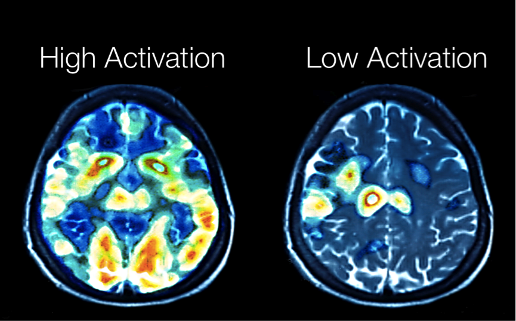
```
:::

::: {.column width="50%"}
**EEG**

```{r}
#| out.width: 100%
#| fig.align: center
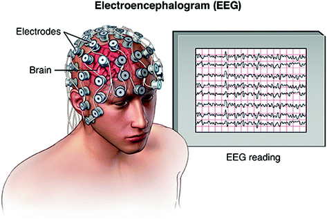
```
:::
:::


## How to Reach Me

- Office hours **TuTh 4:50 - 5:50 PM** and **We 12 - 1 PM** in **Cudahy Hall 353**.

- `r emo::ji('e-mail')`  <cheng-han.yu@marquette.edu> 
  + Answer your question within 24 hours. 
  + Expect a reply on **Monday** if shoot me a message **on weekends**.
  + Start your subject line with **[math4780]** or **[mssc5780]** followed by a **clear description of your question**. 
  

```{r}
knitr::include_graphics("./images/01-syllabus/email.png")
```
  + I will **NOT** reply your e-mail if ... **Check the email policy in the [syllabus](https://math4780-f26.github.io/website/course-syllabus.html)**!


<!-- ## Course Materials -->

<!-- - Course Website - <https://math4720-f26.github.io/website/> -->


<!-- ```{r} -->
<!-- #| fig-align: center -->
<!-- #| fig-link: https://math4720-f26.github.io/website/ -->
<!-- 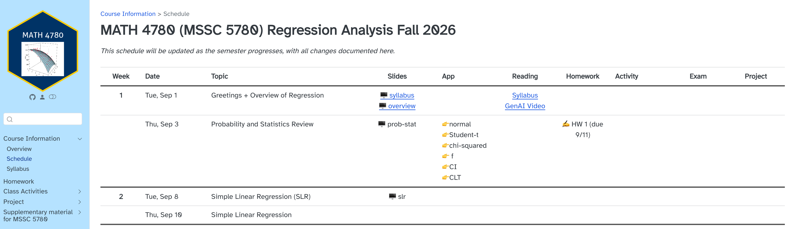 -->
<!-- ``` -->

<!-- - **All course materials and information** can be found on this website. Bookmark it! -->


## Textbook (Really?!)

:::: r-stack

{.fragment width="1800" height="1000"}

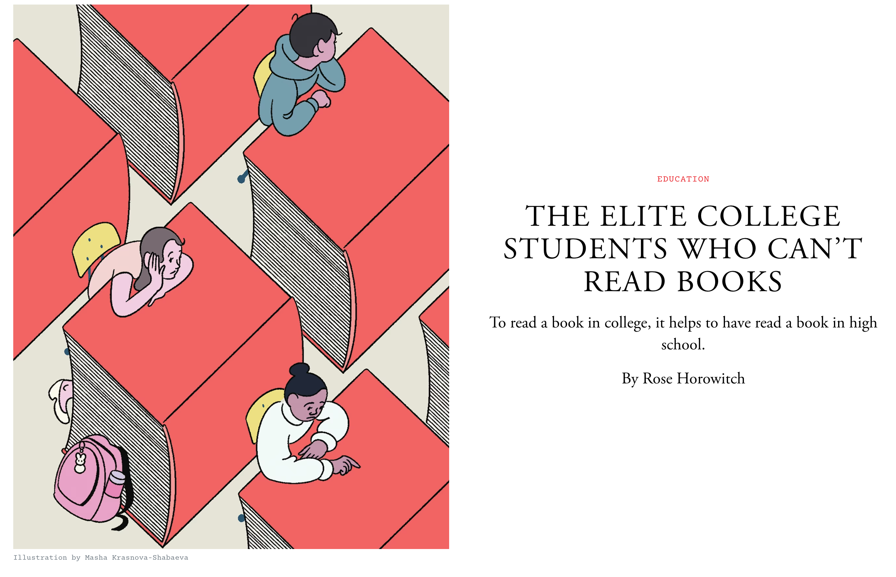{.fragment width="1600" height="900"}

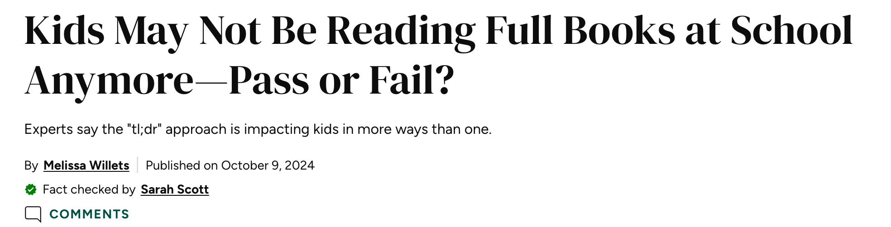{.fragment width="1400" height="400"}

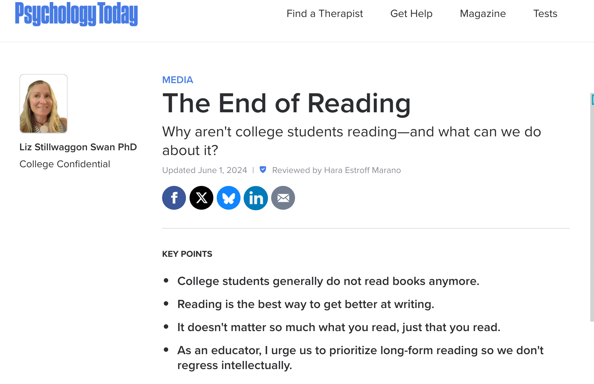{.fragment width="1200" height="800"}
::::

::: notes

It does not mean we don't learn anymore. In fact, we learn and study in a different way. Watch videos, taking online short courses, read online tutorials or blogs.
:::


## References (LRA)

::: columns
::: {.column width="50%"}
-   [*Introduction to Linear Regression Analysis, 6th edition*](https://www.wiley.com/en-us/Introduction+to+Linear+Regression+Analysis%2C+6th+Edition-p-9781119578727), by D. C. Montgomery, E. A. Peck and G. G. Vining. Publisher: Wiley. <!-- - The 5th edition is sufficient. -->
-   Ch 1 \~ 10, 13.
-   Careful about typos; introduce regression more traditionally

In the Preface, 

> *The book ... for a course taken by seniors and 1st-year graduate students....*

> *Some knowledge of matrix algebra is also necessary.*
:::

::: {.column width="50%"}
```{r}
#| out-width: 60%
#| fig-align: center
#| fig-link: https://www.wiley.com/en-us/Introduction+to+Linear+Regression+Analysis%2C+6th+Edition-p-9781119578727
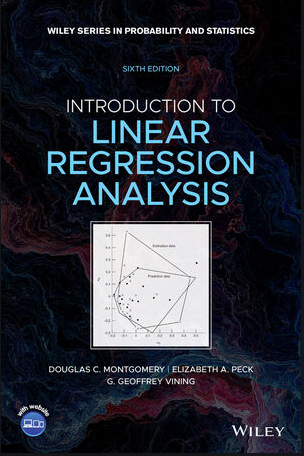
```
:::
:::

::: notes
-   Course materials are grabbed from several books and resources.

-   Our [course website](https://math4780-f23.github.io/website) would be helpful.
:::

## References (CMR)

::: columns
::: {.column width="50%"}
-   [*Classical and Modern Regression with Applications*](https://www.amazon.com/Classical-Regression-Applications-Duxbury-Classic/dp/0534380166/ref=pd_lpo_14_t_0/135-5067421-1903413?_encoding=UTF8&pd_rd_i=0534380166&pd_rd_r=03ae154d-b095-4e98-9a72-e3dc30666c1f&pd_rd_w=tDw1K&pd_rd_wg=OIjNY&pf_rd_p=3b5203d9-bdd0-47f6-97e5-387010fc3251&pf_rd_r=PY1Q3JBBS4PS1M7D7DZF&psc=1&refRID=PY1Q3JBBS4PS1M7D7DZF), by Raymond Myers. Publisher: Duxbury Press.
-   Ch 1 \~ 8.
-   The textbook when I was a master student at Indiana University.
-   Outdated (published in 1990) and no code involved.
- Explains concepts well.

In the Preface, 

> *The book ... for seniors and graduate students majoring in statistics or user subject-matter fields.*

:::

::: {.column width="50%"}
```{r}
#| out-width: 60%
#| fig-align: center
#| fig-link: https://www.amazon.com/Classical-Regression-Applications-Duxbury-Classic/dp/0534380166/ref=pd_lpo_14_t_0/135-5067421-1903413?_encoding=UTF8&pd_rd_i=0534380166&pd_rd_r=03ae154d-b095-4e98-9a72-e3dc30666c1f&pd_rd_w=tDw1K&pd_rd_wg=OIjNY&pf_rd_p=3b5203d9-bdd0-47f6-97e5-387010fc3251&pf_rd_r=PY1Q3JBBS4PS1M7D7DZF&psc=1&refRID=PY1Q3JBBS4PS1M7D7DZF
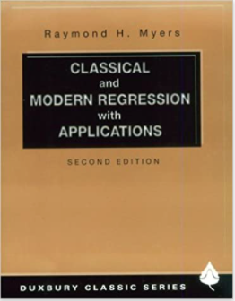
```
:::
:::

::: notes
-   I also provide some other reference books. They are all optional, but some course materials may borrow from these books.
-   It's a pretty old book which was published in 1990. So it's a little bit outdated. But it explains basic ideas and concepts pretty well. I enjoyed reading it.
:::


## Reference (ARA)

::: columns
::: {.column width="50%"}
-   [*Applied Regression Analysis & Generalized Linear Models*](https://collegepublishing.sagepub.com/products/applied-regression-analysis-and-generalized-linear-models-3-237254), by John Fox. Publisher: SAGE.

-   Answers to the odd-numbered exercises and other resouces on the [book Website](https://www.john-fox.ca/AppliedRegression/index.html)
<!-- -   Doing regression easier by the **car** and **effects** R packages. -->

- Comprehensive with 791 pages!

- Examples in social sciences

In the Preface, 

> *... the book will prove useful in other disciplines that employ regression models for data analysis...*

<!-- # ```{r} -->
<!-- # #| out-width: 100% -->
<!-- # #| fig-align: center -->
<!-- # 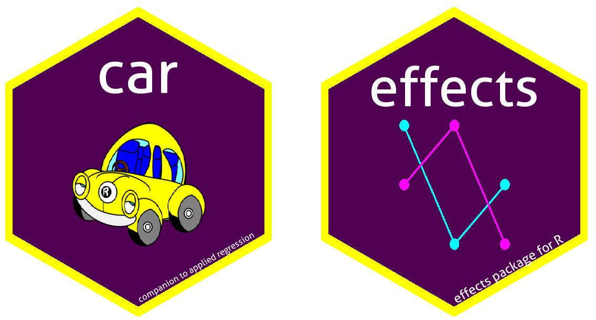 -->
<!-- # ``` -->
:::

::: {.column width="50%"}
```{r}
#| out-width: 60%
#| fig-align: center
#| fig-link: https://collegepublishing.sagepub.com/products/applied-regression-analysis-and-generalized-linear-models-3-237254
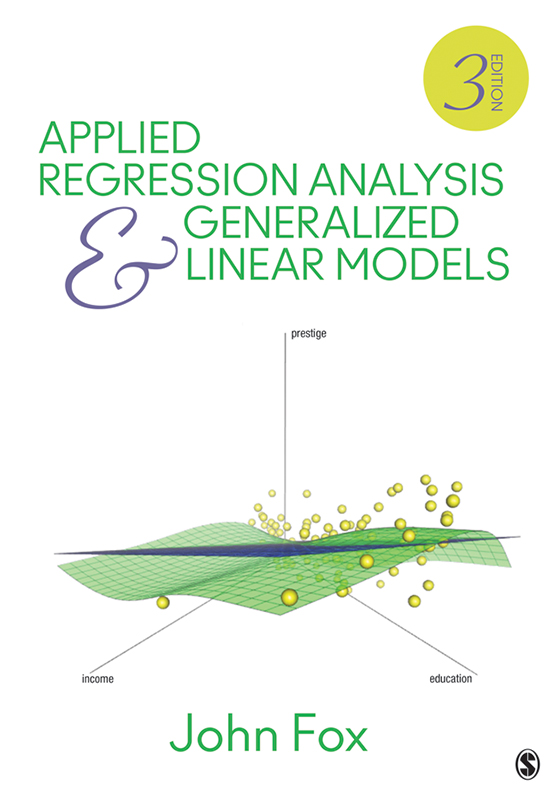
```
:::
:::


## Reference (CAR)

::: columns
::: {.column width="50%"}
-   [*An R Companion to Applied Regression*](https://us.sagepub.com/en-us/nam/an-r-companion-to-applied-regression/book246125), by John Fox and Sanford Weisberg. Publisher: SAGE.
- Ch 3, 5, 8.
-   R scripts and data on the [book Website](https://socialsciences.mcmaster.ca/jfox/Books/Companion/)
-   Doing regression easier by the **car** and **effects** R packages.

```{r}
#| out-width: 100%
#| fig-align: center

```
:::

::: {.column width="50%"}
```{r}
#| out-width: 60%
#| fig-align: center
#| fig-link: https://socialsciences.mcmaster.ca/jfox/Books/Companion/
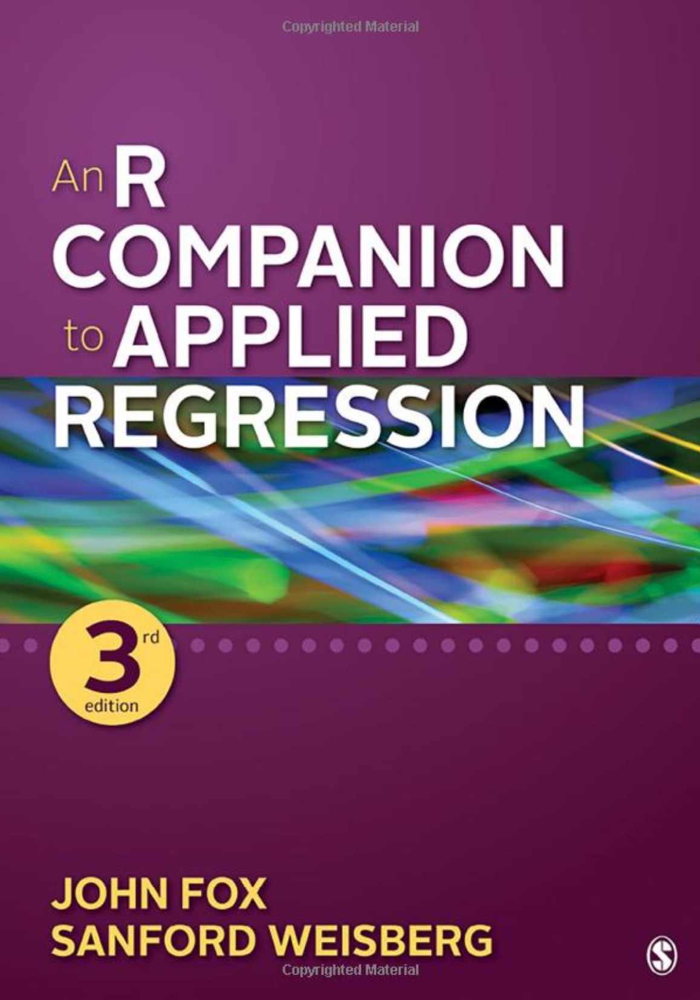
```
:::
:::

::: notes
-   If you wanna learn how to use R to do regression, this book could be helpful.
-   The authors create 2 R packages car and effects that make doing regression so much easier.
-   Later you'll see we can just use some simple function calls to generate some important and useful graphics for regression analysis.

John Fox received a BA from the City College of New York and a PhD from the University of Michigan, both in Sociology. Sanford Weisberg is Professor Emeritus of statistics at the University of Minnesota. He has also served as the director of the University′s Statistical Consulting Service, and has worked with hundreds of social scientists and others on the statistical aspects of their research. He earned a BA in statistics from the University of California, Berkeley, and a Ph.D., also in statistics, from Harvard University
:::


## Reference (ISL)

::: columns
::: {.column width="50%"}
- [*An Introduction to Statistical Learning*](https://www.statlearning.com/), by James et. al. Publisher: Springer.
- Ch 3.
- R and Python code


In the Preface, 

> *ISL ... for advanced undergraduates or master's students in Statistics or related quantitative fields......*

:::

::: {.column width="50%"}
```{r}
#| out-width: 60%
#| fig-align: center
#| fig-link: https://www.statlearning.com/
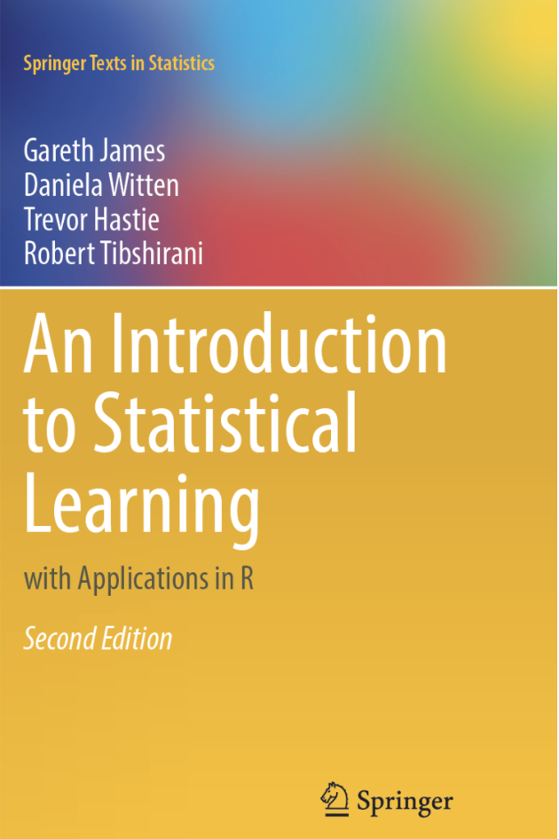
```
:::
:::

## Reference (ROS)

::: columns
::: {.column width="50%"}
- [*Regression and Other Stories*](https://avehtari.github.io/ROS-Examples/index.html), by Andrew Gelman, Jennifer Hill, and Aki Vehtari. Publisher: Cambridge.

- less mathematics and more computer simulations

- intuitive explanations and practical advice.

- more Bayesian perspectives


In the Preface, 

> *This book does not require advanced mathematics. . . . you will need the algebra of the intercept and slope of a straight line, but it will not be necessary to follow the matrix algebra in the derivation of least squares computations*

:::

::: {.column width="50%"}
```{r}
#| out-width: 60%
#| fig-align: center
#| fig-link: https://avehtari.github.io/ROS-Examples/index.html#Contents
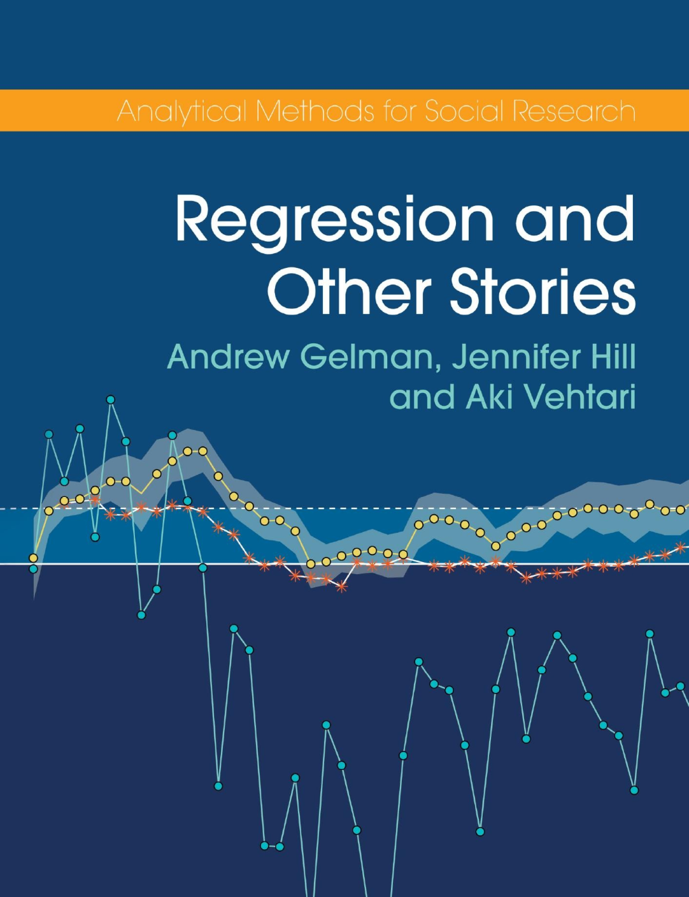
```
:::
:::


## Reference (AoR)

::: columns
::: {.column width="50%"}
- [*All of Regression*](https://www.cambridge.org/core/books/all-of-regression/3CF84F65514446FD8311AAF469C814C5), by Isabella Verdinelli and Larry Wasserman. Publisher: Cambridge.

- clear and concise with 220 pages only!

- Published in 2026, and more modern topics, neural nets, causal inference, graphical models for example


In the Preface, 

> *used this material ... in a fourth-year undergraduate course at Carnegie Mellon University ... also suitable for master’s students in statistics and other areas of data science.*

:::

::: {.column width="50%"}
```{r}
#| out-width: 60%
#| fig-align: center
#| fig-link: https://www.stat.cmu.edu/~larry/All_of_Regression/AllOfRegr.html
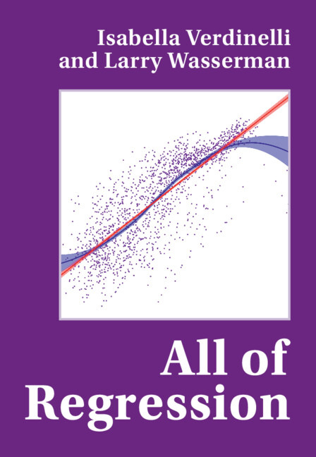
```
:::
:::


## More References

- [Applied Linear Regression](https://www.stat.purdue.edu/~qfsong/teaching/525/book/Weisberg-Applied-Linear-Regression-Wiley.pdf)

- [Applied Linear Statistical Models](https://d1b10bmlvqabco.cloudfront.net/attach/is282rqc4001vv/is6ccr3fl0e37q/iwfnjvgvl53z/Michael_H_Kutner_Christopher_J._Nachtsheim_JohnBookFi.org.pdf)

- [Regression Daignostics](https://www.john-fox.ca/RegressionDiagnostics/index.html)

and more!

::: notes
<!-- - [Linear Models with R/Python](https://julianfaraway.github.io/faraway/LMR/) -->

<!-- - [Applied Regression Analysis and Generalized Linear Models](https://www.john-fox.ca/AppliedRegression/index.html) -->
<!-- - [Regression and Other Stories](https://avehtari.github.io/ROS-Examples/index.html) -->

:::


## Prerequisites

-   On bulletin: MATH 2780 (Baby Regression), MATH 4720 (Intro Stats) or equivalent.

. . .

Helpful if you

-   code (any language) `r emo::ji('computer')`

. . .

-   learned basic linear algebra (MATH 3100) `r emo::ji('1234')`

. . .

-   took probability (MATH 4700) and statistical inference (MATH 4710) `r emo::ji('game_die')`


. . .

-   know how to write good prompts in your AI ?! 🤔


. . .

- Come to talk if you are not sure whether this is the right course for you.

::: notes
-   On the Marquette bulletin, the prerequisite is either MATH 2780 or MATH 4720 or equivalent.
-   But this course requires more than basic statistics experience.
-   Nowadays, nobody is doing regression by hand, and we will write some code to do regression. So it would be helpful if you code any language before.
:::


## [My Statistics Book](https://chenghanyu-introstatsbook.netlify.app/)

- Please review probability distributions, confidence interval and hypothesis testing, and R/Python syntax

```{r}
#| out-width: 60%
#| fig-link: https://chenghanyu-introstatsbook.netlify.app/
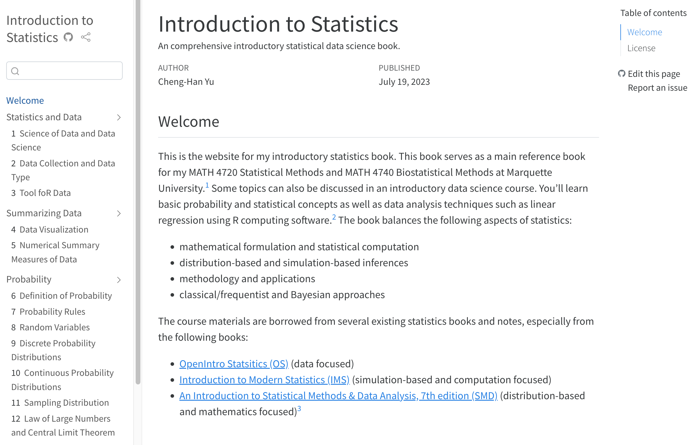
```


::: notes

- Nowadays, students don't read books!

- For this course, I don't think you need to buy any textbook.

- One book you may be interested is my online book.Introduction to Statistics that provide full detailed explanation of course slides, and other topics that re not covered in this course.

- So if you find it difficult to understand the course slides, you are welcome to read the book.

:::


## Course Website

-   All course materials

```{r}
#| fig-align: center
#| fig-link: https://math4780-f26.github.io/website/

```


## Learning Management System (D2L)

```{r}
#| out-width: 100%
#| fig-align: center
#| fig-link: https://d2l.mu.edu/d2l/home/656221
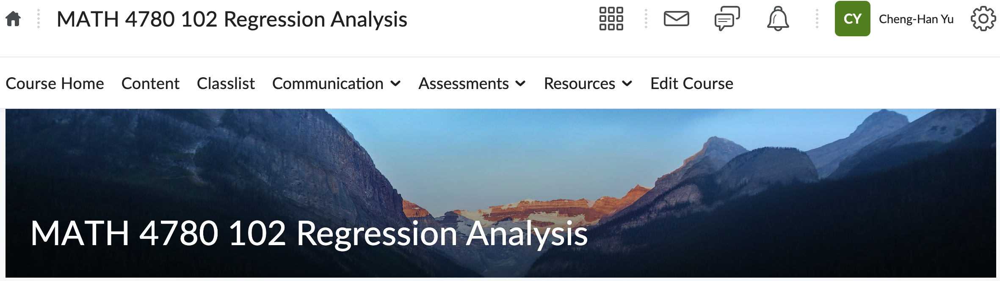
```

- Submit your work: **Assessments > Dropbox**

- Check your grade: **Assessments > Grades**

- New announcement: **News**


## Grading Policy ✨

-   For MATH 4780 (MSSC 5780) students, the grade is earned out of **1000 (1200) total points** distributed as follows:

| Category | Points |
| --- | ---: |
| Homework  | 150 |
| In-class exam | 250 |
| Final project | 400 |
| Class activity | 200 |
| MSSC 5780 work | 200 |
| **Total** | **1200** |
    
    
-   `r emo::ji("x")` No extra credit projects/homework/exam to compensate for a poor grade.
-   Individual grade will **NOT** be curved.
-   Want to obtain a good grade? Study hard. No pain, no gain! ✍ ✍

::: notes
-   Everyone has the same opportunity to do well in this class.
-   4780 students are encouraged to do MSSC problems: Up to **100 pts** extra credit.
-   I am not a harsh grader, but this is not an easy A course as well.
:::


## Grade-Percentage Conversion &#x2728;

- The final grade is based on your earned percentage and the grade-percentage conversion Table.

- $[x, y)$ means greater than or equal to $x$ and less than $y$.

```{r}
#| echo: false
letter <- c("A", "A-", "B+", "B", "B-", "C+", "C", "C-",
                       "D+", "D", "F")
percentage <- c("[94, 100]", "[90, 94)", "[87, 90)", "[83, 87)", "[80, 83)",
                "[77, 80)", "[73, 77)", "[70, 73)",
                "[65, 70)", "[60, 65)", "[0, 60)")
grade_dist <- data.frame(Grade = letter, Percentage = percentage)
library(kableExtra)
knitr::kable(grade_dist, longtable = TRUE, format = "html", align = 'l') %>% kable_styling(position = "center", font_size = 35)
```


## Homework (150 pts)

- **D2l > Assessments > Dropbox** and upload your homework in **PDF** format.

- There will be 6 homework sets.

- Every homework is due by **Friday 11:59 PM ** (**Don't miss it. This is a hard deadline**`r emo::ji("exclamation")`).

- `r emo::ji("x")` **No make-up homework**.

-   `r emo::ji("x")` **Handwriting is NOT allowed** for the data analysis parts.

- Some questions are required for MSSC 5780 students.

- Using generative AI (GenAI) tools is allowed, but you **must carefully disclose your usage.**


## In-class Exam (250 pts)

- Midterm exam is held in class on **Nov 10**.

- `r emo::ji("page_facing_up")` One piece of **letter size** cheat sheet is allowed. It has to be turned-in with your in-class exam. (Or entirely open book?)

- Exam covers materials in **Week 1 to 10**.

- Some questions are required for MSSC 5780 students.

- `r emo::ji("x")` **No make-up exams** for any reason unless you got an [excused absence](https://bulletin.marquette.edu/policies/attendance/undergraduate/).


## Project (400 pts)

-   You will be doing a *team* project.

-   What is your project about?

-   Written report or oral presentation or both?

-   How is your projected evaluated?

-   More information will be released later.


## Class Activity (200 pts)

- Presentation on exercise problems?

- Group activities?

- More details will be released later.


<!-- ## MSSC 5780 Work (200 pts) -->

<!-- -   Some extra work are for MSSC 5780 students. -->
<!-- -   `r emo::ji('thumbsup')` MATH 4780 students are encouraged to do the MSSC problems to earn extra points! -->


##  What Computing Language We Use? {visibility="hidden"}

::::: {.columns}

:::: {.column width="50%"}

- `r emo::ji("chart_with_upwards_trend") ` The best language for statistical computing!
<!-- - `r emo::ji("x") ` If you do **NOT** want to learn R, choose another section!  -->
- `r emo::ji("white_check_mark")` You may use other tools or software such as Excel, Python, Minitab, etc to do your work, but I will **NOT** teach any of them.
- `r emo::ji("x")` Drop/Swap deadline: **9/8/2026**. Don't miss it!

::::


:::: {.column width="50%"}


```{r}
#| fig-link: <https://www.r-project.org/>
knitr::include_graphics("./images/01-syllabus/Rlogo.png")
```

::::

:::::


::: notes

- In this course, we will be using programming language R to learn statistics.
- To me, R is the best language for statistical computing!
- R is actually created by two statisticians for statistics.
- The R syntax for doing statistics is very clean and intuitive. 
- Now, R becomes one of the main languages for doing data science and machine learning. 
- So I think it's worth learning it.
- But still that's your choice. 
- `r emo::ji("x")` If you do **NOT** want to learn R, choose another section! 
- Although I teach R in this course, you may use other tools or software to do your work, but I will **NOT** teach any of them.

:::


## Which Programming Language?

 `r emo::ji("white_check_mark")` May use *any* language you like to do your work. 😎


:::: columns


::: {.column width="30%"}
```{r}
#| out-width: 100%
#| fig-align: center
knitr::include_graphics("./images/01-syllabus/Rlogo.png")
```
:::

::: {.column width="23%"}
```{r}
#| out-width: 100%
#| fig-align: center
knitr::include_graphics("https://upload.wikimedia.org/wikipedia/commons/c/c3/Python-logo-notext.svg")
```
:::

::: {.column width="23%"}
```{r}
#| out-width: 100%
#| fig-align: center
knitr::include_graphics("https://upload.wikimedia.org/wikipedia/commons/2/21/Matlab_Logo.png")
```
:::

::: {.column width="23%"}
```{r}
#| out-width: 100%
#| fig-align: center
knitr::include_graphics("https://upload.wikimedia.org/wikipedia/commons/1/1f/Julia_Programming_Language_Logo.svg")
```
:::

::::


## Document Generative AI Use


:::: {.columns}
::: {.column width="80%"}

<!-- ### Generative AI -->

- You may use generative AI tools such as ChatGPT to generate a draft of your work, provided that this use is **documented and cited**.

<!-- [Example] Data science is an interdisciplinary field that ... [^1] -->

<!-- [^1]: ChatGPT, response to *“Tell me what data science is,”* Jan 14, 2025, https://chat.openai.com. -->

<!-- - Unless explicitly stated otherwise, you may make use of any online resources, but you must **explicitly cite/document** where you obtained any code you directly use or use as inspiration in your solutions. -->
:::

::: {.column width="20%"}

```{r}
#| out-width: 80%
#| fig-align: center

```

:::

::::


- If you use GenAI, please include the followings in your submitted work:

  + **Why/How I used AI (prompts or questions)**
  + **Generated output (screenshot or copy-paste excerpt)**
  + **How I used the output**
 
 
## Document Generative AI Use


:::: {.columns}

::: {.column width="50%"}

- **Why/How I used AI (prompts and questions)**
  + *I asked ChatGPT to generate a histogram using R.*
 
- **Generated output (screenshot or copy-paste excerpt)**

::: tiny
```{r}
#| out-width: 100%
#| fig-align: center
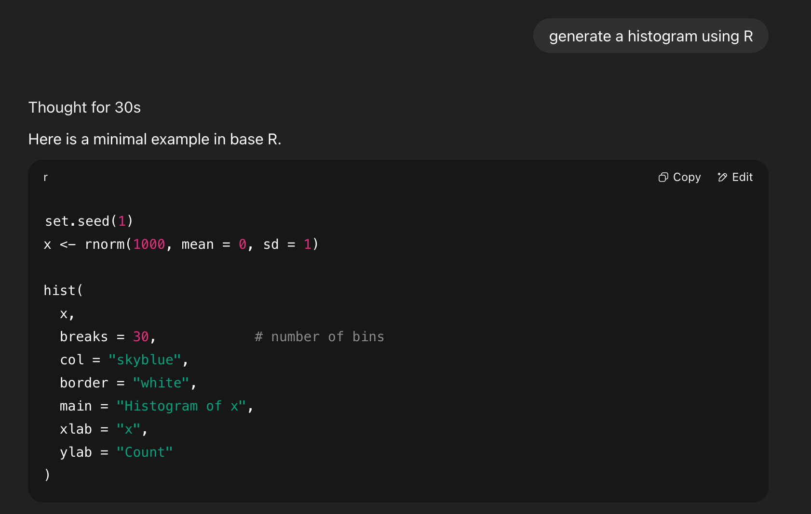
```
:::

:::

::: {.column width="50%"}

- **How I used the output**
  + *I reviewed the suggestions, but I did not use the exact code. Instead, I change the code format and breaks value to 50.*

:::

::::

 
<!-- ## Sharing/Reusing Code -->

<!-- - Unless explicitly stated otherwise, you may make use of any online resources, but you must **explicitly cite** where you obtained any code you directly use or use as inspiration in your solutions. -->

<!-- [Example] -->

<!-- - The code is modified from the GitHub repo <https://github.com/chenghanyustats/slam> -->

<!-- - The code is generated from ChatGPT response to *“Please generate R code for solving the probability problem I attach,”* Jan 14, 2025. -->

<!-- ::: notes -->
<!-- - You are responsible for the content of all work submitted for this course. -->
<!-- - You can use any code shared online or in books. But please give the authors full credits. Cite their work and let me know whose code you are using to do your homework and project. -->
<!-- - I encourage you to write your own code. This way you learn the most. -->
<!-- - `r emo::ji("x")`  Any recycled code that is discovered and is not explicitly cited will be treated as plagiarism, regardless of source. `r emo::ji("scream")` -->
<!-- ::: -->

<!-- ## -->

<!-- How I used AI: -->
<!--  I asked ChatGPT to suggest different ways to start my personal statement. -->
<!-- Generated Output (excerpt): -->
<!--  (screenshot or copy-paste excerpt) -->
<!-- “One way to begin your personal statement could be with a defining moment: ‘The first time I stood in front of a classroom, I realized that teaching was not just a profession—it was my calling.’ Another option is to highlight your motivation with a story of overcoming a challenge…” -->
<!-- How I used it: -->
<!--  I reviewed the suggestions, but I did not use the exact wording. Instead, I used the idea of starting with a defining moment and wrote my own opening sentence. -->


## Impact of AI


:::: {.columns}

::: {.column width="50%"}

- **less time** on homework

- **higher** homework score

- **poorer** exam performance

- [The Generative AI Learning Penalty: Evidence from Chinese Secondary Education](https://shorturl.at/Z5S3E)

:::


::: {.column width="50%"}
```{r}
#| out-width: 70%
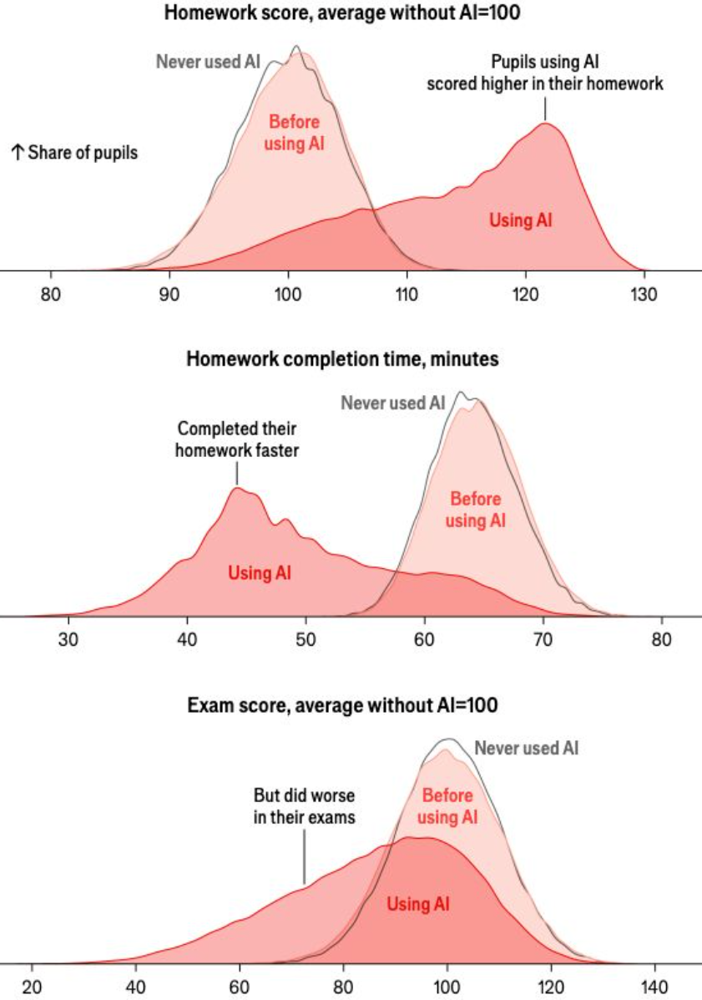
```
:::

::::


 
## Academic Integrity

This course expects all students to follow University and College statements on [academic integrity](https://bulletin.marquette.edu/undergrad/academicregulations/).

- **Honor Pledge and Honor Code**: *I recognize the importance of personal integrity in all aspects of life and work. I commit myself to truthfulness, honor, and responsibility, by which I earn the respect of others. I support the development of good character, and commit myself to uphold the highest standards of academic integrity as an important aspect of personal integrity. My commitment obliges me to conduct myself according to the Marquette University Honor Code*.
<!-- - `r emo::ji("x")` You know what I am talking about. Yes, **DO NOT CHEAT**.  -->

## GenAI and Academic Integrity

```{=html}
<div style="position:relative; padding-bottom:56.25%; height:0; overflow:hidden;">
  <iframe
    src="https://marquette.hosted.panopto.com/Panopto/Pages/Embed.aspx?id=36be65f1-ba4f-457d-bad3-b1b8013b9448&autoplay=false"
    title="GenAI and Academic Integrity"
    style="position:absolute; top:0; left:0; width:100%; height:90%; border:0;"
    allow="encrypted-media; fullscreen; picture-in-picture"
    allowfullscreen>
  </iframe>
</div>
```