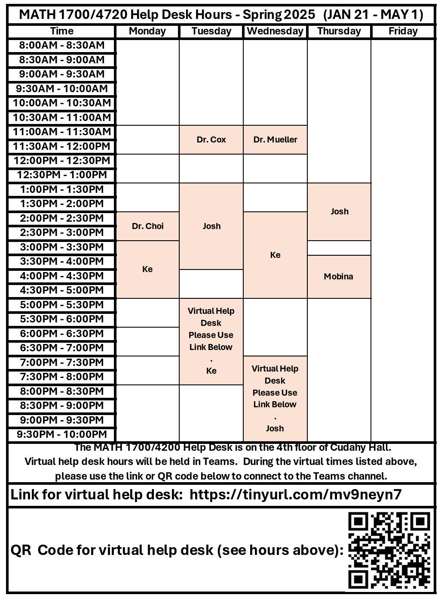

# {visibility="hidden"}

\def\bx{\mathbf{x}}
\def\bg{\mathbf{g}}
\def\bw{\mathbf{w}}
\def\bbeta{\boldsymbol \beta}
\def\bX{\mathbf{X}}
\def\by{\mathbf{y}}
\def\bH{\mathbf{H}}
\def\bI{\mathbf{I}}
\def\bS{\mathbf{S}}
\def\bW{\mathbf{W}}
\def\T{\text{T}}
\def\cov{\mathrm{Cov}}
\def\cor{\mathrm{Corr}}
\def\var{\mathrm{Var}}
\def\E{\mathrm{E}}
\def\bmu{\boldsymbol \mu}
\DeclareMathOperator*{\argmin}{arg\,min}
\def\Trace{\text{Trace}}


```{r}
#| label: setup
#| include: false
#| eval: true
library(countdown)
library(emo)
library(knitr)
library(gt)
library(gtExtras)
library(ggplot2)
library(tidyverse)
library(tidymodels)
# library(ISLR2)
# library(genridge)
# library(glmnet)
# library(gam)
# library(splines)
# library(MASS)

# library(ElemStatLearn)
knitr::opts_chunk$set(
    fig.asp = 0.618,
    fig.align = "center",
    out.width = "100%",
    fig.retina = 10,
    fig.path = "images/01-syllabus",
    message = FALSE,
    global.par = TRUE
)
options(
  htmltools.dir.version = FALSE,
  dplyr.print_min = 6, 
  dplyr.print_max = 6,
  tibble.width = 80,
  width = 80,
  digits = 3
  )
hook_output <- knitr::knit_hooks$get("output")
knitr::knit_hooks$set(output = function(x, options) {
  lines <- options$output.lines
  if (is.null(lines)) {
    return(hook_output(x, options))  # pass to default hook
  }
  x <- unlist(strsplit(x, "\n"))
  more <- "..."
  if (length(lines)==1) {        # first n lines
    if (length(x) > lines) {
      # truncate the output, but add ....
      x <- c(head(x, lines), more)
    }
  } else {
    x <- c(more, x[lines], more)
  }
  # paste these lines together
  x <- paste(c(x, ""), collapse = "\n")
  hook_output(x, options)
})
```

<!-- begin: webr fodder -->



<!-- end: webr fodder -->

<!-- ## Code -->

<!-- When you click the **Render** button a presentation will be generated that includes both content and the output of embedded code. You can embed code like this: -->

<!-- ```{r} -->
<!-- 1 + 1 -->
<!-- ``` -->


<!-- ```{webr} -->
<!-- fit = lm(mpg ~ am, data = mtcars) -->
<!-- summary(fit) -->
<!-- ``` -->


# Taipei, Taiwan {background-image="images/01-syllabus/taiwan.jpeg" background-size="cover" background-position="50% 50%" background-color="#447099"}

::: {.absolute bottom="50" right="10"}
{width="500" fig-alt="Taiwan location"}
:::


::: notes

- Hello everyone, how are you? I hope you have a great summer. Welcome to 4720 Introduction to Statistics course. I am your instructor Cheng-Han Yu.  
- First thing first. Get to know each other. Let me first introduce myself. I was born and grew up in Taipei, Taiwan, my home country, which is a island right next to China. Taipei is a big city in terms of population. It is about the same population size as Chicago. This building is called Taipei 101, which is the tallest building in Taiwan.

:::

## My Journey {background-image="images/01-syllabus/sample_gate.png" background-size="cover" background-position="50% 50%" background-opacity="0.3"}

-   Assistant Professor (2020/08 - )

```{r}
#| out-width: 20%
#| fig-align: center
#| echo: false
knitr::include_graphics("./images/01-syllabus/mu.svg")
```

-   Postdoctoral Fellow

```{r}
#| out-width: 20%
#| fig-align: center
#| echo: false
knitr::include_graphics("./images/01-syllabus/rice.png")
```

-   PhD in Statistics

```{r}
#| out-width: 20%
#| fig-align: center
knitr::include_graphics("./images/01-syllabus/ucsc.png")
```

-   MA in Economics/PhD program in Statistics

```{r}
#| out-width: 20%
#| fig-align: center
knitr::include_graphics("./images/01-syllabus/iub.png")
```


::: notes

After college, working and doing military service for several years, I came to the US for my PhD degree. Originally I would like to study economics, but then I switched my major to statistics. 
- I got my master degree in economics from Indiana University Bloomington, then I transferred to UC Santa Cruz to finish my PhD studies. 
- Then I spent two years doing my postdoctoral research at Rice University in Houston, Texas.
- Finally, in fall 2020, I came to Marquette being an assistant professor.
- Midwest/Indiana-West/California-South/Texas-Midwest/Wisconsin
- Been to any one of these universities/cities? 
- The most beautiful campus.
- Who are international students? I can totally understand how hard studying and living in another country. Feel free to share your stories or difficulties, and I am more than happy to help you if you have any questions.
- Poor listening and speaking skills. I was shy. 
- Usually if it is a class less than 30 students, I'd like to ask students to briefly introduce themselves, but this semester we have a big class, bear with me if I can't recognize you.

:::


## How to Reach Me

- Office hours **TuTh 4:50 - 5:50 PM** and **We 12 - 1 PM** in **Cudahy Hall 353**.

- `r emo::ji('e-mail')`  <cheng-han.yu@marquette.edu> 
  + Answer your question within 24 hours. 
  + Expect a reply on **Monday** if shoot me a message **on weekends**.
  + Start your subject line with **[math4720]** or **[mssc5720]** followed by a **clear description of your question**. 
  

```{r}
knitr::include_graphics("./images/01-syllabus/email.png")
```
  + I will **NOT** reply your e-mail if ... **Check the email policy in the [syllabus](https://math4720-f26.github.io/website/course-syllabus.html)**!


## TA Information {visibility="hidden"}

::::: {.columns}

:::: {.column width="50%"}

- Statistics PhD student **Qishi Zhan**

- `r emo::ji('incoming_envelope')` <qishi.zhan@marquette.edu>

- Help desk hours: To be announced.

- Welcome to set up a meeting with your TA via Teams.

- Let me know if you need any other help! `r emo::ji("smile")`

::::

:::: {.column width="50%"}

```{r}
#| out-width: 100%
#| eval: false
knitr::include_graphics("./images/01-syllabus/qishi.jpeg")
```

::::

:::::


## Help Desk Hours

::::: {.columns}

:::: {.column width="50%"}


- Unfortunately, no TA for this course. `r emo::ji('sad')`

- Help desk hours on the **4th** floor of Cudahy Hall.

- The hours will be released later.

::::

:::: {.column width="50%"}

```{r}
#| out-width: 70%

```

::::

:::::


## Course Materials

- Course Website - <https://math4720-f26.github.io/website/>


```{r}
#| fig-align: center
#| fig-link: https://math4720-f26.github.io/website/
knitr::include_graphics("./images/01-syllabus/website_f26.png")
```

- **All course materials and information** can be found on this website. Bookmark it!


## Textbook (Really?!)

:::: r-stack

{.fragment width="1800" height="1000"}

{.fragment width="1600" height="900"}

{.fragment width="1400" height="400"}

{.fragment width="1200" height="800"}
::::

::: notes

It does not mean we don't learn anymore. In fact, we learn and study in a different way. Watch videos, taking online short courses, read online tutorials or blogs.
:::


## Textbook (Dr. Yu's Online Book)

- [*Introduction to Statistics*](https://chenghanyu-introstatsbook.netlify.app/), by Cheng-Han Yu

- Full detailed explanation of course slides `r emo::ji('sunglasses')`

```{r}
#| out-width: 60%
#| fig-link: https://chenghanyu-introstatsbook.netlify.app/
knitr::include_graphics("./images/01-syllabus/IS.png")
```


::: notes

- Nowadays, students don't read books!

- For this course, I don't think you need to buy any textbook.

- One book you may be interested is my online book.Introduction to Statistics that provide full detailed explanation of course slides, and other topics that re not covered in this course.

- So if you find it difficult to understand the course slides, you are welcome to read the book.

:::


## Learning Management System (D2L)

```{r}
#| out-width: 100%
#| fig-align: center
#| fig-link: https://d2l.mu.edu/d2l/home/656225
knitr::include_graphics("./images/01-syllabus/d2l_f26.png")
```

- Submit your work: **Assessments > Dropbox**

- Check your grade: **Assessments > Grades**

- New announcement: **News**


## Grading Policy &#x2728;

<!-- - Your final grade is earned out of **[1000]{.red} total points** distributed as follows: -->
<!--   - **Homework 1 to 8: [175]{.red} pts (25 pts each)** -->
<!--   - **Quiz 1 to 4: [200]{.red} pts (50 pts each)** -->
<!--   - **Exam 1 and 2: [300]{.red} pts (150 pts each)** -->
<!--   - **Final exam: [150]{.red} pts** -->
<!--   - **AI Project: [150]{.red} pts**  -->
<!--   - **Class participation: [25]{.red} pts** -->
<!-- ::: large -->

| Category                | Weight |
| ----------------------- | -----: |
| 8 Homework sets         |    10% |
| 4 Quizzes               |    20% |
| 2 Exams                 |    50% |
| ~10 Worksheets          |    10% |
| ~3 Group Activities     |    10% |

<!-- ::: -->


- `r emo::ji("x")` No extra credit projects/homework/exam to compensate for a poor grade.

- Individual grade will **NOT** be curved.

<!-- - This is not a course that gives most of students grade A. Wanna get a good grade? Study hard. No pain, no gain! &#x270D; &#x270D; -->


## Grade-Percentage Conversion &#x2728;

- The final grade is based on your earned percentage and the grade-percentage conversion Table.

- $[x, y)$ means greater than or equal to $x$ and less than $y$.

```{r}
#| echo: false
letter <- c("A", "A-", "B+", "B", "B-", "C+", "C", "C-",
                       "D+", "D", "F")
percentage <- c("[94, 100]", "[90, 94)", "[87, 90)", "[83, 87)", "[80, 83)",
                "[77, 80)", "[73, 77)", "[70, 73)",
                "[65, 70)", "[60, 65)", "[0, 60)")
grade_dist <- data.frame(Grade = letter, Percentage = percentage)
library(kableExtra)
knitr::kable(grade_dist, longtable = TRUE, format = "html", align = 'l') %>% kable_styling(position = "center", font_size = 35)
```


## Homework (10%)

- **Assessments > Dropbox** and upload your homework in **PDF** format.

- There are 8 homework sets.

<!-- - You must submit YOUR OWN work. `r emo::ji("please")` -->

- Every homework is due by **Friday 11:59 PM ** (**Don't miss it. This is a hard deadline**`r emo::ji("exclamation")`).

- MSSC 5720 students may have more or different homework questions.

- Homework is graded as *complete* or *incomplete*. Each incomplete set results in a 2% deduction from your overall grade.

- `r emo::ji("x")` **No make-up homework**.

<!-- - The lowest score will not be in your final grade calculation. -->

- Using generative AI (GenAI) tools is allowed, but you **must carefully disclose your usage.**


## Quizzes (20%)

- There are 4 in-class 15-min quizzes.

- Each quiz is worth 5% of your overall grade.

<!-- - Questions in the quizzes are similar to homework questions. So do the HW! -->
- `r emo::ji("books")` Quizzes are individual and in **closed-book** and **no-tech** format, except for a calculator.

- `r emo::ji("x")` No cheat sheets or GenAI are allowed.

- `r emo::ji("x")` **No make-up quizzes** for any reason unless you got an [excused absence](https://bulletin.marquette.edu/policies/attendance/undergraduate/). Check the [syllabus](https://math4720-s26.github.io/website/course-syllabus.html#quizzes) for more details.


## Exams (50%)

- There will be **two** exams, one midterm and one final.

- The midterm exam has *in-class* and *take-home* parts.

<!-- - The in-class exams are about one-hour long. -->
- `r emo::ji("page_facing_up")` For the in-class parts, one piece of  **letter size** cheat sheet is allowed. It has to be turned-in with your exam.

- For the take-home parts, you are allowed to use GenAI tools. However, you **must carefully disclose your AI usage.**

. . .

- **Assessments > Dropbox** to submit your take-home exams in **PDF** format.
<!-- - `r emo::ji("x")` **Handwriting is NOT allowed**. -->

- Midterm Exam covers Week **1 to 7**.

- Final Exam covers **ALL** course material.

<!-- - Final exam is comprehensive and covers the **all course materials**.  `r emo::ji("sunglasses")` -->

- `r emo::ji("x")` **No make-up exams** for any reason unless you got an [excused absence](https://bulletin.marquette.edu/policies/attendance/undergraduate/).


## Worksheets (10%)

- Several worksheets will be distributed and completed during class sessions.

- The worksheets are graded as *complete* or *incomplete*.

- Each incomplete sheet results in a 1% deduction from your overall grade.


## Group Activities (10%)

- There are several in-class group activities

- The group activities are graded as *complete* or *incomplete*.

- Each incomplete activity results in a 2% deduction from your overall grade.


<!-- ## Final Project (10%) -->

<!-- - The project will be released after Exam 2. -->

<!-- - You are required to use GenAI to explore a topic not addressed in class, and apply both your self-learning and course knowledge to create a data analysis report. -->

<!-- - The project topic will also be tested in the final exam. -->

<!-- - You **must carefully cite your GenAI tool or reveal your use of AI.** -->


##  What Computing Language We Use?

::::: {.columns}

:::: {.column width="50%"}

- `r emo::ji("chart_with_upwards_trend") ` The best language for statistical computing!
<!-- - `r emo::ji("x") ` If you do **NOT** want to learn R, choose another section!  -->
- `r emo::ji("white_check_mark")` You may use other tools or software such as Excel, Python, Minitab, etc to do your work, but I will **NOT** teach any of them.
- `r emo::ji("x")` Drop/Swap deadline: **9/8/2026**. Don't miss it!

::::


:::: {.column width="50%"}


```{r}
#| fig-link: <https://www.r-project.org/>
knitr::include_graphics("./images/01-syllabus/Rlogo.png")
```

::::

:::::


::: notes

- In this course, we will be using programming language R to learn statistics.
- To me, R is the best language for statistical computing!
- R is actually created by two statisticians for statistics.
- The R syntax for doing statistics is very clean and intuitive. 
- Now, R becomes one of the main languages for doing data science and machine learning. 
- So I think it's worth learning it.
- But still that's your choice. 
- `r emo::ji("x")` If you do **NOT** want to learn R, choose another section! 
- Although I teach R in this course, you may use other tools or software to do your work, but I will **NOT** teach any of them.

:::


## Document Generative AI Use


:::: {.columns}
::: {.column width="80%"}

<!-- ### Generative AI -->

- You may use generative AI tools such as ChatGPT to generate a draft of your work, provided that this use is **documented and cited**.

<!-- [Example] Data science is an interdisciplinary field that ... [^1] -->

<!-- [^1]: ChatGPT, response to *“Tell me what data science is,”* Jan 14, 2025, https://chat.openai.com. -->

<!-- - Unless explicitly stated otherwise, you may make use of any online resources, but you must **explicitly cite/document** where you obtained any code you directly use or use as inspiration in your solutions. -->

:::

::: {.column width="20%"}

```{r}
#| out-width: 80%
#| fig-align: center
knitr::include_graphics("images/01-syllabus/genai.png")
```

:::

::::


- If you use GenAI, please include the followings in your submitted work:

  + **Why/How I used AI (prompts or questions)**
  + **Generated output (screenshot or copy-paste excerpt)**
  + **How I used the output**
 
 
## Document Generative AI Use


:::: {.columns}

::: {.column width="50%"}

- **Why/How I used AI (prompts and questions)**
  + *I asked ChatGPT to generate a histogram using R.*
 
- **Generated output (screenshot or copy-paste excerpt)**

::: tiny
```{r}
#| out-width: 100%
#| fig-align: center
knitr::include_graphics("images/01-syllabus/genai_screenshot.png")
```
:::

:::

::: {.column width="50%"}

- **How I used the output**
  + *I reviewed the suggestions, but I did not use the exact code. Instead, I change the code format and breaks value to 50.*

:::

::::

 
<!-- ## Sharing/Reusing Code -->

<!-- - Unless explicitly stated otherwise, you may make use of any online resources, but you must **explicitly cite** where you obtained any code you directly use or use as inspiration in your solutions. -->

<!-- [Example] -->

<!-- - The code is modified from the GitHub repo <https://github.com/chenghanyustats/slam> -->

<!-- - The code is generated from ChatGPT response to *“Please generate R code for solving the probability problem I attach,”* Jan 14, 2025. -->

<!-- ::: notes -->
<!-- - You are responsible for the content of all work submitted for this course. -->
<!-- - You can use any code shared online or in books. But please give the authors full credits. Cite their work and let me know whose code you are using to do your homework and project. -->
<!-- - I encourage you to write your own code. This way you learn the most. -->
<!-- - `r emo::ji("x")`  Any recycled code that is discovered and is not explicitly cited will be treated as plagiarism, regardless of source. `r emo::ji("scream")` -->
<!-- ::: -->

<!-- ## -->

<!-- How I used AI: -->
<!--  I asked ChatGPT to suggest different ways to start my personal statement. -->
<!-- Generated Output (excerpt): -->
<!--  (screenshot or copy-paste excerpt) -->
<!-- “One way to begin your personal statement could be with a defining moment: ‘The first time I stood in front of a classroom, I realized that teaching was not just a profession—it was my calling.’ Another option is to highlight your motivation with a story of overcoming a challenge…” -->
<!-- How I used it: -->
<!--  I reviewed the suggestions, but I did not use the exact wording. Instead, I used the idea of starting with a defining moment and wrote my own opening sentence. -->


 
## Academic Integrity

This course expects all students to follow University and College statements on [academic integrity](https://bulletin.marquette.edu/undergrad/academicregulations/).

- **Honor Pledge and Honor Code**: *I recognize the importance of personal integrity in all aspects of life and work. I commit myself to truthfulness, honor, and responsibility, by which I earn the respect of others. I support the development of good character, and commit myself to uphold the highest standards of academic integrity as an important aspect of personal integrity. My commitment obliges me to conduct myself according to the Marquette University Honor Code*.
<!-- - `r emo::ji("x")` You know what I am talking about. Yes, **DO NOT CHEAT**.  -->


## GenAI and Academic Integrity

```{=html}
<!-- Replace host and id with yours -->
<div style="position:relative; padding-bottom:56.25%; height:0; overflow:hidden;">
  <iframe
    src="https://marquette.hosted.panopto.com/Panopto/Pages/Viewer.aspx?id=36be65f1-ba4f-457d-bad3-b1b8013b9448&start=0.5"
    title="GenAI and Academic Integrity"
    style="position:absolute; top:0; left:0; width:100%; height:90%; border:0;"
    allow="encrypted-media; fullscreen; picture-in-picture"
    allowfullscreen
  ></iframe>
</div>
```