# {visibility="hidden"}

\def\bx{\mathbf{x}}
\def\bg{\mathbf{g}}
\def\bw{\mathbf{w}}
\def\bbeta{\boldsymbol \beta}
\def\bX{\mathbf{X}}
\def\by{\mathbf{y}}
\def\bH{\mathbf{H}}
\def\bI{\mathbf{I}}
\def\bS{\mathbf{S}}
\def\bW{\mathbf{W}}
\def\T{\text{T}}
\def\cov{\mathrm{Cov}}
\def\cor{\mathrm{Corr}}
\def\var{\mathrm{Var}}
\def\E{\mathrm{E}}
\def\bmu{\boldsymbol \mu}
\DeclareMathOperator*{\argmin}{arg\,min}
\def\Trace{\text{Trace}}


```{r}
#| label: pkg
#| include: false
#| eval: true
library(emo)
library(openintro)
library(ggVennDiagram)
library(ggplot2)
library(ggVennDiagram)
library(plotrix)
library(diagram)
library(knitr)
data(COL)
source("./sample_method_fcns.R")
```

<!-- begin: webr fodder -->



<!-- end: webr fodder -->


# What is Statisitcs {background-image="./images/02-overview/what_stats.jpg" background-size="cover" background-position="50% 50%" background-color="#447099"}

::: notes

- Let's take a short break, and we can start talking about statistics.
- The first and big question we usually ask is What is statistics.

:::

## Statistics as Numeric Records

- In ordinary conversations, the word **statistics** is used as a term to indicate a set or collection of **numeric records**.

```{r}
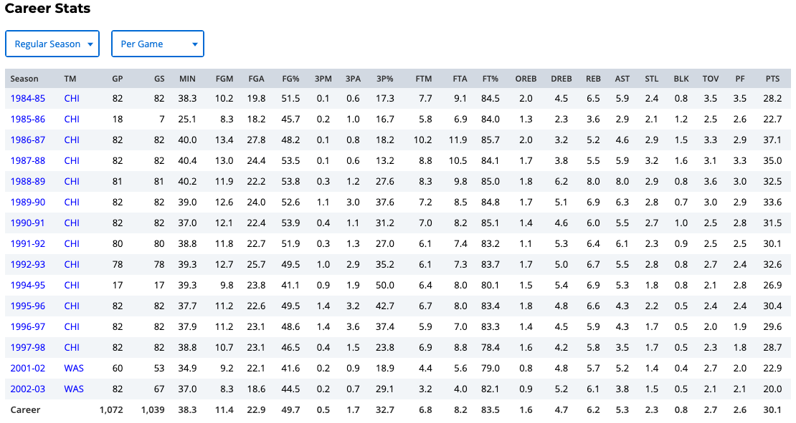
```

::: notes

- For example, some NBA star's career statistics are right here.
- Anyone know who he is? Wanna guess?

:::

## Statistics as Numeric Records

- In ordinary conversations, the word **statistics** is used as a term to indicate a set or collection of **numeric records**.

::: tiny
```{r}
#| echo: false
#| out-width: 32%
#| fig-cap: "https://slamgoods.com/products/jordan-collectors-issue"

```
:::


::: notes

- Yes, Michael Jordan! My favorite NBA player. 
- You know I was born in 80's.
- You guys didn't watch MJ playing, but I did. in TV. OK.
- Your idol may be Kobe, or LBJ or Stephen Curry, but for people born in 80's, or your parents, most of them would agree MJ is the greatest of all time.
- OK I am gone too far.
- Again, in ordinary conversations, the word **statistics** represents **numeric records**.

:::


##

::: tiny
```{r}
#| echo: false
#| out-width: 72%
#| fig-cap: "https://www.amazon.com/Funny-Statistics-Shirt-Definition/dp/B07JKMCDR2?customId=B07537PB8C&customizationToken=MC_Assembly_1%23B07537PB8C&th=1&psc=1"
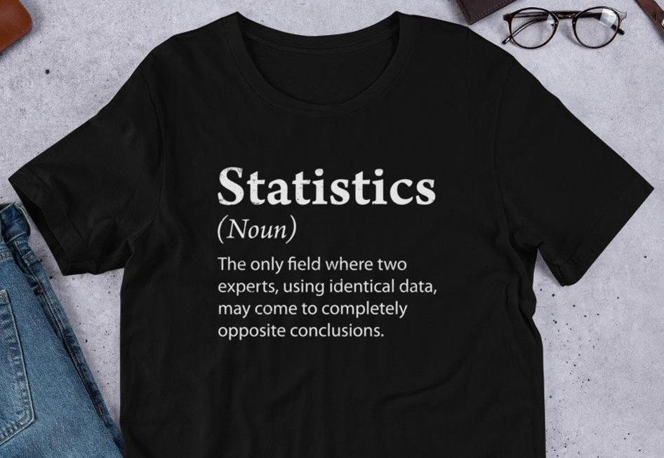
```
:::


::: notes

- And somebody defines statistics as the only field where two experts, using identical data, may come to completely opposite conclusions, which is true in some sense.
- And well see why later in this course.
- With the same data, different statistical methods may produce different results and lead to difference conclusions.

:::


## Statistics as a Discipline

::: tiny
```{r}
#| echo: false
#| out-width: 90%
#| fig-cap: "https://en.wikipedia.org/wiki/Statistics"
#| fig-link: https://en.wikipedia.org/wiki/Statistics
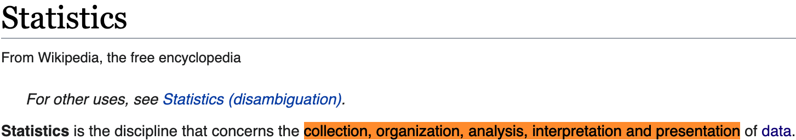
```
:::

::: notes

- Forget about that useless definition.
- From Wiki, Statistics is formally defined as the discipline that concerns the collection, organization, analysis, interpretation and presentation of data.

:::

. . .

My ChatGPT says

::: tiny
```{r}
#| echo: false
#| out-width: 75%
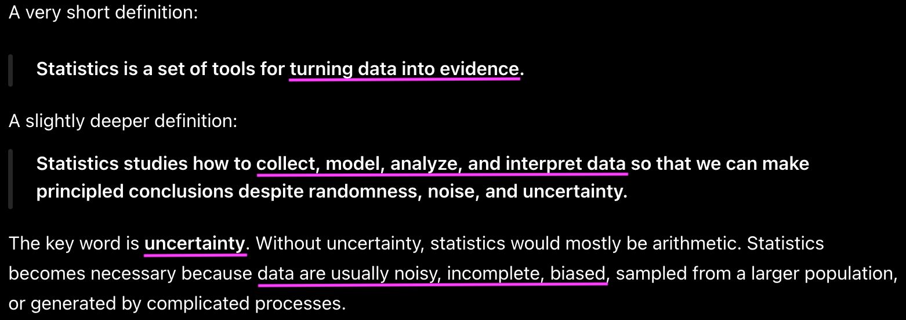
```
:::


## Science of Data

- **Statistics** is a subject dealing with data, or **Science of Data**.

::: notes

- So, **Statistics** is a **Science of Data**.
- There might be another science of data. I'm not saying statistics is THE science of data.

:::

. . .

- A __*science of data*__ using **statistical thinking, methods and models**.

. . .

::: xlarge

`r emo::ji('thinking')` But wait, then what is **DATA SCIENCE** `r emo::ji('question')`

:::


## Difference between Statistics and Data Science

```{r}
#| out-width: 70%


```
::: notes

- When the term Data science just came out around 10 years ago, there is no formal definition of data science.

:::


. . .

My ChatGPT says:

> Statistics is **foundational** to Data Science, but Data Science also includes *programming, data engineering, machine learning, and business communication*.


## Data Science Life Cycle

<!-- {fig-alt="Data science life cycle" width=1800px} -->

```{r}
#| out-width: 120%
include_graphics("./images/02-overview/data-science-cycle.001.png")
```


::: notes

- Data science is an discipline that helps us *turn raw data into understanding, insight, and knowledge* that includes multiple steps associated with data.

- This pipeline is the entrie workflow of data science.

:::


## UC Santa Cruz Department of Statistics Courses


::::: columns
::: {.column width="50%"}

::: small

STAT 5 – Statistics

STAT 7 – Statistical Methods for the Biological, Environmental, and Health Sciences

STAT 17 – Statistical Methods for Business and Economics

STAT 80A – Gambling and Gaming

[STAT 80B – The Art of Data Visualization]{.green}

STAT 108 – Linear Regression

STAT 131 – Introduction to Probability Theory

STAT 132 – Classical and Bayesian Inference

STAT 202 – Linear Models in SAS

STAT 203 – Introduction to Probability Theory

STAT 204 – Introduction to Statistical Data Analysis

STAT 205 – Introduction to Classical Statistical Learning

STAT 205B – Intermediate Classical Inference

STAT 206 – Applied Bayesian Statistics

STAT 206B – Intermediate Bayesian Inference

STAT 207 – Intermediate Bayesian Statistical Modeling

STAT 208 – Linear Statistical Models

STAT 209 – Generalized Linear Models

:::

:::

::: {.column width="50%"}

::: small

STAT 221 – Statistical Machine Learning

STAT 222 – Bayesian Nonparametric Methods

STAT 223 – Time Series Analysis

STAT 224 – Bayesian Survival Analysis and Clinical Design

STAT 225 – Multivariate Statistical Methods

STAT 226 – Spatial Statistics

STAT 227 – Statistical Learning and High-Dimensional Data Analysis

STAT 229 – Advanced Bayesian Computation

STAT 243 – Stochastic Processes

STAT 244 – Bayesian Decision Theory

STAT 246 – Probability Theory with Markov Chains

[STAT 266A – Data Visualization and Statistical Programming in R]{.green}

STAT 266B – Advanced Statistical Programming in R

[STAT 266C – Introduction to Data Wrangling]{.green}

:::

- ️⬛ Methods and models
- 🟩 Other data science related topics


:::


:::::


::: notes


:::


## Data Science May Now Be a Broader View of Statistics

Collection, organization, analysis, interpretation and presentation of data.

```{r}
#| out-width: 120%
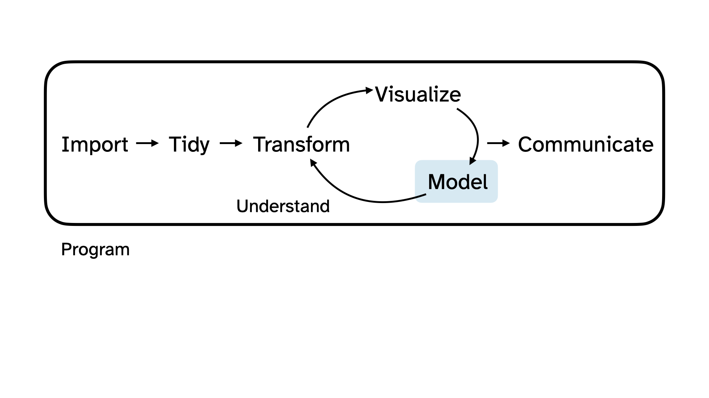
```

::: notes

- Although statistics deals with Collection, organization, analysis, interpretation and presentation of data, statistics focus much more on data analysis, methods and models.

- And now data science is more like a broader view of statistics.

:::


## What We Learn In this Course

::: tiny
```{r}
#| fig-cap: OpenIntro Statistics Contents
#| out-width: 100%
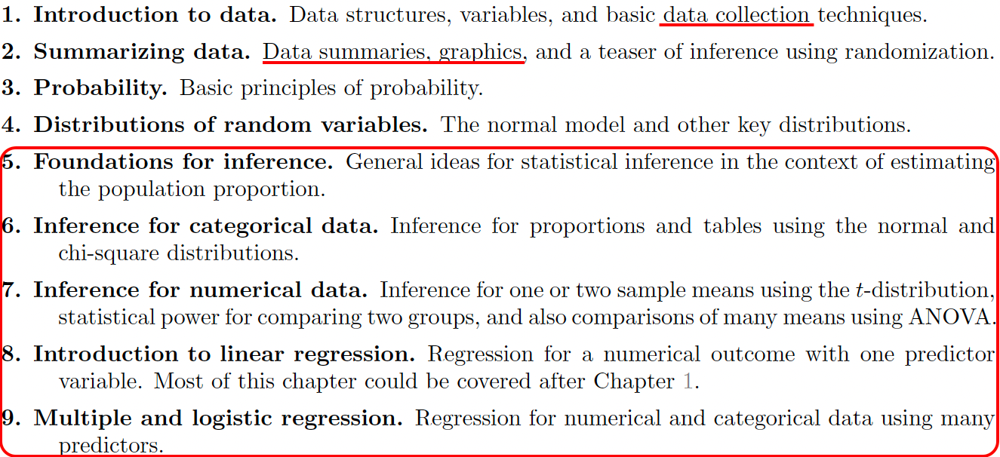
```
:::


::: notes

- In particular, we will spend most of the time talking about probability and statistical inference methods OK.

:::


## We Focus On Statistical Inference

- We spend most of time on various *statistical methods for analyzing data*.

- Learn useful information 
  + about the **population** we are interested (e.g. All Marquette students)
  
  + from our **sample data** (e.g. Students in MATH 4720)
  
  + through **statistical inferential** methods, including **estimation** and **testing** (e.g. Confidence intervals)


```{r}
par(mar = c(0, 0, 0, 0))
plot(0, 0, type = "n", axes = FALSE, xlab = "", ylab = "")
plotrix::draw.ellipse(x = -0.3, y = 0.5, a = 0.65, b = 0.55, lwd = 2)
plotrix::draw.ellipse(x = -0.3, y = 0.4, a = 0.35, b = 0.25, lwd = 2, lty = 2)
text(x = -0.3, y = 0.7, labels = "Set of all measurements: Population", cex = 2.2)
plotrix::draw.ellipse(x = 0.5, y = -0.4, a = 0.36, b = 0.26, lwd = 2, lty = 1)
diagram::curvedarrow(from = c(-0.3, 0.4), to = c(0.5, -0.2),
                     curve = -0.2, arr.pos = 0.98)
text(x = 0.5, y = -0.5, labels = "Sample", cex = 2.2)
text(x = 0, y = -0.3, labels = "Set of data selected from the population:", cex = 2.2)
```


::: notes

- Don't worry if you have no idea of these terms.
- These are what we will discuss throughout the course, and I'll explain each term in detail later in class. OK.
 
:::


## Statistics is a Science of Data, so What is Data?

- **Data**: A set of **objects** on which we observe or measure one or more **characteristics**.

- Objects are individuals, observations, subjects or cases in statistical studies.

- A characteristic or attribute is called a **variable** because it *varies* from one to another.


::: notes

- All right. Statistics is a Science of Data, so What is Data?
- Let's define Data.
- A data set is a set of **objects** on which we observe or measure one or more **characteristics**.
- Objects are individuals, observations, subjects or cases in statistical studies.
- A characteristic or attribute is called a **variable** because it *varies* from one to another.

:::


. . .

::: tiny
```{r}
#| label: mu_data
roster <- read.csv("./data/marquette_roster_2026_27.csv")
kable(roster, align = "c")
```
::: 

 

::: notes

- For example, the data set right here is a set of Marquette mens basketball players.
- So objects are individuals or players in the data.
- And each player has several characteristics or attributes shown in columns associated with him.
- For example, his #, class, position, height, weight, hometown, and high school.
- These characteristics are called variables because they vary form one to another. Clear?

:::


## Data Matrix

- Each row corresponds to a unique case or observational unit.

- Each column represents a characteristic or variable.

- This structure allows new cases to be added as rows or new variables as new columns.

::: tiny
```{r}
#| ref.label: mu_data
```
:::


::: notes

- And we usually store a data set in a matrix form that has rows and columns.
- Each row corresponds to a unique case or observational unit, or the object.
- Each column represents a characteristic or variable.
- This structure allows new cases to be added as rows or new variables as new columns.

:::


# Population and Sample {background-image="./images/02-overview/data_collect.jpg" background-size="cover" background-position="50% 50%" background-color="#447099"}


::: notes

- All right. Let's begin to see what population and sample are.

:::


## Target Population

- The first step in conducting a study is to *identify questions* to be investigated.

- A clear research question is helpful in identifying 
  + what *cases* should be studied (row)
  + what *variables* are important (column)
  
- Target **Population**: the collection of **all** objects which we are interested in studying from.

::::: columns

::: {.column width="50%"}

- *What is the average GPA of currently enrolled Marquette students?*

::: small
```{r}
#| out-width: 60%

```
:::

::: notes

- Target **Population**: The **complete** collection of data we'd like to make inference about. 
- So the population is a set of **all** objects which we are interested in studying from. 
- Because All Marquette undergrads that are currently enrolled is the **complete** collection of data we'd like to make inference about.
- Each currently enrolled Marquette undergrad is an object.
- Note that students who are not currently enrolled or students that are already graduated are not our interest, and they shouldn't be a part of target population.
- Can anybody tell me what variable associated with Marquette undergrads is our interest?
- So average GPA is the variable or population property we like to make inference about.

:::

:::


::: {.column width="50%"}

::: {.fragment}

[All Marquette students that are currently enrolled.]{.blue}

:::

:::

:::::


::: notes


:::


## Target Population

- The first step in conducting a study is to *identify questions* to be investigated.

- A clear research question is helpful in identifying 
  + what *cases* should be studied (row)
  + what *variables* are important (column)
  
- Target **Population**: the collection of **all** objects which we are interested in studying from.

::::: columns

::: {.column width="50%"}

- *Does a new drug reduce mortality in patients with severe heart disease?*

::: small
```{r}
#| out-width: 60%
knitr::include_graphics("./images/02-overview/heart_disease.jpeg")
```
:::


::: notes

- OK. Another example. If our research question is *Does a new drug reduce mortality in patients with severe heart disease?* What is our target population?
- A person with severe heart disease represents a case. 
- The population includes all patients with severe heart disease.

:::


:::


::: {.column width="50%"}

::: {.fragment}

[All people with severe heart disease.]{.blue}

:::

:::

:::::


::: notes


:::


## Sample Data


::::: columns

::: {.column width="50%"}

- Sometimes, it's possible to collect data of all cases we are interested.

- Most of the time, it is too expensive to collect data for every case in a population.

- What about the average GPA of all students in Illinois? the U.S.? the world? `r emo::ji('scream')` `r emo::ji('scream')` `r emo::ji('scream')`

:::


::: {.column width="50%"}

```{r}
#| label: sample
#| out-width: 100%
par(mar = 0*c(1,1,1,1))
plot(c(0, 2),
     c(0, 1.1),
     type = 'n',
     axes = FALSE, xlab = "", ylab = "")
temp <- seq(0, 2 * pi, 2 * pi / 100)
x <- 0.5 + 0.5 * cos(temp)
y <- 0.5 + 0.5 * sin(temp)
lines(x, y)

s <- matrix(runif(700), ncol = 2)
S <- matrix(NA, 350, 2)
j <- 0
for (i in 1:nrow(s)) {
  if(sum((s[i, ] - 0.5)^2) < 0.23){
    j <- j + 1
    S[j, ] <- s[i, ]
  }
}
points(S, col = COL[1, 3], pch = 20)
text(0.5, 1, 'All current students', pos = 3, cex = 2)

set.seed(50)
N <- sample(j, 25)
lines((x - 0.5) / 2 + 1.5, (y - 0.5) / 2 +  0.5, pch = 20)

SS <- (S[N, ] - 0.5) / 2 + 0.5
these <- c(2, 5, 11, 10, 12)
points(SS[these, 1] + 1,
       SS[these, 2],
       col = COL[4, 2],
       pch = 20,
       cex = 1.5)
text(1.5, 0.75, 'Sample', pos = 3, cex = 2)

for (i in these) {
  arrows(S[N[i], 1], S[N[i], 2],
         SS[i, 1] + 1 - 0.03, SS[i, 2],
         length = 0.08, col = COL[5], lwd = 1.5)
}
```
:::

:::::

. . .

- **Sample**: A **subset** of cases selected from a population.

- Compute the average GPA of the sample data

- Hope sample avg GPA $\approx$ population avg GPA. `r emo::ji('please')`


::: notes

- So sampling is our solution to it. 
- A **Sample** is A **subset** of cases selected from a population.
- And the idea is that OK, we are not able to compute the average GPA of a population, but we collect a sample from that population which has way less objects than the population.
- And then we compute the average GPA of the sample data.
- And we hope the sample average GPA can be close to the population average GPA because the population GPA is our main interest, not the sample GPA.
- To have sample average GPA close to population GPA, we want the sample to look like the population so that the sample and the population share similar attribute including GPA.

:::


## Good Sample vs. Bad Sample

::: question

Is **this 4720/5720 class** a sample data of the target population Marquette students?

:::

. . .

::: question

Is **this 4720/5720 class** a *"good"* sample of the target population?

:::

. . .

```{r}
#| out-width: 60%
par(mar = c(0, 0, 1, 0), mgp = c(1, 0.2, 0))
major <- c("Engineering" = 8, "CS" = 6,
           "Bio" = 8, "Other STEM" = 2, "Education" =  1)
pie(major, col = 2:6, main = "Major of 4720/5720 class", cex = 1.4)
```

::: notes


:::


## Good Sample vs. Bad Sample


::: question

Is **this 4720/5720 class** a *"good"* sample of the target population?

:::

- The sample is convenient to be collected, but it may NOT be **representative** of the population.

- **Biased** sample: The average GPA of the class may be far from that of all Marquette undergrads.

```{r}
par(mar = c(0, 0, 0, 0))
plot(c(0, 2),
     c(0, 1.1),
     type = 'n',
     axes = FALSE, xlab = "", ylab = "")
temp <- seq(0, 2 * pi, 2 * pi / 100)
x <- 0.5 + 0.5 * cos(temp)
y <- 0.5 + 0.5 * sin(temp)
lines(x, y)

s <- matrix(runif(700), ncol = 2)
S <- matrix(NA, 350, 2)
j <- 0
sub <- rep(FALSE, 1000)
for (i in 1:nrow(s)) {
  if(sum((s[i,] - 0.5)^2) < 0.23){
    j <- j+1
    S[j,] <- s[i,]
  }
  if(sum((s[i, ] - c(0.05, 0.18) - 0.5)^2) < 0.07){
    sub[j] <- TRUE
  }
}
points(S, col = COL[1, 4 - 2 * sub], pch = 20)
text(0.5, 1, 'All students', pos = 3, cex = 2)
lines((x - 0.5) * 2 * sqrt(0.07) + 0.55,
      (y - 0.5) * 2 * sqrt(0.07) + 0.68)

set.seed(7)
N <- sample((1:j)[sub], 25)
lines((x - 0.5) / 2 + 1.5,
      (y - 0.5) / 2 + 0.5,
      pch = 20)

SS <- (S[N, ] - 0.5) / 2 + 0.5
these <- c(2, 5, 7, 12, 15)
points(SS[these, 1] + 1,
       SS[these, 2],
       col = COL[4, 2],
       pch = 20,
       cex = 1.5)
text(1.5, 0.75, 'Sample', pos = 3, cex = 2)

for (i in these)  {
  arrows(S[N[i], 1], S[N[i], 2],
         SS[i, 1] + 1 - 0.03, SS[i, 2],
         length = 0.08,
         col = COL[5],
         lwd = 1.5)
}
rect(0.143, 0.2, 0.952, 0.301,
     border = "#00000000",
     col = "#FFFFFF88")
rect(0.236, 0.301, 0.858, 0.403,
     border = "#00000000",
     col = "#FFFFFF88")
text(0.55, 0.5 + 0.18 - sqrt(0.07),
     'Students from \n STEM fields',
     pos = 1, cex = 2)
```


::: notes

- The sample is convenient to be collected, but it is NOT well **representative** of the population.
- You are mostly STEM majors, and so with a high chance, your avg GPA is not the same as the GPA of humanities or business students,right.
- **Biased** sample: The average GPA of you guys may not be close to the average GPA of all Marquette undergrads.
- Sample data must be collected in an appropriate way. If not GIGO.

:::


## 

```{r}
major_and_average_gpa <- 
    read.csv("./data/major_and_average_gpa.csv")
names(major_and_average_gpa) <- c("major", "avg_gpa")
par(mar = c(4, 4, 2, 1), mgp = c(2.5, 0.8, 0))

my_bar <- barplot(height = major_and_average_gpa$avg_gpa, ylab = "Average GPA", 
                  main = "UC Berkeley Average GPA by Major", col = "lightblue",
                  ylim = c(3, 4), las = 1, xpd = FALSE) 
text(my_bar, major_and_average_gpa$avg_gpa + 0.05, 
     paste(major_and_average_gpa$avg_gpa), 
     col = c("blue", 1, 2, 1, 1, 1, 1, 1, 1, 1), font = 2, 
    cex = 1.2)  
text(cex = 1, x = my_bar - 0.25, y = 3, xpd = TRUE,
     major_and_average_gpa$major, srt = 45)
```

::: notes


:::


## How and Why a Representative Sample?

- We always seek to **randomly** select a sample from a population.

- Lots of statistical methods are based on *randomness assumption*.

```{r}
#| ref.label: sample
```


::: notes

- We always seek to **randomly** select a sample from a population because random sampling usually give us a Representative Sample, as long as the sample size, or the number of objects in the sample is not too small.
- So in the example, the proportion of major in our sample should look pretty similar to the proportion of our target population, which is all marquette students.
- If data are not collected in a random framework, these statistical methods – the estimates and errors associated with the estimates – are not reliable.

:::


# Data Collection {background-image="./images/02-overview/data_collect.jpg" background-size="cover" background-position="50% 50%" background-color="#447099"}

::: notes


:::


## Two Types of Studies to Collect Sample Data


::::: columns

::: {.column width="50%"}

```{r}
#| out-width: 75%
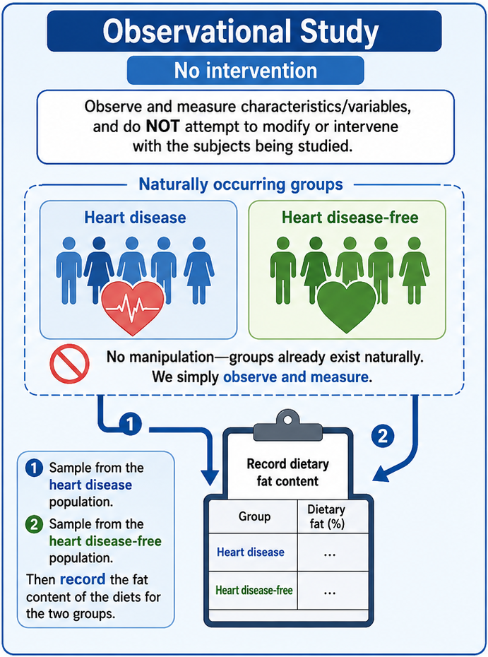
```

:::


::: {.column width="50%"}

::: fragment

```{r}
#| out-width: 82%
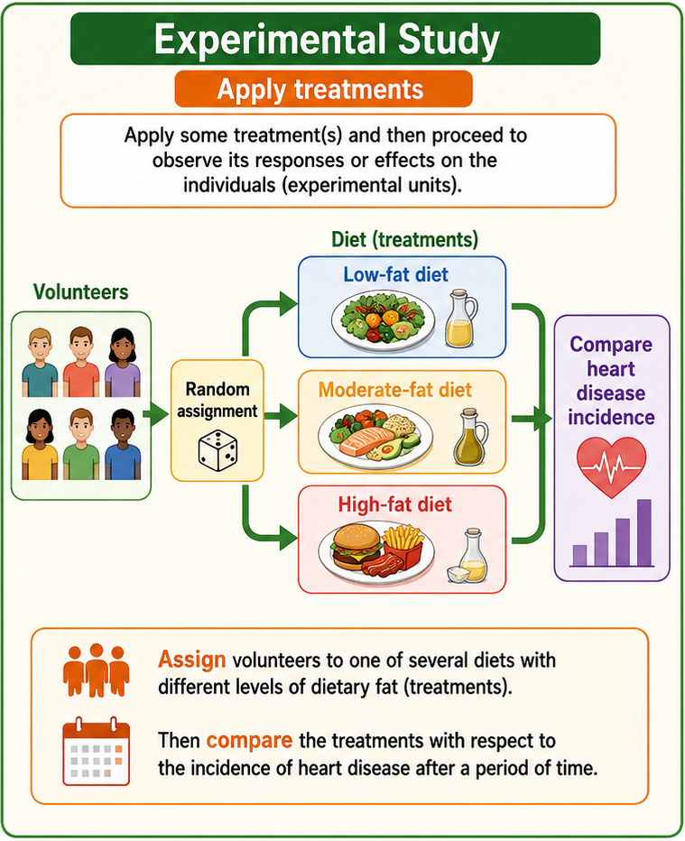
```

:::

:::


::::


<!-- - **Observational Study**: Observe and measure characteristics/variables, and do **NOT** attempt to modify or intervene with the subjects being studied. -->
<!--   + <span style="color:blue"> Sample from `r emo::ji('one')` the heart disease and `r emo::ji('two')` heart disease-free populations. Then record the fat content of the diets for the two groups.</span> </span>  -->

<!-- . . . -->

<!-- - **Experimental Study**: Apply some **treatment(s)** and then proceed to observe its responses or effects on the individuals (experimental units). -->
<!--   + <span style="color:blue">Assign volunteers to one of several diets with different levels of dietary fat (treatments). Then compare the treatments with respect to the incidence of heart disease after a period of time. </span>  -->

## Two Types of Studies to Collect Sample Data
  
::: question

Observational or Experimental?

- <span style="color:blue">Randomly select 40 males and 40 females to see the difference in blood pressure levels between male and female. </span> 

- <span style="color:blue"> Test the effects of a new drug by randomly dividing patients into 3 groups (high dosage, low dosage, placebo). </span> 

:::


::: notes


:::


## Limitation of Observational Studies: Confounding

- **Confounder**: A variable NOT included in a study but affects the variables in the study.
- Observe past data show that increases in ice cream sales are associated with increases in drownings, and we conclude that **eating ice cream causes drownings**. `r emo::ji('scream')` `r emo::ji('confused')` `r emo::ji('interrobang')`
 
::::: columns

::: {.column width="50%"}
```{r}
#| out-width: 50%
knitr::include_graphics("./images/02-overview/icecream.jpeg")
```
:::

::: {.column width="50%"}
```{r}
#| out-width: 50%
knitr::include_graphics("./images/02-overview/drowning.jpeg")
```
:::

:::::

. . .

::: question

What is the confounder that is not in the data, but affects ice cream sales and the number of drownings?

:::

. . .


::::: columns

::: {.column width="80%"}

***Temperature***: as temperature increases, ice cream sales increase and the number of drownings goes up because more people swim.
:::

::: {.column width="20%"}

```{r}
#| out-width: 50%

```

:::
:::::


::: notes

As temperature increases (season), ice cream sales increase and the number of drownings goes up because more people swim.

:::


## Causal Relationship

- Making causal conclusions based on *experiments* is often more reasonable than making the same causal conclusions based on observational data.

- Observational studies are generally only sufficient to show **associations, not causality**.


```{r}
par(mar = c(0, 0, 0, 0))
plot(c(-0.05, 1.2), c(0.39, 1),
     type = 'n', xlab = "", ylab = "", axes = FALSE)
text(0.59, 0.89, 'temparature', font = 2, cex = 1.8)
rect(0.4, 0.8, 0.78, 1)
text(0.3, 0.49, 'ice cream sales', font = 2, cex = 1.8)
rect(0.1, 0.4, 0.48, 0.6)
arrows(0.49, 0.78, 0.38, 0.62,
       length = 0.08, lwd = 2.5)
text(0.87, 0.5, 'drowning cases', font = 2, cex = 1.8)
rect(0.71,0.4, 1.03, 0.6)
arrows(0.67, 0.78, 0.8, 0.62,
       length = 0.08, lwd = 2.5)
arrows(0.5, 0.5, 0.69, 0.5, lwd = 2.5,
       length = 0.08, col = COL[6,2])
text(0.595, 0.565, "?", font = 2,
     cex = 4.5, col = COL[4])
```

::: notes


:::


# Sampling Methods {background-image="./images/02-overview/data_collect.jpg" background-size="cover" background-position="50% 50%" background-color="#447099"}


::: notes


:::


## Simple Random Sample

- **Random Sample**: Each member of a population is **equally likely** to be selected.

- **Simple Random Sample (SRS)**: Every possible sample of sample size $n$ has the same chance to be chosen.

- **Example**: If sample 100 students from all, say 10,000 Marquette students, I would *randomly* assign each student a number (from 1 to 10,000), then *randomly* select 100 numbers. 

::::: columns

::: {.column width="50%"}
```{r}
set.seed(3)
N   <- 108
n   <- 18
colSamp <- COL[4]
PCH <- rep(c(1, 3, 20)[3], 3)
col <- rep(COL[1], N)
pch <- PCH[match(col, COL)]

par(mar = c(0,0,0,0))
plot(0, xlim=c(0,2), ylim=0:1, type='n', axes=FALSE)
box()
x   <- runif(N, 0, 2)
y   <- runif(N)
inc <- n
points(x, y, col=col, pch=pch, cex = 2)

these <- sample(N, n)
points(x[these], y[these], pch=20, cex=1.5, col=colSamp)
points(x[these], y[these], cex=1.8, col=colSamp)
```
:::


::: {.column width="50%"}

::: tiny

```{r}
#| fig-cap: "https://research-methodology.net/sampling-in-primary-data-collection/random-sampling/"
#| out-width: 80%
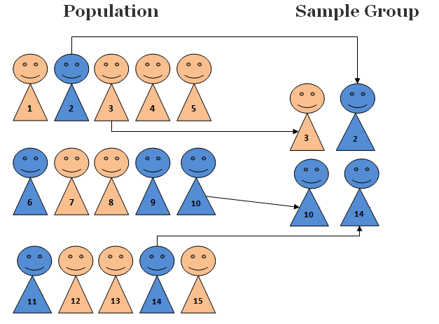
```

:::

:::

:::::


::: notes


:::


## Stratified Random Sample

- **Stratified Sampling**: Subdivide the population into different subgroups (strata) that share the **same** characteristics, then draw a simple random sample from each subgroup.

- **Homogeneous within strata; Non-homogeneous between strata**

```{r}
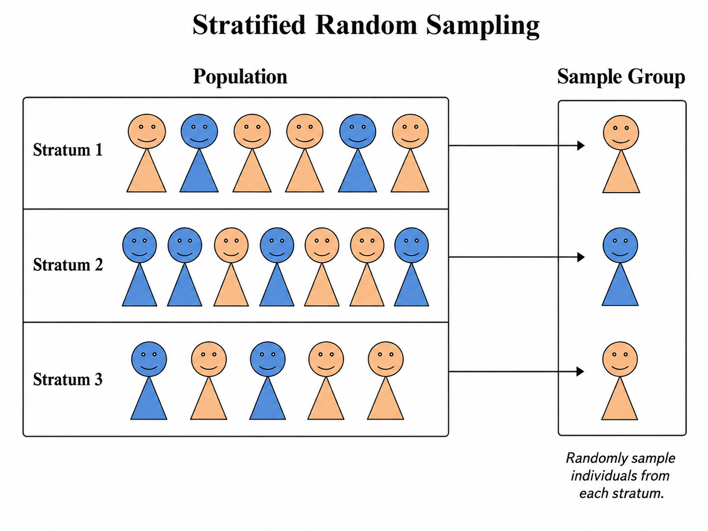
```


::: notes


:::


## Stratified Random Sample Example

- **Example**: Divide Marquette students into groups by colleges, then SRS for each group.

```{r}
par(mar = c(0,0,0,0))
PCH <- rep(c(1, 3, 20)[3], 3)
plot(0, xlim=c(0,2), ylim=0:1, type='n', axes=FALSE, xlab = "", ylab = "")
box()
X    <- c(0.18, 0.3, 0.68, 1.18, 1.4, 1.74)
Y    <- c(0.2, 0.78, 0.44, 0.7, 0.25, 0.65)
locs <- c(1, 4, 5, 3, 6, 2)
gps  <- list()
N    <- 1.1*c(15, 12, 35, 22, 13, 28)
R    <- sqrt(N/500)
p    <- matrix(c(12, 2, NA,
				 1,  2, NA,
				 4,  30, NA,
				 19, 1, NA,
				 11, 0, NA,
				 3, 24, NA), 3)
p     <- round(p*1.1)
p[3,] <- N - p[1,] - p[2,]
above <- c(1, 1, 1, 1, -1, 1)
for(i in 1:6){
	hold <- seq(0, 2*pi, len=99)
	x    <- X[i] + (R[i]+0.01)*cos(hold)
	y    <- Y[i] + (R[i]+0.01)*sin(hold)
	polygon(x, y, border=COL[5,4])
	x    <- rep(NA, N[i])
	y    <- rep(NA, N[i])
	for(j in 1:N[i]){
		inside <- FALSE
		while(!inside){
			xx <- runif(1, -R[i], R[i])
			yy <- runif(1, -R[i], R[i])
			if(sqrt(xx^2 + yy^2) < R[i]){
				inside <- TRUE
				x[j]   <- xx
				y[j]   <- yy
			}
		}
	}
	type <- sample(1, N[i], TRUE)
	pch  <- PCH[type]
	col  <- COL[type]
	x    <- X[i]+x
	y    <- Y[i]+y
	points(x, y, pch=pch, col=col, cex = 1.2)
	these  <- sample(N[i], 3)
	points(x[these], y[these], pch=20, cex=1, col=colSamp)
	points(x[these], y[these], cex=1.6, col=colSamp)
}
college <- c("Arts/Sciences", "Business", "Engineering", "Law", "Nursing", "Health Sciences")
text(X, Y+above*(R+0.01), college, pos=2+above, cex=1.1, font = 2)
```


::: notes


:::


## Cluster Sampling

- **Cluster Sampling**: Divide the population into clusters, then randomly select some of those clusters, and then choose **all** the members from those selected clusters.

- **Homogeneous between clusters; Non-homogeneous within clusters**

```{r}
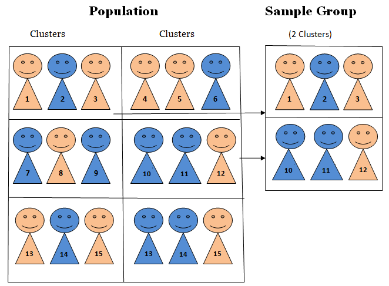
```

::: notes


:::


## Cluster Sampling Example

- **Example**: Study 4720 student drinking habit by dividing the students into 9 groups, then randomly selecting 3 and interviewing all of the students in each of those clusters.

```{r, cache=TRUE, echo=FALSE, out.width="62%"}
par(mar = c(0,0,0,0))
PCH <- rep(c(1, 3, 20)[3], 3)
plot(0, xlim=c(0,2), ylim=0:1, type='n', axes=FALSE)
box()
X    <- c(0.17, 0.19, 0.52, 0.85, 1, 1.22, 1.49, 1.79, 1.85)
Y    <- c(0.3, 0.75, 0.5, 0.26, 0.73, 0.38, 0.67, 0.3, 0.8)
locs <- c(1, 4, 5, 3, 6, 2)
gps  <- list()
N    <- c(18, 12, 11, 13, 16, 14, 15, 16, 12)
R    <- sqrt(N/500)
p    <- matrix(c(6,  8, NA,
				 4,  4, NA,
				 4,  4, NA,
				 5,  4, NA,
				 8,  5, NA,
				 4,  5, NA,
				 5,  9, NA,
				 6,  5, NA,
				 4,  5, NA), 3)
p[3,] <- N - p[1,] - p[2,]
above <- c(-1, 1, 1, 1, 1, -1, 1, 1, 1)
for(i in 1:length(X)){
	hold <- seq(0, 2*pi, len=99)
	x    <- X[i] + (R[i]+0.02)*cos(hold)
	y    <- Y[i] + (R[i]+0.02)*sin(hold)
	polygon(x, y, border=COL[5,4])
	if(i %in% c(3, 4, 8)){
		polygon(x, y, border=COL[4], lty=2, lwd=1.5)
	}
	x    <- rep(NA, N[i])
	y    <- rep(NA, N[i])
	for(j in 1:N[i]){
		inside <- FALSE
		while(!inside){
			xx <- runif(1, -R[i], R[i])
			yy <- runif(1, -R[i], R[i])
			if(sqrt(xx^2 + yy^2) < R[i]){
				inside <- TRUE
				x[j]   <- xx
				y[j]   <- yy
			}
		}
	}
	type <- sample(1, N[i], TRUE)
	pch  <- PCH[type]
	col  <- COL[type]
	x    <- X[i]+x
	y    <- Y[i]+y
	points(x, y, pch=pch, col=col, cex = 1.2)
	these  <- sample(N[i], N[i])
	# these  <- N[i]
	if(i %in% c(3, 4, 8)){
	points(x[these], y[these], pch=20, cex=1, col=colSamp)
	points(x[these], y[these], cex=1.6, col=colSamp)
		#points(x[these], y[these], pch=19, col=colSamp)
	}
}
class_name <- c("Cluster 1", "Cluster 2", "Cluster 3", "Cluster 4",
                "Cluster 5", "Cluster 6",
                "Cluster 7", "Cluster 8", "Cluster 9")
text(X, Y+above*(R+0.01), class_name, 
     pos=2+above, cex=1.1, font = 2)
# text(X, Y+above*(R+0.01), paste("Cluster", 1:length(X)), 
#      pos=2+above, cex=1.1, font = 2)
```


::: notes

- clusters look similar each other, but members in a cluster are not very alike. They have different characteristics.
- Homogeneous between clusters because all classes are STEM classes.
- Non-homogeneous within clusters because students in the same class may have different majors or from different colleges

:::


# Data Type {background-image="./images/02-overview/data_collect.jpg" background-size="cover" background-position="50% 50%" background-color="#447099"}

::: notes

- OK. We learn data collection and sampling methods. 
- Now's let's learn some data types.

:::


## 

```{r}
#| label: data-type
par(mar = c(0,0,0,0))
plot(c(-0.15, 1.3),
     c(0, 1),
     type = 'n',
     axes = FALSE)

text(0.6, 0.9, 'Variables/Data', font = 2, cex = 1.5)
rect(0.4, 0.8, 0.8, 1)

text(0.25, 0.55, 'Categorical', font = 2, cex = 1.5)
text(0.25, 0.45, '(Qualitative)', font = 2, cex = 1.5)
rect(0.1, 0.4, 0.4, 0.6)
arrows(0.45, 0.78, 0.34, 0.62, length = 0.08)

text(0.9, 0.55, 'Numerical', font = 2, cex = 1.5)
text(0.9, 0.45, '(Quantitative)', font = 2, cex = 1.5)
rect(0.73, 0.4, 1.07, 0.6)
arrows(0.76, 0.78, 0.85, 0.62, length = 0.08)

text(0, 0.1, 'Nominal', font = 2, col = "blue", cex = 1.5)
rect(-0.1, 0.05, 0.1, 0.15)
arrows(0.13, 0.38, 0.05, 0.22, length = 0.08)

text(0.4, 0.1, 'Ordinal', font = 2, col = "blue", cex = 1.5)
rect(0.3, 0.05, 0.5, 0.15)
arrows(0.35, 0.38, 0.4, 0.22, length = 0.1)

text(0.6, 0.19, 'Level of measurements', font = 2, col = 4, cex = 1.5)

text(0.75, 0.1, 'Interval', font = 2, col = "blue", cex = 1.5)
# text(0.77, 0.05, '(unordered categorical)',
#      col = COL[6],
#      cex = 0.5, font = 2)
rect(0.65, 0.05, 0.85, 0.15)
arrows(0.82, 0.38, 0.77, 0.22, length = 0.08)

text(1.1, 0.1, 'Ratio', font = 2, col = "blue", cex = 1.5)
# text(1.14, 0.05, '(ordered categorical)', col = COL[6], cex = 0.5, font = 2)
rect(1, 0.05, 1.2, 0.15)
arrows(1, 0.38, 1.05, 0.22, length = 0.08)

text(1.18, 0.32, 'Continuous', font = 2, col = "red", cex = 1.5)
rect(1.05, 0.25, 1.3, 0.38)
arrows(1.07, 0.5, 1.15, 0.4, length = 0.08)

text(1.18, 0.73, 'Discrete', font = 2, col = "red", cex = 1.5)
rect(1.05, 0.65, 1.3, 0.8)
arrows(1.07, 0.5, 1.15, 0.64, length = 0.08)
```


::: notes

- This diagram tell us everything.
- We are going to learn each data type.

:::


## Categorical vs. Numerical Variables

- A **categorical** variable provides *non-numerical* information which can be placed in **one (and only one)** category from two or more categories.

  + <span style="color:blue">Gender (Male  `r emo::ji('man')`, Female  `r emo::ji('woman')`,  Trans  `r emo::ji('rainbow_flag')`) </span> 
  + <span style="color:blue">Class (Freshman, Sophomore, Junior, Senior, Graduate) </span>
  + <span style="color:blue">Country (USA `r emo::ji('us')`, Canada `r emo::ji('canada')`, UK `r emo::ji('uk')`, Germany `r emo::ji('de')`, Japan `r emo::ji('jp')`, Korea `r emo::ji('kr')`) </span> 

. . .

- A **numerical** variable is recorded in a *numerical* value representing counts or measurements.

  + <span style="color:blue"> GPA </span> 
  + <span style="color:blue"> The number of relationships you've had </span>
  + <span style="color:blue"> Height </span> 
  
::: notes


:::


## Numerical Variables can be Discrete or Continuous

- A **discrete** variable takes on values of a **finite** or **countable** number.

- A **continuous** variable takes on values **anywhere** over a particular range *without gaps or jumps*.

  + <span style="color:blue"> GPA is **continuous** because it can be any value between 0 and 4. </span> 
  + <span style="color:blue"> The number of relationships you've had is **discrete** because you can count the number and it is finite.</span>
  + <span style="color:blue"> Height is **continuous** because it can be any number within a range. </span> 

::: notes


:::


## Categorical Variables are Usually Recorded as Numbers

  + <span style="color:blue">Gender (Male = 0, Female = 1, Trans = 2) </span>
  + <span style="color:blue">Class (Freshman = 1, Sophomore = 2, Junior = 3, Senior = 4, Graduate = 5) </span> 
  + <span style="color:blue">Country (USA = 100, Canada = 101, UK = 200, Germany = 201, Japan = 300, Korea = 301) </span> 
  + <span style="color:blue">United Airlines boarding groups</span> 

. . .

  + **The numbers represent categories only; differences between them are meaningless.**
    * Canada - USA = 101 - 100 = 1?
    * Graduate - Sophomore = 5 - 2 = 3 = Junior?
  + We need to learn the **level of measurements** to know whether or which arithmetic operations are meaningful.
  

::: notes


:::


## Levels of Measurements: Nominal and Ordinal for Categorical Variables

- **Nominal**: The data can *NOT be ordered* in a meaningful or natural way.
  + <span style="color:blue">Gender (Male = 0, Female = 1, Trans = 2) </span> is **nominal** because Male, Female and Trans cannot be ordered.
  + <span style="color:blue">Country (USA = 100, Canada = 101, UK = 200, Germany = 201, Japan = 300, Korea = 301) </span> is **nominal**.
  
. . .

<br>

- **Ordinal**: The data can be arranged in some meaningful order, but differences between data values can NOT be determined or are meaningless.
  + <span style="color:blue">Class (Freshman = 1, Sophomore = 2, Junior = 3, Senior = 4, Graduate = 5) </span> is **ordinal** because Sophomore is one class higher than Freshman.

::: notes


:::


## Levels of Measurements: Interval and Ratio for Numerical Variables

- **Interval**: The data have meaningful difference between any two values. But the data do NOT have a **natural zero or starting point**. The data can do $\color{red} +$ and $\color{red} -$, but can't reasonably do $\color{red} \times$ and $\color{red} \div$. 
  + <span style="color:blue">Temperature</span> is **interval** because $80^{\circ}$F is 40 degrees higher than $40^{\circ}$F $(80-40=40)$, but $0^{\circ}$ does not mean NO heat and $80^{\circ}$F is NOT twice as hot as $40^{\circ}$F.
  
. . .

<br>

- **Ratio**: The data have both meaningful differences and ratios, and there is a natural zero starting point that indicates none of the quantity. The data can do $\color{red} +$, $\color{red} -$,  $\color{red} \times$ and $\color{red} \div$.
  + <span style="color:blue">Distance</span> is **ratio** because $80$ miles is twice as far as $40$ miles $(80/40 = 2)$, and $0$ mile means no distance.
  
  
## Converting Numerical to Categorical

- You've already seen an example.

. . .

```{r}
letter <- c("A", "A-", "B+", "B", "B-", "C+", "C", "C-",
                       "D+", "D", "F")
percentage <- c("[94, 100]", "[90, 94)", "[87, 90)", "[83, 87)", "[80, 83)",
                "[77, 80)", "[73, 77)", "[70, 73)", 
                "[65, 70)", "[60, 65)", "[0, 60)")
grade_dist <- data.frame(Grade = letter, Percentage = percentage)
library(kableExtra)
knitr::kable(grade_dist, longtable = TRUE, format = "html", align = 'l') %>% kable_styling(position = "center", font_size = 35)
```


::: notes


:::


##

```{r}
#| ref.label: data-type
```


::: notes


:::


##

::: your-turn

Identify data type of each variable in the 2026-27 Marquette men's basketball player data

:::

::: xsmall

```{r}
#| ref.label: mu_data
```

:::

::: {.content-visible when-format="revealjs"}

:::

::: notes


:::

