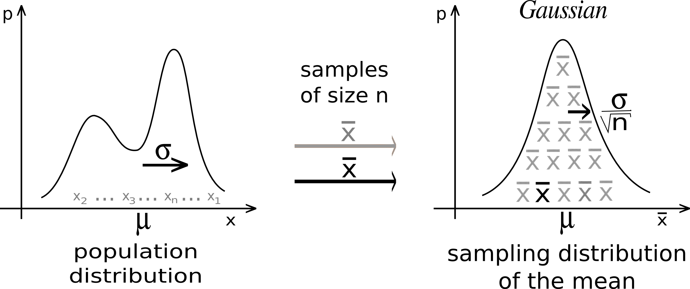
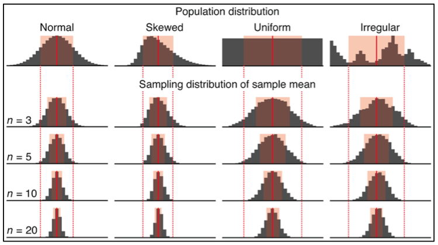

#  {visibility="hidden"}

\def\bx{\mathbf{x}}
\def\bg{\mathbf{g}}
\def\bw{\mathbf{w}}
\def\bbeta{\boldsymbol \beta}
\def\bX{\mathbf{X}}
\def\by{\mathbf{y}}
\def\bH{\mathbf{H}}
\def\bI{\mathbf{I}}
\def\bS{\mathbf{S}}
\def\bW{\mathbf{W}}
\def\T{\text{T}}
\def\cov{\mathrm{Cov}}
\def\cor{\mathrm{Corr}}
\def\var{\mathrm{Var}}
\def\E{\mathrm{E}}
\def\bmu{\boldsymbol \mu}
\DeclareMathOperator*{\argmin}{arg\,min}
\def\Trace{\text{Trace}}


```{r}
#| label: setup
#| include: false
#| eval: true
library(countdown)
library(emo)
library(knitr)
library(gt)
library(gtExtras)
library(ggplot2)
library(tidyverse)
library(tidymodels)

knitr::opts_chunk$set(
    fig.asp = 0.618,
    fig.align = "center",
    out.width = "100%",
    fig.retina = 10,
    fig.path = "./images/03-prob-stat/",
    message = FALSE,
    global.par = TRUE
)
options(
  htmltools.dir.version = FALSE,
  dplyr.print_min = 6, 
  dplyr.print_max = 6,
  tibble.width = 80,
  width = 80,
  digits = 3
  )
hook_output <- knitr::knit_hooks$get("output")
knitr::knit_hooks$set(output = function(x, options) {
  lines <- options$output.lines
  if (is.null(lines)) {
    return(hook_output(x, options))  # pass to default hook
  }
  x <- unlist(strsplit(x, "\n"))
  more <- "..."
  if (length(lines)==1) {        # first n lines
    if (length(x) > lines) {
      # truncate the output, but add ....
      x <- c(head(x, lines), more)
    }
  } else {
    x <- c(more, x[lines], more)
  }
  # paste these lines together
  x <- paste(c(x, ""), collapse = "\n")
  hook_output(x, options)
})
```


# Random Variables and Probability Distributions


## Discrete Random Variables

- A **discrete** variable $Y$ has *countable* possible values, e.g. $\mathcal{Y} = \{0, 1, 2\}$

- **Probability (mass) function** (pf or pmf) $$P(Y = y) = p(y), \,\, y \in \mathcal{Y}$$
  + $0 \le p(y) \le 1$ for all $y \in \mathcal{Y}$
  
  + $\sum_{y \in \mathcal{Y}}p(y) = 1$
  
  + $P(a < Y < b) = \sum_{y: a<y<b}p(y)$

<!-- - **Cumulative distribution function** (cdf) $$F(y) := P(Y \le y) = \sum_{z \le y}p(z)$$ -->


::: notes
give an example.
:::

::: question
Give me an example of a discrete variable/distribution!
:::

## Binomial Probability Distribution

$P(Y = y; n, \pi) = \frac{n!}{y!(n-y)!}\pi^y(1-\pi)^{n-y}, \quad y = 0, 1, 2, \dots, n$

```{r}
#| label: binomial_plot
#| out-width: 70%
par(mar = c(4, 4, 2, 0), mgp = c(2.7, 1, 0), las = 1)
plot(x = 0:5, y = dbinom(0:5, size = 5, prob = 0.4), 
     type = 'h', xlab = "y", 
     ylab = "P(Y = y)", lwd = 10, main = "Binomial(n = 5, pi = 0.4)")
```


<!-- ## -->

<!--  -->


## Poisson Probability Distribution

- $Y \sim Poisson(\lambda)$

- $Y$ has no upper limit. The graph is *truncated* at $y = 24$.

```{r}
#| out-width: 100%
par(mar = c(3.8, 3.8, 1, 0), mgp = c(2.5, 0.5, 0))
plot(0:24, dpois(0:24, lambda = 10), type = 'h', lwd = 10, las = 1,
     ylab = "P(Y = y)", xlab = "y", main = "Poisson(10)")
```

##




## Continuous Random Variables

- A **continuous** variable $Y$ has *infinite* possible values, e.g. $\mathcal{Y} = [0, \infty)$

- **Probability density function** (pdf) $$f(y), \,\, y \in \mathcal{Y}$$

  + $f(y) \ge 0$ for all $y \in \mathcal{Y}$
  
  + $\int_{\mathcal{Y}}f(y) \, dy= 1$
  
  + $P(a < Y < b) = \int_{a}^bf(y)\,dy$

<!-- - **Cumulative distribution function** (cdf) $$F(y) := P(Y \le y) = \int_{y}^{\infty}f(t)\,dt$$ -->

. . .

::: question
Give me an example of continuous variable/distribution!
:::


## Normal (Gaussian) Density Curve

For continuous variables, **$P(a < Y < b)$ is the area under the density curve between $a$ and $b$.**


```{r}
#| label: norm_den
#| out-width: 100%
#| fig-asp: 0.5
z <- seq(-3, 3, by = 0.001)
hz <- dnorm(z)
plot(z, hz, type = "n", xlab = "y", ylab = "", ylim = c(0, dnorm(0, 0, 1)),
    axes = FALSE, main = "Gaussian density curve", cex.main = 0.9, cex.lab = 0.9)
these <- (qnorm(0.025) <= z & z <= qnorm(0.975))
polygon(c(qnorm(0.025), z[these], qnorm(0.975)),
          c(0, hz[these], 0),
          col = "lightblue",
          border = 4)
lines(z, hz, col = 4, lwd = 4)
z_cri <- qnorm(0.975)
segments(x0 = z_cri, y0 = 0, y1 = dnorm(z_cri, 0, 1), col = 4, lwd = 2, lty = 2)
segments(x0 = -z_cri, y0 = 0, y1 = dnorm(-z_cri, 0, 1), col = 4, lwd = 2, lty = 2)
axis(1, at = c(-3, -z_cri, 0, z_cri, 3), labels = c("", "a", "0", "b", ""), 
     pos = 0, line = 1, cex.axis = 0.9)
```


<!-- ## -->

<!--  -->


## Expected Value and Variance
For a random variable $Y$,

- The **expected value** or **mean**: $E(Y)$ or $\mu$.

- The **variance**: $\var(Y)$ or $\sigma^2$; **standard deviation**: $\text{SD}(Y)$ or $\sigma$

. . .

- The mean measures the *center* of the distribution, or the *balancing point* of a seesaw.

- The standard deviation measures the *dispersion*  of a distribution, or the *average distance* from the mean.


<!-- - The mean of a discrete random variable is the weighted average of possible values weighted by their corresponding probability. -->

<!-- - The variance of a discrete random variable is the weighted sum of squared deviation from the mean weighted by probability values. -->

. . . 

:::: {.columns}

::: {.column width="50%"}
*Discrete* $Y$:

::: midi
$$E(Y) := \sum_{y \in \mathcal{Y}}yP(Y = y)$$
$$\begin{align} \var(Y) &:= E\left[(Y - E(Y))^2 \right] \\&= \sum_{y \in \mathcal{Y}}(y - \mu)^2P(Y = y)\end{align}$$
:::

:::


::: {.column width="50%"}
*Continuous* $Y$:

::: midi
$$E(Y) := \int_{-\infty}^{\infty}yf(y)\, dy$$
$$\begin{align} \var(Y) &:= E\left[(Y - E(Y))^2 \right] \\&= \int_{-\infty}^{\infty}(y - \mu)^2f(y)\, dy \end{align}$$
:::

:::
::::


::: notes
- The mean of a discrete random variable is the weighted average of possible values weighted by their corresponding probability.

- The variance of a discrete random variable is the weighted sum of squared deviation from the mean weighted by probability values.

- give an normal example
:::


::: alert
This is **NOT** the sample mean $\overline{y}$ or sample variance $s^2$.
:::

::: notes
If $Y \sim binomial(n, \pi)$, what are the mean and variance?
:::


## [R Lab]{.pink} dpqr Functions {visibility="hidden"}

For some distribution (`dist`), 

- **d**`dist(x, ...)`: density value $f(x)$ or probability value $P(X = x)$.
- **p**`dist(q, ...)`: cdf $F(q) = P(X \le q)$.
- **q**`dist(p, ...)`: quantile of probability $p$.
- **r**`dist(n, ...)`: generate $n$ random numbers.

::: notes
- In practice, we are not gonna calculate those properties by hand. Instead, we use computing software.
- In R we can use dpqr Functions to calculate probabilities or generate values from some distribution. Let's see how.
:::

. . .

:::: {.columns}

::: {.column width="50%"}
```{r}
#| echo: true

## 10 binomial(5, 0.4) values
rbinom(n = 10, size = 5, prob = 0.4)

## P(Y = 3) of binom(5, 0.4)
dbinom(x = 3, size = 5, prob = 0.4)
```
:::


::: {.column width="50%"}
```{r}
#| echo: true

## P(Y <= 2) of binom(5, 0.4)
pbinom(q = 2, size = 5, prob = 0.4)
```
:::
::::


## [R Lab]{.pink} dpqr Functions {visibility="hidden"}
```{r}
#| label: norm
#| echo: true
## the default mean = 0 and sd = 1 (standard normal)
rnorm(5)
```

. . .

- $100$ random draws from $N(0, 1)$

```{r}
#| label: nor-den-draw
#| out-width: 72%
#| fig-asp: 0.5
par(mar = c(4, 4, 2, 1))
mean <- 0; sd <- 1
# lb=80; ub=120

x <- seq(-4, 4, length = 100) * sd + mean
hx <- dnorm(x, mean, sd)

plot(x, hx, type = "n", xlab = "normal variables", ylab = "density value",
     main = expression(N(0, 1)), axes = FALSE, mgp = c(2, 0, 0))

lines(x, hx, col = "#003366", lwd = 3)
axis(1, at = seq(-4, 4, 2), pos=0)
axis(2, las = 1)

nor_sample <- rnorm(100)
points(x = nor_sample, y = jitter(rep(0, length(nor_sample)), factor = 0.5), 
       col = alpha("red", 0.2), pch = 19)
```

## [R Lab]{.pink} dpqr Functions {visibility="hidden"}

```{r}
#| echo: true
# P(0.5 < Z < 1) where Z ~ N(0, 1)
pnorm(1) - pnorm(0.5)
```

```{r}
#| label: nor-den-ab
#| out-width: 75%
#| fig-asp: 0.5
z <- seq(-3, 3, by = 0.001)
hz <- dnorm(z)
plot(z, hz, type = "n", xlab = "N(0, 1)", ylab = "", ylim = c(0, dnorm(0, 0, 1)),
    axes = FALSE, main = "Standard Normal density curve", 
    cex.main = 1.9, cex.lab = 1.9)
a <- 1
b <- 0.5
these <- (b <= z & z <= 1)
polygon(c(b, z[these], a),
          c(0, hz[these], 0),
          col = "lightblue",
          border = 4)
lines(z, hz, col = 4, lwd = 4)

segments(x0 = a, y0 = 0, y1 = dnorm(a, 0, 1), col = 4, lwd = 2, lty = 2)
segments(x0 = b, y0 = 0, y1 = dnorm(b, 0, 1), col = 4, lwd = 2, lty = 2)
axis(1, at = c(-3, 0, b, a, 3), labels = c("", "0", "0.5", "1", ""), 
     pos = 0, line = 1, cex.axis = 1.9)
```


## [R Lab]{.pink} dpqr Functions {visibility="hidden"}
```{r}
#| echo: true
m <- 5
p <- 0.4
## mean
(mu <- sum(0:5 * dbinom(0:5, size = m, prob = p)))
m * p
## var
(sig2 <- sum((0:5 - mu) ^ 2 * dbinom(0:5, size = m, prob = p)))
m * p * (1 - p)
```


## {visibility="hidden"}

::: tiny
```{r}
#| fig-cap: "https://statisticsglobe.com/probability-distributions-in-r"
#| out-width: 75%

```
:::

## {background-iframe="https://chenghanyustats-introstat-mean.share.connect.posit.cloud/" background-interactive="true"}


## {background-iframe="https://chenghanyustats-introstat-standarddeviation.share.connect.posit.cloud/" background-interactive="true"}


## {background-iframe="https://chenghanyustats-distributions.share.connect.posit.cloud" background-interactive="true"}

# Properties of Distributions


## Sum of Normals is Normal

- If $Y \sim N(\mu, \sigma^2)$, $Z = \frac{Y - \mu}{\sigma} \sim N(0, 1)$.

. . .

- If $X \sim N(\mu_X, \sigma_X^2)$ and $Y \sim N(\mu_Y, \sigma_Y^2)$ and $X$ and $Y$ are [*independent*]{.green}. Then for $a, b \in \mathbf{R}$,
$$\textcolor{blue}{aX + bY \sim N\left(a\mu_X+b\mu_Y, a^2\sigma_X^2 + b^2\sigma_Y^2\right)}$$

. . .


- Example. $X \sim N(1, 2)$ and $Y \sim N(2, 1)$, and $X \perp Y$. Then 
$$2X - 3Y \sim N\left(2(1) - 3(2), 2^2(2) + 3^2(1)\right) = N(-4, 17)$$

. . .

::: question
What is the distribution of $a_1Y_1 + a_2Y_2 + \cdots + a_nY_n$ if $Y_i \sim N(\mu_i, \sigma^2_i)$ and $Y_i$s are independent?
:::


::: notes
- If $Z \sim N(0, 1)$, then $$Z^2 \sim \chi^2_1$$
- If $Z_i \stackrel{iid}{\sim} N(0, 1), i = 1, 2, \dots, k$, then $$\sum_{i=1}^k Z_i^2 \sim \chi^2_k$$

- $iid$ means <span style="color:blue"> * **i**ndependent **i**dentically **d**istributed*</span>.

- Let $Y_i \stackrel{indep}{\sim} N(\mu_i, \sigma_i^2), i = 1, 2, \dots, n$. Then the random variable $U = \sum_{i=1}^n a_iY_i$ has the distribution
:::

##

```{r}
source("../scripts/plot_sum_normals.R")
```


## Conditional Distribution

- The distribution of $Y$ may depend on another variable $X$'s value.

- $Y \mid X \sim N\left(\mu(X), 1 \right)$

. . .

- If $\mu(X) = 3X$, then when $X = 1$, 
$$Y \mid X = 2 \sim N\left(\mu(2), 1 \right) = N\left(6, 1 \right)$$

. . .

::: alert

The location of the distribution of $Y$, or the mean of $Y$ changes with the value of $X$. The conditional expectation $E(Y\mid X) = 3X$.

:::


##

```{r}
source("../scripts/plot_condtional_mean.R")
```


## Normal, Chi-Squared, Student's-t and F {visibility="hidden"}

- If $Z \sim N(0, 1)$, $V \sim \chi^2_v$ and $Z$ and $V$ are independent, then $$\frac{Z}{\sqrt{V/v}} \sim t_{v}$$

- If $V \sim \chi^2_v$, $W \sim \chi^2_w$ and $V$ and $W$ are independent, then $$\frac{V/v}{W/w} \sim F_{v, w}$$


# Statistical Inference
- ## Learning from (observed imperfect) data


## Statistics Comes In

Suppose each data point $Y_i$ of the sample $(Y_1, Y_2, \dots, Y_n)$ is a random variable from the same population whose distribution is $N(\mu, \sigma^2)$, and  $Y_i$s are independent each other: $$Y_i \stackrel{iid}{\sim} N(\mu, \sigma^2), \quad i = 1, 2, \dots, n$$

```{r}
#| out-width: 60%
par(mar = c(0, 0, 0, 0), mfrow = c(1, 1))
plot(0, 0, type = "n", axes = FALSE, xlab = "", ylab = "")
plotrix::draw.ellipse(x = -0.56, y = 0, a = 0.5, b = 0.4, lwd = 2)
plotrix::draw.ellipse(x = 0.56, y = 0, a = 0.5, b = 0.4, lwd = 2)
text(x = -0.56, y = 0, labels = "Data Generating Process", cex = 2.5)
text(x = 0.56, y = 0, labels = "Observed Data", cex = 2.5)
diagram::curvedarrow(from = c(-0.56, 0.47), to = c(0.56, 0.47), 
                     curve = -0.2, arr.pos = 0.98)
diagram::curvedarrow(from = c(0.56, -0.47), to = c(-0.56, -0.47), 
                     curve = -0.2, arr.pos = 0.98)
text(x = 0, y = 0.8, labels = "Probability (Generating)", cex = 2.5)
text(x = 0, y = -0.8, labels = "Statistical Inference (Learning)", cex = 2.5)
```

::: notes
The real data generating process is the finite population. The data generating process is usually assumed to be a hypothetical superpopulation represented by a probability distribution.
:::


## Statistics Comes In: Sampling Distribution

If $Y_i \stackrel{iid}{\sim} N(\mu, \sigma^2), \quad i = 1, 2, \dots, n$, a generative model determined by $\mu$ and $\sigma$,

- The **sampling distribution** of the sample mean $\overline{Y} \sim N\left(\mu,\frac{\sigma^2}{n} \right)$, and so $Z = \frac{\overline{Y} - \mu}{\sigma/\sqrt{n}} \sim N(0, 1)$

. . .

- Let the sample variance of $Y$ be $S^2 = \frac{\sum_{i=1}^n(Y_i - \overline{Y})^2}{n-1}$. 

::: question

What is the distribution of $\frac{\overline{Y} - \mu}{S/\sqrt{n}}$?

:::

. . .

- $\frac{\overline{Y} - \mu}{S/\sqrt{n}} \sim t_{n-1}$

. . .


::: question

What if $Y_i$ is not from Gaussian?

:::

. . .

- We have **central limit theorem (CLT)** that $\frac{\overline{Y} - \mu}{\sigma/\sqrt{n}} \xrightarrow{d} N(0, 1)$ as $n \rightarrow \infty$

. . .

- **Inference**: $\mu$ and $\sigma^2$ are **unknown parameters**, and $\overline{y}$ and $s^2$ are point estimates for $\mu$ and $\sigma^2$, respectively.

::: notes
- sampling distribution might be called probabilistic data model (generative model)
- in practice, we will not know the sampling distribution, and we can only estimate it.
:::


## {background-iframe="https://chenghanyustats-introstat-clt.share.connect.posit.cloud" background-interactive="true"}


## Why Use Normal? <span style="color: red">**Central Limit Theorem (CLT)**</span> {visibility="hidden"}

- $X_1, X_2, \dots, X_n$ are i.i.d. variables with mean $\mu$ and variance $\sigma^2 < \infty$. 

- As $n$ increases, the sampling distribution of $\overline{X}_n = \frac{\sum_{i=1}^nX_i}{n}$ looks **more and more like $N(\mu, \frac{\sigma^2}{n})$, regardless of the distribution from which we are sampling $X_i$!**


```{r}
#| purl: false
#| out-width: 89%

```


::: notes
- Alright. We know why we want large sample. You will find that we use normal distribution quite often. It is not because it is called normal or more normal than other distributions. There is a reason why we use it. 
- The reason is Central Limit Theorem.
- The CLT says that Suppose is $\overline{X}_n$ is from a random sample of size $n$ and from a population distribution having mean $\mu$ and finite standard deviation $\sigma$. As $n$ increases, the sampling distribution of $\overline{X}_n$ looks **more and more like $N(\mu, \sigma^2/n)$, regardless of the distribution from which we are sampling!**
- Look at this figure. Your population distribution can be of any shape. As long as the distribution has mean and variance, its sampling distribution of sample mean will always look like a normal distribution as long as n is large. 
:::


## {visibility="hidden"}

```{r}
#| purl: false
#| out-width: 100%
#| fig-cap: "Nature Methods 10, 809–810 (2013)"


```

## Standard Errors

- The **standard error** is the estimated standard deviation of an estimator.
  + give us a sense of our uncertainty about the quantity of interest.
  
- The estimator $\overline{Y}$ has the standard error $\frac{\sigma}{\sqrt{n}}$.
  + give us a sense of our uncertainty about $\mu$.
  

```{r}
par(mar = c(1, 0, 1.9, 0), mgp = c(0, 1, 0), las = 1)
x <- seq(-5,7,length=100)
hx <- dnorm(x, 1, 2)
n_vec <- c(2, 4, 8)
plot(x, hx, type="n", xlab="", ylab="", axes = FALSE, ylim = c(0, max(hx)+0.38),
     main = "Sampling distribution of Sample Mean")
lines(x, hx, col = "black", lwd = 3)
lines(x, dnorm(x, 1, 2/sqrt(n_vec[1])), col = "red", lwd = 3)
lines(x, dnorm(x, 1, 2/sqrt(n_vec[2])), col = "blue", lwd = 3)
lines(x, dnorm(x, 1, 2/sqrt(n_vec[3])), col = "green", lwd = 3)
legend("topright", c("Population distribution: N(mean = 1, var = 4)", 
                     expression(paste("Sampling distributioin of ", bar(Y), " (n = 2): N(1, 4/2)")), 
                     expression(paste("Sampling distributioin of ", bar(Y), " (n = 4): N(1, 4/4)")),
                     expression(paste("Sampling distributioin of ", bar(Y), " (n = 8): N(1, 4/8)"))),
       bty = "n", col = c("black", "red", "blue", "green"), lwd = c(3, 3, 3, 3))
# qq <- round(qnorm(c(0.5, 1.5, 2.5, 3.5, 4.5)/5), 2)
axis(1, pos=0, cex.axis = 2)
segments(1, 0, 1, dnorm(1, 1, 2/sqrt(n_vec[3])), lty = 2, lwd = 0.5)
# text(0,-0.05, expression(bold(mu[0])), col = "blue", cex = 1.5)

```


## $(1-\alpha)100\%$ Confidence Interval for $\mu$

- **Confidence interval**: A range of values of a parameter that are roughly consistent with the data, given the assumed sampling distribution.

- $T = \frac{\overline{Y} - \mu}{S/\sqrt{n}} \sim t_{n-1}$

:::: {.columns}

::: {.column width="48%"}

$$\small \begin{align} & \quad \quad P\left(-t_{\frac{\alpha}{2}, n-1} < T  < t_{\frac{\alpha}{2}, n-1}\right) = 1 - \alpha \\ & P\left(-t_{\frac{\alpha}{2}, n-1} < \frac{\overline{Y} - \mu}{S/\sqrt{n}} < t_{\frac{\alpha}{2}, n-1}\right) = 1 - \alpha \\ & P\left(\mu-t_{\frac{\alpha}{2}, n-1}\frac{S}{\sqrt{n}} < \overline{Y} < \mu + t_{\frac{\alpha}{2}, n-1}\frac{S}{\sqrt{n}}\right) = 1 - \alpha \end{align}$$
:::


::: {.column width="52%"}
```{r}
#| purl: false
#| out-width: 100%
#| fig-asp: 0.34
par(mfrow = c(1, 1))
par(mar = c(3, 0, 0, 0), mgp = c(2, 1, 0))
x <- seq(-4, 4, length=100)
hx <- dt(x, df = 1)
plot(x, hx, type="l", lty = 1, xlab = "", lwd = 2, las = 1, 
  ylab = "", main = "", axes = F)
t_cri <- qt(0.8, df = 1)
abline(v = 0, lty = 2, lwd = 0.5)
text(-0.2, 0.3*dt(0, df = 1), expression(1 - alpha/2), cex = 2.5, col = "#003366")
text(2.2, 0.5*dt(2.2, df = 1), expression(alpha/2), cex = 2.2, col = "#003366")
segments(x0 = t_cri, y0 = 0, y1 = dt(t_cri, df = 1), col = 2, lwd = 2, lty = 2)
axis(1, at = c(-4, -t_cri,0, t_cri, 4), cex.axis = 2.2, pos = 0,
     labels = c("", "", 0, expression(t[frac(alpha, 2)]), expression(T[n-1])), tck = 0.01, line = 1)
```

:::

::::

## $(1-\alpha)100\%$ Confidence Interval for $\mu$: Probability
:::: {.columns}


::: {.column width="45%"}

::: small
$$P\left(\mu-t_{\frac{\alpha}{2}, n-1}\frac{S}{\sqrt{n}} < \overline{Y} < \mu + t_{\frac{\alpha}{2}, n-1}\frac{S}{\sqrt{n}} \right) = 1-\alpha$$
:::

::: question
Is the interval $\left(\mu-t_{\frac{\alpha}{2}, n-1}\frac{S}{\sqrt{n}}, \mu + t_{\frac{\alpha}{2}, n-1}\frac{S}{\sqrt{n}} \right)$ our confidence interval?
:::

:::


::: {.column width="55%"}
```{r}
#| purl: false
#| label: ci_95
#| out-width: "100%"
par(mar = c(6, 0, 0, 0), mgp = c(3, 2, 0), las = 1)
par(mfrow = c(1, 1))
z <- seq(-3, 3, by = 0.001)
hz <- dnorm(z)
plot(z, hz, type = "n", xlab = "", ylab = "", ylim = c(0, dnorm(0, 0, 1)),
    axes = FALSE, main = "")
these <- (qnorm(0.025) <= z & z <= qnorm(0.975))
polygon(c(qnorm(0.025), z[these], qnorm(0.975)),
          c(0, hz[these], 0),
          col = "lightblue",
          border = 4)
lines(z, hz, col = 4, lwd = 4)
z_cri <- qnorm(0.975)
segments(x0 = z_cri, y0 = 0, y1 = dnorm(z_cri, 0, 1), col = 4, lwd = 2, lty = 2)
segments(x0 = -z_cri, y0 = 0, y1 = dnorm(-z_cri, 0, 1), col = 4, lwd = 2, lty = 2)
text(0, 0.3*dnorm(0), expression(1 - alpha), cex = 3.5, col = "#003366")
text(2.2, 0.5*dnorm(2.2), expression(alpha/2), cex = 2.2, col = "#003366")
text(-2.2, 0.5*dnorm(-2.2), expression(alpha/2), cex = 2.2, col = "#003366")
labels <- c("", expression(mu - t[alpha/2] * frac(s, sqrt(n)),
                     # mu - sigma,
                     mu,
                     # mu + sigma,
                     mu + t[alpha/2] * frac(s, sqrt(n)), bar(Y)))
axis(1, at = c(-3, -z_cri,0, z_cri, 3), labels, pos = 0, line = 1, cex.axis = 2)
```
:::

::::

. . .

**No! We don't know $\mu$, the quantity we'd like to estimate!** But we almost there!


## $(1-\alpha)100\%$ Confidence Interval for $\mu$: Formula

:::: {.columns}

::: {.column width="45%"}

::: small
$$\begin{align}
&P\left(\mu-t_{\frac{\alpha}{2}, n-1}\frac{S}{\sqrt{n}} < \overline{Y} < \mu + t_{\frac{\alpha}{2}, n-1}\frac{S}{\sqrt{n}} \right) = 1-\alpha\\
&P\left( \boxed{\overline{Y}- t_{\frac{\alpha}{2}, n-1}\frac{S}{\sqrt{n}} < \mu < \overline{Y} + t_{\frac{\alpha}{2}, n-1}\frac{S}{\sqrt{n}}} \right) = 1-\alpha
\end{align}$$

:::

:::


::: {.column width="55%"}

```{r}
#| label: ci_95
```

:::

::::


- <span style="color:blue"> With sample data of size $n$, $\left( \overline{y}- t_{\frac{\alpha}{2}, n-1}\frac{s}{\sqrt{n}}, \overline{y} + t_{\frac{\alpha}{2}, n-1}\frac{s}{\sqrt{n}} \right)$ is our $(1-\alpha)100\%$ CI for $\mu$. </span>

## Hypothesis Testing
- <span style="color:blue"> $H_0: \mu = \mu_0  \text{   vs.   }  H_1: \mu > \mu_0$, or $\mu < \mu_0$, or $\mu \ne \mu_0$ </span>
- The significant level $\alpha = P(\text{Reject } H_0 \mid H_0 \text{ is true}) = P(\text{Type I error})$
- The test statistic is $t_{test} = \frac{\overline{y} - \color{blue}{\mu_0}}{s/\sqrt{n}}$, a value from $T \sim t_{n-1}$.
- When calculating a test statistic, we assume $H_0$ is **true**.

. . .

**Reject $H_0$ if** 

 |         Method   &nbsp; &nbsp;        | **Right**-tailed $(H_1: \mu > \mu_0)$  | **Left**-tailed  $(H_1: \mu < \mu_0)$  | **Two-tailed** $(H_1: \mu \ne \mu_0)$|
|:------------------------------:|:--------------:|:---------------:|:-----------:|
| Critical value | $t_{test} > t_{\alpha, n-1}$ | $t_{test} < -t_{\alpha, n-1}$ | $\mid t_{test}\mid \, > t_{\alpha/2, n-1}$ |
|  $p$-value | $\small P(T > t_{test} \mid H_0) < \alpha$  | $\small P(T < t_{test} \mid H_0) < \alpha$ | $\small 2P(T > \,\mid t_{test}\mid) \mid H_0) < \alpha$ |

## Both Methods Lead to the Same Conclusion
```{r}
#| purl: false
#| label: pvalue_criticalvalue
#| out-width: 85%
#| fig-asp: 0.6

par(mar = c(2.2, 0, 2, 0))
par(mfrow = c(2, 2))
x <- seq(-4, 4, length=1000)
hx <- dnorm(x)
plot(x, hx, type="l", lty=1, xlab="", axes = FALSE, cex.main = 1.2,
  ylab="", main=expression(paste("Left-tailed test (H1: ", mu < mu[0], ")")), ylim= c(-0.02, 0.4))
axis(1, labels = FALSE,  tck = -0.01)
# axis(2, labels = FALSE,  tck = -0.01)
lb <- qnorm(0.1)
ub <- qnorm(0.9)
lb_2 <- qnorm(0.05)
ub_2 <- qnorm(0.95)
z_test <- qnorm(0.05)
i <- x < lb
i_test <- x < z_test
# lines(x, hx)
polygon(c(lb,x[i]), c(0, hx[i]), col="red", border = NA)
polygon(c(z_test, x[i_test]), c(0, hx[i_test]), col="#003366", border = NA)
text(lb-0.6,-0.02, "t_stat.", cex = 1.2, col = "#003366")
text(z_test+0.6,-0.02, "t_cri", cex = 1.2, col = "red")
text(-2.5, 0.11, "p-value = blue area", cex = 1.2, col = "#003366")
text(0.8, 0.05, "alpha = red and blue area", cex = 1.2, col = "red")
arrows(-2.8, 0.07, x1 = -2.5, y1 = 0.02, length = 0.1, angle = 20)
# ========
plot(x, hx, type="l", lty=1, xlab="", axes = FALSE,ylim= c(-0.02, 0.4), cex.main = 1.2,
  ylab="", main=expression(paste("Right-tailed test (H1: ", mu > mu[0], ")")))
axis(1, labels = FALSE,  tck = -0.01)
i <- x > ub
z_test <- qnorm(0.95)
i_test <- x > z_test
# lines(x, hx)
polygon(c(ub,x[i]), c(0,hx[i]), col="red", border = NA)
polygon(c(z_test,x[i_test]), c(0,hx[i_test]), col="#003366", border = NA)
text(ub+0.6, -0.02, "t_stat", cex = 1.2, col = "#003366")
text(z_test-0.6,-0.02, "t_cri", cex = 1.2, col = "red")
text(2.4, 0.11, "p-value = blue area", cex = 1.2, col = "#003366")
text(-0.8, 0.05, "alpha = red and blue area", cex = 1.2, col = "red")
arrows(3.3, 0.08, x1 = 2.5, y1 = 0.02, length = 0.1, angle = 20)


# ========
plot(x, hx, type="l", lty=1, xlab="", axes = FALSE,ylim= c(-0.02, 0.4), cex.main = 1.2,
  ylab="", main= expression(paste("Two-tailed test (H1: ", mu != mu[0], ")", " left")))
axis(1, labels = FALSE,  tck = -0.01)
i_l <- x < lb_2
# i_u <- x > ub_2
# z_test_u <- qnorm(0.975)
z_test_l <- qnorm(0.025)
i_test_l <- x < z_test_l
# i_test_u <- x > z_test_u
# lines(x, hx)
polygon(c(lb_2, x[i_l]), c(0, hx[i_l]), col="red", border = NA)
# polygon(c(ub_2, x[i_u]), c(0, hx[i_u]), col="red")

polygon(c(z_test_l, x[i_test_l]), c(0, hx[i_test_l]), col="#003366", border = NA)
# polygon(c(z_test_u, x[i_test_u]), c(0, hx[i_test_u]), col="#003366")

text(lb_2-0.6, -0.02, "t_stat", cex = 1.2,col="#003366")
text(z_test_l+0.6,-0.02, "t_cri", cex = 1.2, col = "red")
text(-2.4, 0.11, "p-value = blue area * 2", cex = 1.2,col="#003366")
arrows(-2.8, 0.07, x1 = -2.5, y1 = 0.02, length = 0.1, angle = 20)
text(1.2, 0.05, "alpha = red and blue area * 2", cex = 1.2, col = "red")
# ========
plot(x, hx, type="l", lty=1, xlab="", axes = FALSE,ylim=c(-0.02, 0.4), cex.main = 1.2,
  ylab="", main= expression(paste("Two-tailed test (H1: ", mu != mu[0], ")", " right")))
axis(1, labels = FALSE,  tck = -0.01)
# i_l <- x < lb_2
i_u <- x > ub_2
z_test_u <- qnorm(0.975)
# z_test_l <- qnorm(0.025)
# i_test_l <- x < z_test_l
i_test_u <- x > z_test_u
# lines(x, hx)
# polygon(c(lb_2, x[i_l]), c(0, hx[i_l]), col="red")
polygon(c(ub_2, x[i_u]), c(0, hx[i_u]), col="red", border = NA)

# polygon(c(z_test_l, x[i_test_l]), c(0, hx[i_test_l]), col="#003366")
polygon(c(z_test_u, x[i_test_u]), c(0, hx[i_test_u]), col="#003366", border = NA)

text(ub_2+0.6, -0.02, "t_stat", cex = 1.2, col="#003366")
text(z_test_u-0.6,-0.02, "t_cri", cex = 1.2, col = "red")
text(2.4, 0.11, "p-value = blue area * 2", cex = 1.2, col="#003366")
arrows(3.5, 0.08, x1 = 2.5, y1 = 0.02, length = 0.1, angle = 20)
text(-0.8, 0.05, "alpha = red and blue area * 2", cex = 1.2, col = "red")

# polygon(c(z_test_l, z_test_u, x[i_test]), c(0, 0, hx[i_test]), col="#FFCC00")

# text(ub+0.8, -0.02, "test stat", cex = 1.3, col = "#003366")
# text(z_test-0.8,-0.02, "cri. val.", cex = 1.3, col = "red")
# text(2.8, 0.11, "p-value = blue area", cex = 1.3, col = "#003366")
# text(-.51, 0.05, "alpha = red and blue area", cex = 1.3, col = "red")
# arrows(3.3, 0.08, x1 = 2.5, y1 = 0.02, length = 0.1, angle = 20)
```


