# {visibility="hidden"}

\def\bx{\mathbf{x}}
\def\bg{\mathbf{g}}
\def\bw{\mathbf{w}}
\def\bbeta{\boldsymbol \beta}
\def\bX{\mathbf{X}}
\def\by{\mathbf{y}}
\def\bH{\mathbf{H}}
\def\bI{\mathbf{I}}
\def\bS{\mathbf{S}}
\def\bW{\mathbf{W}}
\def\T{\text{T}}
\def\cov{\mathrm{Cov}}
\def\cor{\mathrm{Corr}}
\def\var{\mathrm{Var}}
\def\E{\mathrm{E}}
\def\bmu{\boldsymbol \mu}
\DeclareMathOperator*{\argmin}{arg\,min}
\def\Trace{\text{Trace}}


```{r}
#| label: pkg
#| include: false
#| eval: true
library(emo)
library(openintro)
library(ggVennDiagram)
library(ggplot2)
library(ggVennDiagram)
library(plotrix)
library(diagram)
library(knitr)
data(COL)
source("./sample_method_fcns.R")
```

<!-- begin: webr fodder -->



<!-- end: webr fodder -->


# **Let's get equipped with our tools!**


## R and RStudio

::::: columns
::: {.column width="50%"}
```{r}
#| out-width: 45%
#| fig-link: https://www.r-project.org/
knitr::include_graphics("./images/03-r/r-logo.png")
```
- [R](https://www.r-project.org/): *free open-source* **programming language**
- R is mainly for doing *data science* with strength in *statistical modeling, computing and data visualization*
<!-- - It's extensible with **packages** that include reusable R functions and data sets. -->
:::


::: {.column width="50%"}
```{r}
#| out-width: 100%
#| fig-link: https://posit.co/products/open-source/rstudio/?sid=1
knitr::include_graphics("./images/03-r/RStudio-Logo.png")
```
- [RStudio](https://posit.co/products/open-source/rstudio/) <sup>1</sup>: interface for R, Python, etc called an **IDE** (integrated development environment), e.g. *"I write R code in the RStudio IDE"*.
- RStudio is not a requirement for programming with R, but it's commonly used by R developers, statisticians and data scientists.
:::

:::::

::: aside
RStudio is a product of [Posit](https://posit.co/) data science company.
:::

::: notes

- The first tool we need is R and RStudio. They are two different things.
- With packages, we can do lots of things without writing our own code, and we can just use the functions provided in packages to do our job. It saves us lots of time.
- A language with many great add-on packages can become a very useful language.
- packages: which is a collection of functions and data for people to use.
- Unlike other languages, R was created by statisticians, for statisticians to use.
- So R is not a general-purpose programming language like python or java, but it is specifically for data science. And that's probably why you don't learn R in an intro programming course.
- So you can view Python as a smart phone. It can do many different things, phone, camera, email, social media. But R is like a high quality camera. It can't receive emails, but it produces high quality photos.
- RStudio is not a programming language, but a software application.
- Code itself is just a text file. You can use any text editor or software to write your code.
:::


## R and RStudio Interface {visibility="hidden"}

- RStudio IDE includes
  + a viewable environment, a file browser, data viewer, and a plotting pane. `r emo::ji('+1')`
  + also features integrated help, syntax highlighting, context-aware tab completion and more! `r emo::ji('smile')`

::::: columns
::: {.column width="30%"}
::: center 
**R**
:::
```{r}
#| out-width: 100%
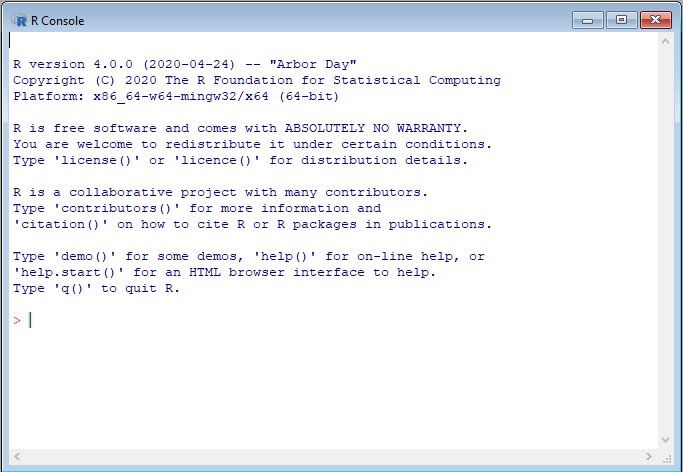
```
:::


::: {.column width="70%"}
::: center
**RStudio**
:::
```{r}
#| out-width: 80%
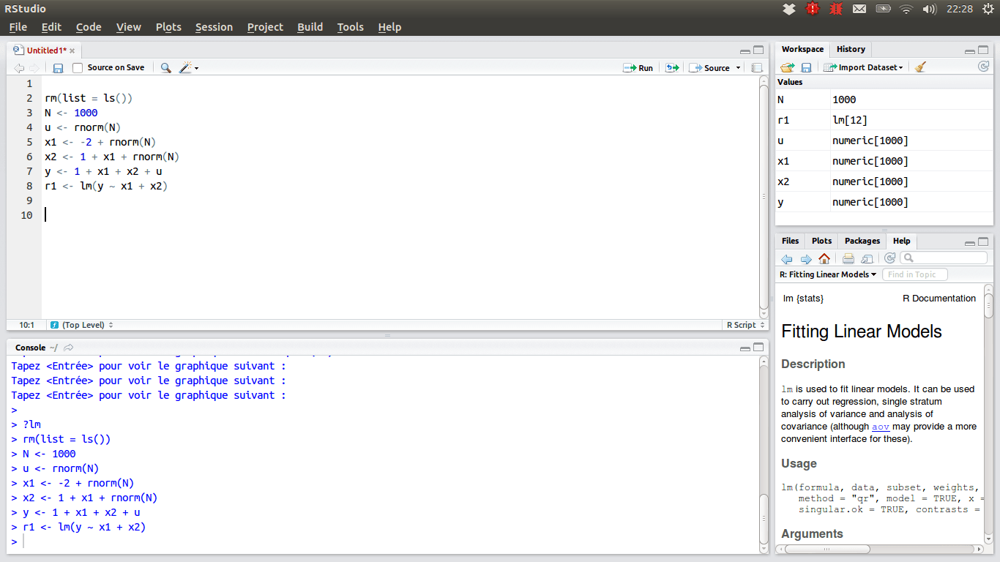
```
:::

:::::

## R Packages `r emo::ji('package')` {visibility="hidden"}

- **Packages** wrap up reusable R functions, the documentation that describes how to use them, and data sets all together.[^1]

- As of August 2025, there are about 22510 R packages available on [**CRAN**](https://cran.r-project.org/) (the Comprehensive R Archive Network)![^2]

- Let's work with an important subset of these!

```{r}
#| out-width: 50%
knitr::include_graphics("./images/03-r/pkg_map_usa.png")
```


[^1]: Wickham and Bryan, [R Packages](https://r-pkgs.org/).

[^2]: [CRAN contributed packages](https://cran.r-project.org/web/packages/).

<!-- [^3]: Mitchell O'Hara-Wild, [useR! 2018 feature wall](https://www.mitchelloharawild.com/blog/user-2018-feature-wall/). -->


## `r emo::ji('cloud')` Posit Cloud - Statistics w/o hardware hassles

- `r emo::ji('sunglasses')` We can implement R programs *without* installing R and RStudio in your laptop! 
- `r emo::ji('sunglasses')` [**Posit Cloud**](https://posit.cloud/) lets you do, share and learn data science **online for free**! 

::::: columns
::: {.column width="50%"}
### `r emo::ji('disappointed')` R/RStudio: Lots of friction 

- Download and install R
- Download and install RStudio
- Install wanted R packages:
  - rmarkdown
  - tidyverse 
  - ...
- Load these packages
- Download and install tools like Git
:::

::: {.column width="50%"}
### `r emo::ji('nerd_face')` Posit Cloud: Much less friction 
```{r}
#| out-width: 40%

```
- Go to <https://posit.cloud/>
- Log in

```
>hello R!
```

:::
:::::


::: notes
- Why I choose use RStudio in the cloud for you to code in R? Well if I want every one of you use R and RStudio locally in your computer, you have to (_____). And we need some magic to make sure everyone gets the coding environment ready.
- Instead, with the Cloud-based solution, you just need to login, then you start writing code right away. 
- Posit Cloud provides you with the latest version of R and RStudio. No installation is required.
- Doesn't mean you should always use Posit Cloud. It's not free if you need more resources.
- After you write more and more R code, you should absolutely install R and Rstudio into your local machine.
:::

## Sign Up Posit Cloud

::: lab

- *Step 1*: In the Posit website [https://posit.co/](https://posit.co/), choose **Products > Posit Cloud** as shown below.

:::

```{r}
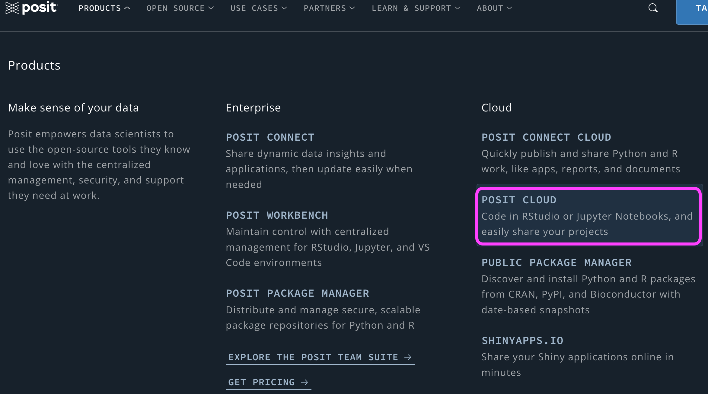
```


## Sign Up Posit Cloud

::: lab
- *Step 2*: Click **GET STARTED**. 

- *Step 3*: **Free > Sign Up**. Please sign up using your Marquette email address or the one you prefer.
:::

::::: columns
::: {.column width="30%"}
```{r}
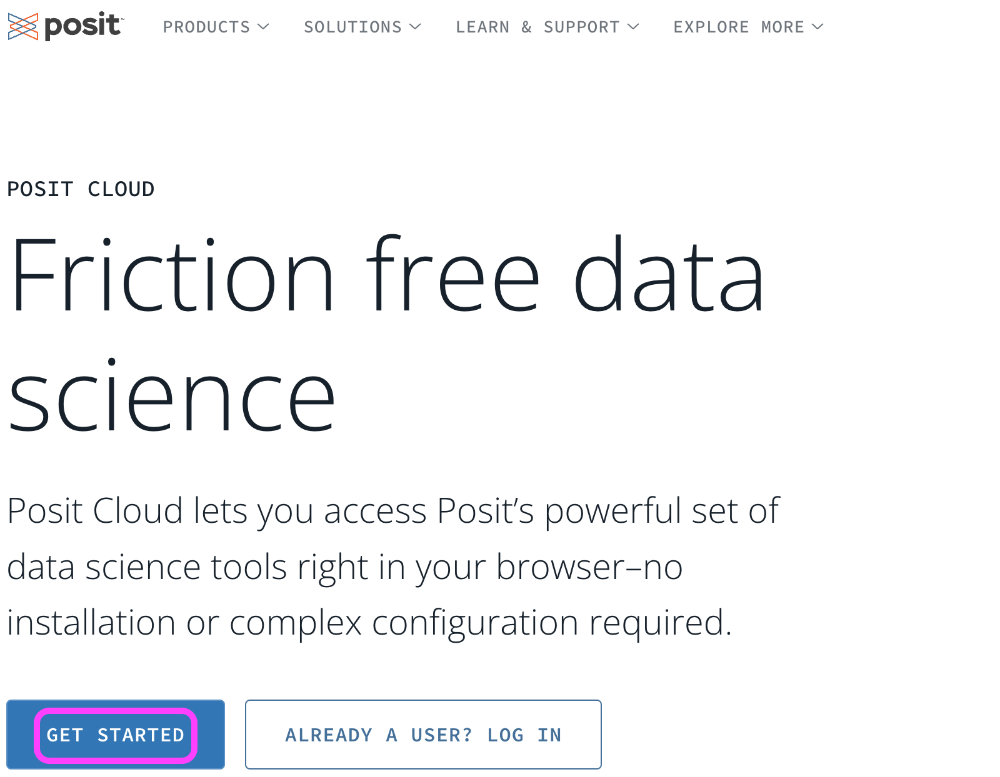
```
:::


::: {.column width="70%"}
```{r}
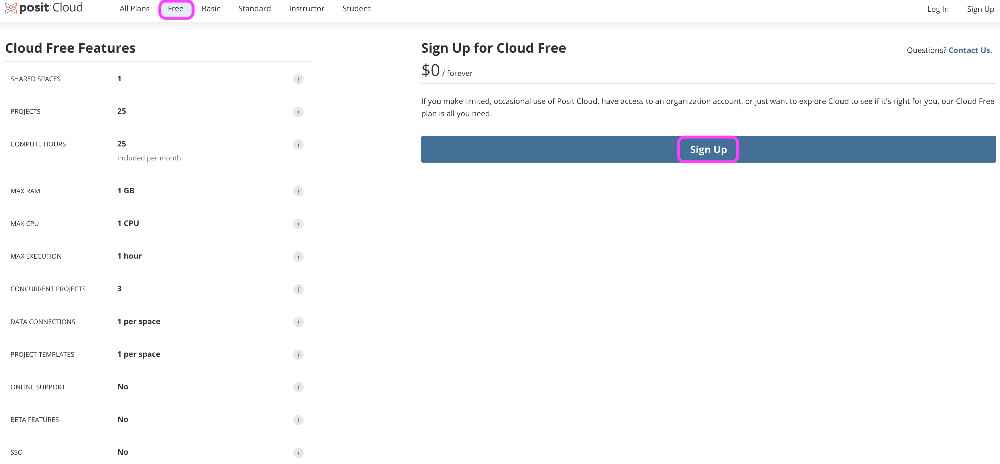
```
:::
:::::


## New Projects

In Posit Cloud, click **New Project > New RStudio Project**, then you are all set!

::::: columns
::: {.column width="70%"}

```{r}
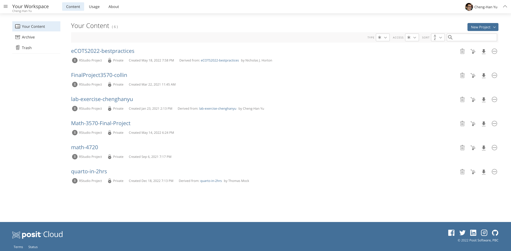
```

:::

::: {.column width="30%"}

**New RStudio Project**  
<!-- **New Project from Git Repo** -->
```{r echo=FALSE, out.width="100%", fig.align="center"}
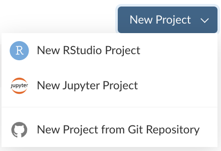
```

:::
:::::


## First R Code in Posit Cloud!

- Give your project a nice name (click Untitled Project), **math-4720** for example.

- First R code: `"Hello WoRld!"` or `2 + 4` after `>` in the **Console** pane.

- Change the editor theme: **Tools > Global Options > Appearance**

```{r}
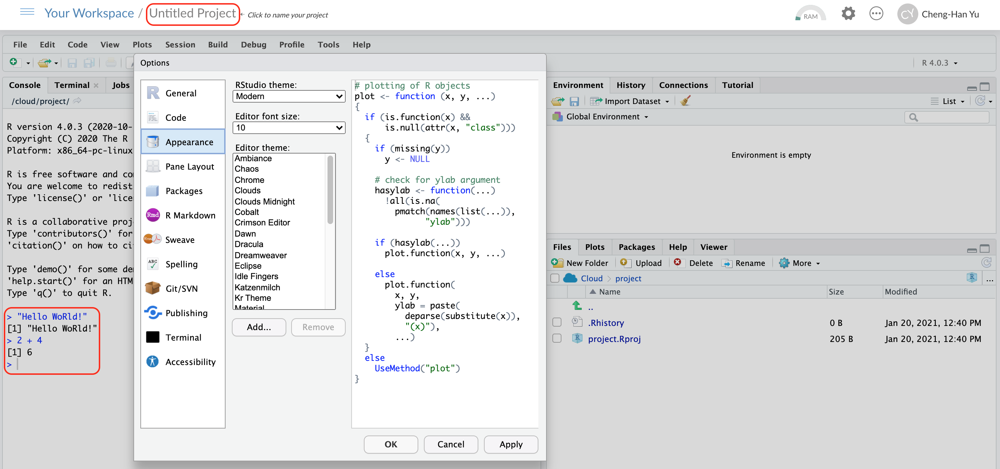
```


# Working in RStudio

## RStudio Panes

```{r}
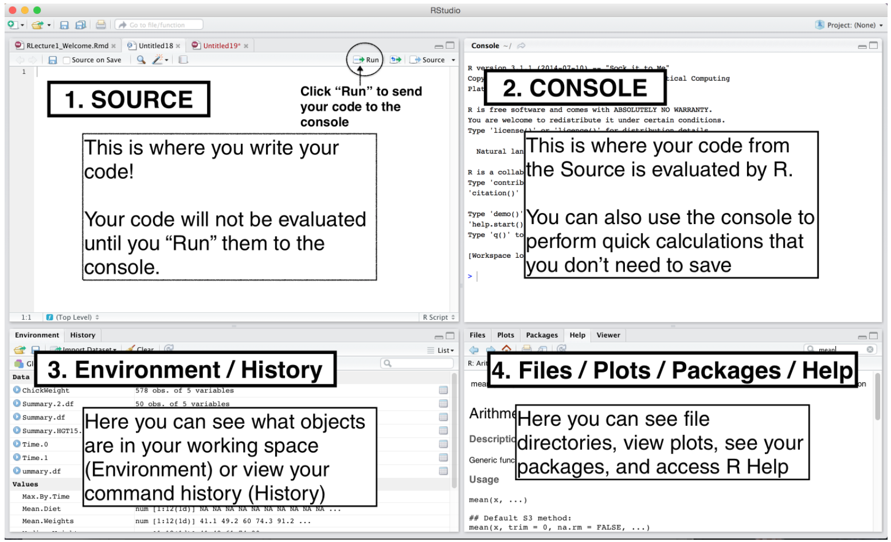
```


::: notes

- In RStudio, there are 4 main panes, source pane, console pane, pane for environment/history and version control, and the pane for files plots packages and help page. 
- Source pane is where you write your code. Your code will not be evaluated or interpreted until you "run" them or source them to the console.
- Try to write your code in R scripts in the Source, so that the code can be saved and reused later.
- You type code into the Console if the code is short or you want to do some quick calculations or analysis. The code you type in the Console will not be saved in a script. 
- In the environment/history, you can check any objects you create in the R environment and you can also view your command history in the history tab.
- And you will see how the pane for file/plot/package/help can be used as we learn more about RStudio.

:::


## R Script

- A R script is a **.R** file that contains R code.

- To create a R script, go to **File > New > R Script**, or click the green-plus icon on the topleft corner, and select R Script.

```{r}
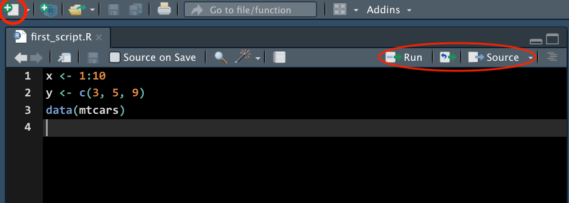
```


## Run Code

- <span style="color:blue"> **Run** </span>: run the **current line** or **selection of code**.

- <span style="color:blue"> **Source** </span>: run **all** the code in the R script.

<!-- - <span style="color:blue"> **Icon right to the Run** </span>: re-run the **previous** selected code. -->

```{r}

```

::: notes
- <span style="color:blue"> **Source** </span>: run **all** the code in the R script with **NO** output
- <span style="color:blue"> **Source with Echo** </span>: run **all** the code in the R script *and show output*
- Depending on your purpose, you can run code line by line or run the entire code.
- To run the R code line by line, Click Run icon to run the current line or selection of code. Or use key-binding `ctrl + enter` (windows) or `cmd + enter` (mac)
:::


## Environment Tab

- The (global) environment is where we are currently working.
- Anything created or imported into the current R session is stored in our environment and shown in the **Environment** tab.
- After we run the R script, objects stored in the environment are
  + Data set `mtcars`
  + Object `x` storing integer values 1 to 10.
  + Object `y` storing three numeric values 3, 5, 9.

```{r}
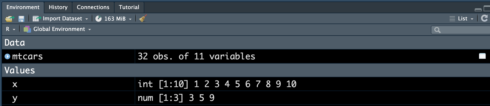
```

## Help

- Don't know how a function works or what a data set is about `r emo::ji('question')` 

- `r emo::ji('point_right')` Simply type `?` followed by the data name or function name like

```{r}
?mean
?mtcars
```

- A document will show up in the **Help** tab, teaching you how to use the function or explaining the data set.

. . .

::: question
What does the function `mean()` do?
:::


##

::: your-turn
<br>

- What is the size of `mtcars` data?

- Type `mtcars` and hit Enter in the Console to see the data set.

- Discuss data type of each variable.

- Type `mtcars[, 1]` and hit Enter in the Console. What do you see?
:::

```{webr}
mtcars
```


::: {.content-visible when-format="revealjs"}

:::

# Install R and RStudio Locally to Your Computer (Optional)

## Install R -- Step 1

- Go to <https://cloud.r-project.org>
- Click Download R for [your operating system]

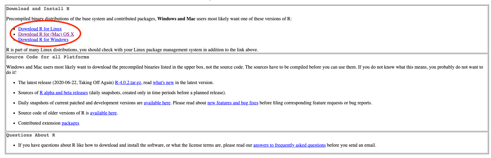

## Install R -- Step 2

- If you are a Mac user, you should see the page as below. You are recommended to download and install the *latest* version of R (now **R-4.5.1 (Great Square Root)**), if your OS version allows to do so. Otherwise, choose a previous version, R-3.6.3.

- If you are a Windows user, after clicking Download R for Windows, please choose **base** version, then click **Download R-4.5.1 for Windows**. 
<!-- - If you are a Linux user, after clicking Download R for Linux, please choose the distribution you are using, ubuntu for example, and then follow the instruction to complete the installation. -->

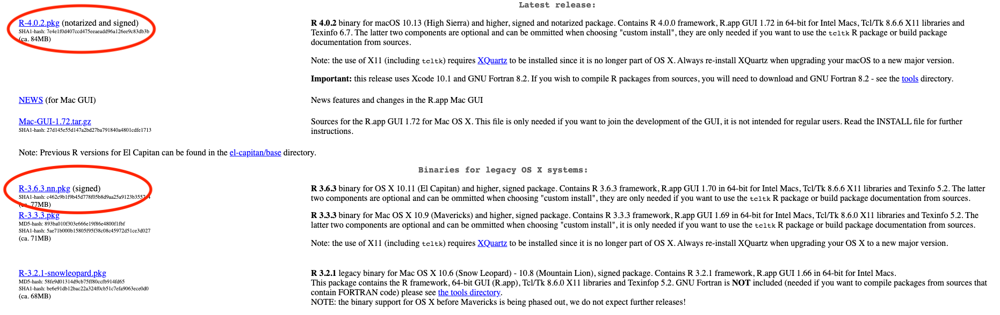

## Install R -- Step 3

- Once you install R successfully, when you open R, you should be able to see the following R terminal or console:

::::: columns

::: {.column width="50%"}

**Windows**


:::

::: {.column width="50%"}

**Mac**

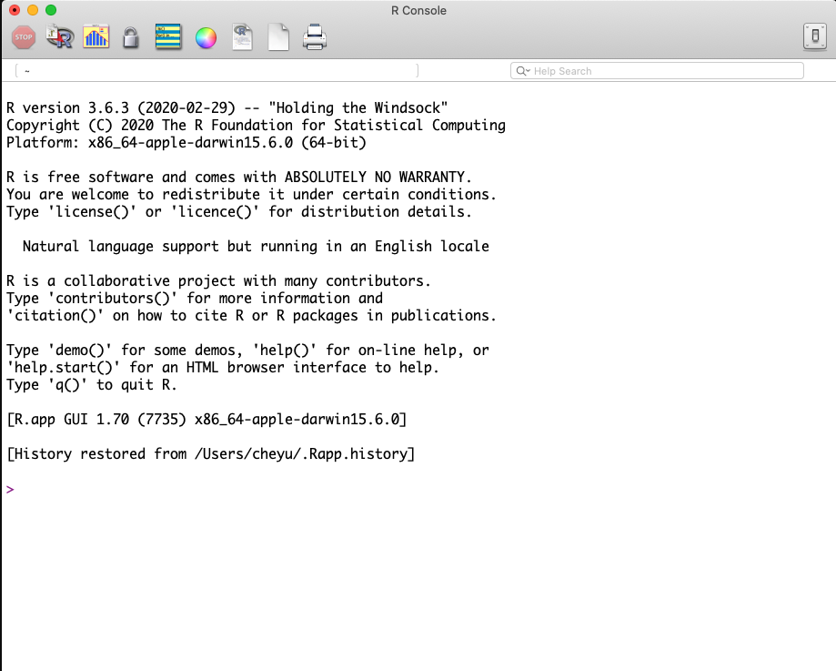

:::

:::::

## Welcome to the R World!

- Now you are ready to use R to do statistical computation.

- You can use R like a calculator. After typing your formula, simply hit Enter, you get the answer! For example,

```{r}
#| echo: true
1 + 2
30 * 42 / 3
log(5) - exp(3) * sqrt(7)
```


## Install RStudio -- Step 1

- In the [Posit website](https://posit.co/), on top go to **OPEN SOURCE** > **DOWNLOAD RSTUDIO ->**

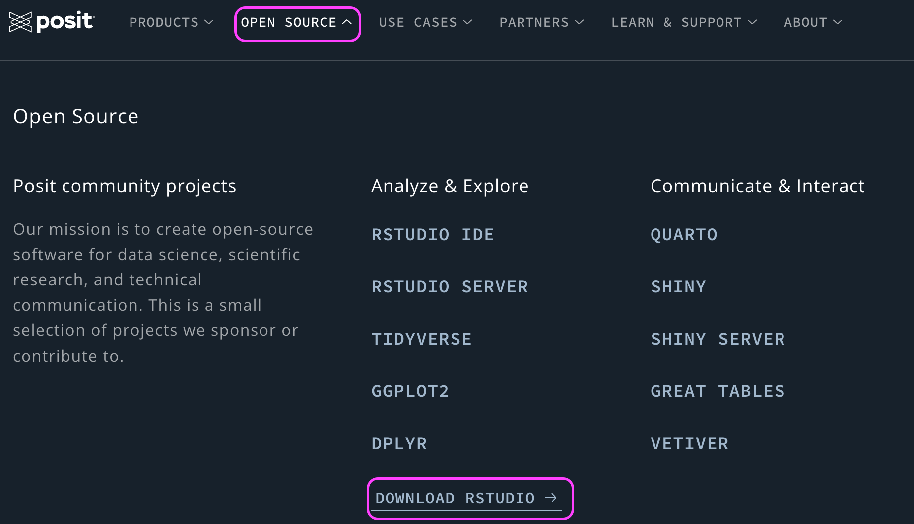


## Install RStudio -- Step 2

- Click **DOWNLOAD RSTUDIO**.

```{r}
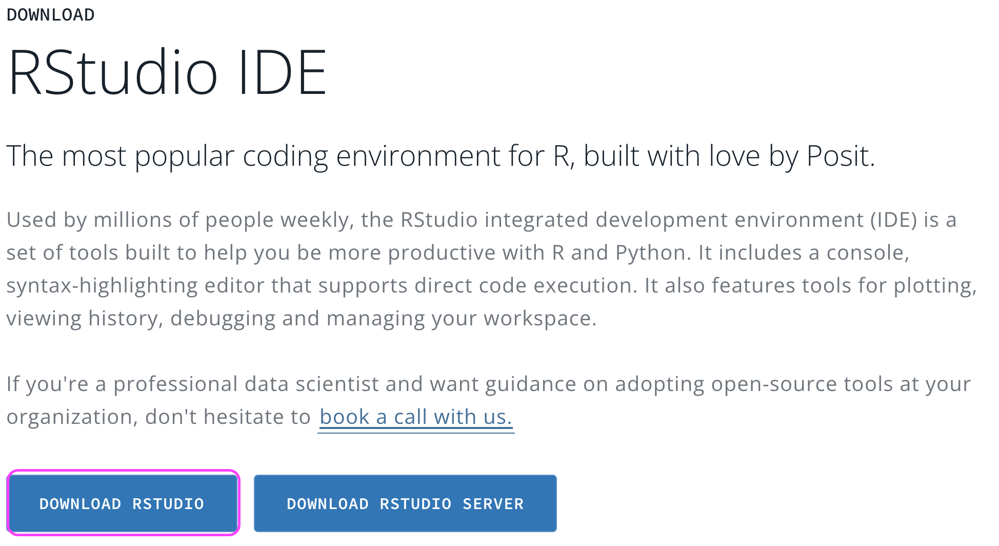
```

## Install RStudio -- Step 3

The page will automatically detect your operating system and recommend a version of RStudio that works the best for you that is usually the latest version.

- Click **DOWNLOAD RSTUDIO DESKTOP FOR [Your OS version]**.

- Follow the standard installation steps and you should get the software.

- Make sure that R is installed successfully on your computer before you download and install RStudio.

```{r echo=FALSE, out.width="55%"}
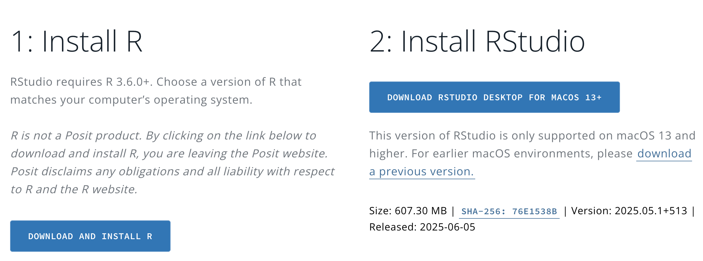
```

## RStudio Screen

- When you open RStudio, you should see something similar to the figure below.

- If you do, congratulations! You are able to do every statistical computation in R using RStudio locally in your computer.

```{r echo=FALSE, out.width="78%", fig.align="center"}

```

