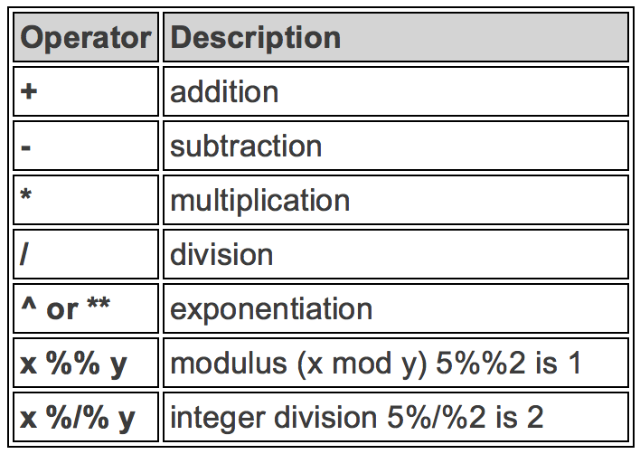
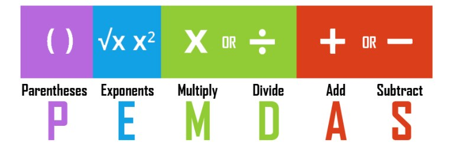
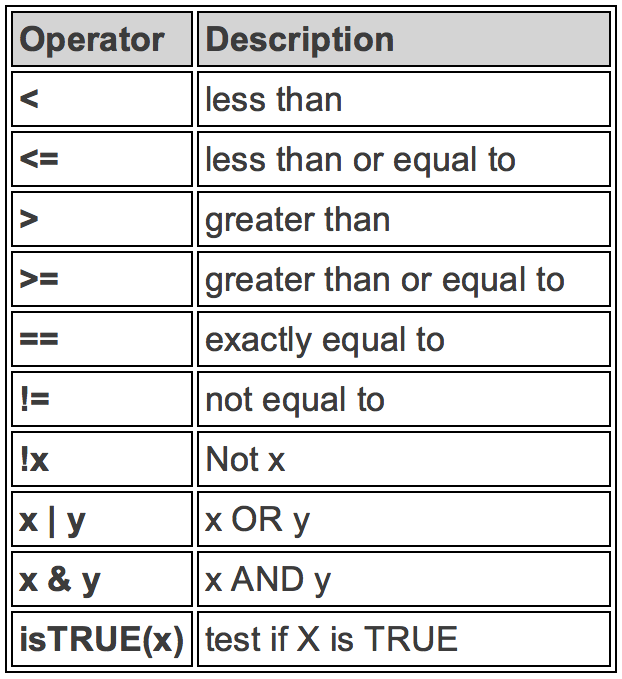
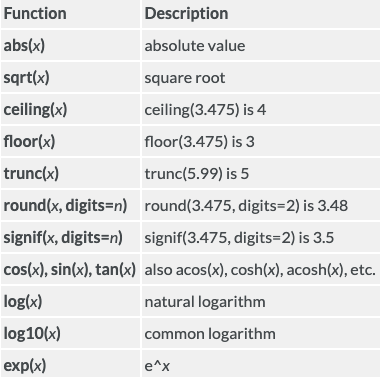
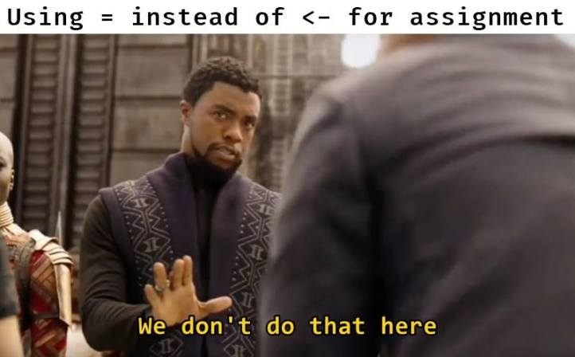
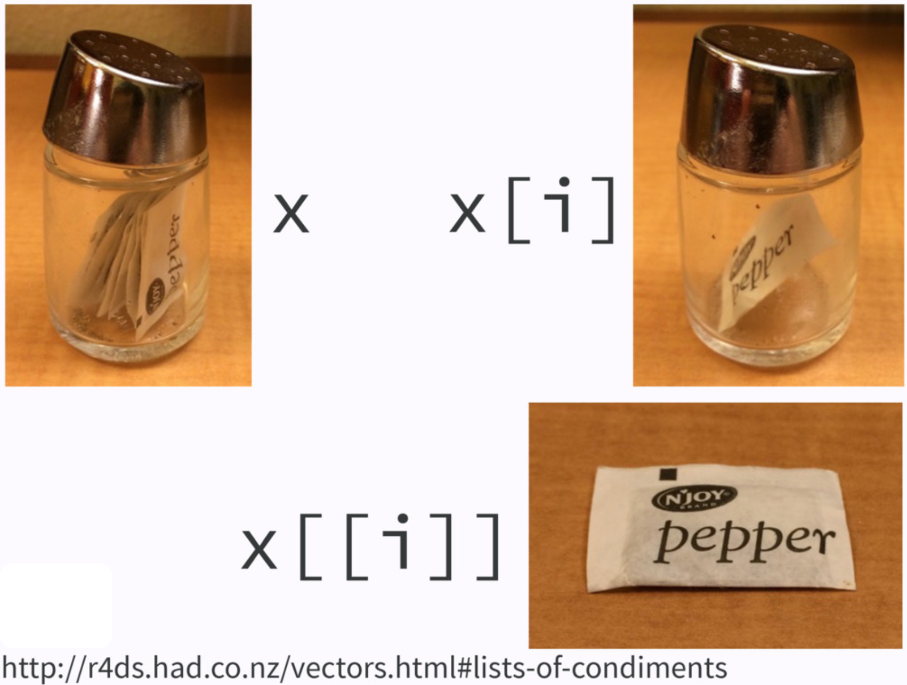
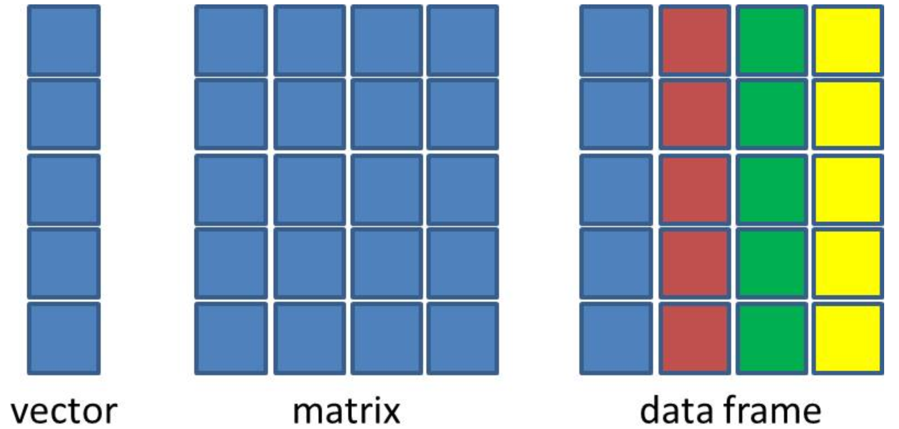

# {visibility="hidden"}

\def\bx{\mathbf{x}}
\def\bg{\mathbf{g}}
\def\bw{\mathbf{w}}
\def\bbeta{\boldsymbol \beta}
\def\bX{\mathbf{X}}
\def\by{\mathbf{y}}
\def\bH{\mathbf{H}}
\def\bI{\mathbf{I}}
\def\bS{\mathbf{S}}
\def\bW{\mathbf{W}}
\def\T{\text{T}}
\def\cov{\mathrm{Cov}}
\def\cor{\mathrm{Corr}}
\def\var{\mathrm{Var}}
\def\E{\mathrm{E}}
\def\bmu{\boldsymbol \mu}
\DeclareMathOperator*{\argmin}{arg\,min}
\def\Trace{\text{Trace}}


```{r}
#| label: pkg
#| include: false
#| eval: true
library(emo)
library(openintro)
library(ggVennDiagram)
library(ggplot2)
library(ggVennDiagram)
library(plotrix)
library(diagram)
library(knitr)
data(COL)
source("./sample_method_fcns.R")
```

<!-- begin: webr fodder -->



<!-- end: webr fodder -->


## R is a Calculator - Arithmetic Operators


```{r}
#| echo: false

```

::: notes

- We are already equipped with the tools we need for doing statistics in this course. Now it's time to program in R.
- We are going to go through basic R syntax and its commonly used data structures.
- Because some of you have no experience in R, this introduction is a must, because I want to make sure everyone is on the same page. 
- If you are already familiar with basic R syntax, please bear with me. You can learn more advanced stuff by yourself. OK.
- First, as many other languages, R is a calculator. We can do basic arithmetic operations using R.
- To get the remainder of division, we use two percentage symbols.
- To get the quotient of division, we use percent, slash and percent symbol.

:::


## R is a Calculator - Examples

<!-- # ```{r} -->
<!-- # #| label: arithmetic-example -->
<!-- # #| echo: true -->
<!-- # 2 + 3 * 5 + 4 -->
<!-- # 2 + 3 * (5 + 4) -->
<!-- # ``` -->

::: small
```{webr}
2 + 3 * 5 + 4
```


```{webr}
5 / 10 ^ 2
```

```{webr}
2 + 3 * (5 + 4)
```

:::

- We have to do the operation in the parenthesis first

```{r}
#| echo: false

```


## R Does Comparisons - Logical Operators


:::: columns

::: {.column width="50%"}


```{r}
#| echo: false
#| out-width: 90%

```

:::


::: {.column width="50%"}

::: fragment

```{r}
5 <= 5
5 <= 4
# Is 5 NOT equal to 5? FALSE
5 != 5
```

```{webr}
TRUE != FALSE
!TRUE == FALSE
```

:::

:::

::::

<!-- ## R Can Do Comparisons - Examples {visibility="hidden"} -->


<!-- ::::: columns -->

<!-- ::: {.column width="50%"} -->

<!-- ```{r} -->
<!-- 5 <= 5 -->
<!-- 5 <= 4 -->
<!-- # Is 5 NOT equal to 5? FALSE -->
<!-- 5 != 5 -->
<!-- ``` -->

<!-- ::: -->

<!-- ::: {.column width="50%"} -->

<!-- ::: fragment -->

<!-- ```{r} -->
<!-- ## Is TRUE not equal to FALSE? -->
<!-- TRUE != FALSE -->
<!-- ## Is not TRUE equal to FALSE? -->
<!-- !TRUE == FALSE -->
<!-- ## TRUE if either one is TRUE or both are TRUE -->
<!-- TRUE | FALSE -->
<!-- ``` -->

<!-- ::: -->

<!-- ::: -->

<!-- ::::: -->

<!-- . . . -->

<!-- ::: question -->

<!-- What does `TRUE & FALSE` return? -->

<!-- ::: -->


## Build-in Functions

- R has lots of built-in functions, especially for mathematics, probability and statistics.


:::: columns

::: {.column width="50%"}


```{r}
#| echo: false
#| out-width: 90%

```

:::


::: {.column width="50%"}

::: fragment

```{r}
#| label: builtin-fcns
sqrt(144)
exp(1)  ## Euler's number
sin(pi/2)
abs(-7)
```

:::

:::

::::


<!-- ## Build-in Functions - Examples {visibility="hidden"} -->


<!-- ::::: columns -->

<!-- ::: {.column width="50%"} -->
<!-- ```{r builtin-fcns} -->
<!-- sqrt(144) -->
<!-- exp(1)  ## Euler's number -->
<!-- sin(pi/2) -->
<!-- abs(-7) -->
<!-- ``` -->
<!-- ::: -->


<!-- ::: {.column width="50%"} -->

<!-- ::: fragment -->

<!-- ```{r} -->
<!-- factorial(5) -->
<!-- ## without specifying base value -->
<!-- ## it is a natural log with base e -->
<!-- log(100) -->
<!-- ## log function and we specify base = 2 -->
<!-- log(100, base = 10) -->
<!-- ``` -->

<!-- ::: -->

<!-- ::: -->

<!-- :::: -->


## Commenting {visibility="hidden"}


::: question
You've seen comments a lot! How do we write a comment in R?
:::

. . .

- Use `#` to add a comment so that the text after `#` is not read as an R command.

- Writing (good) comments is highly recommended: help readers and more importantly yourself understand what the code is doing.

- Comments should explain the **why**, not the what.


## {visibility="hidden"}


::::: columns


::: {.column width="50%"}
::: tiny
```{r}
#| echo: false
#| fig-cap: "https://www.reddit.com/r/ProgrammerHumor/comments/8w54mx/code_comments_be_like/"

```
:::
:::


::: {.column width="50%"}

```{r}
#| echo: false

```

:::


:::::


## Objects and Funtions in R {visibility="hidden"}

> <span style="color:red"> Everything that **exists** is an **object**. </span>
<span style="color:red"> Everything that **happens** is a **function call**. </span>  
  -- *[John Chambers](https://bit.ly/3yJJGrC), the creator of the S programming language*.

- We have made lots of things happened!

- Even arithmetic and logical operators are functions!

```{r}
`+`(x = 2, y = 3)
`&`(TRUE, FALSE)
```

## Creating Variables

- A variable stores a value that can be changed according to our need.

- Use `<-` operator to **assign** a value to the variable. (Highly recommended`r emo::ji('+1')`)

```{r assignment}
x <- 5  ## we create an object, value 5, and call it x, which is a variable.
x  ## type the variable name to see the value stored in the object x
```

<!-- - Can also use `=` symbol to do assignment. (`r emo::ji('x')` Does not work in some situations) -->

```{r variable}
(x <- x + 6)  # We can reassign any value to the variable we created
x == 5  # We can perform any operations on variables
log(x) # Variables can also be used in any built-in functions
```


#

```{r}
#| echo: false
#| fig-link: "https://colinfay.me/r-assignment/"
#| out-width: 85%

```

<!-- <div class="absolute" style="bottom: 20px; left: 50px;"> -->
<!--   [Why do we use arrow as an assignment operator](https://colinfay.me/r-assignment/) -->
<!-- </div> -->


## Bad Naming {visibility="hidden"}

- `r emo::ji('x')` Unless you have a very good reason, don't create a variable whose name is the same as any R [*built-in constant*](https://stat.ethz.ch/R-manual/R-devel/library/base/html/Constants.html) or function!

- `r emo::ji('worried')` It causes lots of confusion when your code is long and when others read your code.

```{r bad-naming}
## THIS IS BAD CODING! DON'T DO THIS!
pi  ## pi is a built-in constant
(pi <- 20)
abs ## abs is a built-in function
(abs <- abs(pi))
```

# Object Types

## Types of Variables

- Use **`typeof()`** to check which type a variable belongs to.

- Common types include **`character`**, **`double`**, **`integer`** and **`logical`**.

- Check if it’s of a specific type: **`is.character()`**, **`is.double()`**, **`is.integer()`**, **`is.logical()`**.
<!-- - To specify an integer, we type a number followed by letter `L`.  -->

::::: columns

::: {.column width="50%"}
```{r type}
typeof(5)
typeof(5L)
typeof("I_love_stat")
```
:::

::: {.column width="50%"}
```{r}
typeof(1 > 3)
is.double(5L)
```
:::

:::::


## Variable Types in R and in Statistics

- Type `character` and `logical` correspond to **categorical** variables.

- Type `logical` is a special type of categorical variables that has only two categories (**binary**).

<!-- - We usually call it a **binary** variable. -->
- Type `double` and `integer` correspond to **numerical** variables. (an exception later)
  + Type `double` is for **continuous** variables
  + Type `integer` is for **discrete** variables.


##

::: {.your-turn}
<br>

- Create a variable `age` that stores your age. Check what type it is.

- Create a variable `name` that stores your name. Check its type.

- Create a variable `is_male` that stores whether you are male (true/false). Check its type.

:::

```{webr}

```


::: {.content-visible when-format="revealjs"}

:::


# R Data Structures

- ### Vector
- ### Factor
<!-- - ### List -->
<!-- - ### Matrix -->
- ### Data Frame
<!-- - ### Data Frame -->

## (Atomic) Vector

- To create a vector, use `c()`, short for *concatenate* or *combine*.

- **All** elements of a vector must be of the **same type**. 

::::: columns

:::: {.column width="50%"}
```{r vector}
(dbl_vec <- c(1, 2.5, 4.5)) 
(chr_vec <- c("pretty", "girl"))
```
::::

:::: {.column width="50%"}

::: fragment

```{r}
## check how many elements in a vector
length(dbl_vec) 
## check a compact description of 
## any R data structure
str(dbl_vec) 
```

:::

::::

:::::


## Operations on Vectors

- We can do any operations on vectors as we do on a *scalar* variable (vector of length 1).

::::: columns

::: {.column width="50%"}
```{r vector-arithmetic}
# Create two vectors
v1 <- c(3, 8)
v2 <- c(4, 100) 

## All operations happen element-wisely
# Vector addition
v1 + v2
# Vector subtraction
v1 - v2
```
:::

::: {.column width="50%"}

::: fragment
```{r}
# Vector multiplication
v1 * v2
# Vector division
v1 / v2
sqrt(v2)
```
:::

:::

:::::


## Recycling of Vectors

- If we apply arithmetic operations to two vectors of **unequal** length, the elements of the shorter vector will be **recycled** to complete the operations.
<!-- - Beware of recycling! -->
<!-- - The concept of *recycling* helps us write more concise code. -->

```{r recycle}
v1 <- c(3, 8, 4, 5)
# The following 2 operations are the same
v1 * 2
v1 * c(2, 2, 2, 2)
v3 <- c(4, 11)
v1 + v3  ## v3 becomes c(4, 11, 4, 11) when doing the operation
```


## Subsetting Vectors

- To extract element(s) in a vector, use a pair of brackets `[]` with element indexing.

- The indexing **starts with 1**.

::::: columns

::: {.column width="50%"}
```{r subsetting}
v1
v2
## The 3rd element
v1[3]  
```
:::


::: {.column width="50%"}

```{r}
v1[c(1, 3)]
## extract all except a few elements
## put a negative sign before the vector of 
## indices
v1[-c(2, 3)] 
```

```{r}
#| echo: false
#| eval: false 
x <- c(1, 5, 2, 6)
names(x) <- letters[1:4]
x["c"]
```
:::

:::::


## Factor

- A vector of type `factor` can be *ordered in a meaningful way.* Create a factor by `factor()`. 

```{r}
#| echo: true
#| label: factor
#| code-line-numbers: false
## Create a factor from a character vector using function factor()
(fac <- factor(c("med", "high", "low")))
```

. . .


- It is a type of **integer**, not **character**. `r emo::ji('astonished')`  `r emo::ji('roll_eyes')` 

```{r}
#| echo: true
#| label: factor-type
#| code-line-numbers: false
typeof(fac)  ## The type is integer.
str(fac)  ## The integers show the level each element in vector fac belongs to.
```

. . .

```{r}
#| echo: true
#| label: order_factor
#| code-line-numbers: false
order_fac <- factor(c("med", "high", "low"), levels = c("low", "med", "high"))
str(order_fac)
```


::: notes
levels(fac) ## Each level represents an integer, ordered from the vector alphabetically.
:::


## List (Generic Vectors) {visibility="hidden"}

- Lists are different from (atomic) vectors: Elements can be of **any type**, including lists.

- Construct a list by using **`list()`**.


:::: {.columns}

::: {.column width="50%"}
```{r}
#| echo: true
#| label: list1
#| code-line-numbers: false
## a list of 3 elements of different types
x_lst <- list(idx = 1:3, 
              "a", 
              c(TRUE, FALSE))
```
```{r, echo=FALSE}
x_lst
```
:::

::: {.column width="50%"}
```{r}
#| echo: true
#| label: list2
#| code-line-numbers: false
str(x_lst)
names(x_lst)
length(x_lst)
```
:::
::::


## Subsetting a List {visibility="hidden"}

:::: {.columns}

::: {.column width="50%"}
<br>
**Return an <span style="color:red"> element </span> of a list**

```{r}
#| echo: true
#| label: list3
#| code-line-numbers: false
## subset by name (a vector)
x_lst$idx  
## subset by indexing (a vector)
x_lst[[1]]  
typeof(x_lst$idx)
```
:::

::: {.column width="50%"}
::: {.fragment}
<br>
**Return a <span style="color:red"> sub-list </span> of a list**


```{r}
#| echo: true
#| label: list4
#| code-line-numbers: false
## subset by name (still a list)
x_lst["idx"]  
## subset by indexing (still a list)
x_lst[1]  
typeof(x_lst["idx"])
```
:::
:::
::::

::: notes
- This is where we should pay more attention to. When we subset a list, it may return an element of the list, or it returns a sub-list of the list.
- Let's see how it happens. 
- This is our x_lst. We can subset a list by name or by indexing. 
- Suppose we want the first element of the list, we can get it by its name using x_lst$idx.
- We can also obtain it by using indexing like x_lst[[1]] because we want the first element.
- Notice that the way we subset a list returns an integer vector, the real first element of the list, not a list. 
- Let's see another case on the right.
- We can also subset by name using single pair of brackets, and put the name inside the brackets.
- Or we can subset by indexing, again using single pair of brackets.
- And you see what happened? The way we subset a list here returns a sub-list, not the element itself. 
- So please be careful when subsetting a list. 
- If you want a vector, use these ways. If you want to keep it as a list, use these ways.
:::

## {visibility="hidden"}

```{r}
#| echo: false
#| label: list_condiment

```

::: notes
pepper packet
pepper shaker
:::


## {visibility="hidden"}

> If list `x` is a train carrying objects, then `x[[5]]` is
> the object in car 5; `x[4:6]` is a train of cars 4-6.
>
> --- \@RLangTip, <https://twitter.com/RLangTip/status/268375867468681216>

```{r}
#| echo: false
knitr::include_graphics("https://raw.githubusercontent.com/hadley/adv-r/master/diagrams/subsetting/train.png")
```

```{r}
#| echo: false
knitr::include_graphics("https://raw.githubusercontent.com/hadley/adv-r/master/diagrams/subsetting/train-single.png")
```


## Matrix {visibility="hidden"}

- A matrix is a *two-dimensional analog of a vector* with **attribute** `dim`.
- Use command `matrix()` to create a matrix.

```{r}
#| label: matrix1
#| tidy: false
#| echo: true
#| code-line-numbers: false
## Create a 3 by 2 matrix called mat
(mat <- matrix(data = 1:6, nrow = 3, ncol = 2)) 
dim(mat); nrow(mat); ncol(mat)
```


::: notes
```{r}
#| label: matrix2
#| code-line-numbers: false
# elements are arranged by row
matrix(data = 1:6, 
       nrow = 3, 
       ncol = 2, 
       byrow = TRUE) #<<
attributes(mat)
```
:::


## Subsetting a Matrix  {visibility="hidden"}

- Use the same indexing approach as vectors on rows and columns.
- Use comma `,` to separate row and column index.
- `mat[2, 2]` extracts the element of the second row and second column.


:::: {.columns}

::: {.column width="50%"}
```{r}
#| label: matrix-idx1
#| echo: true
#| code-line-numbers: false
mat
## all rows and 2nd column
## leave row index blank
## specify 2 in coln index
mat[, 2]
```
:::


::: {.column width="50%"}
```{r}
#| label: matrix-idx2
#| echo: true
#| code-line-numbers: false
## 2nd row and all columns
mat[2, ] 
## The 1st and 3rd rows and the 1st column
mat[c(1, 3), 1] 
```
:::
::::


## Data Frame: The Most Common Way of Storing Datasets

- A data frame is of type **list** of *equal-length* vectors, having a *2-dimensional* structure.

- More general than matrix: *Different columns can have different types*.

- Use `data.frame()` that takes *named* vectors as input "element".


<!-- :::: {.columns} -->

<!-- ::: {.column width="50%"} -->
```{r}
#| label: dataframe1
#| echo: true
#| code-line-numbers: false
## data frame w/ an dbl column named age and char columns gen and col.
(df <- data.frame(age = c(19, 21, 40), gen = c("m", "f", "m"), col = c("r","b","g")))
str(df)  ## use $ to represent column elements 
```

. . .

::: question
What happen if we create a data frame without column names?
:::

```{webr}
data.frame(c(19, 21, 40), c("m", "f", "m"))
```

## Data Structure Comparison

::: tiny

```{r}
#| echo: false
#| fig-cap: "https://environmentalcomputing.net/getting-started-with-r/data-types-structure/"

```

:::

<!-- ::: -->

<!-- ::: {.column width="50%"} -->

<!-- # ```{r} -->
<!-- # #| label: dataframe2 -->
<!-- # #| echo: true -->
<!-- # #| code-line-numbers: false -->
<!-- # ## must set column names -->
<!-- # ## or they are ugly and non-recognizable -->
<!-- # data.frame(c(19, 21, 40), c("m", "f", "m"))  -->
<!-- # ``` -->
<!-- ::: -->
<!-- :::: -->


## Properties of Data Frames

Data frame has properties of matrix.

<!-- :::: {.columns} -->

<!-- ::: {.column width="40%"} -->

```{r}
#| label: df-fcns
#| echo: true
#| code-line-numbers: false
df
colnames(df)  ## df as a matrix
ncol(df) ## df as a matrix
dim(df) ## df as a matrix
```
<!-- ::: -->


<!-- ::: {.column width="60%"} -->

```{r}
#| label: df-bind
#| echo: false
#| eval: false
#| code-line-numbers: false
## rbind() and cbind() can be used on df
df_r <- data.frame(age = 10, 
                   gen = "f")
rbind(df, df_r)
df_c <- 
    data.frame(col = c("red","blue","gray"))
(df_new <- cbind(df, df_c))
```

<!-- ::: -->
<!-- :::: -->


## Subsetting a Data Frame

<!-- Can use either list or matrix subsetting methods. -->

:::: {.columns}

::: {.column width="50%"}

```{r}
#| label: df-subset1
#| echo: true
#| code-line-numbers: false
df

## Subset rows
df[3, ]

## Subset columns
df[, "age"]
df$age
```

:::

::: {.column width="50%"}
::: fragment
```{r}
#| label: df-subset2
#| echo: true
#| code-line-numbers: false

## Subset rows
df[c(1, 3), ]

## Subset columns
df[, c("age", "col")]

## select the row where age == 21
df[df$age == 21, ]
```
:::
:::

::::

::: notes

```{r}
str(df["age"])  ## a data frame with one column
str(df[, "age"])  ## becomes a vector by default
## like a list
df$age
df[c("age", "gen")] 
```

:::


##

::: {.your-turn}
<br>

- Create a vector object called `x` that has 5 elements 3, 6, 2, 9, 14.
- Compute the average of elements of `x`.
- Subset the `mtcars` data set by selecting variables `mpg` and `disp`.
- Select the cars (rows) in `mtcars` that have 4 cylinders.

:::


```{webr}

```

```{webr}

```


::: {.content-visible when-format="revealjs"}

:::


::: notes
```{r}
x <- c(3, 6, 2, 9, 14)
mean(x)
mtcars[, c("mpg", "disp")]
mtcars[mtcars$cyl == 4, ]
```
:::
