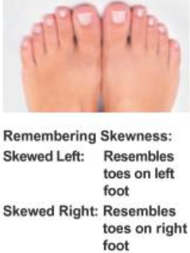
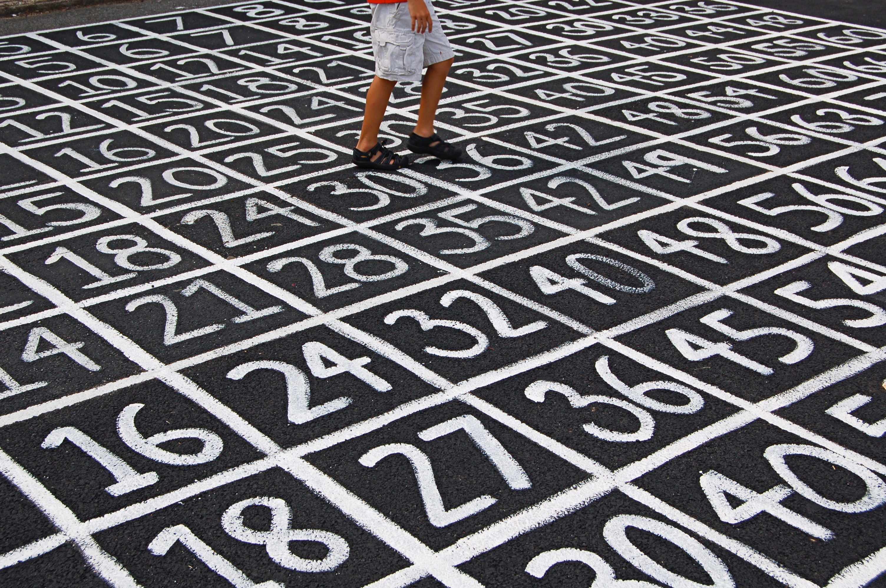
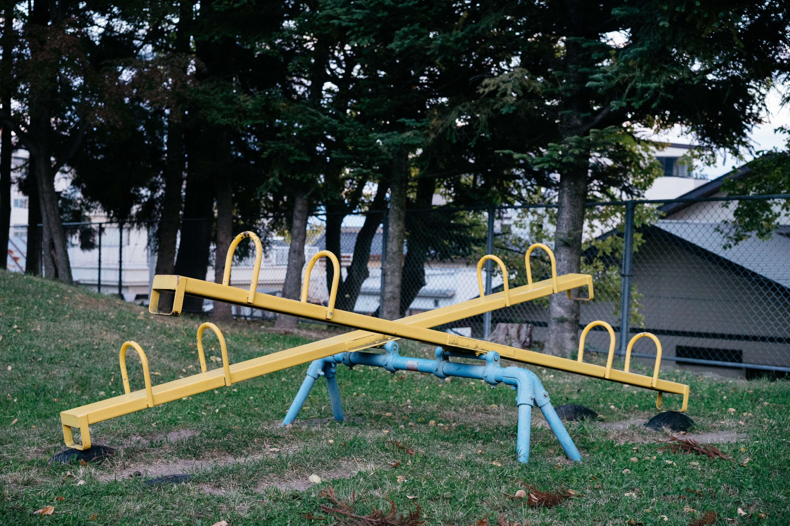
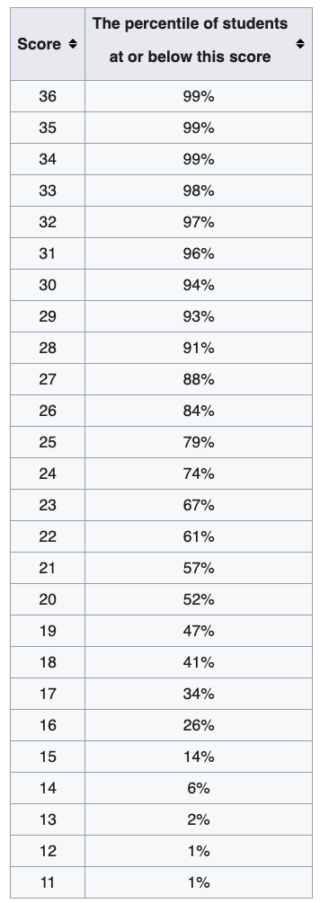
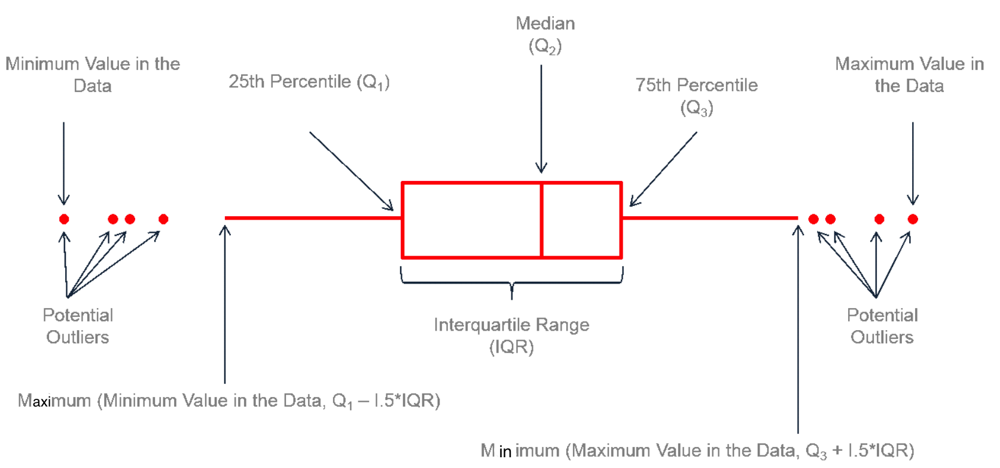

# {visibility="hidden"}

\def\bx{\mathbf{x}}
\def\bg{\mathbf{g}}
\def\bw{\mathbf{w}}
\def\bbeta{\boldsymbol \beta}
\def\bX{\mathbf{X}}
\def\by{\mathbf{y}}
\def\bH{\mathbf{H}}
\def\bI{\mathbf{I}}
\def\bS{\mathbf{S}}
\def\bW{\mathbf{W}}
\def\T{\text{T}}
\def\cov{\mathrm{Cov}}
\def\cor{\mathrm{Corr}}
\def\var{\mathrm{Var}}
\def\E{\mathrm{E}}
\def\bmu{\boldsymbol \mu}
\DeclareMathOperator*{\argmin}{arg\,min}
\def\Trace{\text{Trace}}


```{r}
#| label: pkg
#| include: false
#| eval: true
#| echo: false
library(tidyverse)
library(fontawesome)
library(fields)
library(microbenchmark)
library(openintro)
```

```{r}
#| echo: false
options(
  htmltools.dir.version = FALSE,
  dplyr.print_min = 6, 
  dplyr.print_max = 6,
  tibble.width = 80,
  width = 80,
  digits = 3
  )
```


# Descriptive Statistics {background-image="./images/05-data-description/data_description.jpg" background-size="cover" background-position="50% 50%" background-color="#447099"}

Data Summary in Tables, Graphics and Numerical Values


## Descriptive Statistics (Data Summary)

- Before doing inferential statistics, let's first learn to understand our data by describing or summarizing it using a **table**, **graph**, or some important **measures**, so that appropriate methods can be performed for better inference results.

```{r}
#| out-width: 100%
#| echo: false
par(mar = c(0,0,0,0))
cex_val <- 1.6
plot(c(-0.15, 1.15), c(0, 0.9), type = 'n', axes = FALSE)

text(0.6, 0.85, 'Statistics', font = 2, cex = cex_val)
rect(xleft = 0.4, ybottom = 0.8, xright = 0.8, ytop = 0.9)

text(0.25, 0.55, 'Descriptive Statistics', font = 2, cex = cex_val, col = "red")
rect(-0.05, 0.5, 0.55, 0.6)
arrows(x0 = 0.45, y0 = 0.78, x1 = 0.34, y1 = 0.62, length = 0.08)

text(0.9, 0.55, 'Inferential Statistics', font = 2, cex = cex_val, col = "red")
rect(0.6, 0.5, 1.2, 0.6)
arrows(0.76, 0.78, 0.85, 0.62, length = 0.08)


text(-0.1, 0.23, 'Frequency', font = 2, col = "blue", cex = cex_val)
text(-0.1, 0.17, 'Tables', font = 2, col = "blue", cex = cex_val)
# rect(-0.15, 0.15, -0.05, 0.25)
arrows(0.1, 0.5, -0.05, 0.25, length = 0.08)
# 
text(0.2, 0.2, 'Graphics', font = 2, col = "blue", cex = cex_val)
# rect(0.11, 0.15, 0.29, 0.25)
arrows(0.2, 0.5, .2, 0.25, length = 0.08)

text(0.45, 0.23, 'Numerical', font = 2, col = "blue", cex = cex_val)
text(0.45, 0.17, 'Measures', font = 2, col = "blue", cex = cex_val)
# rect(0.31, 0.15, 0.49, 0.25)
arrows(0.35, 0.5, .45, 0.25, length = 0.08)

# 
text(0.7, 0.2, 'Estimation', font = 2, col = "blue", cex = cex_val)
# rect(0.6, 0.15, 0.8, 0.25)
arrows(0.75, 0.5, 0.7, 0.25, length = 0.08)

text(1, 0.23, 'Hypothesis', font = 2, col = "blue", cex = cex_val)
text(1, 0.17, 'Testing', font = 2, col = "blue", cex = cex_val)
# rect(0.88, 0.15, 1.12, 0.25)
arrows(0.9, 0.5, 1, 0.26, length = 0.08)


text(1.1, 0.75, 'Probability', font = 2, col = "green4", cex = cex_val)
# rect(0.9, 0.7, 1.3, 0.8)
arrows(1.05, 0.73, 0.9, 0.61, length = 0.08)
```


## Frequency Table for Categorical Variable

- A **frequency table (frequency distribution)** lists variable values individually for categorical data along with their corresponding number of times occurred in the data (**frequencies** or **counts**).

- Frequency table for categorical data with $n$ data values:

| Category name | Frequency     | Relative Frequency |
|:-------------:|:-------------:|:------------------:|
| $C_1$         | $f_1$         | $f_1/n$ |
| $C_2$         | $f_2$         | $f_2/n$ |
| ...           | ...           | ...     |
| $C_k$         | $f_k$         | $f_k/n$ |


## Frequency Table for Categorical Variable

- A **frequency table (frequency distribution)** lists variable values individually for categorical data along with their corresponding number of times occurred in the data (**frequencies** or **counts**).

- Example: A categorical variable **color** that has three categories

| Category name | Frequency     | Relative Frequency |
|:-------------:|:-------------:|:------------------:|
|  Red   `r emo::ji('red_circle')`       | 8             | 8/50 = 0.16    |
|  Blue  `r emo::ji('blue_circle')`       | 26            | 26/50 = 0.52   |
|  Black  `r emo::ji('black_circle')`      | 16            | 16/50 = 0.32   |


## R Packages `r emo::ji('package')`

::::: columns

::: {.column width="70%"}
- **Packages** wrap up reusable R functions, the documentation that describes how to use them, and data sets all together.

- As of August 2025, there are about 22510 R packages available on [**CRAN**](https://cran.r-project.org/) (the Comprehensive R Archive Network)!

```{r}
#| eval: false
install.packages("palmerpenguins")
```

```{r}
#| out-width: 100%
#| echo: false
knitr::include_graphics("./images/03-r/pkg_map_usa.png")
```
:::


::: {.column width="30%"}

- `palmerpenguins` package

```{r}
#| out-width: 100%
#| echo: false
#| fig-link: https://allisonhorst.github.io/palmerpenguins/

```

:::

::::


## Categorical Frequency Table [`palmerpenguins`](https://allisonhorst.github.io/palmerpenguins/) package  {.absolute left="1650" top="0" width="100"}


<br>
<!-- :::: columns -->

<!-- ::: {.column width="80%"} -->

```{r}
#| echo: true
#| message: false
#| code-line-numbers: false
library(palmerpenguins)
```


```{r}
#| echo: true
#| code-line-numbers: false
#| class-output: my_class500
str(penguins)
```

<!-- ::: -->

<!-- ::: {.column width="20%"} -->

<!-- ```{r} -->
<!-- #| out-width: 100% -->
<!-- #| echo: false -->
<!-- #| fig-link: https://allisonhorst.github.io/palmerpenguins/ -->
<!--  -->
<!-- ``` -->

<!-- ::: -->

<!-- :::: -->

. . .

```{r}
#| echo: true
#| code-line-numbers: false
x <- penguins[, "species"]
```


## Categorical Frequency Table: `species`

```{r}
#| echo: true
#| code-line-numbers: false
## frequency table
table(x)
```

```{r}
#| out-width: 60%
#| echo: false
#| fig-link: https://allisonhorst.github.io/palmerpenguins/
knitr::include_graphics("./images/05-data-description/lter_penguins.png")
```

::: notes
::: question
If we want to create a frequency table shown in definition, which R data structure we can use?
:::
:::

## Categorical Frequency Table in R: `species` {visibility="hidden"}

```{r}
#| code-line-numbers: false
freq <- table(x)
rel_freq <- freq / sum(freq)
cbind(freq, rel_freq)
```


## Visualizing a Frequency Table: Bar Chart

```{r}
#| echo: !expr c(-1)
#| code-line-numbers: false
par(mar = c(4, 4, 2, 1))
barplot(height = table(x), main = "Bar Chart", xlab = "Penguin Species")
```


## Pie Chart

```{r}
#| echo: !expr c(2)
#| code-line-numbers: false
par(mar = c(0, 0, 1, 0))
pie(x = table(x), main = "Pie Chart")
```


##


::: {.your-turn}


- Create a frequency table and a bar chart for the variable `island` of the penguins.

```{r}
library(palmerpenguins)
```

```{webr}
#| exercise: ex_cat
______(penguins$______)
barplot(____)
```


::: {.content-visible when-format="revealjs"}

:::

:::


## Frequency Distribution for Numerical Variables

- Divide the data into $k$ **non-overlapping groups of intervals** (**classes**).

- Convert the data into $k$ categories with an associated **class interval**.

- Count the number of measurements falling in a given class interval (**class frequency**).

| Class       | Class Interval  | Frequency     | Relative Frequency |
|:-----------:|:---------------:|:-------------:|:------------------:|
| $1$         | $[a_1, a_2]$    | $f_1$          | $f_1/n$ |
| $2$         | $(a_2, a_3]$    | $f_2$          | $f_2/n$ |
| ...         |    ...          | ...            | ...     |
| $k$         | $(a_k, a_{k+1}]$| $f_k$          | $f_k/n$ |


- $(a_2 - a_1) = (a_3 - a_2) = \cdots = (a_{k+1} - a_k)$. **All class widths are the same**!


## Frequency Distribution for Numerical Variables

- Divide the data into $k$ **non-overlapping groups of intervals** (**classes**).

- Convert the data into $k$ categories with an associated **class interval**.

- Count the number of measurements falling in a given class interval (**class frequency**).

| Class       | Class Interval  | Frequency     | Relative Frequency |
|:-----------:|:---------------:|:-------------:|:------------------:|
| $1$         | $[80, 100]$    | $2$          | $2/50$ |
| $2$         | $(100, 120]$    | $4$          | $4/50$ |
| ...         |    ...          | ...            | ...     |
| $8$         | $(220, 240]$| $3$          | $3/50$ |


##

::: question
Can our grade conversion be used for creating a frequency distribution?
:::

```{r}
#| echo: false
#| message: false
letter <- c("A", "A-", "B+", "B", "B-", "C+", "C", "C-",
                       "D+", "D", "F")
percentage <- c("[94, 100]", "[90, 94)", "[87, 90)", "[83, 87)", "[80, 83)",
                "[77, 80)", "[73, 77)", "[70, 73)", 
                "[65, 70)", "[60, 65)", "[0, 60)")
grade_dist <- data.frame(Grade = letter, Percentage = percentage)
library(kableExtra)
knitr::kable(grade_dist, longtable = TRUE, format = "html", align = 'l') %>% kable_styling(position = "center", font_size = 40)
```


## Body Mass (Grams) in Data `penguins`

```{r}
#| code-line-numbers: false
#| echo: !expr -c(4)
body_mass <- penguins$body_mass_g
head(body_mass, 20)
body_mass <- body_mass[complete.cases(body_mass)]
int_rate <- round(loan50$interest_rate, 1)
```


```{r}
#| out-width: 60%
#| echo: false
#| fig-link: https://allisonhorst.github.io/palmerpenguins/
knitr::include_graphics("./images/05-data-description/lter_penguins.png")
```


## Frequency Distribution of Body Mass


::::: columns


::: {.column width="50%"}
```{r}
#| echo: false
#| code-line-numbers: false
#| class-output: my_class500
k <- 12
class_width <- 300
lower_limit <- 2700

class_boundary <- lower_limit + 0:k * class_width
class_int <- paste(paste0(class_boundary[1:k], "g"),
                   paste0(class_boundary[2:(k+1)], "g"), 
                   sep = " - ")

freq_info <- hist(body_mass, 
                  breaks = class_boundary, 
                  plot = FALSE)
freq_dist <- data.frame("Class" = as.character(1:k), 
                        "Class_Intvl" = class_int, 
                        "Freq" = freq_info$counts, 
                        "Rel_Freq" = round(freq_info$counts / length(body_mass), 2))
# print(freq_dist, row.names = FALSE)
kable(freq_dist)
```

:::

::: {.column width="50%"}

```{r}
#| code-line-numbers: false
range(body_mass)
```

- All class widths are the same!

- Number of classes should not be too big or too small.

- The *lower* limit of the 1st class **should not be greater** than the *minimum* value of the data.

- The *upper* limit of the last class **should not be smaller** than the *maximum* value of the data.


::: fragment

::: question
Wonder how we choose the number of classes or the class width?
:::

:::

::: fragment

::: alert
R decide the number for us when we visualize the frequency distribution by a **histogram**.
:::

:::

:::

:::::


## Visualizing Frequency Distribution by a Histogram

::::: columns

::: {.column width="50%"}
**Use default breaks (no need to specify)**
```{r}
#| code-line-numbers: false
#| echo: !expr c(-1)
par(mar = c(4, 4, 2, 1))
hist(x = body_mass, 
     xlab = "Body Mass (gram)",
     main = "Histogram (Defualt)")
```
:::


::: {.column width="50%"}

::: fragment

**Use customized breaks**

::: midi
```{r}
#| code-line-numbers: false
#| out-width: 100%
class_boundary
hist(x = body_mass, 
     breaks = class_boundary, #<<
     xlab = "Body Mass (gram)",
     main = "Histogram (Ours)")
```
:::

:::

:::

:::::


<!-- ## [Histogram Applet](https://math4720-f25.github.io/website/ojs/data-hist-ojs.html) -->

<!-- ## -->

<!--  -->


## Skewness

- Key characteristics of distributions includes **shape**, **center** and **spread**.

- Skewness provides a way to summarize the shape of a distribution.

```{r}
#| echo: false
normal_data <- rnorm(2000)
beta_data_right <- rbeta(2000, 2, 5)
beta_data_left <- rbeta(2000, 5, 2)
normal_data_2 <- rnorm(2000, mean = 5)
par(mfrow = c(2, 2))
par(mar = c(4, 4, 2, 1))
hist(beta_data_right, main = "Skewed to the right", xlab = "x", 
     col = "blue", border = "white", breaks = 20)
hist(normal_data, main = "Symmetric, unimodal", xlab = "x", 
     col = "blue", border = "white", breaks = 20)
hist(beta_data_left, main = "Skewed to the left", xlab = "x", 
     col = "blue", border = "white", breaks = 20)
hist(c(normal_data, normal_data_2), main = "Symmetric, bimodal", xlab = "x", 
     col = "blue", border = "white", breaks = 20)
```


## Remembering Skewness

::::: columns

::: {.column width="50%"}

::: question
Is the body mass histogram left skewed or right skewed?
:::

```{r}
#| echo: false
par(mar = c(4, 4, 2, 1))
par(mfrow = c(1, 1))
hist(x = body_mass, breaks = class_boundary, xlab = "Body Mass (gram)", las = 1,
     main = "Histogram of Penguin Body Mass")
```
:::


::: {.column width="50%"}

::: fragment

::: tiny
```{r}
#| echo: false
#| out-width: 67%
#| fig-align: center
#| fig-cap: Biostatistics for the Biological and Health Sciences p.53

```
:::

:::

:::

:::::

## Scatterplot for Two Numerical Variables

<!-- - We'll learn statistical methods for 2 numerical variables in Week 11. -->
- A **scatterplot** provides a case-by-case view of data for two numerical variables.


::::: columns

::: {.column width="70%"}


```{r}
#| echo: !expr c(-1)
#| code-line-numbers: false
#| out-width: 80%
par(mar = c(4, 4, 0, 0))
plot(x = penguins$bill_length_mm, 
     y = penguins$bill_depth_mm,
     xlab = "Bill Length", ylab = "Bill Depth",
     pch = 16, col = 4)
```

:::

::: {.column width="30%"}
```{r}
#| out-width: 100%
#| echo: false
#| fig-link: https://allisonhorst.github.io/palmerpenguins/
knitr::include_graphics("./images/05-data-description/culmen_depth.png")
```
:::

:::::


## 

::: {.your-turn}

<br>
For the `penguins` data, do

<!-- - Pie chart for variable `island`. -->
- Histogram for variable `flipper_length_mm`. Discuss its shape.
- Scatter plot for variables `flipper_length_mm` and `bill_length_mm`.

:::


```{webr}
library(palmerpenguins)
```

::: {.content-visible when-format="revealjs"}

:::


## Numerical Summaries of Data

::::: columns

::: {.column width="50%"}

```{r}
#| echo: false

```

::: question

If you need to choose one value that represents the entire data, what value would you choose?

:::

:::


::: {.column width="50%"}

::: fragment
- **Measure of Center**: We typically use the **middle** point. (What does "middle" mean?)

- **Measure of Variation**: What values tell us how much variation a variable has?
:::

:::
:::::


## Measures of Center: Mean

- The **(arithmetic) mean or average** is adding up all of the values, then dividing by the total number of them.

- Let $x_1, x_2, \dots, x_n$ denote the measurements observed in a sample of size $n$. Then the **sample mean** is defined as $$\overline{x} = \frac{\sum_{i=1}^{n} x_i}{n} = \frac{x_1 + x_2 + \dots + x_n}{n}$$

- In the body mass example,
$$\overline{x} = \frac{3750 + 3800 + \cdots + 3775}{342} = 4202$$
<!-- - The corresponding **population mean**, is denoted as $\mu$. -->

```{r}
#| code-line-numbers: false
mean(body_mass)
```


::: notes
- Mean balances data Values. It means that the sum of deviations from the mean is 0.
:::


## Balancing Point

- Think of the mean as the **balancing point** of the distribution.

::::: columns

::: {.column width="70%"}
```{r}
#| echo: false
#| out-width: 100%
par(mar = c(4, 0, 0, 0))
par(mfrow = c(1, 1))
round.to <- 1
binned <- round.to * round(body_mass / round.to)
tab <- table(binned)
cex <- 1
xlim <- c(0.9 * min(body_mass), 1.05 * max(body_mass))
plot(0,
     type = "n",
     xlab = "Body Mass",
     ylab = "",
     axes = FALSE,
     xlim = xlim,
     ylim = c(-1, 1.1 * max(tab)))
for (i in 1:length(tab)) {
  points(rep(as.numeric(names(tab[i])), tab[i]),
         1.1 * (1:tab[i]) - 0.4,
         pch = 19,
         col = 4,
         cex = 1.2 * cex)
}
abline(h = 0)
axis(1, pretty(c(0, body_mass)))
# openintro::Axis(1, pretty(c(0, body_mass)))
M <- mean(body_mass)
polygon(M + c(-1, 1, 0) * 50,
        c(-1.2, -1.2, -0.1),
        border = "red",
        col = 2)
```
:::


::: {.column width="30%"}

```{r}
#| echo: false

```
:::

:::::

::: notes
- Mean is a measure of center in the sense that it can be viewed as the **balancing point** of the distribution.
- This is the distribution of the interest rate.
- And if you imagine that we put all those data points on a see-saw, the sample mean is the balancing point that keeps the see-saw balanced horizontally.
:::


## Measures of Center: Median

- **Median**: the *middle value* when data values are *sorted*.

- Half of the values are less than or equal to the median, and the other half are greater than it.

- To find the median, we first sort the values.

- $n$ is **odd**: the median is located in the *exact middle* of the ordered values.
   + <span style="color:blue"> Data: (0, 2, 10, 14, 8) </span>
   + <span style="color:blue"> Sorted Data: (0, 2, <span style="color:red">8</span>, 10, 14) </span>
   + <span style="color:blue"> The median is $8$ </span>

. . .

- $n$ is **even**: the median is the *average of the two middle numbers*.
   + <span style="color:blue"> Data: (0, 2, 10, 14, 8, 12) </span>
   + <span style="color:blue"> Sorted Data: (0, 2, <span style="color:red">8, 10</span>, 12, 14) </span>
   + <span style="color:blue"> The median is $\frac{8 + 10}{2} = 9$ </span>
   
::: notes

- The **Median** is the *middle value* when data values are *sorted from the lowest to highest*.
- Half of the values are less than or equal to the median, and the other half are greater than it. 
- To find the median (well without using any technology or computer), we first sort the values.
- If $n$ is *odd*, the median is located in the exact middle of the ordered values.
- There are two on its right and two on its left. it is right on the middle.

- If $n$ is *even*, the median is the average of the two middle numbers.
- 8 or 10 itself is not right on the middle.
:::


## Calculate Median in R

```{r}
#| code-line-numbers: false
median(body_mass)  ## Compute the median using command median()
``` 

. . .

```{r}
#| code-line-numbers: false
(sort_mass <- sort(body_mass))  ## sort data
length(body_mass)  ## Check sample size is odd or even
(sort_mass[171] + sort_mass[172]) / 2  ## Verify the answer
```

. . .

```{r}
#| code-line-numbers: false
(body_mass[171] + body_mass[172]) / 2  ## Using un-sorted data leads to a wrong answer!!
```


## Measures of Center: Mode

- **Mode**: the value that occurs *most frequently*.

- For continuous numerical data, it is common to have **no** observations with the same value.

- Practical definition:  A mode is represented by a **prominent peak** in the distribution.

```{r}
#| echo: !expr c(1, 2)
#| code-line-numbers: false
## Create a frequency table 
table_data <- table(body_mass)
# sort_table_data <- sort(table_data, decreasing = TRUE)
# sort_table_data
# print(paste("The mode is",names(sort_table_data)[1]))
``` 

. . .

```{r}
#| code-line-numbers: false
## Sort the table to find the mode that occurs most frequently
## the number that happens most frequently will be the first one
sort(table_data, decreasing = TRUE)
```


::: notes
- Mathematically, the **mode** is the value in the data that occurs *most frequently*.
- For continous numerical data that take on infinitely many possible values, it is common to have **no** observations with the same value in a data set, making this definition impractical.
- Practical definition:  A mode is represented by a **prominent peak** in the distribution.
:::


## Comparison of Mean, Median and Mode

- Mean is sensitive to extreme values (outliers).

- Median/mode is more **robust** than mean.

```{r}
#| code-line-numbers: false
#| echo: !expr c(-1, -2)
data_extreme <- body_mass; data_extreme[1] <- 37500 ## replace the first 3 values with 3 large values 
## In the original data, the maximum value is 3750.
head(data_extreme, 10)
```

```{r}
#| code-line-numbers: false
mean(data_extreme)  ## Large mean! Original mean is 4202
median(data_extreme)  ## Median does not change!
names(sort(table(data_extreme), decreasing = TRUE))[1] ## Mode does not change too!
```


::: notes
- Mean is sensitive to extreme values (outliers). 
- Median/mode is more **robust** than mean, meaning that median and mode will not change or not change much if few data values change.
:::


## Comparison of Mean, Median and Mode

- Mode is applicable for both categorical and numerical data, while median and mean work for numerical data only.

- There may be more than one mode, but there is only one median and one mean.

```{r}
#| echo: false
#| fig-asp: 0.4
#| code-line-numbers: false
#| results: hide
par(mfrow = c(1, 3), mar = c(0.3, 0, 2, 0))
p <- seq(0, 1, length = 100)
a <- 2; b <- 5
max_d <- max(dbeta(p, a, b))
plot(p, dbeta(p, a, b), type = 'l', axes = FALSE, xlab = "", ylab = "", lwd = 3, ylim = c(0, max_d + 0.2)) + 
    title(main = "Right-Skewed") + 
    abline(v = (a - 1) / (a + b - 2), lty = 1, col = 1) + 
    abline(v = (a - 1/3) / (a + b - 2/3), lty = 2, col = 2) + 
    abline(v = a /(a + b), lty = 3, col = 4) + 
    text(x = (a - 1) / (a + b - 2)*0.7, y = max_d + 0.2, 
         labels = "Mode", col = 1) + 
    text(x = (a - 1/3) / (a + b - 2/3), y = max_d+0.08, 
         labels = "Median", col = 2) + 
    text(x = a /(a + b)*1.3, y = max_d-0.2, 
         labels = "Mean", col = 4)
axis(1, labels = FALSE, tick = TRUE)

x <- seq(-4, 4, length = 1000)
plot(x, dnorm(x), type = "l", ylim = c(0, 0.45), 
     main = "Symmetric", axes = FALSE, xlab = "", 
     ylab = "", lwd = 3)
abline(v = 0, lty = 2)
text(1.2, dnorm(0) + 0.02, "Mean = Median = Mode")
axis(1, labels = FALSE, tick = TRUE)


p <- seq(0, 1, length = 100)
a <- 5; b <- 2
max_d <- max(dbeta(p, a, b))

plot(p, dbeta(p, a, b), type = 'l', ylim = c(0, max_d + 0.2),
     axes = FALSE, xlab = "", ylab = "", lwd = 3) + 
    title(main = "Left-Skewed") + 
    abline(v = (a - 1) / (a + b - 2), lty = 1, col = 1) + 
    abline(v = (a - 1/3) / (a + b - 2/3), lty = 2, col = 2) + 
    abline(v = a /(a + b), lty = 3, col = 4) + 
    text(x = (a - 1) / (a + b - 2)*1.15, y = max_d + 0.2,
         labels = "Mode", col = 1) + 
    text(x = (a - 1/3) / (a + b - 2/3), y = max_d + 0.08, 
         labels = "Median", col = 2) + 
    text(x = a /(a + b)*0.85, y = max_d - 0.2, 
         labels = "Mean", col = 4)
axis(1, labels = FALSE, tick = TRUE)
```


::: notes

- Mode is applicable for both categorical and numerical data, while median and mean work for numerical data only.
  + Show Categorical homeownership freq table
  + Show int_rate mode
- There may be more than one mode, but there is only one median and one mean.
- mean is sensitive to extreme values. The values at the long tails are extreme values comparing to the values in the middle.
- This forces the mean to be pulled toward the left in order to balance the data.
- Mode happens at the peak of the distribution

:::


<!-- ## [Outliers Applet](https://math4720-f25.github.io/website/ojs/data-extremes-ojs.html) -->


<!--  -->


## Measures of Variation

```{r}
#| echo: false
normal_small <- rnorm(5000, 0, 0.1)
normal_median <- rnorm(5000, 0, 0.5)
normal_large <- rnorm(5000, 0, 0.9)
par(mfrow = c(3, 1))
par(mar = c(1,1,1,1))
hist(normal_small, xlim = c(-3.6, 3.6), breaks = 20, main = "Small Variation", 
     col = "#003366", border = "white", axes = FALSE, ylab = "", ylim = c(0, 1000))
abline(v = 0, col = "#FFCC00", lwd = 3)
hist(normal_median, xlim = c(-3.6, 3.6), breaks = 30, main = "Median Variation", 
     col = "#003366", border = "white", axes = FALSE, ylab = "", ylim = c(0, 1000))
abline(v = 0, col = "#FFCC00", lwd = 3)
hist(normal_large, xlim = c(-3.6, 3.6), breaks = 60, main = "Large Variation", 
     col = "#003366", border = "white",axes = FALSE, ylab = "", ylim = c(0, 1000))
abline(v = 0, col = "#FFCC00", lwd = 3)
```


::: notes
- Done the discussion of measure of center.
- Now let's see how we quantify the variation of data.
- Here we have three frequency distributions with the same mean, median and mode because their distribution is symmetric.
- But from top to bottom, the data have small, median and large variation.
- Basically larger variation means the data values spread out more. 
- So although the data mean is right here, but in general, data values are not very close to the mean. Their deviation from the sample mean is large. OK.
:::


## Measures of Variation: *p*-th percentile


::::: columns

::: {.column width="50%"}
- **p-th percentile (quantile)**: a data value such that 
  + at most $p\%$ of the values are below it
  + at most $(1-p)\%$ of the values are above it

::: question

- Two datasets with the same mean 20. 
  + One data set has 99-th percentile = 30, and 1-st percentile = 10. 
  + The other has 99-th percentile = 40, and 1-st percentile = 0. 
- Which data have larger variation?

:::

:::

::: {.column width="50%"}

::: tiny
```{r}
#| echo: false
#| out-width: 33%
#| fig-cap: "https://en.wikipedia.org/wiki/ACT_(test)"

```
:::
:::

:::::


::: notes

- The first Measure of Variation is p-th percentile
- **p-th percentile (quantile)**: a data value such that 
  + at most $p\%$ of the values are below it
  + at most $(1-p)\%$ of the values are above it

:::


## Measures of Variation: Interquartile Range (IQR)

- **First Quartile (Q1)**: the <span style="color:red">25-th</span> percentile

- **Second Quartile (Q2)**: the <span style="color:red">50-th</span> percentile (Median)

- **Third Quartile (Q3)**: the <span style="color:red">75-th</span> percentile

- **Interquartile Range (IQR)**: Q3 - Q1

::::: columns

::: {.column width="50%"}
```{r}
#| code-line-numbers: false
## Use quantile() to find any percentile 
## through specifying the probability
quantile(x = body_mass, 
         probs = c(0.25, 0.5, 0.75))
## IQR by definition
quantile(x = body_mass, probs = 0.75) - 
  quantile(x = body_mass, probs = 0.25) 
```
:::

::: {.column width="50%"}
```{r}
#| code-line-numbers: false
## IQR()
IQR(body_mass)  
## summary() to get the numeric summary
summary(body_mass)
```

::: question
Larger IQR means more or less variation?
:::


:::


:::::


::: notes
The range of the middle 50% of the data.
:::

## Variance and Standard Deviation

-  The distance of an observation from its mean, $x_i - \overline{x}$, its **deviation**.

- **Sample Variance** is defined as $$ s^2 = \frac{\sum_{i=1}^n(x_i - \overline{x})^2}{n-1} $$

- **Sample Standard Deviation (SD)** is defined as the square root of the variance 
 $$ s = \sqrt{\frac{\sum_{i=1}^n(x_i - \overline{x})^2}{n-1}} $$
<!-- - The corresponding population variance and SD are $\sigma^2$ and $\sigma$ respectively. -->

- Variance is the average of squared deviation from the sample mean $\overline{x}$ or the **mean squared deviation** from the mean.

- SD is the **root mean squared deviation** from the mean. It measures, on average, **how far the data spread out around the average**.

## {background-iframe="https://019b86e1-a4fd-0742-2647-47cb207b4813.share.connect.posit.cloud" background-interactive="true"}

## Compute Variance and SD

```{r}
#| code-line-numbers: false
var(body_mass)
sqrt(var(body_mass))
sd(body_mass)
```


## Visualizing Data Variation: Boxplot

When plotting the whiskers,

- minimum value in the data means the minimal value that is not an potential outlier.

- maximum value in the data means the maximal value that is not an potential outlier.

::: tiny
```{r}
#| echo: false
#| out-width: 75%
#| fig-cap: "https://www.leansigmacorporation.com/box-plot-with-minitab/"

```
:::


::: notes
- To Visualize Data Variation, we can make a so-called Boxplot.
- The plot has a box in the middle, and so-called whiskers that are these two straight lines connected to the box.
- Let's look at the box first. We have 3 vertical lines here. The lines from left to right indicate Q1, Q2 or the median, and Q3.
- So the length of the box shows the IQR.
- Now let's look at the whiskers.
- The upper limit of the whisker is the smaller one of the maximum of values and Q3 + 1.5 IQR
- The lower limit of the whisker on the left is the larger one of the minimum of values and Q1 - 1.5 IQR
- For any data values that are greater than Q3 + 1.5 IQR or smaller than Q1 - 1.5 IQR, we show them as a point.
- Basically those points are far from the center of the data, and we could potentially treat them as extreme values or outliers.
:::


## Body Mass Boxplot

```{r}
#| echo: false
#| out-width: 80%
#| code-line-numbers: false
par(mar = c(0, 3.8, 1, 0))
par(mfrow = c(1, 1))
the.seed <- 2
openintro::boxPlot(body_mass,
        ylab = 'Body Mass (g)',
        xlim = c(0.3, 3),
        axes = FALSE,
        ylim = range(body_mass) + sd(body_mass) * c(-1, 1) * 0.2)
# openintro::AxisInPercent(2, c(0, pretty(body_mass)), las = 1)
axis(2, c(0, pretty(body_mass)), las = 1)
arrows(2, min(body_mass) + 1, 1.35, min(body_mass), length = 0.08)
text(2, min(body_mass) + 1, 'lower whisker (min)', pos = 4)
arrows(2, quantile(body_mass, 0.25) + sd(body_mass) / 7,
       1.35, quantile(body_mass, 0.25),
       length = 0.08)
text(2, quantile(body_mass, 0.25) + sd(body_mass) / 6.5,
     expression(Q[1]~~'(first quartile)'), pos = 4)
m <- median(body_mass)
arrows(2, m + sd(body_mass) / 5, 1.35, m, length = 0.08)
text(2,m + sd(body_mass) / 4.7, 'median', pos = 4)

q <- quantile(body_mass, 0.75)
arrows(2, q + sd(body_mass) / 4, 1.35, q, length = 0.08)
text(2, q + sd(body_mass) / 3.8,
     expression(Q[3]~~'(third quartile)'), pos = 4)

arrows(2, rev(sort(body_mass))[1] - sd(body_mass) / 4,
       1.35, rev(sort(body_mass))[1], length = 0.08)
text(2, rev(sort(body_mass))[1] - sd(body_mass) / 3.8,
     'upper whisker', pos = 4)

y <- quantile(body_mass, 0.75) + 1.5 * IQR(body_mass)
arrows(2, y - 0.1 * sd(body_mass),
       1.35, y, length = 0.08)
lines(c(0.72, 1.28), rep(y, 2),
      lty = 3, col = '#00000066')
text(2, y - 0.1 * sd(body_mass),
     'Q3 + 1.5 IQR max whisker reach', pos = 4)
# text(2, y + 0.05 * sd(body_mass),
#      'Q3 + 1.5 IQR', pos = 4)

# m <- rev(tail(sort(body_mass), 5))
# s <- m[1] - 0.3 * sd(m)
# arrows(2, s, 1.1, m[1] - 0.2, length = 0.08)
# arrows(2, s, 1.1, m[2] + 0.3, length = 0.08)
# text(2, s, 'suspected outliers', pos = 4)

set.seed(the.seed)
pt.jitter <- 0.05
nco <- 50
cutoffs <- seq(0.9 * min(body_mass), max(body_mass), length.out = nco)
for (i in 2:nco) {
  these <- which(cutoffs[i - 1] < body_mass & body_mass <= cutoffs[i])
  lt <- length(these)
  if (lt == 0) {
    next
  }
  x <- pt.jitter * (1:lt)
  x <- x - mean(x)
  points(rep(0.4, lt) + x, body_mass[these],
      col = rep(COL[1, 3], 25), pch = 19)
}
```


::: notes
- Here shows the boxplot of the interest rate data.
- You can see that there are two very high interest rates in the data. They are 25% or more.
- And the median interest rate is just about 10%. And so these two data points are suspected outliers. They are way far from the the median or the most data points.
- If
:::


## Boxplot in R

::::: columns

::: {.column width="50%"}
```{r}
#| code-line-numbers: false
#| echo: !expr c(-1, -2)
par(mar = c(0,4,0,0))
par(mfrow = c(1, 1))
boxplot(body_mass, ylab = "Body Mass (g)")
```
:::

::: {.column width="50%"}
```{r}
#| code-line-numbers: false
range(body_mass)
Q3 <- quantile(body_mass, probs = 0.75, 
               names = FALSE)
Q1 <- quantile(body_mass, probs = 0.25, 
               names = FALSE)
IQR <- Q3 - Q1
Q1 - 1.5 * IQR
Q3 + 1.5 * IQR
```
:::

:::::

::: notes
- In R, we can create a boxplot using boxplot().
sort(int_rate, decreasing = TRUE)[1:5]
sort(int_rate)[1:5]
:::


## 

::: {.your-turn}

<br>
For the `penguins` data,

- Make a boxplot for the variable `bill_depth_mm`.

- Compute the minimum, Q1, Q2, Q3, and maximum values of `bill_depth_mm`. (Hint: `summary()` function is pretty useful! `r emo::ji('thumb')`)

:::


```{webr}
library(palmerpenguins)
```

::: {.content-visible when-format="revealjs"}

:::
