# {visibility="hidden"}

\def\bx{\mathbf{x}}
\def\bg{\mathbf{g}}
\def\bw{\mathbf{w}}
\def\bbeta{\boldsymbol \beta}
\def\bX{\mathbf{X}}
\def\by{\mathbf{y}}
\def\bH{\mathbf{H}}
\def\bI{\mathbf{I}}
\def\bS{\mathbf{S}}
\def\bW{\mathbf{W}}
\def\T{\text{T}}
\def\cov{\mathrm{Cov}}
\def\cor{\mathrm{Corr}}
\def\var{\mathrm{Var}}
\def\E{\mathrm{E}}
\def\bmu{\boldsymbol \mu}
\DeclareMathOperator*{\argmin}{arg\,min}
\def\Trace{\text{Trace}}


```{r}
#| label: pkg
#| include: false
#| eval: true
library(emo)
library(openintro)
library(countdown)
```

<!-- begin: webr fodder -->



<!-- end: webr fodder -->

# Language of Uncertainty{background-image="./images/06-probability/dies.jpg" background-size="cover" background-position="50% 50%" background-color="#447099"}

::: notes
- If we want to describe or quantify the uncertainty about something happening or not happening, we use probability.
- Starting this week, we are gonna learn basic probability, including its definition and operations. OK.
:::


# Probability Fundamentals

- ### Interpretation
- ### Operations
- ### Conditional Probability
- ### Independence
- ### Bayes Formula


## Why Study Probability

- We live in a world full of chances and uncertainty!


::::: columns

::: {.column width="50%"}

::: center
**Jan 23, 2026**
:::

```{r}
#| echo: false
#| out-width: 100%
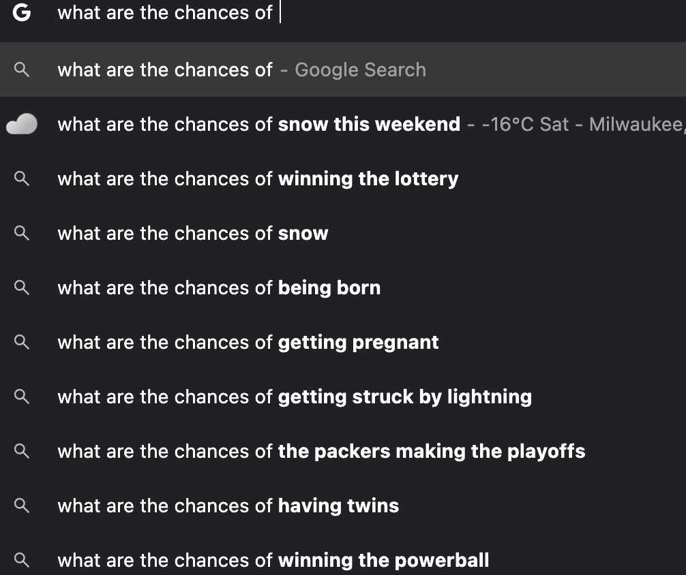 
```
:::


::: {.column width="50%"}

::: center
**Sep 13, 2025**
:::

```{r}
#| echo: false
#| out-width: 75%
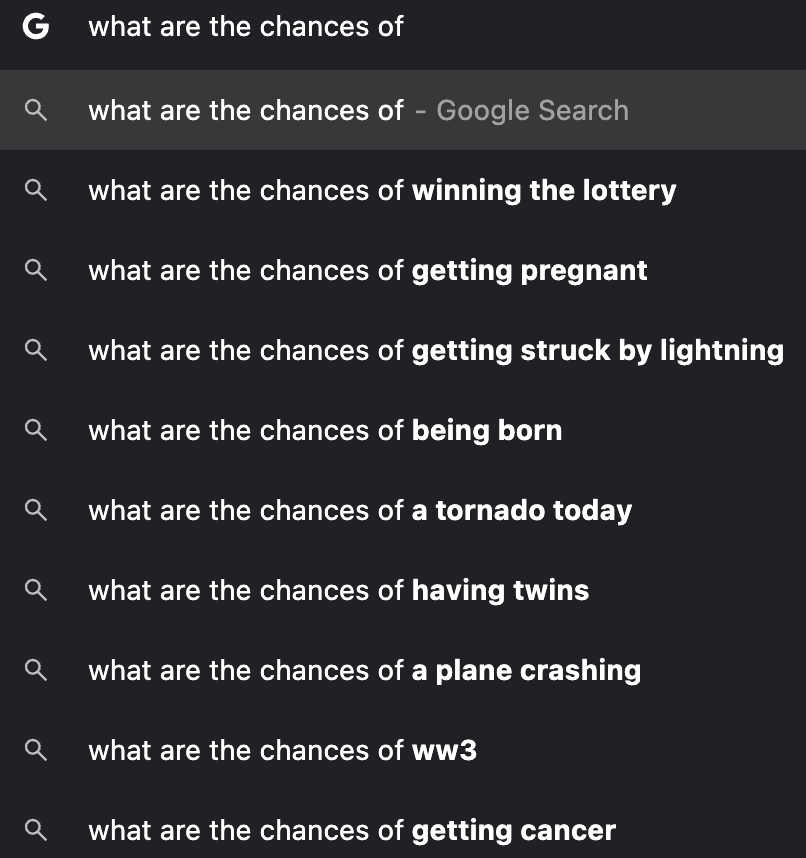 
```

:::


:::::


::: notes
- We always ask questions like what are the chances of XXX
- I just typed what are the chances in Google, and these are the auto-completions. 
- It looks like US people are curious about getting pregnant, getting COVID of course, and getting struck by lightning or tornado.
<!-- - Weird americans! -->
<!-- - So you want the chances of getting pregnant high or low? I don't get it. -->
<!-- - I just realized people are so eager to know the chance of getting pregnant! -->
:::


##


::::: columns

::: {.column width="50%"}
```{r}
#| out-width: 100%
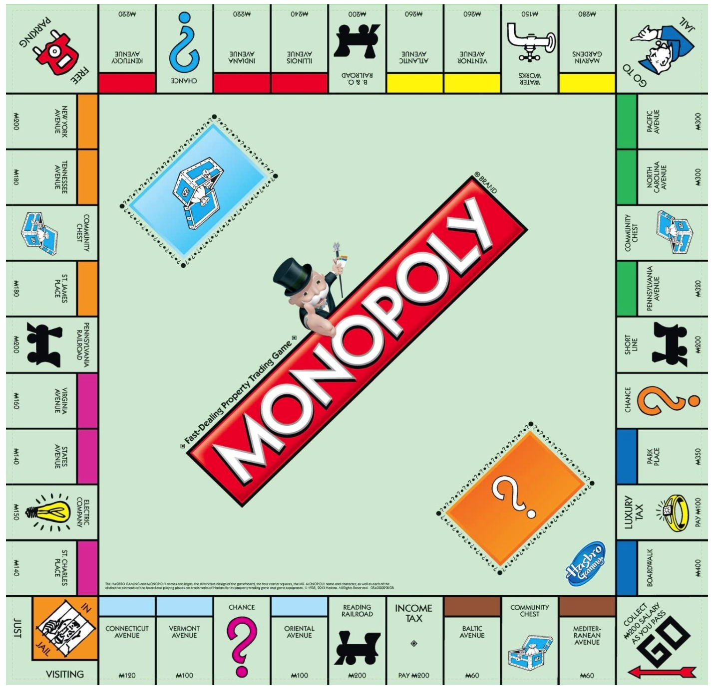
```
:::


::: {.column width="50%"}
```{r}
#| out-width: 70%
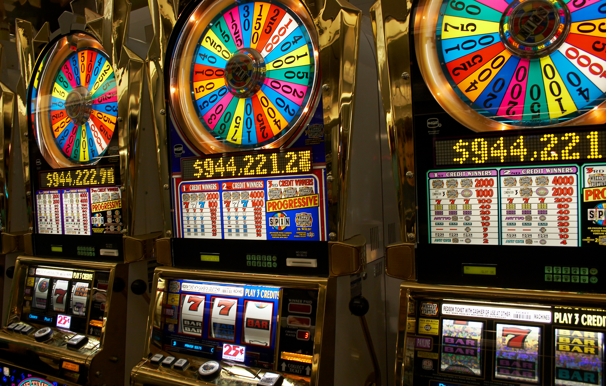
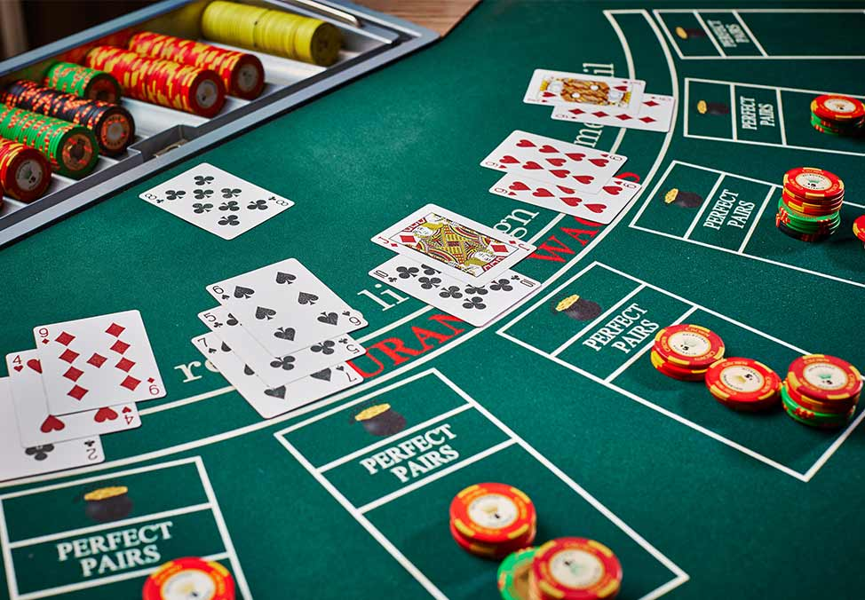
```
:::

:::::


::: notes
- And of course, it is the chance or uncertainty that makes so many games so fun, amusing and even additive.
:::


## Why Probability Before Statistics?

<!-- - Probability is the language of statistical inference and prediction.  -->
- <span style="color:blue"> **Probability** </span>: We *know* the process generating the data and are interested in properties of observations.

- <span style="color:blue"> **Statistics** </span>: We *observed* the data (sample) and are interested in determining what is the process generating the data (population).

```{r}
#| echo: false
#| out-width: 60%
# 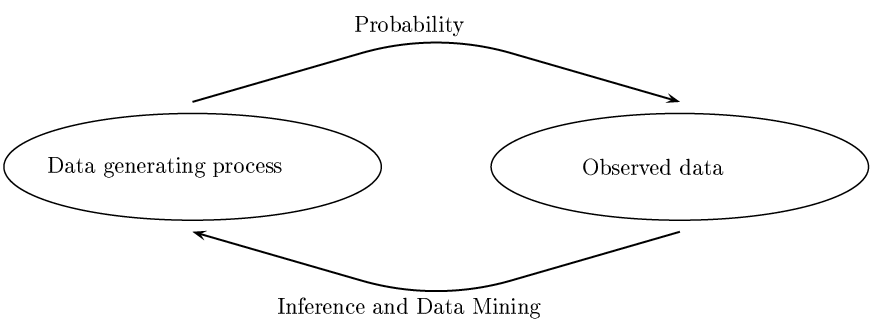
# fig.cap="Figure 1.1 in All of Statistics (Wasserman 2003)"
par(mar = c(0, 0, 0, 0))
plot(0, 0, type = "n", axes = FALSE, xlab = "", ylab = "")
plotrix::draw.ellipse(x = -0.56, y = 0, a = 0.52, b = 0.4, lwd = 2)
plotrix::draw.ellipse(x = 0.56, y = 0, a = 0.45, b = 0.34, lwd = 2)
text(x = -0.56, y = 0, labels = "Data Generating Process", cex = 1.5)
text(x = 0.56, y = 0, labels = "Observed Data", cex = 1.5)
diagram::curvedarrow(from = c(-0.56, 0.47), to = c(0.56, 0.47), 
                     curve = -0.2, arr.pos = 0.98)
diagram::curvedarrow(from = c(0.56, -0.47), to = c(-0.56, -0.47), 
                     curve = -0.2, arr.pos = 0.98)
text(x = 0, y = 0.8, labels = "Probability", cex = 1.5)
text(x = 0, y = -0.8, labels = "Statistical Inference", cex = 1.5)

plot(0, 0, type = "n", axes = FALSE, xlab = "", ylab = "")
plotrix::draw.ellipse(x = -0.3, y = 0.5, a = 0.65, b = 0.45, lwd = 2)
plotrix::draw.ellipse(x = -0.3, y = 0.4, a = 0.35, b = 0.2, lwd = 2, lty = 2)
text(x = -0.3, y = 0.7, labels = "Set of all measurements: Population", cex = 1.2)
plotrix::draw.ellipse(x = 0.5, y = -0.5, a = 0.36, b = 0.21, lwd = 2, lty = 1)
diagram::curvedarrow(from = c(-0.3, 0.4), to = c(0.5, -0.3), 
                     curve = -0.2, arr.pos = 0.98)
text(x = 0.5, y = -0.5, labels = "Sample", cex = 1.2)
text(x = 0, y = -0.4, labels = "Set of data selected from the population:", cex = 1.2)
```


::: notes
Statistics is based on probability, and while probability is not required for the applied techniques in this book, it may help you gain a deeper understanding of the methods and set a better foundation for future courses.
:::


# [Interpretation of Probability]{.orange}{background-image="https://upload.wikimedia.org/wikipedia/commons/1/1c/6sided_dice_%28cropped%29.jpg" background-size="cover" background-position="50% 50%" background-color="#447099"}


## Interpretation of Probability: **Relative Frequency**

- <span style="color:blue"> **Relative Frequency** </span>: The probability that some outcome of a process will be obtained is interpreted as the **relative frequency** with which that outcome would be obtained _if the process were repeated **a large number of times** independently under **similar conditions**._

```{r}
rel_freq_head <- rep(0, 2)
times <- c(10, 1000)
for (i in 1:2) {
  x <- sample(c("Heads", "Tails"), times[i], replace = TRUE)
  freq_table <- as.matrix(table(x)); colnames(freq_table) <- "Frequency"
  rel_freq_table <- cbind(freq_table, "Relative Frequency" = freq_table[, 1] / times[i])
  rel_freq_table <- rbind(rel_freq_table, Total = apply(rel_freq_table, 2, sum))
  print(rel_freq_table)
  cat("---------------------\n")
  rel_freq_head[i] <- rel_freq_table[1, 2]
}
```

- If we repeat tossing the coin 10 times, the probability of obtaining heads is `r rel_freq_head[1] * 100`%.

- If 1000 times, the probability is `r rel_freq_head[2] * 100`%.


::: notes

- Suppose we toss a coin. 
  + If we repeat tossing the coin 10 times, the probability of obtaining heads is `r rel_freq_head[1] * 100`%. 
  + If 1000 times, the probability is `r rel_freq_head[2] * 100`%.

:::
  
. . .

::: question
Any issue of relative frequency probability?
:::


## Issues of **Relative Frequency**

- `r emo::ji('confused')` How large of a number is large enough? 

. . .

- `r emo::ji('confused')` Meaning of "under similar conditions"

::: notes
- airflow, temperature, same person, same coin?
:::


. . .

- `r emo::ji('confused')` The relative frequency is reliable under identical conditions?

::: notes
skilled person 
:::

. . .

- `r emo::ji('point_right')`  We only obtain an approximation instead of exact value.

. . .

- `r emo::ji('joy')`  How do you compute the probability that Chicago Cubs wins the World Series next year? 

```{r}
#| out-width: 40%
knitr::include_graphics("https://media.giphy.com/media/EKURBxKKkw0uY/giphy.gif")
```

::: notes
- Most importantly, some process or experiment cannot be replicated or repeated. 

<!-- One shot situation -->
<!-- it applies only to a problem in which there can be, at least in principle, a large number of -->
<!-- similar repetitions of a certain process. -->
:::


## Interpretation of Probability: **Classical Approach**

- <span style="color:blue"> **Classical** probability </span>: The probability is based on the concept of **equally likely** outcomes.

- If the outcome of some process must be one of $n$ different outcomes, the probability of each outcome is $1/n$. 

. . .

- Example: 
  + toss a fair coin (2 outcomes) 🪙
  + roll a well-balanced die (6 outcomes)  `r emo::ji('game_die')` 
  + draw one from a deck of cards (52 outcomes) `r emo::ji('black_joker')` 

. . .

::: question
Any issue of classical probability?
:::

. . .

- _The probability that *[you name it]* wins the World Series next year is **1/30**_?!

```{r}
#| out-width: 10%

```

::: notes
- No systematic method is given for assigning probabilities to outcomes that are not assumed to be equally likely.
- This interpretation or definition of probability is way too naive right!
- Only get pregnant or not get pregnant, but We cannot say the chance of getting pregnant is 1/2.
- Only get COVID or not get COVID, but We cannot say the chance of getting COVID is 1/2.
:::


## Interpretation of Probability: **Subjective Approach**

- <span style="color:blue"> **Subjective** probability </span>: The probability is assigned or estimated using people's **knowledge, beliefs and information** about the data generating process.

- A person's *subjective* probability of an outcome, rather than the *true* probability of that outcome.

. . .

- I think *"the probability that Milwaukee Brewers wins the World Series this year is 30%"*.

. . .

- My probability that Milwaukee Brewers wins the World Series next year is *different* from an ESPN MLB analyst's probability. 


::::: columns

::: {.column width="50%"}

```{r}
#| out-width: 70%

```
:::


::: {.column width="50%"}
```{r}
knitr::include_graphics("https://upload.wikimedia.org/wikipedia/en/2/2e/ESPN_Major_League_Baseball_TV_logo.jpg")
```
:::

:::::


::: notes
- **Subjective** probability: The probability is assigned or estimated using people's **knowledge, beliefs and information** about the data generating process, or hoe the outcome is obtained from some experiment.
- I think *"the probability that Milwaukee Brewers wins the World Series this year is 30%"*.
- Since the probability is subjective, my probability that Milwaukee Brewers wins the World Series next year is *different* from an ESPN MLB analyst's probability.
:::


## 

::: {.center}
::: xlarge
<br>
<br>
<br>
<br>
**Any probability operations and rules do NOT depend on interpretation of probability!**
:::
:::


::: notes
no worries about which interpretation we gonna use before we do probability calculations. OK.
:::

# [Probability Operations and Rules]{.orange}{background-image="https://upload.wikimedia.org/wikipedia/commons/1/1c/6sided_dice_%28cropped%29.jpg" background-size="cover" background-position="50% 50%" background-color="#447099"}


## Experiments, Events and Sample Space

- **Experiment**: any process in which the possible **outcomes** can be identified *ahead of time*.

- **Event**: a set of possible outcomes of the experiment.

- **Sample space** $(\mathcal{S})$ of an experiment: the collection of **ALL** possible outcomes of the experiment.

Experiment    | Possible Outcomes        | Some Events                      | Sample Space
------------- | ------------------------ | -------------------------------  | -------------------
Flip a coin  🪙 | Heads, Tails      | {Heads}, {Heads, Tails}, ...                 | {Heads, Tails}
Roll a die  `r emo::ji('game_die')`   | 1, 2, 3, 4, 5, 6  | {1, 3, 5}, {2, 4, 6}, {2}, {3, 4, 5, 6}, ... | {1, 2, 3, 4, 5, 6}


::: notes
- Flipping a coin is an experiment because we can identify possible outcomes before we do the experiment, which are heads and tails. 
- Rolling a die is an experiment because we can identify possible outcomes before we do the experiment, which are numbers 1, 2, 3, 4, 5, 6.
- We use curly braces to indicate a set. Any elements in the set are inside the curly braces. 
:::


. . .

::: question
Is the sample space also an event?
:::

. . .

- Yes, the sample space itself is an event because it is also a set of possible outcomes of the experiment.


## Set Concept: Example of **Rolling a six-side balanced die**

::: tip
Draw a [**Venn Diagram**](http://www.stat.ucla.edu/~vlew/stat11/lectures/venn/venn.html) every time you get stuck!
:::

- <span style="color:black"> **Complement** </span> of an event (set) $A$, <span style="color:black"> $A^c$ </span>: a set of **all** outcomes (elements) of $\mathcal{S}$ in which $A$ does **not** occur.
  + <span style="color:blue">Let $A$ be an event that a number greater than 2. Then $A = \{3, 4, 5, 6\}$ and $A^c = \{1, 2\}$.</span> 


::: notes
- Before formally introduce probability operations, we need some basic set concepts because probability is defined on a set, or event.
- Venn diagram is a very useful tool for identifying a set, so I encourage you to draw a venn diagram when you get stuck on complicated set operations.
- This applet is very helpful. Try to check each set and see if you fully understand concept of union, intersection, complement and containment or subset.
- An Event is usually described by words, and we need to convert the words into the set it is referring to.
:::

. . .

- <span style="color:black"> **Union** $(A \cup B)$ </span>: a set of all outcomes of $\mathcal{S}$ in $A$ **or** $B$.
  + <span style="color:blue">Let $B$ be an event that an even number is obtained.</span>  (What is $B$ in terms of a set?)
  + <span style="color:blue"> $B = \{2, 4, 6\}$, $A \cup B = \{2, 3, 4, 5, 6\}$.</span>
  
::: notes
- Collect all elements in A and in B.
- Keep unique ones.
- An element in $(A \cup B)$ either belongs to  event A only, B only or belong to A and B.
:::

. . .

- <span style="color:black"> **Intersection** $(A \cap B)$ </span>: a set of all outcomes of $\mathcal{S}$ in both $A$ **and** $B$.
  + <span style="color:blue"> $A \cap B = \{4, 6\}$.</span> 

::: notes
- the elements in the set $(A \cap B)$ should occur in both A and B. 
:::

  

## Set Concept: Example of **Rolling a six-side balanced die**

- $A$ and $B$ are **disjoint** (or **mutually exclusive**) if they have **no outcomes in common** $(A \cap B = \emptyset)$.
  + $\emptyset$ means an empty set, $\{\}$, i.e., no elements in the set.
  + <span style="color:blue"> Let $C$ be an event that an odd number is obtained. Then $C = \{1, 3, 5\}$ and $B \cap C = \emptyset$. </span> 


::: notes
- All elements in A are also elements in B. But there may be some B's elements that are not in A.
- Set D has more elements than B, and B's elements also belong to D.
:::

. . .

::::: columns

::: {.column width="80%"}

- **Containment** $(A \subset B)$: every elements of $A$ also belongs to $B$. If $A$ occurs then so does $B$.
  + <span style="color:blue"> $B$ is an event that an even number is obtained. </span>
  + <span style="color:blue"> $D$ is an event that a number greater than 1 is obtained. </span>
  + <span style="color:blue"> $B = \{2, 4, 6\}$ and $D = \{2, 3, 4, 5, 6\}$. </span>

:::

::: {.column width="20%"}
```{r}
#| out-width: 100%
par(mar = c(0,0,0,0))
plot(c(0, 1), c(0, 1), type = 'n', axes = FALSE, xlab = "", ylab = "")
temp <- seq(0, 2 * pi, 2 * pi / 100)
x <- 0.5 + 0.5 * cos(temp)
y <- 0.5 + 0.5 * sin(temp)
lines(x, y, lwd = 15, col = 2)

text(0.5, 0.6, 'A', pos = 3, font = 2, cex = 6)
lines((x - 0.5) * 2 * sqrt(0.07) + 0.55,
      (y - 0.5) * 2 * sqrt(0.07) + 0.68, lwd = 15, col = 4)

text(0.55, 0.3, 'B', pos = 1, font = 2, cex = 6)
```
:::
:::::

. . .

::: question
$B \subset D$ or $D \subset B$?
:::

<!-- -- -->

<!-- - <span style="color:blue"> $B \subset D$ or $D \supset B$. </span> -->


<!-- In other words, they cannot occur at the same time when the experiment is performed. -->


## Probability Rules

Denote the probability of an event $A$ on a sample space $\mathcal{S}$ as $P(A)$.

::: tip
Treat the probability of an event as the **area** of the event in the Venn diagram.
:::

::::: columns


::: {.column width="50%"}

**Rules**

  + $P(\mathcal{S}) = 1$
  
::: fragment
  
  + For any event $A$, $P(A) \ge 0$
  
:::
  
::: fragment

  + If $A$ and $B$ are **disjoint**, $P(A \cup B) = P(A) + P(B)$

:::

:::

::: {.column width="50%"}

::: fragment

**Properties**

  + $P(\emptyset) = 0$

::: fragment

  + $0 \le P(A) \le 1$

:::

::: fragment

  + $P(A^c) = 1 - P(A)$

:::

::: fragment

  + **Addition Rule:** $P(A \cup B) = P(A) + P(B) - P(A \cap B)$  

:::

::: fragment

  + If $A \subset B$, then $P(A) \le P(B)$

:::

:::

:::

::::


::: notes
- Now we are ready to formally define a probability and it's rules.
- Treat probability as the area in the Venn diagram. For example, $P(\mathcal{S})$ is the area of the sample space, or the area of the rectangle, which is normalized to be 1.
:::


## Venn Diagram Illustration

- **Disjoint case**: $P(A \cup B) = P(A) + P(B)$ because $P(A \cap B) = 0$!


```{r}
#| out-width: 70%
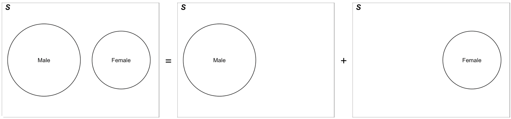
```

. . .

- **Addition Rule**: $P(A \cup B) = P(A) + P(B) - P(A \cap B)$

```{r}
#| out-width: 100%
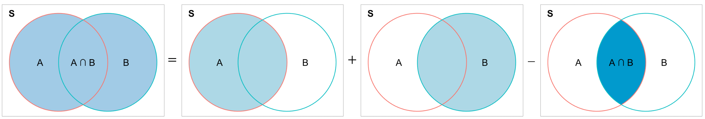
```


## Example: M&M Colors

The makers of the candy M&Ms report that their plain M&Ms are composed of

  + 15% Yellow; 10% Red; 20% Orange; 25% Blue; 15% Green; 15% Brown
  
  
::::: columns

::: {.column width="50%"}
```{r}
#| out-width: 80%
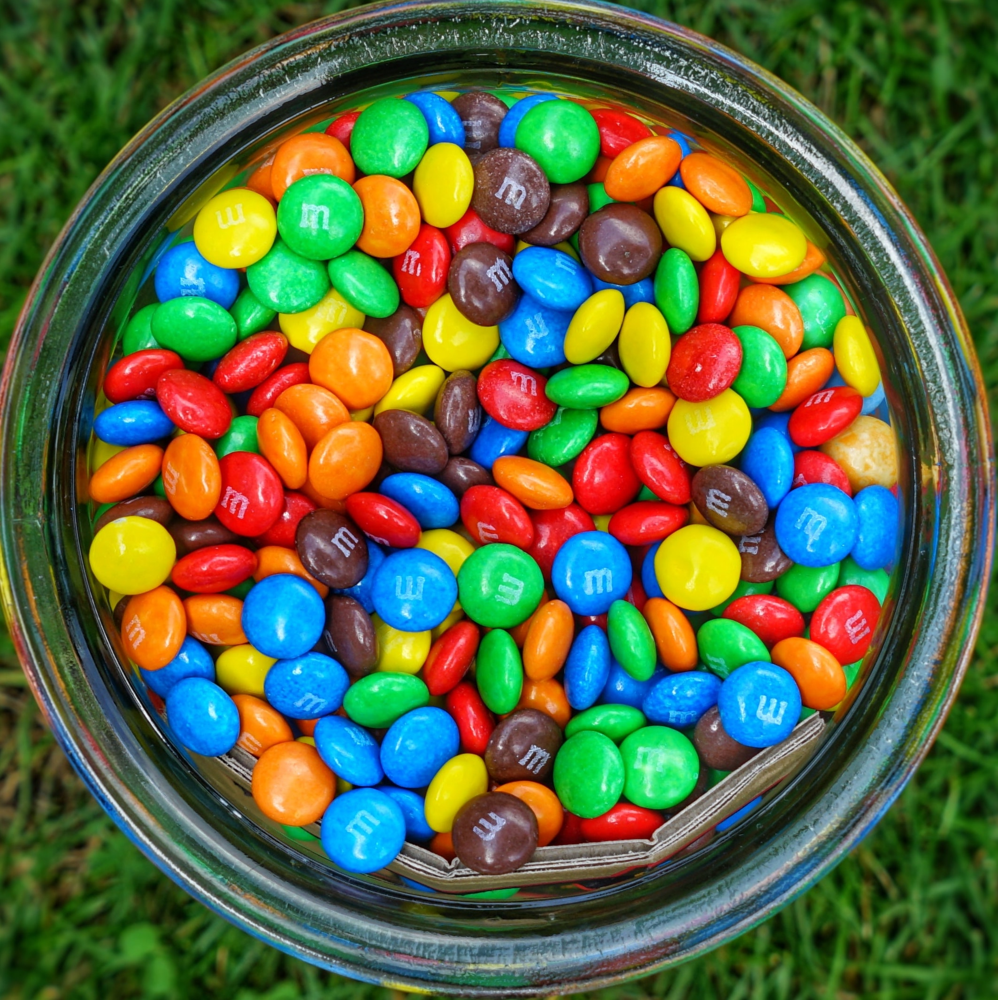
```
:::

::: {.column width="50%"}

::: question

If you randomly select an M&M, what is the probability of the following?

  + (1) It is brown. 
  + (2) It is red or green. 
  + (3) It is not blue. 
  + (4) It is red and brown.
  
:::
:::

:::::

::: {.content-visible when-format="revealjs"}

:::


::: notes
- Give you 2 minutes!
:::


## Example: M&M Colors

- 15% Yellow; 10% Red; 20% Orange; 25% Blue; 15% Green; 15% Brown

::::: columns

::: {.column width="40%"}

::: question

If you randomly select an M&M, what is the probability of the following?

  + (1) It is brown. 
  + (2) It is red or green. 
  + (3) It is not blue. 
  + (4) It is red and brown.
  
:::

:::

::: {.column width="60%"}

- $P(\mathrm{Brown}) = 0.15$

- $\small \begin{align} P(\mathrm{Red} \cup \mathrm{Green}) &= P(\mathrm{Red}) + P(\mathrm{Green}) - P(\mathrm{Red} \cap \mathrm{Green}) \\ &= 0.10 + 0.15 - 0 = 0.25 \end{align}$

- $P(\text{Not Blue}) = 1 - P(\text{Blue}) = 1 - 0.25 = 0.75$

- $P(\text{Red and Brown}) = P(\emptyset) = 0$

:::

::::

. . .

::: question
By the way, which interpretation of probability is used in this question?
:::


# [Conditional Probability and Independence]{.orange}{background-image="https://upload.wikimedia.org/wikipedia/commons/1/1c/6sided_dice_%28cropped%29.jpg" background-size="cover" background-position="50% 50%" background-color="#447099"}

## Conditional Probability

- The **conditional probability of $A$ given $B$** is

$$ P(A \mid  B) = \frac{P(A \cap B)}{P(B)} $$ if $P(B) > 0$, and it is undefined if $P(B) = 0$.
<!-- - Read $A | B$ as "$A$ given $B$" -->

- "Given $B$" means that event $B$ *has already occurred*. 

. . .

```{r}
#| out-width: 50%
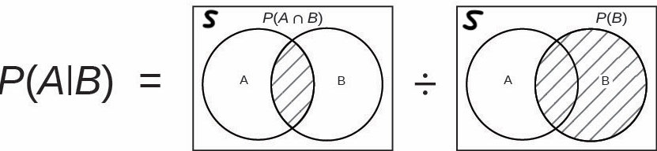
```

<!-- At this moment $P(B)$ is 1. -->
<!-- - $P(B)$ is scaled up by $1 / P(B)$ so that $P(B) \times \frac{1}{P(B)} = 1$. -->

::: notes
- Read $A | B$ as "$A$ given $B$"
- When we compute the probability of A, the information about B have been given, and the probability of A is adjusted, according to this information.
- The probability of A may depend on whether B happens or not.
- $P(A | B)$ computes the probability of A given that B has been occurred. At this moment $P(B)$ is 1. 
- $P(B)$ is scaled up by $1 / P(B)$ so that $P(B) \times \frac{1}{P(B)} = 1$.
- $P(A) \ne P(A|B)$ in general. 
- The conditional probability is the ratio of $P(A \cap B)$ to $P(B)$.
- The proportion of area of (A and B) to the area of B.
- The probability is the area of $A \cap B$ / area of B
:::

. . .

- **Multiplication Rule**: $P(A \cap B) = P(A \mid  B)P(B) = P(B \mid  A)P(A)$

- $P(A)$ and $P(B)$ are **unconditional** or **marginal probabilities**.


## Difference Between $P(A)$ and $P(A \mid B)$

::: midi
```{r}
#| out-width: 85%
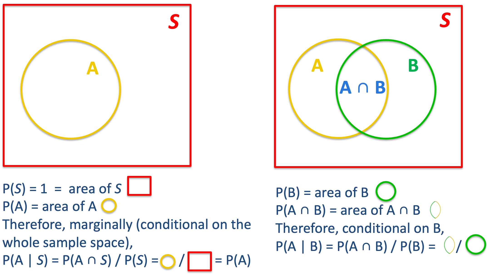
```
:::

::: notes
<!-- - The marginal probability $P(A)$ is the ratio of area of $A$ and the area of the sample space. -->
<!-- - The conditional probability $P(A|B)$ is the ratio of area of $A \cap B$ and the area of $B$. -->

- If we don't have any specific information, what we can base on is the entire sample space, and the probability of A is the ratio of area of A to the area of entire sample space which is 1.
- Now if we know B has occurred, we don't need to consider the entire sample space any more. 
- Instead, we focus only on B cuz we know B has occurred, $B^c$ becomes totally irrelevant.
- To find $P(A \mid  B)$, we just need to find how large part of B that also belongs to A.
- Example, when we don't have any info about women, to compute a woman > 20 yrs old, we base on the entire female population of interest. But if we do know that the woman has a BA degree, we shrink our focus on women who have a BA degree, and compute the proportion of the women pool that has age over 20.
:::


## Example: Peanut Butter and Jelly

- Suppose 80% of people like peanut butter, 89% like jelly, and 78% like both.

- Given that a randomly sampled person likes peanut butter, what’s the probability that she also likes jelly?

  
::::: columns

::: {.column width="50%"}

```{r}
#| out-width: 100%
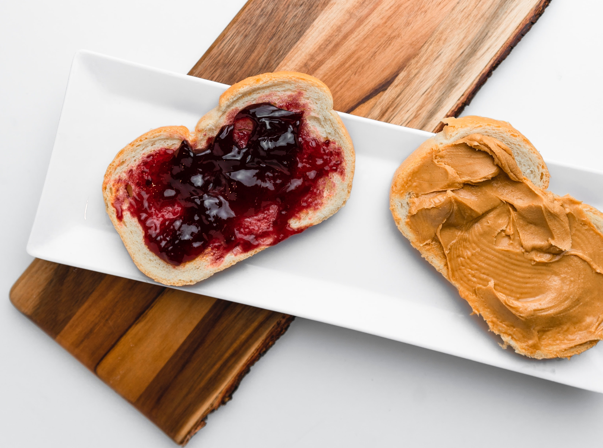
```

:::

::: {.column width="50%"}

::: fragment

- We want $P(J\mid PB) = \frac{P(PB \cap J)}{P(PB)}$.

- From the problem we have $P(PB) = 0.8$, $P(J) = 0.89$, $P(PB \cap J) = 0.78$

- $P(J\mid PB) = \frac{P(PB \cap J)}{P(PB)} = \frac{0.78}{0.8} = 0.975$.

::: alert

::: small

- If we **don't** know if the person loves peanut butter, the probability that she loves jelly is 89%.

- If we **do** know she loves peanut butter, the probability that she loves jelly is going up to 97.5%.

:::

:::

:::

:::

:::::


## Independence

- $A$ and $B$ are **independent** if 
$\begin{align} P(A \mid  B) &= P(A) \text{ or }\\ P(B \mid  A) &= P(B) \text{ or } \\P(A\cap B) &= P(A)P(B)\end{align}$  $\text{ if } P(A) > 0 \text{ and } P(B) > 0$

- Intuition: *Knowing $B$ occurs does not change the probability that $A$ occurs, and vice versa.*

::: notes
- The information about B is irrelevant to probability of A. 
- Example: 
:::

. . .

::: question
Can we compute $P(A \cap B)$ if we only know $P(A)$ and $P(B)$?
:::

. . .

- No, we cannot compute $P(A \cap B)$ since we do not know if $A$ and $B$ are independent.

- We could only if $A$ and $B$ were independent.

- In general, we need the multiplication rule $P(A \cap B) = P(A \mid B)P(B)$.


## Venn Diagram Explanation of Independence

::: midi

```{r}
#| out-width: 95%
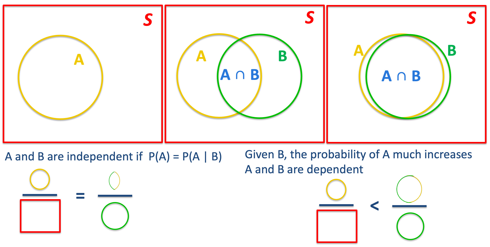
```

:::


::: notes
- Independence means that the ratio of area of A to area of S is the same as the ratio of area of A&B to area of B.
- Look at the case of non-independence.
- Look at the circles. The area of A&B is very close to the area of B.
- It means that the ratio of area of $A\cap B$ to area of B is pretty close to 1.
- So given B, [ ]
- In this case, the information about B does matter, and affect probability of A.
- If we know B occurred, there is pretty high chance that A will occur as well. OK.
:::


## Independence Example

::: question
- Assuming that events $A$ and $B$ are **independent**. $P(A) = 0.3$ and $P(B) = 0.7$.
  + $P(A \cap B)$?
  + $P(A \cup B)$?
  + $P(A \mid B)$?

<!-- - If $P(A \cap B)= 0.1$, are $A$ and $B$ independent? -->
<!-- - If $P(A \cap B)= 0.1$, what is $P(A \mid B)$? -->

::: {.content-visible when-format="revealjs"}

:::

:::


. . .

- $P(A \cap B) = P(A)P(B)=0.21$

. . .

- $P(A \cup B) = P(A)+P(B)-P(A\cap B) = 0.3+0.7-0.21=0.79$

. . .

- $P(A \mid B) = P(A) = 0.3$

<!-- -- -->

<!-- - If $P(A \cap B)= 0.1$, $A$ and $B$ are not independent because $P(A \cap B) \ne P(A)P(B)$ -->

<!-- -- -->

<!-- - $P(A \mid B) =\frac{P(A\cap B)}{P(B)} = \frac{0.1}{0.7} = 0.143$. -->

# [Bayes' Formula]{.orange}{background-image="https://upload.wikimedia.org/wikipedia/commons/1/1c/6sided_dice_%28cropped%29.jpg" background-size="cover" background-position="50% 50%" background-color="#447099"}

## Why Bayes' Formula?

- Often, we know $P(B \mid A)$ but are much more interested in $P(A \mid B)$.

- Example: diagnostic tests provide $P(\text{positive test result}  \mid \text{COVID})$, but we are interested in $P(\text{COVID} \mid \text{positive test result})$


  
::::: columns

::: {.column width="50%"}

<br>

```{r}
#| out-width: 60%

```
:::

::: {.column width="50%"}
```{r}
#| out-width: 60%
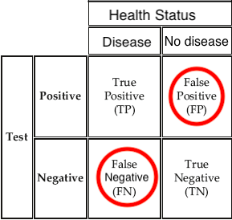
```
:::

:::::

. . .

- Bayes' formula provides a way for finding $P(A \mid B)$ from $P(B \mid A)$


::: notes
- Often, we know the conditional probability $P(B \mid A)$ but are much more interested in $P(A \mid B)$
- For example, diagnostic tests provide $P(\text{positive test result}  \mid \text{disease})$, but we are interested in $P(\text{disease} \mid \text{positive test result})$
:::


## Bayes' Formula

- If $A$ and $B$ are any events whose probabilities are not 0 or 1, then

::: midi

$$\begin{align*} P(A \mid B) &= \frac{P(A \cap B)}{P(B)} \quad ( \text{def. of cond. prob.}) \\ &= \frac{P(A \cap B)}{P((B \cap A) \cup (B \cap A^c))} \quad ( \text{partition } B) \\ &= \frac{P(B \mid A)P(A)}{P(B \mid A)P(A) + P(B \mid A^c)P(A^c)}  \quad ( \text{multiplication rule}) \end{align*}$$


```{r}
#| out-width: 33%
par(mar = c(0, 0, 0, 0), mfrow = c(1, 1))
plot(0, 0, type = "n", axes = FALSE, xlab = "", ylab = "")
box(lwd = 4)
plotrix::draw.ellipse(x = -0.2, y = 0, a = 0.8, b = 0.6, lwd = 2)
plotrix::draw.ellipse(x = 0.56, y = 0, a = 0.4, b = 1, lwd = 2)
text(x = -0.5, y = 0.62, labels = "A", cex = 2)
text(x = .92, y = 0.62, labels = "B", cex = 2)
text(x = 0.36, y = 0, labels = "B ∩ A", cex = 2)
text(x = 0.66, y = -0.45, 
     labels = expression(paste("B ", intersect(A^c))), cex = 2)
text(x = -1, y = 1, labels = "S", cex = 2, font = 4)
```

:::

::: notes
- Hint: <span style="color:blue"> Partition the event $B$ as a union of disjoint sets: $B = (B \cap A) \cup (B \cap A^c)$ (Check Venn diagram) and apply the multiplication rule.</span>  
- Start from the definition of conditional probability, we have 
$$ P(A \mid  B) = \frac{P(A \cap B)}{P(B)} = \cdots = \frac{P(B \mid A)P(A)}{P(B \mid A)P(A) + P(B \mid A^c)P(A^c)}$$
:::

## Example: Passing Rate

::::: columns

::: {.column width="60%"}

After taking MATH 4720, $80\%$ of students understand the Bayes' formula.

- Of those who understand the Bayes' formula,
  + $95\%$ passed

- Of those who do not understand the Bayes' formula,
  + $60\%$ passed

:::


::: {.column width="40%"}

```{r}

```

:::

:::::


::: question
Calculate the probability that a student understand the Bayes' formula given the fact that she passed.
:::


## Bayes Formula: Step-by-Step

- $80\%$ of students understand the Bayes' formula.

- Of those who understand the Bayes' formula, $95\%$ passed ( $5\%$ failed).

- Of those who do not understand the formula, $60\%$ passed ( $40\%$ failed).

::: small
$$P(A \mid B) = \frac{P(B \mid A)P(A)}{P(B \mid A)P(A) + P(B \mid A^c)P(A^c)}$$
:::

. . .

- <span style="color:blue"> Step 1: Formulate what we would like to compute  </span>

. . .

$P(\text{understand} \mid \text{passed})$

. . .

- <span style="color:blue"> Step 2: Define relevant events in the formula: $A$, $A^c$ and $B$ </span>

. . .

Let $A =$ understand. $B =$ passed. Then $A^c =$ don't understand and $P(\text{understand} \mid \text{passed}) = P(A \mid B)$.


## Bayes Formula: Step-by-Step

- $80\%$ of students understand the Bayes' formula.

- Of those who understand the Bayes' formula, $95\%$ passed ( $5\%$ failed).

- Of those who do not understand the formula, $60\%$ passed ( $40\%$ failed).

::: small
$$P(A \mid B) = \frac{P(B \mid A)P(A)}{P(B \mid A)P(A) + P(B \mid A^c)P(A^c)}$$
:::

- <span style="color:blue"> Step 3: Find probabilities in the Bayes' formula using provided information. </span>

$P(B \mid A) = P(\text{passed} \mid \text{understand}) = 0.95$, $P(B \mid A^c) = P(\text{passed} \mid \text{don't understand}) = 0.6$  
$P(A) = P(\text{understand}) = 0.8$, $P(A^c) = 1 - P(A) = 0.2$.

. . .

- <span style="color:blue"> Step 4: Apply Bayes' formula. </span>

$P(\text{understand} \mid \text{passed}) = P(A \mid B) = \frac{P(B \mid A)P(A)}{P(B \mid A)P(A) + P(B \mid A^c)P(A^c)} = \frac{(0.95)(0.8)}{(0.95)(0.8) + (0.6)(0.2)} = 0.86$


## Bayes Formula: Tree Diagram Illustration

- $80\%$ of students understand the Bayes' formula.

- Of those who understand the Bayes' formula, $95\%$ passed ( $5\%$ failed).

- Of those who do not understand the formula, $60\%$ passed ( $40\%$ failed).

::::: columns

::: {.column width="60%"}
```{r}
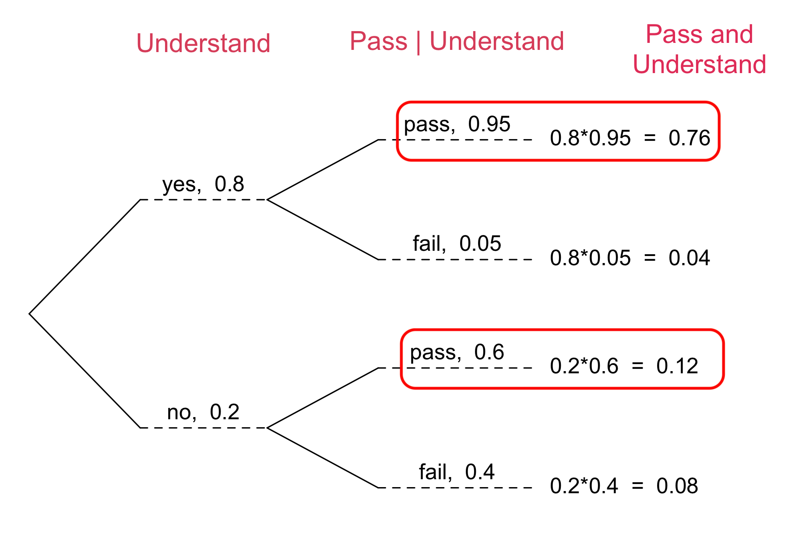
```
:::


::: {.column width="40%"}

$$\begin{align*} & P(\text{yes} \mid \text{pass}) \\ &= \frac{P(\text{yes and }  \text{pass})}{P(\text{pass})} \\ &= \frac{P(\text{yes and }  \text{pass})}{P(\text{pass and yes}) + P(\text{pass and no})}\\ &= \frac{0.76}{0.76 + 0.12} = 0.86 \end{align*}$$

:::

:::::

::: notes
$$\begin{align*} & P(\text{yes} \mid \text{pass}) \\ &= \frac{P(\text{yes and }  \text{pass})}{P(\text{pass})} \\ &= \frac{P(\text{yes and }  \text{pass})}{P(\text{pass and yes}) + P(\text{pass and no})}\\ &= \frac{P(\text{pass | yes})P(\text{yes})}{P(\text{pass | yes})P(\text{yes}) + P(\text{pass | no})P(\text{no})} \\ &= \frac{0.76}{0.76 + 0.12} = 0.86 \end{align*}$$
:::
