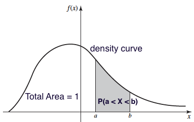

# {visibility="hidden"}

\def\bx{\mathbf{x}}
\def\bg{\mathbf{g}}
\def\bw{\mathbf{w}}
\def\bbeta{\boldsymbol \beta}
\def\bX{\mathbf{X}}
\def\by{\mathbf{y}}
\def\bH{\mathbf{H}}
\def\bI{\mathbf{I}}
\def\bS{\mathbf{S}}
\def\bW{\mathbf{W}}
\def\T{\text{T}}
\def\cov{\mathrm{Cov}}
\def\cor{\mathrm{Corr}}
\def\var{\mathrm{Var}}
\def\E{\mathrm{E}}
\def\bmu{\boldsymbol \mu}
\DeclareMathOperator*{\argmin}{arg\,min}
\def\Trace{\text{Trace}}


```{r}
#| label: pkg
#| include: false
#| eval: true
library(emo)
library(kableExtra)
library(countdown)
library(knitr)
library(openintro)
options(digits = 3)
```

<!-- begin: webr fodder -->



<!-- end: webr fodder -->

# [Random Variables]{.orange}{background-image="https://upload.wikimedia.org/wikipedia/commons/1/1c/6sided_dice_%28cropped%29.jpg" background-size="cover" background-position="50% 50%" background-color="#447099"}

## Random Variables

- Recap: A **variable** in a data set is a characteristic that varies from one to another.
  + A variable can be either categorical or numerical.
  + Numerical variables can be either **discrete** or **continuous**.
  
. . .

- A **random variable**, usually written as $X$ [^1], is a variable whose possible values are **numerical** outcomes determined by **chance** or **randomness** of a procedure or experiment.
  + <span style="color:blue"> Toss a coin 2 times. $X$ = # of heads. </span> 
  + <span style="color:blue"> $X$ = # of accidents in W. Wisconsin Ave. per day.</span>

  <!-- + $X$ = time (in minutes) until next accident in W. Wisconsin Ave. -->

- A random variable has a **probability distribution** associated with it, accounting for its randomness. 

[^1]: Usually in statistics, a capital $X$ represents a random variable and a small $x$ represents a realized value of $X$.


::: notes
- Similar to relative frequency table (distribution)
- A probability distribution is the mathematical function that gives the probabilities of occurrence of different possible outcomes for an experiment in terms of values of r.v. X.
Yes. The possible values of $X$ are numerical $X = 0, 1, 2$ that are determined by randomness of the tossing-coin experiment.
:::


## Discrete and Continuous Random Variables

- A **discrete** random variable takes on a **finite** or **countable** number of values.

- A **continuous** random variable has **infinitely** many values, and the collection of values is **uncountable**.

. . .

- <span style="color:blue"> The number of relationships you've ever had is **discrete** variable because we can count the number and it is finite.</span>
  + If we can further determine the probability that the number is 0, 1, 2, or any possible number, it is a **discrete random variable**.
  
- <span style="color:blue"> Height is **continuous** because it can be any number within a range. </span> 
  + If we have a way to quantify the probability that the height is from any value $a$ to any value $b$, it is a **continuous random variable**.


# Probability Distributions

- ### Discrete Distributions
- ### Continuous Distributions


## A Statistician Should Know

::: tiny
```{r}
#| fig-link: "https://github.com/rasmusab/distribution_diagrams"
#| out-width: 45%
include_graphics("./images/07-distribution/common_dist.png")
```
:::

::: notes
- There are lots of well-known probability distributions out there.
- The distributions shown here are just a small part of probability distributions
- In fact there are infinitely many probability distributions.
- A function that satisfies probability distribution conditions is a probability distribution.
- You can construct our own probability distribution.
:::


# What We Learn Here

- ### Binomial Distribution
- ### Poisson Distribution
- ### Normal Distribution

# [Discrete Probability Distributions]{.orange}{background-image="./images/07-distribution/Poisson.jpg" background-size="cover" background-position="50% 50%" background-color="#447099"}


## Discrete Probability Distribution

- The **probability (mass) function (pf, pmf)** of a discrete random variable (r.v.) $X$ is a function $P(X = x)$ (or $p(x)$) that assigns a probability for **every** possible number $x$.

- The **probability distribution** for a discrete r.v. $X$ *displays* its **probability function**.

- The display can be a *table*, *graph*, or *mathematical formula* of $P(X = x)$. 

. . .

<span style="color:blue"> **Example:** 🪙🪙 Toss a fair coin twice *independently* and $X$ is the number of heads. </span>

- The probability distribution of $X$ as a table is 

```{r}
prob_function <- cbind("x" = c(0, 1, 2), "P(X = x)" = c(0.25, 0.5, 0.25))
# kable(prob_function, format = "pipe")
# kable(print(as.data.frame(prob_function), row.names = FALSE))
prob_function_horizontal <- rbind("x" = c("0", "1", "2"), "P(X = x)" = c(0.25, 0.5, 0.25))
# print(as.data.frame(t(prob_function)), row.names = FALSE)
# print(unname(as.data.frame(prob_function_horizontal)))
kable(prob_function_horizontal)
```

. . .

::: alert
`r emo::ji('point_right')` $\{X = x\}$ is an event corresponding to an event of some experiment.
:::

. . .

::: question
What is the event that $\{X = 0\}$ corresponds to?
:::

. . .

::: question
How do we get $P(X = 0)$, $P(X=1)$ and $P(X=2)$ ?
:::

## Discrete Probability Distribution as a Graph

```{r}
#| out-width: 100%
#| fig-asp: 0.4
par(mar = c(3.8, 6, 0, 0), mgp = c(3, 1, 0))
plot(c("0", "1", "2"), c(0.25, 0.5, 0.25), type = "h", ylim = c(0, 0.75),
     lwd = 5, col = "#003366", ylab = "P(X = x)", xlab = "x", 
     las = 1, axes = F, cex.lab = 1.5)
points(c("0", "1", "2"), c(0.25, 0.5, 0.25), pch = 16, cex = 2, col = "#FFCC00")
axis(1, 0:2, c("0", "1", "2"), col.axis = "black", cex.axis = 1.5)
axis(2, seq(0, 0.75, by = 0.25), col.axis = "black", las = 2, cex.axis = 1.5)
```

- $0 \le P(X = x) \le 1$ for every value $x$ of $X$.
  + <span style="color:blue"> $x = 0, 1, 2$ </span>
  
. . .

- $\sum_{x}P(X=x) = 1$, where $x$ assumes all possible values.
  + <span style="color:blue"> $P(X=0) + P(X = 1) + P(X = 2) = 1$ </span>
  
. . .

- The probabilities for a discrete r.v. are **additive** because $\{X = a\}$ and $\{X = b\}$ are *disjoint* for any possible values $a \ne b$.
  + <span style="color:blue"> $P(X = 1 \text{ or } 2) = P(\{X = 1\} \cup \{X = 2\}) = P(X = 1) + P(X = 2)$. </span>


## Mean of a Discrete Random Variable

- Suppose $X$ takes values $x_1, \dots, x_k$ with probabilities $P(X = x_1), \dots, P(X = x_k)$.

- The **mean** or **expected value** of $X$ is the sum of each outcome multiplied by its corresponding probability:
$$E(X) := x_1 \times P(X = x_1) + \dots + x_k \times P(X = x_k) = \sum_{i=1}^kx_iP(X=x_i)$$

- The Greek letter $\mu$ may be used in place of the notation $E(X)$.


::: notes
- Give an example
:::


. . .

::: alert
`r emo::ji('point_right')` The mean of a discrete random variable $X$ is the **weighted average** of possible values $x$ *weighted by their corresponding probability*.
:::

. . .

::: question
What is the mean of $X$ (the number of heads) in the previous example?
:::

. . .

::: question
What about variance of $X$?
:::

::: notes
- On average, we will see one heads comes up when we toss a fair coin twice.
:::


## Variance of a Discrete Random Variable {visibility="hidden"}

- Suppose $X$ takes values $x_1, \dots , x_k$ with probabilities $P(X = x_1), \dots, P(X = x_k)$ and expected value $\mu = E(X)$.

- The variance of $X$, denoted by $\var(X)$ or $\sigma^2$, is $$\small \var(X) := (x_1 - \mu)^2 \times P(X = x_1) + \dots + (x_k - \mu)^2 \times P(X = x_k) = \sum_{i=1}^k(x_i - \mu)^2P(X=x_i)$$

- The standard deviation of $X$, $\sigma$, is the square root of the variance.

. . .

::: alert
`r emo::ji('point_right')` The variance of a discrete random variable $X$ is the *weighted sum of squared deviation* from the mean weighted by probability values.
:::

. . .

::: question
What is the variance of $X$ (the number of heads) in the previous example?
:::

# Binomial Distribution

## Binomial Experiment and Random Variable

- A **binomial experiment** is the one having the following properties:
  1. `r emo::ji('point_right')` The experiment consists of a **fixed** number of **identical** trials $n$.
  
  2. `r emo::ji('point_right')` Each trial results in one of **exactly two** outcomes (*success* (S) and *failure* (F)).
  
  3. `r emo::ji('point_right')` Trials are **independent**, meaning that the outcome of any trial does not affect the outcome of any other trial.
  
  4. `r emo::ji('point_right')` The probability of success is **constant** for all trials.
  
- If $X$ is defined as  <span style="color:blue"> the number of successes observed in $n$ trials </span>, $X$ is a binomial random variable.

. . .

::: alert
- The word *success* just means one of the two outcomes, and *does not necessarily mean something good. *
- `r emo::ji('astonished')` Can define *Drug abuse* as success and *No drug abuse* as failure.
:::


::: notes
if *smoking* and *non-smoking* are the only two outcomes of some binomial experiment.
:::


## Binomial Distribution

- The probability function $P(X = x)$ of a binomial r.v. $X$ can be *fully* determined by 
  + the number of trials $n$
  + probability of success $\pi$

- Different $(n, \pi)$ pairs generate different binomial probability distributions.

- $X$ is said to follow a binomial distribution with **parameters** $n$ and $\pi$, written as $\color{blue}{X \sim binomial(n, \pi)}$.

. . .

- The binomial probability function is 
$$ \color{blue}{P(X = x \mid n, \pi) = \frac{n!}{x!(n-x)!}\pi^x(1-\pi)^{n-x}, \quad x = 0, 1, 2, \dots, n}$$ with mean $\mu = E(X) = n\pi$ and variance $\sigma^2 = \var(X) = n\pi(1-\pi)$.

::: notes
- Once $(n, \pi)$ is fixed, we know exactly what the distribution looks like, and we can form a table, graph, and provide a mathematical formula of the binomial distribution.
:::

. . .

::: question
Tossing a fair coin two times independently. Let $X =$ # of heads. Is $X$ a binomial r.v.?
:::


::: notes

- Example: Toss a fair coin two times independently.
  + $X =$ # of heads
  + $X \sim binomial(n=2, \pi=1/2)$
  
:::


<!-- ## [Binomial Distribution Applet](https://math4720-f25.github.io/website/ojs/prob-binomial-ojs.html) -->

<!--  -->


## Binomial Distribution Example


::::: columns

::: {.column width="90%"}

Assume that 20% of all drivers have a blood alcohol level above the legal limit. For a random sample of 15 vehicles, compute the probability that:

  1. **Exactly 6** of the 15 drivers will *exceed* the legal limit.
  
  2. Of the 15 drivers, **6 or more** will *exceed* the legal limit.
  
:::

::: {.column width="10%"}
```{r}
#| out-width: 100%

```
:::

:::::


. . .

- Suppose it is a binomial experiment with $n = 15$ and $\pi = 0.2$.

- Let $X$ be the number of drivers exceeding limit.

- $X \sim binomial(15, 0.2)$.

$$ \color{blue}{P(X = x \mid n=15, \pi=0.2) = \frac{15!}{x!(15-x)!}(0.2)^x(1-0.2)^{15-x}, \quad x = 0, 1, 2, \dots, 15}$$


::: notes

- On a particular roadway, assume that 20% of all drivers have a blood alcohol level above the legal limit. 
  3. All 15 drivers will have a blood alcohol level *within* the legal limit.
  
:::

## Binomial Distribution Example $X \sim binomial(15, 0.2)$

```{r}
par(mar = c(4, 4, 2, 0), mgp = c(2, 0.5, 0), las = 1)
plot(x = 0:15, y = dbinom(0:15, size = 15, prob = 0.2), type = 'h', xlab = "x", 
     ylab = "P(X = x)", lwd = 5, main = "Binomial(15, 0.2)")
```


## Binomial Distribution Example

::::: columns

::: {.column width="90%"}

Assume that 20% of all drivers have a blood alcohol level above the legal limit. For a random sample of 15 vehicles, compute the probability that:

  1. Exactly 6 of the 15 drivers will *exceed* the legal limit.
  
  2. Of the 15 drivers, 6 or more will *exceed* the legal limit.
  
:::

::: {.column width="10%"}
```{r}
#| out-width: 100%

```
:::

:::::


::: notes
- On a particular roadway, assume that 20% of all drivers have a blood alcohol level above the legal limit. 

- Suppose it is a binomial experiment with $n = 15$ and $\pi = 0.2$. 
- Let $X$ be the number of drivers exceeding limit. Then $X \sim binomial(15, 0.2)$.
:::


. . .

  1. $\small P(X = 6) = \frac{n!}{x!(n-x)!}\pi^x(1-\pi)^{n-x} = \frac{15!}{6!(15-6)!}(0.2)^6(1-0.2)^{15-6} = 0.043$
  
. . .

  2. $\small P(X \ge 6) = p(6) + \dots + p(15) = 1 - P(X \le 5) = 1 - (p(0) + p(1) + \dots + p(5)) = 0.0611$
  

::: notes

  3. All 15 drivers will have a blood alcohol level *within* the legal limit.
  3. $\small P(X = 0) = \frac{15!}{0!(15-0)!}(0.2)^0(1-0.2)^{15-0} = 0.0352$
- $P(X \ge 6) = 1 - P(X \le 5)$ very useful trick
- Calculation is super tedious, even you use a calculator!

:::


. . .

::: tip
Never do this by hand. We compute them using R!
:::


## Binomial Example Computation in R
<!-- - R Shiny app is at [Binomial Calculator](http://sctc.mscs.mu.edu:3838/sample-apps/Calculator/) -->
- With `size` the number of trials and `prob` the probability of success,
  + **`dbinom(x, size, prob)`** to compute $P(X = x)$
  + **`pbinom(q, size, prob)`** to compute $P(X \le q)$
  + **`pbinom(q, size, prob, lower.tail = FALSE)`** to compute $P(X > q)$
  
::::: columns

::: {.column width="50%"}
```{r}
#| echo: true
## 1. P(X = 6)
dbinom(x = 6, size = 15, prob = 0.2) 
## 2. P(X >= 6) = 1 - P(X <= 5)
1 - pbinom(q = 5, size = 15, prob = 0.2) 
```
:::


::: {.column width="50%"}
```{r}
#| echo: true
## 2. P(X >= 6) = P(X > 5)
pbinom(q = 5, size = 15, prob = 0.2, 
       lower.tail = FALSE)  
```
:::

:::::


## Binomial(15, 0.2)

```{r}
#| code-fold: false
#| echo: !expr c(-1)
par(mar = c(4, 4, 2, 0), mgp = c(2, 0.5, 0), las = 1)
plot(x = 0:15, y = dbinom(0:15, size = 15, prob = 0.2), type = 'h', xlab = "x", 
     ylab = "P(X = x)", lwd = 5, main = "Binomial(15, 0.2)")
```


::: notes
- Since $n = 15$ and $\pi = 0.2$, mean is 3.
- Most of the probabilities are around $x = 3$. 
- It's very uncommon to see that more than 10 drivers have alcohol level above the legal limit.
:::


# Poisson Distribution

## Poisson Random Variables

- If we'd like to count **the number of occurrences of some event over a unit of time period or space (region)** and calculate its probability, we could consider the **Poisson distribution**.
  + Number of COVID patients arriving at ICU in one hour
  + Number of Marquette students logging onto D2L in one day
  + Number of dandelions per square meter in Marquette campus

. . .

- Let $X$ be a Poisson r.v. Then $\color{blue}{X \sim Poisson(\lambda)}$, where $\lambda$ is the parameter representing the **mean** number of occurrences of the event in the interval.
$$\color{blue}{P(X = x \mid \lambda) = \frac{\lambda^x e^{-\lambda}}{x!}, \quad x = 0, 1, 2, \dots}$$ with both mean and variance being equal to $\lambda$.


::: notes
- Let $X$ be a Poisson r.v. representing the number of occurrences of some event over a unit of interval (time, space, volume).
:::

## Assumptions and Properties of Poisson Variables

- `r emo::ji('point_right')` **Events occur one at a time**; two or more events do not occur at the same time or in the same space or spot.

- `r emo::ji('point_right')` The occurrence of an event in a given period of time or region of space is **independent** of the occurrence of the event in a **nonoverlapping** time period or region of space.

- `r emo::ji('point_right')` $\lambda$ is **constant** of any period or region.

::: notes
- You cannot say two patients arrived at ICU at the same time.
- You can always know which patient arrives at ICU earlier.
- You can always know which students log in D2L earlier
:::


. . .

::: question
Can you find the difference between binomial and Poisson distributions?
:::


. . .

- The Poisson distribution
  + is determined by one single parameter $\lambda$
  + has possible values $x = 0, 1, 2, \dots$ with no upper limit (countable), while a binomial variable has possible values $0, 1, 2, \dots, n$ (finite)


<!-- ## [Poisson Distribution Applet](https://math4720-f25.github.io/website/ojs/prob-poisson-ojs.html) -->

<!--  -->


## Poisson Distribution Example


::::: columns

::: {.column width="90%"}
Last year there were 4200 births at the University of Wisconsin Hospital. Assume $X$ be the number of births in a given day at the center, and $X \sim Poisson(\lambda)$. Find

  1. $\lambda$, the mean number of births **per day**.
  2. the probability that on a randomly selected day, there are exactly 10 births.
  3. $P(X > 10)$? 
  
:::

::: {.column width="10%"}

```{r}
#| out-width: 100%

```
:::

:::::

. . .

1. $\small \lambda = \frac{\text{Number of birth in a year}}{\text{Number of days}} = \frac{4200}{365} = 11.5$

. . .

2. $\small P(X = 10 \mid \lambda = 11.5) = \frac{\lambda^x e^{-\lambda}}{x!} = \frac{11.5^{10} e^{-11.5}}{10!} = 0.113$

. . .

3. $\small P(X > 10) = p(11) + p(12) + \cdots + p(20) + \cdots$ (No end!)
$\small P(X > 10) = 1 - P(X \le 10) = 1 - (p(0) + p(1) + p(2) + \dots + p(10))$.

::: notes
.tip[
I know you are waiting for R implementation!
:::


## Poisson Example Compuatation in R

<!-- - R Shiny app is at [Poisson Calculator](http://sctc.mscs.mu.edu:3838/sample-apps/Calculator/) -->
<!-- P(X <= 10) = 0.392 -->
- With `lambda` the mean of Poisson distribution, 
  + **`dpois(x, lambda)`** to compute $P(X = x)$
  + **`ppois(q, lambda)`** to compute $P(X \le q)$
  + **`ppois(q, lambda, lower.tail = FALSE)`** to compute $P(X > q)$

::::: columns

::: {.column width="50%"}
```{r}
#| echo: true
(lam <- 4200 / 365)
## P(X = 10)
dpois(x = 10, lambda = lam)  
```
:::


::: {.column width="50%"}
```{r}
#| echo: true
## P(X > 10) = 1 - P(X <= 10)
1 - ppois(q = 10, lambda = lam)  
## P(X > 10)
ppois(q = 10, lambda = lam, 
      lower.tail = FALSE) 
```
:::
:::::


## Poisson(11.5)

- $X$ has no upper limit. The graph is *truncated* at $x = 24$.

```{r}
#| echo: true
#| code-fold: true
#| out-width: 100%
par(mar = c(3.8, 3.8, 1, 0), mgp = c(2.5, 0.5, 0))
plot(0:24, dpois(0:24, lambda = lam), type = 'h', lwd = 5, las = 1,
     ylab = "P(X = x)", xlab = "x", main = "Poisson(11.5)")
```


# [Continuous Probability Distributions]{.orange}{background-image="./images/07-distribution/Gauss.jpg" background-size="cover" background-position="50% 50%" background-color="#447099"}


## Continuous Probability Distributions

- A continuous r.v. can take on **any** values from *an interval of the real line*.

- Instead of probability functions, a continuous r.v. $X$ has the **probability density function (pdf)** $f(x)$ such that for any real value $a < b$,
$$P(a < X < b) = \int_{a}^b f(x) dx$$

<!-- - The **cumulative distribution function (cdf)** of $X$ is defined as -->
<!-- $$F(x) := P(X \le x) = \int_{-\infty}^x f(t)dt$$ -->

. . .

- Every pdf must satisfy <span style="color:blue"> (1) $f(x) \ge 0$ for all $x$; (2) $\int_{-\infty}^{\infty} f(x) dx = 1$ </span>

. . .

`r emo::ji('sunglasses')` Luckily we don't deal with integrals in this course.


## Density Curve

- A pdf generates a graph called the **density curve** that shows the *likelihood* of a random variable at all possible values.

- $P(a < X < b) = \int_{a}^b f(x) dx$: **The area under the density curve between $a$ and $b$.**

- $\int_{-\infty}^{\infty} f(x) dx = 1$: **The total area under any density curve is equal to 1.**

```{r}
# 
par(mar = c(2, 2, 0, 0), mgp = c(0.5, 0.2, 0), mfrow = c(1, 1))
x = seq(0,10,length=1000)
y = dgamma(x, 2, 1/2)
plot(x, y, type = "l", lwd = 3, col = "blue", axes = FALSE, 
     ylab = "f(x)", las = 1, cex.lab = 1.4)
axis(1, at = c(2, 4), labels = c("a", "b"), tick = TRUE)
axis(2, tick = FALSE, labels = FALSE)
abline(h = 0)
abline(v = 0)
x = seq(2, 4, length = 100)
y = dgamma(x, 2, 1/2)
polygon(c(2, x, 4), c(0, y, 0), col = "lightblue")
text(3, dgamma(2, 2, 1/2)/2, "P(a < X < b)", cex = 1.4)
text(6, dgamma(6, 2, 1/2)/3, "Total Area = 1", cex = 1.8)
text(7.5, dgamma(5.6, 2, 1/2), "density curve", cex = 1.8)
```


::: notes
- ** $P(a < X < b)$ is the area under the density curve between $a$ and $b$.**
- **The total area under any density curve is equal to 1.**
:::


## Commonly Used Continuous Distributions

- [Distribution Applet](https://homepage.divms.uiowa.edu/~mbognar/)

- In this course, we will touch **normal (Gaussian)**, **Student's t**, **chi-squared**, **F**

- Some other common distributions include **uniform**, **exponential**, **gamma**, **beta**, **inverse gamma**, **Cauchy**, etc. (MATH 4700)


## Normal (Gaussian) Distribution

-  The normal distribution, $N(\mu, \sigma^2$), has the pdf given by
$$\small f(x) = \frac{1}{\sqrt{2\pi}\sigma}e^{\frac{-(x-\mu)^2}{2\sigma^2}}, \quad -\infty < x < \infty$$
    + Two parameters mean $\mu$ and variance $\sigma^2$ (standard deviation $\sigma$)
    + Always bell shaped, and symmetric about the mean $\mu$
    + When $\mu = 0$ and $\sigma = 1$, $N(0, 1)$ is called **standard normal**.

```{r}
par(mfrow = c(1, 1))
par(mar = c(1.8, 0, 1.8, 0), mgp = c(0.5, 0.5, 0), las = 1)
mean=100; sd=15
# lb=80; ub=120
x <- seq(-4,4,length=100)*sd + mean
hx <- dnorm(x,mean,sd)
plot(x, hx, type="n", xlab="x", ylab="", cex.lab = 1.5,
  main=expression(N(100, 15^2)), axes=FALSE, cex.main = 1.5)
# i <- x >= lb & x <= ub
lines(x, hx, col = "#003366", lwd = 3)
# polygon(c(lb,x[i],ub), c(0,hx[i],0), col="red")
# area <- pnorm(ub, mean, sd) - pnorm(lb, mean, sd)
# result <- paste("P(",lb,"< IQ <",ub,") =",
#    signif(area, digits=3))
# mtext(result,3)
axis(1, at=seq(40, 160, 20), pos=0, tick = -0.005, cex.axis = 1.5)
```


## Normal Density Curves

```{r}
#| out-width: 100%
mean=100; sd=10
x <- seq(-4,4,length=100)*sd + mean
hx <- dnorm(x,mean,sd)
par(mar = c(2.5, 0, 2, 0), mgp = c(0.5, 0.5, 0))
plot(x, hx, type="n", xlab="x", ylab="", xlim = c(-30, 160), bty = "n",
     main="Normal Densities", yaxt = "n", xaxt = "n")
axis(1, at=seq(-30, 160, 20), pos=0, tick = -0.005)
lines(x, hx, col = "#003366", lwd = 3)
mean=100; sd=15
x <- seq(-4,4,length=100)*sd + mean
hx <- dnorm(x,mean,sd)
lines(x, hx, col = "#FFCC00", lwd = 3)
mean=20; sd=10
x <- seq(-4,4,length=100)*sd + mean
hx <- dnorm(x,mean,sd)
lines(x, hx, col = 2, lwd = 3)
legend("topright", c(expression(N(100, 10^2)), 
                     expression(N(100, 15^2)), 
                     expression(N(20, 10^2))), 
       col = c("#003366", "#FFCC00", 2), lwd = 3, bty = "n", cex = 1.5)
```


<!-- ## [Normal Distribution Applet](https://math4720-f25.github.io/website/ojs/prob-normal-ojs.html) -->

<!--  -->


## Standardization and Z-Scores

- **Standardization**: Convert $N(\mu, \sigma^2)$ to $N(0, 1)$.

- **Why standardization**: Put data onto a *standardized scale*, making comparisons easier!

. . .

::: question

|Measure         | SAT               | ACT         |
|:-------------:|:-----------------:|:------------:|
| Mean          | 1100              | 21          |  
| SD            | 200               | 6           |

- The distribution of SAT and ACT scores are both nearly normal.

- Suppose Anna scored 1300 on her SAT and Tommy scored 24 on his ACT. Who performed better?

:::

::: midi
```{r}
#| out-width: 50%

```
:::

::: notes
- For normal distribution, we usually do the so-called Standardization.
- The idea is to Make a normal distribution standard normal, i.e., convert $N(\mu, \sigma^2)$ to $N(0, 1)$.
- But why do we want to do that?
- Well, by doing so, we can put any data onto a *standardized scale*, making comparisons easier and reasonable.
- The distribution of SAT and ACT scores are both nearly normal. 
- Suppose Anna scored 1300 on her SAT and Tommy scored 24 on his ACT. Who performed better?
- It's hard to compare the two scores, right? because they are on the different scales.
- And standardization helps us compare Anna and Tommy's performance because we are gonna put their scores on the same scale. Let's see how.
:::


## Standardization and Z-Scores

-  If $x$ is an observation from a distribution with mean $\mu$ and standard deviation $\sigma$, the standardized value of $x$ is so-called **$z$-score**:
$$z = \frac{x - \mu}{\sigma}$$

. . .

- A $z$-score tells us how many standard deviations $x$ falls away from the mean, and in which direction.
  + Observations **larger (smaller)** than the mean have **positive (negative)** $z$-scores.
  + A $z$-score -1.2 means that $x$ is 1.2 standard deviations to the **left** of (**below**) the mean.
  + A $z$-score 1.8 means that $x$ is 1.8 standard deviations to the **right** of (**above**) the mean.

. . .

- <span style="color:blue">  If $X \sim N(\mu, \sigma^2)$, $Z = \frac{X - \mu}{\sigma}$ follows the standard normal distribution, i.e., $Z \sim N(0, 1)$. </span>


::: notes

- If z-score is positive, it means that the original x is greater the mean.
- Since we divided by sigma, the standardized value is measured using SD as the unit.
- A $z$-score tells us how many standard deviations the original observation $x$ falls away from the mean, and in which direction.
  + Observations **larger (smaller)** than the mean have **positive (negative)** $z$-scores.
  + A $z$-score -1.2 means that $x$ is 1.2 standard deviations to the **left** of (**below**) the mean.
  + A $z$-score 1.8 means that the original observation $x$ is 1.8 standard deviations to the **right** of (**above**) the mean.
- <span style="color:blue">  If $X \sim N(\mu, \sigma^2)$, $Z = \frac{X - \mu}{\sigma}$ follows the standard normal distribution, i.e., $Z \sim N(0, 1)$. </span>

:::


## Standardization Illustration

- $X - \mu$ shifts the mean from $\mu$ to 0

```{r}
#| out-width: 56%
#| fig-asp: 0.3
mean = 3; sd = 2
par(mar = c(2, 0, 1, 0), mgp = c(0.6, 0.3, 0), las = 1)
x <- seq(-6, 9, length = 100)
# z <- seq(-3, 13, length = 100)
hx <- dnorm(x, mean, sd)
hz <- dnorm(x, 0, sd)
plot(x, hz, type="n", xlab="x", ylab="", ylim = c(0, dnorm(0, 0, 1)),
  main = "Shift from N(3, 4) to N(0, 4)", axes = FALSE)
lines(x, hz, col = "blue", lwd = 4)
lines(x, hx, col = "#003366", lwd = 4)
axis(1, at = seq(-3, 9, 1), pos=0)
# abline(v = c(0, 3))
segments(x0 = 0, y0 = 0, y1 = dnorm(0, 0, sd), col = "blue", lwd = 2)
segments(x0 = mean, y0 = 0, y1 = dnorm(mean, mean, sd), col = "#003366", lwd = 2)
arrows(x0 = 3, y0 = 0.1, x1 = 0, col = "#FFCC00", lwd = 5)
```

. . .

- $\frac{X - \mu}{\sigma}$ scales the variation from 4 to 1

```{r}
#| out-width: 56%
#| fig-asp: 0.3
par(mar = c(2, 0, 1, 0), mgp = c(0.6, 0.3, 0), las = 1)
x <- seq(-6, 9, length = 100)
# z <- seq(-3, 13, length = 100)
hx <- dnorm(x, 0, sd)
hz <- dnorm(x, 0, 1)
plot(x, hz, type="n", xlab="x", ylab="", ylim = c(0, dnorm(0, 0, 1)),
  main = "Scale from N(0, 4) to N(0, 1)", axes = FALSE)
lines(x, hz, col = "red", lwd = 4)
lines(x, hx, col = "blue", lwd = 4)
axis(1, at = seq(-3, 9, 1), pos=0)
segments(x0 = 0, y0 = 0, y1 = dnorm(0, 0, 1), col = "red", lwd = 2)
arrows(x0 = 3, y0 = 0.05, x1 = 2, col = "#FFCC00", lwd = 5)
arrows(x0 = 0.5, y0 = dnorm(0, 0, 2), x1 = 0.5, y1 = dnorm(0, 0, 1), col = "#FFCC00", lwd = 5)
```


## Standardization Illustration

- A value of $x$ that is 2 standard deviation below $\mu$ corresponds to $z = -2$.

- $z = \frac{x  -\mu}{\sigma} \iff x = \mu + z\sigma$. If $z = -2$, $x = \mu - 2\sigma$.

```{r}
par(mar = c(4, 0, 0, 0), mgp = c(0, 0.5, 0), las = 1)
z <- seq(-3, 3, length = 100)
hz <- dnorm(z)
plot(z, hz, type="n", xlab="", ylab="", ylim = c(0, dnorm(0, 0, 1)),
  main = "", axes = FALSE)
lines(z, hz, col = 4, lwd = 4)
segments(x0 = 0, y0 = 0, y1 = dnorm(0, 0, 1), col = 4, lwd = 1, lty = 2)
segments(x0 = 1, y0 = 0, y1 = dnorm(1, 0, 1), col = 4, lwd = 1, lty = 2)
segments(x0 = 2, y0 = 0, y1 = dnorm(2, 0, 1), col = 4, lwd = 1, lty = 2)
segments(x0 = 3, y0 = 0, y1 = 5*dnorm(3, 0, 1), col = 4, lwd = 1, lty = 2)
segments(x0 = -1, y0 = 0, y1 = dnorm(-1, 0, 1), col = 4, lwd = 1, lty = 2)
segments(x0 = -2, y0 = 0, y1 = dnorm(-2, 0, 1), col = 4, lwd = 1, lty = 2)
segments(x0 = -3, y0 = 0, y1 = 5*dnorm(-3, 0, 1), col = 4, lwd = 1, lty = 2)
axis(1, at = seq(-3, 3, 1), pos=0, line = 1, cex.axis = 1.5)
labels <- expression(mu - 3 * sigma,
                     mu - 2 * sigma,
                     mu - sigma,
                     mu,
                     mu + sigma,
                     mu + 2 * sigma,
                     mu + 3 * sigma)
axis(1, at = seq(-3, 3, 1), labels, tick = 0.01, line = 2, cex.axis = 1.5)
```


## SAT and ACT Example

- $z_{A} = \frac{x_{A} - \mu_{SAT}}{\sigma_{SAT}} = \frac{1300-1100}{200} = 1$; $z_{T} = \frac{x_{T} - \mu_{ACT}}{\sigma_{ACT}} = \frac{24-21}{6} = 0.5$.

```{r}
par(mfrow = c(2, 1),
    las = 1,
    mar = c(2.5, 0, 0.5, 0))
# _____ Curve 1 _____ #
m <- 1100
s <- 200
X <- m + s * seq(-6, 6, 0.01)
Y <- dnorm(X, m, s)
plot(X, Y,
     type = 'l',
     axes = FALSE, xlab = "",
     xlim = m + s * 2.7 * c(-1, 1))
axis(1, at = m + s * (-3:3))
abline(h = 0)
lines(c(m, m),
      dnorm(m, m, s) * c(0.01, 0.99),
      lty = 2,
      col = '#EEEEEE')
lines(c(m, m) + s,
      dnorm(m + s, m, s) * c(0.01, 1.25),
      lty = 2, col = 2)
text(m + s,
     dnorm(m + s, m, s) * 1.25,
     'Anna',
     pos = 3,
     col = 2)


# _____ Curve 2 _____ #
par(mar = c(2, 0, 1, 0))
m <- 21
s <- 6
X <- m + s * seq(-6, 6, 0.01)
Y <- dnorm(X, m, s)
plot(X, Y, xlab = "",
     type = 'l',
     axes = FALSE,
     xlim = m + s * 2.7 * c(-1, 1))
axis(1, at = m + s * (-3:3))
abline(h = 0)
lines(c(m, m),
      dnorm(m, m, s) * c(0.01, 0.99),
      lty = 2,
      col = '#EEEEEE')
lines(c(m, m) + 3,
      dnorm(m + 3, m, s) * c(0.01, 1.2),
      lty = 2,
      col = 2)
text(m + 3,
     dnorm(m + 3, m, s) * 1.05,
     'Tommy',
     pos = 4,
     col = 2)
```


::: notes
- After standardizing SAT and ACT distributions, we can compare SAT and ACT scores together.
- The z-score for Anna is 1, so her SAT score is 1 SD above the mean of SAT.
- The z-score for Tommy is 0.5, so his ACT score is 0.5 SD above the mean of ACT.
- Originally, SAT and ACT are two different distributions with different scales.
- But now we convert both distributions to standard normal distributions, so that they can be compared.
- Because Anna's score is 1 sd higher than the mean, and Tommy's socre is 0.5 sd higher than the mean, we conclude that Anna performed better on the test.

An observation x1 is said to be more unusual than another observation x2 if the absolute value of its Zscore is larger than the absolute value of the other observation's Z-score.
:::


## Finding Tail Areas $P(X < x)$

::: question
What fraction of students have an SAT score below Anna's score of 1300?
:::

- This is the same as the percentile Anna is at, which is the percentage of cases that have lower scores than Anna.

- Need $P(X < 1300 \mid \mu = 1100, \sigma = 200)$ or $P(Z < 1 \mid \mu = 0, \sigma = 1)$.

```{r}
#| out-width: 50%
#| label: tail
par(mfrow = c(1, 1), las = 1, mar = c(2.5, 0, 0, 0), mgp = c(0, 1, 0))
normTail(m = 1100, s = 200, L = 1300, col = 4, cex.axis = 1.3)
```


::: notes

- If there are 100 test takers, how many students score are lower than Anna's score?
It's very useful in statistics to be able to identify tail areas of distributions. For instance, what
fraction of people have an SAT score below Anna's score of 1300? This is the same as the percentile
Anna is at, which is the percentage of cases that have lower scores than Anna. We can visualize such
a tail area like the curve and shading shown in Figure 4.6.
- The area to the left of Z represents the fraction of people who scored
lower than Anna.

:::


## Finding Tail Areas $P(X < x)$ in R

- With **`mean`** and **`sd`** representing the mean and standard deviation of a normal distribution
  + **`pnorm(q, mean, sd)`** to compute $P(X \le q)$
  + **`pnorm(q, mean, sd, lower.tail = FALSE)`** to compute $P(X > q)$

. . .


::::: columns

::: {.column width="50%"}
```{r}
#| ref-label: tail
#| out-width: 100%
```
:::

::: {.column width="50%"}
```{r}
#| echo: true
pnorm(1, mean = 0, sd = 1)
pnorm(1300, mean = 1100, sd = 200)
```

- The shaded area represents the proportion 84.1% of SAT test takers who had z-score below 1.


:::

:::::


::: notes
- Don't forget R Shiny app is at [Normal Calculator](http://sctc.mscs.mu.edu:3838/sample-apps/Calculator/)
- The default values of `mean` and `sd` are 0 and 1 respectively, i.e., $N(0, 1)$.
- It is rarely used in practice, but you can find tail areas using the normal table (Table 1 in the textbook.) 
:::


## SAT Example Cont'd {visibility="hidden"}

- SAT score follows $N(1100, 200^2)$. Shannon is a SAT taker, and nothing is known about Shannon's SAT aptitude. What is the probability Shannon SAT scores at least 1190?

```{r}
par(mfrow = c(1, 1), las = 1, mar = c(4, 0, 0, 0), mgp = c(1, 1, 0))
normTail(m = 1100, s = 200, U = 1190, col = 4, cex.axis = 1.3)
```


## SAT Example Cont'd

- SAT score follows $N(1100, 200^2)$. Shannon is a SAT taker, and nothing is known about Shannon's SAT aptitude. What is the probability Shannon SAT scores **at least** 1190?

::::: columns

::: {.column width="50%"}

- <span style="color:red"> Step 1: State the problem </span>
  +  <span style="color:blue"> We like to compute $P(X \ge 1190)$. </span>
  
- <span style="color:red"> Step 2: Draw a picture

```{r}
par(mfrow = c(1, 1), las = 1, mar = c(4, 0, 0, 0), mgp = c(1, 1, 0))
normTail(m = 1100, s = 200, U = 1190, col = 4, cex.axis = 1.3)
```

:::

::: {.column width="50%"}

- <span style="color:red"> Step 3: Find the area

We want the **upper tail** area, so `lower.tail = FALSE`!

```{r}
#| echo: true
pnorm(q = 1190, mean = 1100, sd = 200, 
      lower.tail = FALSE)
```

:::

:::::


## SAT Example Cont'd {visibility="hidden"}

```{r}
#| fig-asp: 0.2
AddShadedPlot <- function(x, y, offset,
                          shade.start = -8,
                          shade.until = 8, col = 4) {
  lines(x + offset, y)
  lines(x + offset, rep(0, length(x)))
  these <- which(shade.start <= x & x <= shade.until)
  polygon(c(x[these[1]], x[these], x[rev(these)[1]]) + offset,
          c(0, y[these], 0),
          col = 4)
  lines(x + offset, y)
}
# AddText <- function(x, text) {
#   text(x, 0.549283, text, cex = 2)
# }

X <- seq(-3.2, 3.2, 0.01)
Y <- dnorm(X)
par(mfrow = c(1, 1), las = 1, mar = c(0, 0, 0, 0), mgp = c(0, 0, 0))
plot(X, Y, type = 'l', axes = FALSE, xlim = c(-3.4, 16 + 3.4), xlab = "", ylab = "")
AddShadedPlot(X, Y, 0, 0.45, 8)
AddShadedPlot(X, Y, 8)
AddShadedPlot(X, Y, 16, -8, 0.45)
segments(c(3.5, 3.5), c(0.19, 0.23), c(4.5, 4.5), lwd = 3)
# lines(c(3.72, 4.28), rep(0.549283, 2), lwd = 2)
lines(c(11.5, 12.5), c(0.21, 0.21), lwd = 3)
# text(12, 0.549283,' = ', cex = 2)

```

- <span style="color:red"> Step 3: Find $z$-score </span>: 
  + <span style="color:blue"> $z = \frac{1190 - 1100}{200} = 0.45$ and we like to compute $P(X > 1190) = P\left( \frac{X - \mu}{\sigma} > \frac{1190 - 1000}{200} \right) = P(Z > 0.45) = 1 - P(Z \le 0.45)$ </span>
  
- <span style="color:red"> Step 4: Find the area using `pnorm()` </span>

```{r}
#| echo: true
1 - pnorm(0.45)
```


## Normal Percentiles in R

- To get the $100p$-th percentile (or the $p$-quantile $q$), given probability $p$, we use
  + **`qnorm(p, mean, sd)`** to get a value of $X$, $q$, such that $P(X \le q) = p$ 
  + **`qnorm(p, mean, sd, lower.tail = FALSE)`** to get $q$ such that $P(X \ge q) = p$

::: notes
- We may be also interested in the value of $X$ given a probability or percentage. 
- In other words, we'd like to find the $100p$-th percentile given the probability $p$.

  <!-- <footnote> The formal definition of the quantile function is $Q(p) := \inf\{x \in \mathbf{R}: P(X \le x) \ge p\}$. </footnote> -->
:::


## SAT Example

What is the 95th percentile for SAT scores?

::: alert
**Find a value $q$ of the normal random variable, not an area (probability), which is 0.95.**
:::


::::: columns

::: {.column width="55%"}

- <span style="color:red"> Step 1: State the problem </span>
  +  <span style="color:blue"> Find a variable's value $q$ s.t $P(X < q) = 0.95$. </span>
  
- <span style="color:red"> Step 2: Draw a picture


```{r}
#| out-width: 80%
par(mfrow = c(1, 1), las = 1, mar = c(1.8, 0, 0, 0), mgp = c(0.5, 0.5, 0))
normTail(m = 1100, s = 200, L = qnorm(0.95, 1100, 200), col = 4, cex.axis = 1.3)
text(x = 1100, y = 0.0008, "95%", cex = 4)
text(x = 1429, y = 0, "q", cex = 3, col = "red")
```

:::


::: {.column width="45%"}

- <span style="color:red"> Step 3: Find the quantile

We want the **q**uantile, so use `qnorm()`!

```{r}
#| echo: true
qnorm(p = 0.95, mean = 1100, sd = 200)
```

:::

:::::


## SAT Example Cont'd {visibility="hidden"}

- <span style="color:red"> Step 3: Find $z$-score s.t. $P(Z < z) = 0.95$ using `qnorm()`</span>: 

```{r}
#| echo: true
(z_95 <- qnorm(0.95))
```

- <span style="color:red"> Step 4: Find the $x$ of the original scale </span>
  + <span style="color:blue"> $z_{0.95} = \frac{x-\mu}{\sigma}$. So $x = \mu + z_{0.95}\sigma$. </span>
  
```{r}
#| echo: true
(x_95 <- 1100 + z_95 * 200)
```

- The 95th percentile for SAT scores is 1429.

. . .

```{r}
#| echo: true
qnorm(p = 0.95, mean = 1100, sd = 200)
```


<!-- ## Finding Probabilties -->

<!-- `r emo::ji('point_right')` **Draw and label the normal curve and shade the area of interest.** -->

<!-- - `r emo::ji('point_right')` **Less than** -->
<!--   + $\small P(X < x) = P(Z < z)$ -->
<!--   + `pnorm(z)` -->
<!--   + `pnorm(x, mean = mu, sd = sigma)` -->

<!-- - `r emo::ji('point_right')` **Greater than** -->
<!--   + $\small P(X > x) = P(Z > z) = 1 - P(Z \le z)$ -->
<!--   + `1 - pnorm(z)` -->

<!-- ::: alert -->
<!-- - `r emo::ji('point_right')` Standardization is not a must.  -->
<!-- - `r emo::ji('point_right')` We have to specify the mean and SD of the original distribution of $X$, like `pnorm(x, mean = mu, sd = sigma)`. -->
<!-- ::: -->


## Finding Probabilties {visibility="hidden"}

`r emo::ji('point_right')` **Draw and label the normal curve and shade the area of interest.**

- `r emo::ji('point_right')` **Less than**
  + $\small P(X < x) = P(Z < z)$
  + `pnorm(z)`
  + `pnorm(x, mean = mu, sd = sigma)`

- `r emo::ji('point_right')` **Greater than**
  + $\small P(X > x) = P(Z > z) = 1 - P(Z \le z)$
  + `1 - pnorm(z)`

::: alert

- `r emo::ji('point_right')` Standardization is not a must.

- `r emo::ji('point_right')` We have to specify the mean and SD of the original distribution of $X$, like `pnorm(x, mean = mu, sd = sigma)`.

:::


## Finding Probabilties {visibility="hidden"}

- `r emo::ji('point_right')` **Between two numbers**
  + $\small P(a < X < b) = P(z_a < Z < z_b) = P(Z < z_b) - P(Z < z_a)$
  + `pnorm(z_b) - pnorm(z_a)`

- `r emo::ji('point_right')` **Outside of two numbers** $(a < b)$
$$\small \begin{align} P(X < a \text{ or } X > b) &= P(Z < z_a \text{ or } Z > z_b) \\ &= P(Z < z_a) + P(Z > z_b) \\ &= P(Z < z_a) + 1 - P(Z < z_b) \end{align}$$
  + `pnorm(z_a) + 1 - pnorm(z_b)`
  + `pnorm(z_a) + pnorm(z_b, lower.tail = FALSE)`


::: alert

- `r emo::ji('point_right')` Any probability can be computed using the *"less than"* form (*lower* or *left* tail).

- `r emo::ji('point_right')` If the calculation involves the "greater than" form, add `lower.tail = FALSE` in `pnorm()`.

:::


## Checking Normality: Normal Quantile Plot {visibility="hidden"}

- Many statistical methods assume variables are normally distributed.

- Testing the appropriateness of the normal assumption is a key step.

- A **normal quantile plot (normal probability plot)** or a **Quantile-Quantile plot (QQ plot)** helps us check normality assumption.
  + $X$-axis: Quantiles of the *ordered* data if the data were normally distributed.
  + $Y$-axis: *Ordered* data values

- If the data are like normally distributed, the points on the QQ plot will lie close to a **straight line**.


::: notes

- Many statistical methods assume variables are normally distributed.
- Testing the appropriateness of the normal assumption is a key step in many data analyses.
- A **normal quantile plot (normal probability plot)** or a **Quantile-Quantile plot (QQ plot)** consists of a plot of the **ordered data** on the Y-axis and the $z$-scores associated with order of the observations on the X-axis. 
- If the distribution of the data is close to a normal distribution, the plotted points on the QQ plot will lie close to a **straight line**.

:::


## QQ plot in R {visibility="hidden"}

```{r}
#| echo: !expr c(5, 6, 8, 9)
par(mfcol = c(2, 2), las = 1, mar = c(3.5, 3.5, 2, 1), mgp = c(2, 0.5, 0))
normal_sample <- rnorm(1000)
right_skewed_sample <- rgamma(1000, 2, 1 / 2)
hist(normal_sample, col = 4, main = "Normal data", breaks = 20, border = "white")
qqnorm(normal_sample, main = "Normal data", col = 4)
qqline(normal_sample)
hist(right_skewed_sample, col = 6, main = "Right-skewed data", breaks = 20, border = "white")
qqnorm(right_skewed_sample, main = "Right-skewed data", col = 6)
qqline(right_skewed_sample)
```


