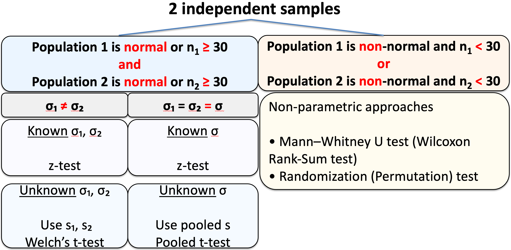

# {visibility="hidden"}

\def\bx{\mathbf{x}}
\def\bg{\mathbf{g}}
\def\bw{\mathbf{w}}
\def\bbeta{\boldsymbol \beta}
\def\bX{\mathbf{X}}
\def\by{\mathbf{y}}
\def\bH{\mathbf{H}}
\def\bI{\mathbf{I}}
\def\bS{\mathbf{S}}
\def\bW{\mathbf{W}}
\def\T{\text{T}}
\def\cov{\mathrm{Cov}}
\def\cor{\mathrm{Corr}}
\def\var{\mathrm{Var}}
\def\E{\mathrm{E}}
\def\bmu{\boldsymbol \mu}
\DeclareMathOperator*{\argmin}{arg\,min}
\def\Trace{\text{Trace}}


```{r}
#| label: pkg
#| include: false
#| eval: true
library(openintro)
library(knitr)
options(digits = 2)
```

<!-- begin: webr fodder -->



<!-- end: webr fodder -->


<!-- # [Hypothesis Testing]{.orange}{background-image="https://upload.wikimedia.org/wikipedia/commons/4/42/William_Sealy_Gosset.jpg" background-size="cover" background-position="50% 50%" background-color="#447099"} -->

# Comparing Two Population Means

- ### Dependent Samples (Matched Pairs)
- ### Independent Samples


## Why Comparing Two Populations

- Often faced with a comparison of parameters from different populations.

  + <span style="color:blue"> Comparing the _mean_ annual income for _Male_ and _Female_ groups. </span>
  
  + <span style="color:blue"> Testing if a diet used for losing weight is effective from _Placebo_ and _New Diet_ samples. </span>

. . .

- If these two samples are drawn from populations with means $\mu_1$ and $\mu_2$ respectively,
<span style="color:blue"> $$\begin{align} 
  &H_0: \mu_1 = \mu_2 \\ 
  &H_1: \mu_1 > \mu_2 
  \end{align}$$ </span>
  + $\mu_1$: *male* mean annual income; $\mu_2$: *female* mean annual income 
  + $\mu_1$: mean weight loss from the *New Diet* group; $\mu_2$: mean weight loss from the *Placebo* group


::: notes
- Often we are faced with an inference involving a comparison of parameters from different populations.

  + <span style="color:blue"> Comparing the mean annual income for male and female groups. </span>
  
  + <span style="color:blue"> Testing if a diet used for losing weight is effective from Placebo samples and New Diet samples. </span>

- If these two samples are drawn from populations with means $\mu_1$ and $\mu_2$ respectively, then the testing problem can be formulated as
<span style="color:blue"> $$\begin{align} 
  &H_0: \mu_1 = \mu_2 \\ 
  &H_1: \mu_1 > \mu_2 
  \end{align}$$ </span>
  + $\mu_1$: male mean annual income; $\mu_2$: female mean annual income 
  + $\mu_1$: weight loss from the New Diet group; $\mu_2$: weight loss from the Placebo group
  
:::

## Dependent and Independent Samples

- The two samples can be *independent* or *dependent*.


:::: columns

::: {.column width="70%"}

Two samples are **dependent** or **matched pairs** if the sample values are matched, where *the matching is based on some inherent relationship*.

  + <span style="color:blue"> Height data of fathers and daughters. The height of each dad is **matched** with the height of his daughter. </span>
  
  + <span style="color:blue"> Weights of subjects measure before and after some diet treatment. The subjects are the **same before and after measurements**. </span>

:::

::: {.column width="30%"}

```{r}

```

:::

::::


::: notes
- The statistical methods are different for these two types of samples.
:::


## Dependent Samples (Matched Pairs)

- Subject 1 may refer to 
  + the *first matched pair* (dad-daughter)
  + the *same* person with two measurements (before and after)

:::: columns

::: {.column width="70%"}

::: center

| Subject  |  (Dad) Before |  (Daughter) After 
| :--------------: | :-----------------: | :------------------:
| 1 | $x_{b1}$ | $x_{a1}$
| 2 | $x_{b2}$ | $x_{a2}$
| 3 | $x_{b3}$ | $x_{a3}$
| $\vdots$ | $\vdots$ |  $\vdots$ 
| $n$ | $x_{bn}$ | $x_{an}$

:::

:::

::: {.column width="30%"}

```{r}
knitr::include_graphics("./images/11-infer-two-means/weight.jpeg")
```

:::

::::


::: notes
- Subject 1 dad is 7 feet tall, subject 2 is 5 feet fall
- Subject 1 has weight 200 pounds, subject 2 weight 100 pounds
- It makes more sense to tie the two samples together
:::


## Independent Samples

:::: columns

::: {.column width="80%"}

Two samples are **independent** if the sample values from one population are *not related to* the sample values from the other.

  + <span style="color:blue"> Salary samples of men and women. Two samples are drawn independently from the male and female groups. </span>
  
:::


::: {.column width="20%"}

```{r}
knitr::include_graphics("./images/11-infer-two-means/male_female.jpeg")
```

:::

::::


- Subject 1 of Group 1 has nothing to do with the subject 1 of Group 2.

::: midi

|Subject of Group 1 (Male)  | Measurement of Group 1   | Subject of Group 2 (Female) |  Measurement of Group 2 
| :-----------------: | :------------------: | :------------------: | :------------------:
| 1 | $x_{11}$ |  1  | $x_{21}$
| 2 | $x_{12}$ |  2  | $x_{22}$
| 3 | $x_{13}$ |  3  | $x_{23}$
| $\vdots$ | $\vdots$ | $\vdots$ | $\vdots$
| $n_1$ | $x_{1n_1}$ | $\vdots$ | $\vdots$
|  |  |  $n_2$ | $x_{2n_2}$

:::


## Inference from Two Samples

<!-- - We start with the inference methods for independent samples. -->

<!-- - Remember, the inference methods include estimation and hypothesis testing, and we start with hypothesis testing.-->

<!-- - To do inference for independent two samples, we start with the sampling distribution of $\$ -->
- The statistical methods are different for these two types of samples.

. . .

- **Good news**: The concepts of CI and HT for one population can be applied to two-population cases.

. . .

- **$\text{CI = point estimate} \pm \text{margin of error (E)}$**, e.g., $\overline{x} \pm t_{\alpha/2, n-1} \frac{s}{\sqrt{n}}$

- Margin of error = critical value $\times$ standard error of the point estimator

. . .

- The 6 testing steps are the same, and both critical value and $p$-value method can be applied too, e.g., $t_{test} = \frac{\overline{x} - \mu_0}{s/\sqrt{n}}$


::: notes

- To compare two populations from two samples, we will learn and find

  + the point estimate for the parameter we are interested and its standard error
  
  + which critical value and test statistic should be used in which cases

:::


# [Inferences About Two Means: Dependent Samples (Matched Pairs)]{.orange}{background-image="./images/11-infer-two-means/nebulae.jpg" background-size="cover" background-position="50% 50%" background-color="#447099"}


## Hypothesis Testing for Dependent Samples

::: alert
To analyze a **paired** data set, simply analyze the differences! 
:::


:::: columns

::: {.column width="60%"}

| Subject  |  $x_1$  | $x_2$ | **Difference $d = x_1 - x_2$** 
| :------------: | :--------------: | :--------------: | :-------------------------:
| 1 | $x_{11}$ | $x_{21}$ | $\color{red}{d_1}$
| 2 | $x_{12}$ | $x_{22}$ | $\color{red}{d_2}$
| 3 | $x_{13}$ | $x_{23}$ | $\color{red}{d_3}$
| $\vdots$ | $\vdots$ |  $\vdots$ | $\color{red}{\vdots}$
| $n$ | $x_{1n}$ | $x_{2n}$ | $\color{red}{d_n}$

:::


::: {.column width="40%"}

- $\mu_d = \mu_1 - \mu_2$

- <span style="color:blue"> $\begin{align} & H_0: \mu_1 - \mu_2 = 0 \iff \mu_d = 0 \\ & H_1: \mu_1 - \mu_2 > 0 \iff \mu_d > 0 \\ & H_1: \mu_1 - \mu_2 < 0 \iff \mu_d < 0  \\ & H_1: \mu_1 - \mu_2 \ne 0 \iff \mu_d \ne 0 \end{align}$ </span>

:::

::::

<br>


::: alert
The point estimate of $\mu_1 - \mu_2$ is $\overline{x}_1 - \overline{x}_2 = \overline{d}$.
:::


::: notes
- Transform two samples into _one sample_ by taking the difference between paired measurements.
:::


## Inference for Paired Data

- Requirements: the sample differences $\color{blue}{d_i}$s are
  + random sample
  + from a normal distribution and/or $n > 30$ (tested by QQ-plot of $d_i$s)
  
- Follow the same procedure as the **one-sample $t$-test**!

- The **test statistic** is 
$\color{blue}{t_{test} = \frac{\overline{d}-0}{s_d/\sqrt{n}}} \sim T_{n-1}$ under $H_0$ where $\overline{d}$ and $s_d$ are the mean and SD of the difference samples $(d_1, d_2, \dots, d_n)$.

- The **critical value** $t_{\alpha, n-1}$ and $t_{\alpha/2, n-1}$.

. . .

Paired $t$-test| Test Statistic  | Confidence Interval for $\mu_d = \mu_1 - \mu_2$
---------------- | --------------- | --------------------------------------
$\sigma_d$ is unknown | $\large t_{test} = \frac{\overline{d}}{s_d/\sqrt{n}}$ | $\large \overline{d} \pm t_{\alpha/2, n-1} \frac{s_d}{\sqrt{n}}$

- The test from matched pairs is called a **paired $t$-test**.

::: notes

<!-- - Use $df = n-1$ to get the $p$-value, critical value and CI. -->
(Yes, the same as one-sample $t$-test)

:::


## Example

- Consider a capsule used to reduce blood pressure (BP) for the hypertensive individuals. Sample of 10 hypertensive individuals take the medicine for 4 weeks.

- Does the data provide sufficient evidence that the treatment is effective in reducing BP?

:::: columns

::: {.column width="70%"}

::: midi
| Subject  | Before $(x_b)$  | After $(x_a)$ | **Difference $d = x_b - x_a$** 
| :--------------: | :-----------------: | :------------------: | :-----------------------:
| 1 | 143 | 124 | 19
| 2 | 153 | 129 | 24
| 3 | 142 | 131 | 11
| 4 | 139 | 145 | -6
| 5 | 172 | 152 | 20
| 6 | 176 | 150 | 26
| 7 | 155 | 125 | 30
| 8 | 149 | 142 | 7
| 9 | 140 | 145 | -5
| 10 | 169| 160 | 9
:::

:::


::: {.column width="30%"}

```{r}
#| out-width: 80%

```

:::

::::


## Example Cont'd

- $\overline{d} = 13.5$, $s_d= 12.48$.

- $\mu_1 =$ Mean Before, $\mu_2 =$ Mean After, and $\mu_d = \mu_1 - \mu_2$.

. . .

- Step 1: <span style="color:blue"> $\begin{align} &H_0: \mu_1 = \mu_2 \iff \mu_d = 0\\ &H_1: \mu_1 > \mu_2 \iff \mu_d > 0 \end{align}$ </span>

. . .

- Step 2:  <span style="color:blue"> $\alpha = 0.05$ </span>

. . .

- Step 3: <span style="color:blue"> $t_{test} = \frac{\overline{d}}{s_d/\sqrt{n}} = \frac{13.5}{12.48/\sqrt{10}} = 3.42$ </span>

. . .

- Step 4-c:  <span style="color:blue"> $t_{\alpha, n-1} = t_{0.05, 9} = 1.833$.</span>

. . .

- Step 5-c:  <span style="color:blue"> Since $\small t_{test} = 3.42 > 1.833  = t_{\alpha, n-1}$, we reject $H_0$.</span>

<!-- > - Step 4-p:  <span style="color:blue"> The $p$-value is $P(T < t_{test}) \approx 0$ </span> -->

<!-- > - Step 5-p:  <span style="color:blue"> We reject $H_0$ if $p$-value < $\alpha$. Since $p$-value $\approx 0 < 0.05  = \alpha$, we reject $H_0$.</span> -->

. . .

- Step 6:  <span style="color:blue"> **There is sufficient evidence to support the claim that the drug is effective in reducing blood pressure.** </span>


::: notes
We reject $H_0$ if $\small t_{test} > t_{\alpha, n-1}$.
:::


##

```{r}
par(mar = c(1, 0, 1, 0), mfrow = c(1, 1))
x <- seq(-4, 4, length=1000)
alpha <- 0.05
x_bar <- 13.5
s <- 12.48
n <- 10
mu_0 <- 0
hx <- dt(x, df = n-1)

cri_val <- qt(alpha, df = n-1, lower.tail = FALSE)
plot(x, hx, type="l", lty=1, xlab="", axes = FALSE,ylim= c(-0.02, 0.4),
  ylab="", main="Right-tailed test")
axis(1, labels = FALSE,  tck = -0.01)
i <- x > cri_val
t_test <- (x_bar - mu_0) / (s / sqrt(n))
i_test <- x > t_test
# lines(x, hx)
# polygon(c(cri_val, x[i]), c(0, hx[i]), col="red", border = NA)
polygon(c(x[i_test], t_test), c(hx[i_test], 0), col=4, border = NA,
        density = 30, angle = -45, lwd = 0.7)
polygon(c(x[i], cri_val), c(hx[i], 0), col="red", border = NA,
        density = 30, angle = 45, lwd = 0.5)

text(t_test, -0.02, paste0(round(t_test, 2)), cex = 1.3, col = "#003366")
text(cri_val,-0.02, paste0(round(cri_val, 2)), cex = 1.3, col = "red")
text(3.2, 0.06, paste0("p-value=", round(pt(t_test, n-1, lower.tail = FALSE), 4)), cex = 1.3, col = "#003366")
text(1.2, 0.05, paste0("alpha=",alpha), cex = 1.3, col = "red")
# arrows(-2.8, 0.08, x1 = -3.1, y1 = 0.02, length = 0.1, angle = 20)
segments(0, 0, 0, dt(0, df = n-1), lty = 2, lwd = 0.5)
text(0,-0.02, 0, 
     col = "blue", cex = 1.5)
```

## Example Cont'd

- The 95% CI for $\mu_d = \mu_1 - \mu_2$ is $$\begin{align}\overline{d} \pm t_{\alpha/2, df} \frac{s_d}{\sqrt{n}} &= 13.5 \pm t_{0.025, 9}\frac{12.48}{\sqrt{10}}\\ &= 13.5 \pm 8.927 \\ &= (4.573, 22.427).\end{align}$$

- 95% confident that the *mean difference* in blood pressure is between 4.57 and 22.43. 

- Since the interval *does NOT include 0*, it leads to the same conclusion as rejection of $H_0$.


## Two-Sample Paired Test in R

:::: columns

::: {.column width="50%"}

::: midi
```{r}
#| echo: !expr c(-1)
load("./data/pair_data.RDS")
pair_data
```
:::

<br>

```{r}
#| echo: true
(d <- pair_data$before - pair_data$after)
(d_bar <- mean(d))
```

:::

::: {.column width="50%"}

::: fragment

```{r}
#| echo: true
(s_d <- sd(d))
```


```{r}
#| echo: true

## t_test
(t_test <- d_bar/(s_d/sqrt(length(d))))
```

```{r}
#| echo: true
## t_cv
qt(p = 0.95, df = length(d) - 1)
```

```{r}
#| echo: true
## p_value
pt(q = t_test, df = length(d) - 1, 
   lower.tail = FALSE)
```

:::

:::

::::


## Two-Sample Paired Test in R

```{r}
#| echo: true

## CI
d_bar + c(-1, 1) * qt(p = 0.975, df = length(d) - 1) * (s_d / sqrt(length(d))) 
```

. . .

::: midi

<br>


```{r}
#| echo: true
#| highlight.output: c(5, 6)
## t.test() function
t.test(x = pair_data$before, y = pair_data$after, alternative = "greater", mu = 0, paired = TRUE)
```

:::

. . .

- Be careful about the **one-sided** CI!


# [Inferences About Two Means: Independent Samples]{.orange}{background-image="./images/11-infer-two-means/dice1.jpg" background-size="cover" background-position="50% 50%" background-color="#447099"}


## Compare Population Means: Independent Samples

- Whether stem cells can improve heart function.

- The relationship between pregnant womens' smoking habits and newborns' weights.

- Whether one variation of an exam is harder than another variation.


:::: columns

::: {.column width="55%"}

```{r}
set.seed(1234)
a_sample <- rnorm(30, 80, 14)
a_sample[a_sample > 100] <- 100
a_sample <- round(a_sample)
b_sample <- rnorm(27, 74, 20)
b_sample[b_sample > 100] <- 100
b_sample <- round(b_sample)
library(ggplot2)
df <- data.frame("score" = c(a_sample, b_sample), 
                 "version" = c(rep("A", 30), rep("B", 27)))
bp <- ggplot(df, aes(x=version, y=score, fill = version)) + 
  geom_boxplot()
bp + theme_classic() + coord_flip()
```

:::


::: {.column width="45%"}

```{r}

```

:::

::::


## 

::: midi
```{r}
#| out-width: 100%

```
:::


## Testing for Independent Samples $(\sigma_1 \ne \sigma_2)$

- Requirements:
  
  + The two samples are *independent*.
  
  + Both samples are a *random sample*.
  
  + $n_1 > 30$, $n_2 > 30$ and/or both samples are from a *normally* distributed population.

- Interested in whether the two population means **$\mu_1$ and $\mu_2$ are equal or not**, or one is larger than the other. 

- $H_0: \mu_1 = \mu_2$

- It is equivalent to testing if **their difference is zero**. 

- $H_0: \mu_1 - \mu_2 = 0$

<!-- - We start with finding a point estimate for $\mu_1 - \mu_2$.  -->
::: question
We start with finding a point estimate for $\mu_1 - \mu_2$. What is the best point estimator for $\mu_1 - \mu_2$?
:::

. . .

$\overline{X}_1 - \overline{X}_2$ is the **best point estimator** for $\mu_1 - \mu_2$!


::: notes

The difference between the sample means ** $\overline{X}_1 - \overline{X}_2$ is the best point estimator for $\mu_1 - \mu_2$ **!

:::


## Sampling Distribution of $\overline{X}_1 - \overline{X}_2$

If the two samples are from *independent normally* distributed populations or $n_1 > 30$ and $n_2 > 30$,
$$\small \overline{X}_1 \sim N\left(\mu_1, \frac{\sigma_1^2}{n_1} \right), \quad \overline{X}_2 \sim N\left(\mu_2, 
\frac{\sigma_2^2}{n_2} \right)$$

. . .

$\overline{X}_1 - \overline{X}_2$ has the sampling distribution 
$$\small \overline{X}_1 - \overline{X}_2 \sim N\left(\mu_1 - \mu_2, \frac{\sigma_1^2}{n_1} {\color{red}{+}} \frac{\sigma_2^2}{n_2} \right) $$

. . .

$$\small Z = \frac{(\overline{X}_1 - \overline{X}_2) - (\mu_1 - \mu_2)}{\sqrt{\frac{\sigma_1^2}{n_1} + \frac{\sigma_2^2}{n_2}}} \sim N(0, 1)$$


## Test Statistic for Independent Samples $(\sigma_1 \ne \sigma_2)$

- With $D_0$ a hypothesized value (often 0),

  + <span style="color:blue"> $\small \begin{align} &H_0: \mu_1 - \mu_2 \le D_0\\ &H_1: \mu_1 - \mu_2 > D_0 \end{align}$ </span> (right-tailed)

  + <span style="color:blue"> $\small \begin{align} &H_0: \mu_1 - \mu_2 \ge D_0\\ &H_1: \mu_1 - \mu_2 < D_0 \end{align}$ </span> (left-tailed)
  
  + <span style="color:blue"> $\small \begin{align} &H_0: \mu_1 - \mu_2 = D_0\\ &H_1: \mu_1 - \mu_2 \ne D_0 \end{align}$ </span> (two-tailed)
  
- If $\sigma_1$ and $\sigma_2$ are **known**, the **test statistic** is the z-score of $\small \overline{X}_1 - \overline{X}_2$ under $H_0$: $$z_{test} = \frac{(\overline{x}_1 - \overline{x}_2) - (\mu_1 - \mu_2)}{\sqrt{\frac{\sigma_1^2}{n_1} + \frac{\sigma_2^2}{n_2}}} = \frac{(\overline{x}_1 - \overline{x}_2) - \color{blue}{D_0}}{\sqrt{\frac{\sigma_1^2}{n_1} + \frac{\sigma_2^2}{n_2}}} $$

- Then find $z_{\alpha}$ or $z_{\alpha/2}$ and follow our testing steps!


## Test Statistic for Independent Samples $(\sigma_1 \ne \sigma_2)$

- If $\sigma_1$ and $\sigma_2$ are **unknown**, the test statistic becomes $t_{test}$:

$$t_{test} = \frac{(\overline{x}_1 - \overline{x}_2) - (\mu_1 - \mu_2)}{\sqrt{\frac{\color{red}{s_1^2}}{n_1} + \frac{\color{red}{s_2^2}}{n_2}}} = \frac{(\overline{x}_1 - \overline{x}_2) - \color{blue}{D_0}}{\sqrt{\frac{\color{red}{s_1^2}}{n_1} + \frac{\color{red}{s_2^2}}{n_2}}} $$

<!-- If $\sigma_1$ and $\sigma_2$ are **known** -->

. . .

- The **critical value** $t_{\alpha, df}$ (one-tailed) and $t_{\alpha/2, df}$ (two-tailed), and the $t$ distribution used to compute the **$p$-value** has the degrees of freedom
$$\small df = \dfrac{(A+B)^2}{\dfrac{A^2}{n_1-1}+ \dfrac{B^2}{n_2-1}},$$ where $\small A = \dfrac{s_1^2}{n_1}$ and $\small B = \dfrac{s_2^2}{n_2}$.

<!-- $$ df = \frac{(n_1-1)(n_2-1)}{(1-c)^2(n_1-1)+c^2(n_2-1)},$$ where $c = \frac{\frac{s_1^2}{n_1}}{\frac{s_1^2}{n_1} + \frac{s_2^2}{n_2}}$. -->

- If the $df$ is not an integer, we round it down to an integer.
<!-- > - <span style="color:blue"> No need to memorize it. No need to know why this ugly value. Just use it! </span> -->


::: notes
similar to the one sample case,
:::


## Inference from Independent Samples $(\sigma_1 \ne \sigma_2)$

$\large \color{red}{\sigma_1 \ne \sigma_2}$       | Test Statistic  | Confidence Interval for $\mu_1 - \mu_2$
--------- | ------------ | ------------------
known   | $\large z_{test} = \frac{(\overline{x}_1 - \overline{x}_2) - \color{blue}{D_0}}{\sqrt{\frac{\sigma_1^2}{n_1} + \frac{\sigma_2^2}{n_2}}}$    |  $\large (\overline{x}_1 - \overline{x}_2) \pm z_{\alpha/2} \sqrt{\frac{\sigma_1^2}{n_1} + \frac{\sigma_2^2}{n_2}}$
unknown | $\large t_{test} = \frac{(\overline{x}_1 - \overline{x}_2) - \color{blue}{D_0}}{\sqrt{\frac{\color{red}{s_1^2}}{n_1} + \frac{\color{red}{s_2^2}}{n_2}}}$ | $\large (\overline{x}_1 - \overline{x}_2) \pm t_{\alpha/2, df} \sqrt{\frac{\color{red}{s_1^2}}{n_1} + \frac{\color{red}{s_2^2}}{n_2}}$

<!-- - use $df = \frac{(n_1-1)(n_2-1)}{(1-c)^2(n_1-1)+c^2(n_2-1)}$ where $c = \frac{\frac{s_1^2}{n_1}}{\frac{s_1^2}{n_1} + \frac{s_2^2}{n_2}}$ to get the $p$-value, critical value, and CI. -->

- Use $\small df = \dfrac{(A+B)^2}{\dfrac{A^2}{n_1-1}+ \dfrac{B^2}{n_2-1}},$ where $\small A = \dfrac{s_1^2}{n_1}$ and $\small B = \dfrac{s_2^2}{n_2}$ to get the $p$-value, critical value, and CI.

- The unequal-variance t-test is called **Welch's t-test**.


## Example: Two-Sample t-Test


:::: columns

::: {.column width="75%"}

Does an oversized tennis racket exert less stress/force on the elbow? The data show

  + **Oversized**: $n_1 = 33$, $\overline{x}_1 = 25.2$, $s_1 = 8.6$
  
  + **Conventional**: $n_2 = 12$, $\overline{x}_2 = 33.9$, $s_2 = 17.4$

- The two populations are nearly normal. 
- The large difference in the sample SD suggests $\sigma_1 \ne \sigma_2$. 
- Form a hypothesis test with $\alpha = 0.05$ and construct a 95% CI for the mean difference of force on the elbow.

:::

::: {.column width="25%"}

```{r, out.width="90%", echo=FALSE}

```

:::

::::

- Step 1: <span style="color:blue"> $\begin{align} &H_0: \mu_1 = \mu_2 \\ &H_1: \mu_1 < \mu_2 \end{align}$ </span>

. . .

- Step 2: <span style="color:blue"> $\alpha = 0.05$ </span>


## Example: Two-Sample t-Test Cont'd

- Step 3: <span style="color:blue"> $t_{test} = \frac{(\overline{x}_1 - \overline{x}_2) - (\mu_1-\mu_2)}{\sqrt{\frac{\color{red}{s_1^2}}{n_1} + \frac{\color{red}{s_2^2}}{n_2}}} = \frac{(25.2 - 33.9) - 0}{\sqrt{\frac{\color{red}{8.6^2}}{33} + \frac{\color{red}{17.4^2}}{12}}} = -1.66$</span>

. . .

<!-- - $\small df = \dfrac{(A+B)^2}{\dfrac{A^2}{n_1-1}+ \dfrac{B^2}{n_2-1}},$ $\small A = \dfrac{s_1^2}{n_1}$ and $\small B = \dfrac{s_2^2}{n_2}$ -->

<!-- - $\small A = \dfrac{8.6^2}{33}$, $\small B = \dfrac{17.4^2}{12}$, $\small df = \dfrac{(A+B)^2}{\dfrac{A^2}{33-1}+ \dfrac{B^2}{12-1}} = 13.01$ -->

<!-- - $\small c = \frac{\frac{8.6^2}{33}}{\frac{8.6^2}{33} + \frac{17.4^2}{12}} = 0.0816$, $\small df = \frac{(33-1)(12-1)}{(1-0.0816)^2(33-1)+0.0816^2(12-1)} =13.01$ -->

$\small A = \dfrac{8.6^2}{33}$, $\small B = \dfrac{17.4^2}{12}$, $\small df = \dfrac{(A+B)^2}{\dfrac{A^2}{33-1}+ \dfrac{B^2}{12-1}} = 13.01$

::: alert
If the computed value of $df$ is not an integer, always **round down** to the nearest integer.
:::

. . .

- Step 4-c:  <span style="color:blue"> $-t_{0.05, 13} = -1.77$. </span>

- Step 5-c:  <span style="color:blue"> We reject $H_0$ if $\small t_{test} < -t_{\alpha, df}$. $\small t_{test} = -1.66 > -1.77 = -t_{\alpha, df}$, we fail to reject $H_0$. </span>

- Step 6:  <span style="color:blue"> **There is insufficient evidence to support the claim that the oversized racket delivers less stress to the elbow**. </span>


## Example: Two-Sample t-Test Cont'd

- The 95% CI for $\mu_1 - \mu_2$ is

$$\begin{align}(\overline{x}_1 - \overline{x}_2) \pm t_{\alpha/2, df} \sqrt{\frac{\color{red}{s_1^2}}{n_1} + \frac{\color{red}{s_2^2}}{n_2}} &= (25.2 - 33.9) \pm t_{0.025,13}\sqrt{\frac{8.6^2}{33} + \frac{17.4^2}{12}}\\&= -8.7 \pm 11.32 = (-20.02, 2.62).\end{align}$$ 

- We are 95% confident that the difference in the mean forces is between -20.02 and 2.62.

- Since the interval includes 0, it leads to the same conclusion as failing to reject $H_0$.


## Two-Sample t-Test in R

```{r}
#| echo: true
n1 = 33; x1_bar = 25.2; s1 = 8.6
n2 = 12; x2_bar = 33.9; s2 = 17.4
A <- s1^2 / n1; B <- s2^2 / n2
df <- (A + B)^2 / (A^2/(n1-1) + B^2/(n2-1))
(df <- floor(df))
## t_test
(t_test <- (x1_bar - x2_bar) / sqrt(s1^2/n1 + s2^2/n2))
## t_cv
qt(p = 0.05, df = df)
## p_value
pt(q = t_test, df = df)
```


## Test Statistic for Independent Samples $(\sigma_1 = \sigma_2 = \sigma)$

- If $\sigma_1$ and $\sigma_2$ are **known**,

$$z_{test} = \frac{(\overline{x}_1 - \overline{x}_2) - (\mu_1 - \mu_2)}{\sigma\sqrt{\frac{1}{n_1} + \frac{1}{n_2}}} = \frac{(\overline{x}_1 - \overline{x}_2) - \color{blue}{D_0}}{\sigma\sqrt{\frac{1}{n_1} + \frac{1}{n_2}}} $$

. . .

- If $\sigma_1$ and $\sigma_2$ are **unknown**, similar to the one sample case, we use $t_{test}$. 

- As $\sigma_1 = \sigma_2 = \sigma$, we don't need two but **one** sample SD to replace the $\sigma$.

- Use the **pooled sample variance** to estimate the common $\sigma^2$:

$$ s_p^2 = \frac{(n_1-1)s_1^2 + (n_2-1)s_2^2}{n_1+n_2-2} $$ which is the *weighted average* of $s_1^2$ and $s_2^2$.


::: notes
- But not so similar to the equal-variance case.
:::


## Test Statistic for Independent Samples $(\sigma_1 = \sigma_2 = \sigma)$

- If $\sigma_1$ and $\sigma_2$ are **unknown**,
$$t_{test} = \frac{(\overline{x}_1 - \overline{x}_2) - (\mu_1 - \mu_2)}{ {\color{red}{s_p}}\sqrt{\frac{1}{n_1} + \frac{1}{n_2}}} = \frac{(\overline{x}_1 - \overline{x}_2) - \color{blue}{D_0}}{{\color{red}{s_p}}\sqrt{\frac{1}{n_1} + \frac{1}{n_2}}}$$

- Here, the **critical value** $t_{\alpha, df}$ (for one-tailed tests) and $t_{\alpha/2, df}$ (for two-tailed tests), and the $t$ distribution used to compute the **$p$-value** have the degrees of freedom
$$df = n_1 + n_2 - 2$$


## Inference from Independent Samples $(\sigma_1 = \sigma_2 = \sigma)$

$\large \color{red}{\sigma_1 = \sigma_2}$       | Test Statistic  | Confidence Interval for $\mu_1 - \mu_2$
-------- | ------------- | ------------------
known   | $\large z_{test} = \frac{(\overline{x}_1 - \overline{x}_2) - \color{blue}{D_0}}{\sigma\sqrt{\frac{1}{n_1} + \frac{1}{n_2}}}$    |  $\large (\overline{x}_1 - \overline{x}_2) \pm z_{\alpha/2} \sigma \sqrt{\frac{1}{n_1} + \frac{1}{n_2}}$
unknown | $\large t_{test} = \frac{(\overline{x}_1 - \overline{x}_2) - \color{blue}{D_0}}{{\color{red}{s_p}}\sqrt{\frac{1}{n_1} + \frac{1}{n_2}}}$ | $\large (\overline{x}_1 - \overline{x}_2) \pm t_{\alpha/2, df} {\color{red}{s_p}}\sqrt{\frac{1}{n_1} + \frac{1}{n_2}}$

- $s_p = \sqrt{\frac{(n_1-1)s_1^2 + (n_2-1)s_2^2}{n_1+n_2-2}}$

- Use $df = n_1+n_2-2$ get the $p$-value, critical value and CI.

- The test from two independent samples with $\sigma_1 = \sigma_2  = \sigma$ is usually called **two-sample pooled $z$-test** or **two-sample pooled $t$-test**.


## Example: Weight Loss

:::: columns

::: {.column width="80%"}

A study was conducted to see the effectiveness of a weight loss program.

- Two groups (Control and Experimental) of 10 subjects were selected.

- The two populations are normally distributed and have the same SD.

:::

::: {.column width="20%"}
```{r}
knitr::include_graphics("./images/11-infer-two-means/weight.jpeg")
```
:::

::::

- The data on weight loss was collected at the end of six months
  + **Control**: $n_1 = 10$, $\overline{x}_1 = 2.1\, lb$, $s_1 = 0.5\, lb$
  + **Experimental**: $n_2 = 10$, $\overline{x}_2 = 4.2\, lb$, $s_2 = 0.7\, lb$
  
- Is there a sufficient evidence at $\alpha = 0.05$ to conclude that the program is effective?

- If yes, construct a 95% CI for $\mu_1 - \mu_2$ to show how much effective it is. 


::: notes

```{r, out.width="90%", echo=FALSE}
knitr::include_graphics("./images/11-infer-two-means/weight.jpeg")
```

:::

. . .

- Step 1: <span style="color:blue"> $\begin{align} &H_0: \mu_1 = \mu_2 \\ &H_1: \mu_1 < \mu_2 \end{align}$ </span>

. . .

- Step 2:  <span style="color:blue"> $\alpha = 0.05$ </span>


## Example Cont'd 

- Step 3: 
<span style="color:blue"> $t_{test} = \frac{(\overline{x}_1 - \overline{x}_2) - \color{blue}{D_0}}{{\color{red}{s_p}}\sqrt{\frac{1}{n_1} + \frac{1}{n_2}}}$. </span>

- $s_p = \sqrt{\frac{(n_1-1)s_1^2 + (n_2-1)s_2^2}{n_1+n_2-2}} = \sqrt{\frac{(10-1)0.5^2 + (10-1)0.7^2}{10+10-2}}=0.61$

- <span style="color:blue"> $t_{test} = \frac{(2.1 - 4.2) - 0}{0.6083\sqrt{\frac{1}{10} + \frac{1}{10}}} = -7.72$</span>


. . .

- Step 4-c:  <span style="color:blue"> $df = n_1 + n_2 - 2 = 10 + 10 - 2 = 18$. So $-t_{0.05, df = 18} = -1.734$. </span>

. . .

- Step 5-c:  <span style="color:blue"> We reject $H_0$ if $\small t_{test} < -t_{\alpha, df}$. Since $\small t_{test} = -7.72 < -1.73  = -t_{\alpha, df}$, we reject $H_0$.</span>

. . .

- Step 4-p:  <span style="color:blue"> The $p$-value is $P(T_{df=18} < t_{test}) \approx 0$ </span>

. . .

- Step 5-p:  <span style="color:blue"> We reject $H_0$ if $p$-value < $\alpha$. Since $p$-value $\approx 0 < 0.05  = \alpha$, we reject $H_0$.</span>

. . .

- Step 6:  <span style="color:blue"> **There is sufficient evidence to support the claim that the weight loss program is effective.** </span>

## Example Cont'd 

- The 95% CI for $\mu_1 - \mu_2$ is $$\begin{align}(\overline{x}_1 - \overline{x}_2) \pm t_{\alpha/2, df} {\color{red}{s_p}}\sqrt{\frac{1}{n_1} + \frac{1}{n_2}} &= (2.1 - 4.2) \pm t_{0.025, 18} (0.61)\sqrt{\frac{1}{10} + \frac{1}{10}}\\ &= -2.1 \pm 0.57 = (-2.67, -1.53) \end{align}$$

- We are 95% confident that the difference in the mean weight loss is between -2.67 and -1.53.

- Since the interval does not include 0, it leads to the same conclusion as rejection of $H_0$.


## Two-Sample Pooled t-Test in R

```{r}
#| echo: true
n1 = 10; x1_bar = 2.1; s1 = 0.5
n2 = 10; x2_bar = 4.2; s2 = 0.7
sp <- sqrt(((n1 - 1) * s1 ^ 2 + (n2 - 1) * s2 ^ 2) / (n1 + n2 - 2))
sp
df <- n1 + n2 - 2
## t_test
(t_test <- (x1_bar - x2_bar) / (sp * sqrt(1 / n1 + 1 / n2)))
## t_cv
qt(p = 0.05, df = df)
## p_value
pt(q = t_test, df = df)
```


