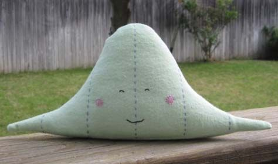

# {visibility="hidden"}

\def\bx{\mathbf{x}}
\def\bg{\mathbf{g}}
\def\bw{\mathbf{w}}
\def\bbeta{\boldsymbol \beta}
\def\bX{\mathbf{X}}
\def\by{\mathbf{y}}
\def\bH{\mathbf{H}}
\def\bI{\mathbf{I}}
\def\bS{\mathbf{S}}
\def\bW{\mathbf{W}}
\def\T{\text{T}}
\def\cov{\mathrm{Cov}}
\def\cor{\mathrm{Corr}}
\def\var{\mathrm{Var}}
\def\E{\mathrm{E}}
\def\bmu{\boldsymbol \mu}
\DeclareMathOperator*{\argmin}{arg\,min}
\def\Trace{\text{Trace}}


```{r}
#| label: pkg
#| include: false
#| eval: true
library(openintro)
library(knitr)
options(digits = 3)
chi_sq_upper_tail <- function(U, df, xlim = c(0, 10), col = fadeColor("black", "22"),
                               axes = TRUE, ...) {
    x <- c(0, seq(xlim[1], xlim[2] + 3, length.out = 300))
    y <- c(0, stats::dchisq(x[-1], df))
    graphics::plot(x, y, type = "l", axes = FALSE, xlim = xlim)
    graphics::abline(h = 0)
    if (axes) {
        axis(1)
    }
    these <- which(x >= U)
    X <- x[c(these[1], these, rev(these)[1])]
    Y <- c(0, y[these], 0)
    graphics::polygon(X, Y, col = col)
}
chi_sq_lower_tail <- function (L, df, xlim = c(0, 10), 
                               col = fadeColor("black", "22"),
                               axes = TRUE, ...) {
    x <- c(0, seq(xlim[1], xlim[2] + 3, length.out = 300))
    y <- c(0, stats::dchisq(x[-1], df))
    graphics::plot(x, y, type = "l", axes = FALSE, xlim = xlim)
    graphics::abline(h = 0)
    if (axes) {
        axis(1)
    }
    these <- which(x <= L)
    X <- x[c(these[1], these, rev(these)[1])]
    Y <- c(0, y[these], 0)
    graphics::polygon(X, Y, col = col)
}
chi_sq_two_tail <- function (U, L, df, xlim = c(0, 10), 
                             col = fadeColor("black", "22"), axes = TRUE, ...) {
    x <- c(0, seq(xlim[1], xlim[2] + 3, length.out = 300))
    y <- c(0, stats::dchisq(x[-1], df))
    graphics::plot(x, y, type = "l", axes = FALSE, xlim = xlim)
    graphics::abline(h = 0)
    if (axes) {
        axis(1)
    }
    these_U <- which(x >= U)
    X_U <- x[c(these_U[1], these_U, rev(these_U)[1])]
    Y_U <- c(0, y[these_U], 0)
    graphics::polygon(X_U, Y_U, col = col)
    these_L <- which(x <= L)
    X_L <- x[c(these_L[1], these_L, rev(these_L)[1])]
    Y_L <- c(0, y[these_L], 0)
    graphics::polygon(X_L, Y_L, col = col)
}
f_upper_tail <- function(U, df1, df2, xlim = c(0, 10), col = fadeColor("black", "22"),
                               axes = TRUE, ...) {
    x <- c(0, seq(xlim[1], xlim[2] + 3, length.out = 300))
    y <- c(0, stats::df(x[-1], df1, df2))
    graphics::plot(x, y, type = "l", axes = FALSE, xlim = xlim)
    graphics::abline(h = 0)
    if (axes) {
        axis(1)
    }
    these <- which(x >= U)
    X <- x[c(these[1], these, rev(these)[1])]
    Y <- c(0, y[these], 0)
    graphics::polygon(X, Y, col = col)
}
f_lower_tail <- function (L, df1, df2, xlim = c(0, 10), 
                               col = fadeColor("black", "22"),
                               axes = TRUE, ...) {
    x <- c(0, seq(xlim[1], xlim[2] + 3, length.out = 300))
    y <- c(0, stats::df(x[-1], df1, df2))
    graphics::plot(x, y, type = "l", axes = FALSE, xlim = xlim)
    graphics::abline(h = 0)
    if (axes) {
        axis(1)
    }
    these <- which(x <= L)
    X <- x[c(these[1], these, rev(these)[1])]
    Y <- c(0, y[these], 0)
    graphics::polygon(X, Y, col = col)
}
f_two_tail <- function (U, L, df1, df2, xlim = c(0, 10), 
                             col = fadeColor("black", "22"), axes = TRUE, ...) {
    x <- c(0, seq(xlim[1], xlim[2] + 3, length.out = 300))
    y <- c(0, stats::df(x[-1], df1, df2))
    graphics::plot(x, y, type = "l", axes = FALSE, xlim = xlim)
    graphics::abline(h = 0)
    if (axes) {
        axis(1)
    }
    these_U <- which(x >= U)
    X_U <- x[c(these_U[1], these_U, rev(these_U)[1])]
    Y_U <- c(0, y[these_U], 0)
    graphics::polygon(X_U, Y_U, col = col)
    these_L <- which(x <= L)
    X_L <- x[c(these_L[1], these_L, rev(these_L)[1])]
    Y_L <- c(0, y[these_L], 0)
    graphics::polygon(X_L, Y_L, col = col)
}
```

<!-- begin: webr fodder -->



<!-- end: webr fodder -->


<!-- # [Hypothesis Testing]{.orange}{background-image="https://upload.wikimedia.org/wikipedia/commons/4/42/William_Sealy_Gosset.jpg" background-size="cover" background-position="50% 50%" background-color="#447099"} -->

# Inference About Population Variances

- ### One Population Variance
- ### Comparing Two Population Variances


# [Inference for One Population Variance]{.orange}{background-image="./images/12-infer-variance/pearson_quote.jpg" background-size="cover" background-position="50% 50%" background-color="#447099"}


## Why Inference for Population Variances?

- We like to know if $\sigma_1 = \sigma_2$, so a correct or better method can be used. 

::: question
Which test we learned needs $\sigma_1 = \sigma_2$?
:::

. . .

::: center
In some situations, we care about *variation*!
:::


:::: columns

::: {.column width="50%"}

- <span style="color:blue"> the variation in potency of drugs</span>: *affects patients' health*

```{r}
#| out-width: 78%


```

:::

::: {.column width="50%"}

- <span style="color:blue"> the variance of stock prices </span>: *the higher the variance, the riskier the investment*

```{r}
#| out-width: 78%

```

:::

::::


::: notes

- When doing inference for population means, 
- We like to know if $\sigma_1 = \sigma_2$, so that a correct or better method can be used. For example, we use the pooled $t$-test if $\sigma_1 = \sigma_2$ or they are very close to each other for higher power.
- drug for lowering BP. We hope the same amount or dose level of the drug provide the same effect on each individual. We don't want some patients BP is lowered a lot, but some other patient's BP is lowered just a little bit. 
- We want the new treatment can provide consistent potency and efficacy for all patients.

:::


## Inference for Population Variances

- The sample variance $S^2 = \frac{\sum_{i=1}^n(X_i - \overline{X})^2}{n-1}$ is our **point estimator** for the population variance $\sigma^2$.
  <!-- + $S^2$ is an **unbiased estimator** for $\sigma^2$, i.e., $E(S^2) = \sigma^2$ -->

- The inference for $\sigma^2$ needs the population to be **normal**. 

::: alert
`r emo::ji('exclamation')` The methods can **work poorly if the normality is violated, even the sample is large**.
:::


```{r}
#| out-width: 40%

```


::: notes

- In some situations, we do care about variation. 
  + <span style="color:blue"> the variation in potency of drugs</span>: affects patients' health
  + <span style="color:blue"> the variance of stock prices </span>: the higher the variance, the riskier the investment

- Intuitively, the sample variance $S^2 = \frac{\sum_{i=1}^n(X_i - \overline{X})^2}{n-1}$ is our **point estimator** for the population variance $\sigma^2$.

- For a random sample of size $n$ drawn from a population with mean $\mu$ and variance $\sigma^2$, $S^2$ is an **unbiased estimator** for $\sigma^2$.

- In Chapter 7, we discuss inference methods for $\sigma^2$ when the population is assumed **normal**. **The methods discussed here can work poorly if normality is violated, even if the sample is large**.

:::

## Chi-Squared $\chi^2$ Distribution

The inference for $\sigma^2$ involves the $\chi^2$ distribution.

:::: columns

::: {.column width="30%"}

- Defined over *positive* numbers

- Parameter: degrees of freedom $df$

- *Right* skewed

- More symmetric as $df$ gets larger
<!-- - [Chi-Squared Distribution](https://homepage.divms.uiowa.edu/~mbognar/applets/chisq.html) -->
:::


::: {.column width="70%"}

```{r}
par(mgp = c(1, 0.4, 0))
par(mar = c(2, 2, 1, 0))
x <- seq(0, 40, length=1000)
df_vec <- c(3, 5, 10, 20)
hx <- dchisq(x, df = df_vec[1])
plot(x, hx, type="l", lty=1, xlab="x", axes = FALSE, col = 1, lwd = 2,
  ylab="Density", main= "Chi-Squared Distributions with different dfs")
axis(1)
axis(2, las = 2)
text(df_vec[1], max(dchisq(x, df = df_vec[1])), paste("df =", df_vec[1]), col = 1)
for (i in 2:length(df_vec)) {
  hx <- dchisq(x, df = df_vec[i])
  lines(x, hx, col = i, lwd = 2)
  text(df_vec[i]+2, max(dchisq(x, df = df_vec[i]))+0.01, 
       paste("df =", df_vec[i]), col = i)
}
```

:::

::::


<!-- ## Chi-Squared $\chi^2$ Distribution Applet -->

<!--  -->


## Upper Tail and Lower Tail of Chi-Square

<!-- - $\chi^2_{c,\, df}$ is the $\chi^2$ value of $\chi^2_{df}$ distribution that has area to the **right** of $c$. -->

- $\chi^2_{\frac{\alpha}{2},\, df}$ has area to the **right** of $\alpha/2$.

- $\chi^2_{1-\frac{\alpha}{2},\, df}$ has area to the **left** of $\alpha/2$.

- In $N(0, 1)$, $z_{1-\frac{\alpha}{2}} = -z_{\frac{\alpha}{2}}$. But $\chi^2_{1-\frac{\alpha}{2},\,df} \ne -\chi^2_{\frac{\alpha}{2},\,df}$ because of **non**-symmetry of the $\chi^2$ distribution.

```{r}
#| label: chi2-critical
par(mar = c(2, 0, 0, 0), mgp = c(2.1, 0.6, 0))
chi_sq_two_tail(U = 15, L = 2, df = 6, xlim = c(0, 20), col = 4, axes = FALSE)
axis(1, at = c(0, 2, 15), labels = c(0, expression(chi[1-frac(alpha, 2)]^2),
                                  expression(chi[frac(alpha, 2)]^2)), font = 3,
     cex.axis = 2, tick = FALSE)
text(5, 0.05, expression(1-alpha), cex = 3)
text(1, 0.02, expression(frac(alpha, 2)), cex = 2)
text(18, 0.02, expression(frac(alpha, 2)), cex = 2)
```


::: notes

- Define critical values $\chi_U^2$ and $\chi_L^2$.
- When constructing a CI with level $1-\alpha$, we put $1-\alpha$ in the middle and

:::


## Sampling Distribution 

- When a random sample of size $n$ is from $\color{red}{N(\mu, \sigma^2)}$, 
$$ \frac{(n-1)S^2}{\sigma^2} \sim \chi^2_{n-1} $$
<!-- - The sampling distribution is approximately normal for large sample sizes. -->

- The inference method for $\sigma^2$ introduced here can work poorly if the normality assumption is violated, even for large samples!

```{r}
#| ref.label: chi2-critical

```


## $(1-\alpha)100\%$ Confidence Interval for $\sigma^2$

:::: columns

::: {.column width="40%"}

$(1-\alpha)100\%$ CI for $\sigma^2$ is 
$$\color{blue}{\left( \frac{(n-1)S^2}{\chi^2_{\frac{\alpha}{2}, \, n-1}}, \frac{(n-1)S^2}{\chi^2_{1-\frac{\alpha}{2}, \, n-1}} \right)}$$ 

:::

::: {.column width="60%"}

```{r}
#| ref.label: chi2-critical

```

:::

::::

::: alert

`r emo::ji('exclamation')` The CI for $\sigma^2$ **cannot** be expressed as $(S^2-m, S^2+m)$ anymore!

:::


<!-- - $\chi_U^2$ is the upper-tail value of chi-square for $df = n-1$ with area $\alpha/2$ to its right. -->

<!-- - $\chi_L^2$ is the lower-tail value of chi-square for $df = n-1$ with area $\alpha/2$ to its left. -->


## Example: Supermodel Heights

:::: columns

::: {.column width="85%"}

Listed below are heights (cm) for the simple random sample of 16 female supermodels:
```{r, echo=TRUE}
heights <- c(178, 177, 176, 174, 175, 178, 175, 178, 
             178, 177, 180, 176, 180, 178, 180, 176)
```
- The supermodels' height is normally distributed.
- Construct a $95\%$ confidence interval for population standard deviation $\sigma$.

:::

::: {.column width="15%"}

```{r}

```

:::

::::

. . .

- $n = 16$, $s^2 = 3.4$, $\alpha = 0.05$.

- $\chi^2_{\alpha/2, n-1} = \chi^2_{0.025, 15} = 27.49$

- $\chi^2_{1-\alpha/2, n-1} = \chi^2_{0.975, 15} = 6.26$

. . .

- The $95\%$ CI for $\sigma$ is $\small \left( \sqrt{\frac{(n-1)s^2}{\chi^2_{\frac{\alpha}{2}, \, n-1}}}, \sqrt{\frac{(n-1)s^2}{\chi^2_{1-\frac{\alpha}{2}, \, n-1}}} \right) = \left( \sqrt{\frac{(16-1)(3.4)}{27.49}}, \sqrt{\frac{(16-1)(3.4)}{6.26}}\right) = (1.36, 2.85)$


## Example: Computation in R

```{r}
#| echo: true
n <- 16
s2 <- var(heights)
al <- 0.05

## two chi-square critical values
chi2_right <- qchisq(al / 2, df = n - 1, lower.tail = FALSE)
chi2_left <- qchisq(al / 2, df = n - 1, lower.tail = TRUE)

## two bounds of CI for sigma2
ci_lwr <- (n - 1) * s2 / chi2_right
ci_upr <- (n - 1) * s2 / chi2_left
```

<br>

```{r}
#| echo: true
## two bounds of CI for sigma
sqrt(ci_lwr)
sqrt(ci_upr)
```

## Example Cont'd: Testing

Use $\alpha = 0.05$ to test the claim that "*supermodels have heights with a standard deviation that is less than $\sigma = 7.5$ cm for the population of women*". 

. . .


- **Step 1**: $H_0: \sigma = \sigma_0$ vs. $H_1: \sigma < \sigma_0$. Here $\sigma_0 = 7.5$ cm

. . .

- **Step 2**: $\alpha = 0.05$

. . .

- **Step 3**: Under $H_0$, $\chi_{test}^2 = \frac{(n-1)s^2}{\sigma_0^2} = \frac{(16-1)(3.4)}{7.5^2} = 0.91$, a statistic drawn from $\chi^2_{n-1}$.

. . .

:::: columns

::: {.column width="50%"}

- **Step 4-c**: This is a left-tailed test. The critical value is $\chi_{1-\alpha, df}^2 = \chi_{0.95, 15}^2 = 7.26$
- **Step-5-c**: Reject $H_0$ in favor of $H_1$ if $\chi_{test}^2 < \chi_{1-\alpha, df}^2$. Since $0.91 < 7.26$, we reject $H_0$.

:::

::: {.column width="50%"}

```{r}
#| out-width: 85%
par(mar = c(2, 0, 0, 0), mgp = c(1, 0.5, 0))

chi_sq_lower_tail <- function(L, df, xlim = c(0, 10), 
                               col = fadeColor("black", "22"),
                               axes = TRUE, ...) {
    x <- c(0, seq(xlim[1], xlim[2] + 3, length.out = 300))
    y <- c(0, stats::dchisq(x[-1], df))
    graphics::plot(x, y, type = "l", axes = FALSE, xlim = xlim, xlab = "")
    graphics::abline(h = 0)
    if (axes) {
        axis(1)
    }
    these <- which(x <= L)
    X <- x[c(these[1], these, rev(these)[1])]
    Y <- c(0, y[these], 0)
    graphics::polygon(X, Y, col = col)
}


chi_sq_lower_tail(L = 7.26, df = 15, xlim = c(0, 50), col = 4, axes = FALSE, lwd = 3)
# axis(1, at = c(2, 15), labels = c(expression(chi[1-frac(0.05, 2)]^2),
#                                   expression(chi[frac(0.05, 2)]^2)), font = 3,
#      cex.axis = 2, tick = FALSE)
axis(1, at = c(-0.6, 0.907, 7.26), labels = c(0, expression(chi[test]^2), expression(chi[1-0.05]^2)), font = 3, 
     cex.axis = 1.2, tick = TRUE)
# text(0.907, 0.001, expression(chi[test]^2), cex = 1)
text(5.5, 0.0025, expression(0.05), cex = 1.5)
text(22, 0.05, expression(chi[15]^2), cex = 4)
# text(0, 0, 0, cex = 1)
# text(18, 0.02, expression(frac(0.05, 2)), cex = 2)
```

:::

::::


## Example Cont'd: Testing


Use $\alpha = 0.05$ to test the claim that "*supermodels have heights with a standard deviation that is less than $\sigma = 7.5$ cm for the population of women*". 

- **Step 1**: $H_0: \sigma = \sigma_0$ vs. $H_1: \sigma < \sigma_0$. Here $\sigma_0 = 7.5$ cm

- **Step 2**: $\alpha = 0.05$

- **Step 3**: Under $H_0$, $\chi_{test}^2 = \frac{(n-1)s^2}{\sigma_0^2} = \frac{(16-1)(3.4)}{7.5^2} = 0.91$, a statistic drawn from $\chi^2_{n-1}$.


:::: columns

::: {.column width="50%"}

- **Step 6**: There is sufficient evidence to support the claim that supermodels have heights with a SD that is less than the SD for the population of women.

*Heights of supermodels vary less than heights of women in the general population.*

:::

::: {.column width="50%"}

```{r}
#| out-width: 85%
par(mar = c(2, 0, 0, 0), mgp = c(1, 0.5, 0))

chi_sq_lower_tail <- function(L, df, xlim = c(0, 10), 
                               col = fadeColor("black", "22"),
                               axes = TRUE, ...) {
    x <- c(0, seq(xlim[1], xlim[2] + 3, length.out = 300))
    y <- c(0, stats::dchisq(x[-1], df))
    graphics::plot(x, y, type = "l", axes = FALSE, xlim = xlim, xlab = "")
    graphics::abline(h = 0)
    if (axes) {
        axis(1)
    }
    these <- which(x <= L)
    X <- x[c(these[1], these, rev(these)[1])]
    Y <- c(0, y[these], 0)
    graphics::polygon(X, Y, col = col)
}


chi_sq_lower_tail(L = 7.26, df = 15, xlim = c(0, 50), col = 4, axes = FALSE, lwd = 3)
# axis(1, at = c(2, 15), labels = c(expression(chi[1-frac(0.05, 2)]^2),
#                                   expression(chi[frac(0.05, 2)]^2)), font = 3,
#      cex.axis = 2, tick = FALSE)
axis(1, at = c(-0.6, 0.907, 7.26), labels = c(0, expression(chi[test]^2), expression(chi[1-0.05]^2)), font = 3, 
     cex.axis = 1.2, tick = TRUE)
# text(0.907, 0.001, expression(chi[test]^2), cex = 1)
text(5.5, 0.0025, expression(0.05), cex = 1.5)
text(22, 0.05, expression(chi[15]^2), cex = 4)
# text(0, 0, 0, cex = 1)
# text(18, 0.02, expression(frac(0.05, 2)), cex = 2)
```

:::

::::


## Back to Pooled t-Test

In a pooled t-test, we assume

  + <span style="color:blue"> both samples are of large size or drawn from a normal population. </span>

  + <span style="color:blue"> $\sigma_1 = \sigma_2$ </span>

. . .

- Use QQ-plot (and normality tests, Anderson, Shapiro, etc) to check the assumption of normal distribution. 

- We learn to check the assumption $\sigma_1 = \sigma_2$.

::: notes
- Whenever we use t-statistics, there are assumptions. 
:::


# [Inference for Comparing Two Population Variances]{.orange}{background-image="./images/12-infer-variance/pearson_quote.jpg" background-size="cover" background-position="50% 50%" background-color="#447099"}

## F Distribution

<!-- - We use **$\chi^2$ distribution** for the inference about **one** population variance. -->

We use **$F$ distribution** for the inference about **two** population variances.

:::: columns

::: {.column width="30%"}

- Two parameters: $df_1$, $df_2$

- *Right* skewed

- Defined over *positive* numbers

<!-- - [F Distribution](https://homepage.divms.uiowa.edu/~mbognar/applets/f.html) -->
<!-- ] -->

:::

::: {.column width="70%"}

```{r}
#| out-width: 100%
par(mgp = c(1.5, 0.5, 0), mar = c(2.5, 2.5, 1, 0))
x <- seq(0, 3, length=1000)
df1_vec <- c(3, 100)
df2_vec <- c(5, 10, 100)
# hx <- df(x, df1 = df1_vec[1], df2 = df2_vec[1])
# plot(x, hx, type="l", lty=1, xlab="x", axes = FALSE, col = 1, lwd = 2, ylim = c(0, 2.2),
#   ylab="Density", main= "F Distribution with different df_1 and df_2")
# axis(1)
# axis(2, las = 2)
# f_mode <- ((df1_vec[1] - 2) / df1_vec[1]) * (df2_vec[1] / (df2_vec[1] + 2))
# text(f_mode, max(df(x, df1 = df1_vec[1], df2 = df2_vec[1])), 
#      paste("df1 =", df1_vec[1], "df2 =", df2_vec[1]), col = 1)
legend_text <- paste("df1 = ", df1_vec[1], ", df2 = ", df2_vec[1], sep = "")
col_idx <- c(1)
k <- 2
for (i in 1:length(df1_vec)) {
    for (j in 1:length(df2_vec)) {
        if (i == 1 && j == 1) {
            hx <- df(x, df1 = df1_vec[1], df2 = df2_vec[1])
            plot(x, hx, type="l", lty=1, xlab="x", axes = FALSE, col = 1, lwd = 3, ylim = c(0, 2.2),
                    ylab="Density", main= "F Distribution with different df_1 and df_2")
            axis(1)
            axis(2, las = 2)
            # legend_text <- c(legend_text, paste("df1 =", df1_vec[i], "df2 =", df2_vec[j]))
        } else {
            hx <- df(x, df1 = df1_vec[i], df2 = df2_vec[j])
            lines(x, hx, col = k, lwd = 3)
            legend_text <- c(legend_text, paste("df1 = ", df1_vec[i], ", df2 = ", df2_vec[j], sep = ""))
            col_idx <- c(col_idx, k)
        }
        k <- k + 1
        # f_mode <- ((df1_vec[i] - 2) / df1_vec[i]) * (df2_vec[j] / (df2_vec[j] + 2))
        # text(f_mode, max(df(x, df1 = df1_vec[i], df2 = df2_vec[j])) + 0.1,
        #      paste("df1 =", df1_vec[i], "df2 =", df2_vec[j]), col = k)
    }
    k <- k + 1
}
# print(k)
legend("topright", legend_text, lwd = rep(3, 6), col = col_idx, bty = "n")
```

:::

::::


<!-- ## F Distribution Applet -->


<!--  -->


## Upper and Lower Tail of F Distribution

- We denote $F_{\alpha, \, df_1, \, df_2}$ as the $F$ quantile so that $P(F_{df_1, df_2} > F_{\alpha, \, df_1, \, df_2}) = \alpha$.

```{r}
#| label: f-critical
par(mar = c(2, 0, 0, 0), mgp = c(2.1, 0.2, 0))
f_two_tail(U=2.5,L=0.3, df1=3, df2=100, xlim = c(0, 6), col = 4, axes = FALSE)
axis(1, at = c(0.3, 2.5), labels = c(expression(F[1-frac(alpha, 2)]),
                                     expression(F[frac(alpha, 2)])), 
     font = 3, cex.axis = 1.5,
     tick = FALSE)
text(1, 0.2, expression(1-alpha), cex = 2)
text(2.7, 0.05, expression(frac(alpha, 2)), cex = 1.5)
text(0.15, 0.05, expression(frac(alpha, 2)), cex = 1.5)
```


## Sampling Distribution

<!-- - If $U_1 \sim \chi^2_{n_1-1}$ and $U_2 \sim \chi^2_{n_2-1}$ and $U_1$ and $U_2$ are independent, the random variable $$X =  \frac{\frac{U_1}{n_1-1}}{\frac{U_2}{n_2-1}}$$ follows $F_{n_1-1, \, n_2-1}$ distribution. -->
 
- The random samples of size $n_1$ and $n_2$ are *independent* from two normal populations, $N(\mu_1, \sigma_1^2)$ and $N(\mu_2, \sigma_2^2)$.

- The ratio $$\frac{S_1^2/S_2^2}{\sigma_1^2/\sigma_2^2} \sim F_{n_1-1, \, n_2-1}$$


::: notes

<!-- .question[ -->
<!-- Can you show why? -->
<!-- ] -->
$$\frac{s_1^2/\sigma_1^2}{s_2^2/\sigma_2^2} = \frac{s_1^2/s_2^2}{\sigma_1^2/\sigma_2^2} \sim F_{n_1-1, \, n_2-1}$$

:::


## $(1-\alpha)100\%$ Confidence Interval for $\sigma_1^2 / \sigma_2^2$

:::: columns

::: {.column width="40%"}

$(1-\alpha)100\%$ CI for $\sigma_1^2 / \sigma_2^2$ is 
$$\color{blue}{\left( \frac{s_1^2/s_2^2}{F_{\alpha/2, \, n_1 - 1, \, n_2 - 1}}, \frac{s_1^2/s_2^2}{F_{1-\alpha/2, \, \, n_1 - 1, \, n_2 - 1}} \right)}$$

:::

::: {.column width="60%"}

```{r}
par(mar = c(2, 0, 0, 0), mgp = c(2.1, 1, 0))
f_two_tail(U=2.5,L=0.3, df1=3, df2=100, xlim = c(0, 6), col = 4, axes = FALSE,
           lwd = 3)
axis(1, at = c(0.3, 2.5), labels = c(expression(F[1-frac(alpha, 2)]),
                                     expression(F[frac(alpha, 2)])), 
     font = 3, cex.axis = 2.5, tick = FALSE)
text(1, 0.2, expression(1-alpha), cex = 3)
text(2.7, 0.05, expression(frac(alpha, 2)), cex = 2.5)
text(0.15, 0.05, expression(frac(alpha, 2)), cex = 2.5)
text(2, 0.4, expression(F[paste("n1-1", ",", "n2-1")]), cex = 2.5)
```

:::

::::


:::: alert

`r emo::ji('exclamation')` The CI for $\sigma_1^2 / \sigma_2^2$ **cannot** be expressed as $\left(\frac{s_1^2}{s_2^2}-m, \frac{s_1^2}{s_2^2} + m\right)$ anymore!

::::


## F test for comparing $\sigma_1^2$ and $\sigma_2^2$

:::: {.midi}

- **Step 1**: right-tailed <span style="color:blue"> $\small \begin{align} &H_0: \sigma_1 \le \sigma_2 \\ &H_1: \sigma_1 > \sigma_2 \end{align}$ </span>
  and two-tailed <span style="color:green"> $\small \begin{align} &H_0: \sigma_1 = \sigma_2 \\ &H_1: \sigma_1 \ne \sigma_2 \end{align}$ </span>

::: fragment

- **Step 2**: $\alpha = 0.05$

:::

::: fragment

- **Step 3**: Under $H_0$, $\sigma_1 = \sigma_2$, and the test statistic is

$$\small F_{test} = \frac{s_1^2/s_2^2}{\sigma_1^2/\sigma_2^2} = \frac{s_1^2}{s_2^2} \sim F_{n_1-1, \, n_2-1}$$

:::

::: fragment

- **Step 4-c**: 
  + Right-tailed: <span style="color:blue"> $F_{\alpha, \, n_1-1, \, n_2-1}$ </span>. 
  + Two-tailed: <span style="color:green"> $F_{\alpha/2, \, n_1-1, \, n_2-1}$ or $F_{1-\alpha/2, \, n_1-1, \, n_2-1}$ </span>

:::

::: fragment

- **Step 5-c**: 
  + Right-tailed: reject $H_0$ if <span style="color:blue"> $F_{test} \ge F_{\alpha, \, n_1-1, \, n_2-1}$</span>. 
  + Two-tailed: reject $H_0$ if <span style="color:green"> $F_{test} \ge F_{\alpha/2, \, n_1-1, \, n_2-1}$ or $F_{test} \le F_{1-\alpha/2, \, n_1-1, \, n_2-1}$</span>

:::

::::


## Back to the Weight Loss Example

:::: columns

::: {.column width="80%"}

A study was conducted to see the effectiveness of a weight loss program.

- Two groups (Control and Experimental) of 10 subjects were selected.

- The two populations are normally distributed and have the same SD.

:::

::: {.column width="20%"}

```{r}
knitr::include_graphics("./images/12-infer-variance/weight.jpeg")
```

:::

::::


- The data on weight loss was collected at the end of six months
  + **Control**: $n_1 = 10$, $\overline{x}_1 = 2.1\, lb$, $s_1 = 0.5\, lb$
  + **Experimental**: $n_2 = 10$, $\overline{x}_2 = 4.2\, lb$, $s_2 = 0.7\, lb$

- Assumptions:

  + <span style="color:blue"> $\sigma_1 = \sigma_2$ </span>
  
  + The weight loss for both groups are normally distributed.
  
  
## Back to the Weight Loss Example: Check if $\sigma_1 = \sigma_2$

:::: columns

::: {.column width="45%"}

- $n_1 = 10$, $s_1 = 0.5 \, lb$

- $n_2 = 10$, $s_2 = 0.7 \, lb$

- **Step 1**: 
  $\begin{align} &H_0: \sigma_1 = \sigma_2 \\ &H_1: \sigma_1 \ne \sigma_2 \end{align}$

- **Step 2**: $\alpha = 0.05$

- **Step 3**: $F_{test} = \frac{s_1^2}{s_2^2} = \frac{0.5^2}{0.7^2} = 0.51$.

- **Step 4-c**: Two-tailed test. The critical value is $F_{0.05/2, \, 10-1, \, 10-1} = 4.03$ or $F_{1-0.05/2, \, 10-1, \, 10-1} = 0.25$.

:::

::: {.column width="55%"}

```{r}
par(mar = c(2, 0, 0, 0), mgp = c(2, 0, 0))
f_two_tail(U=4.03,L=0.22, df1=9, df2=9, xlim = c(0, 6), col = 4, axes = FALSE,
           lwd = 3, xlab = "")
axis(1, at = c(0.22, 0.56, 4.03), 
     labels = c(expression(F[.975]),
                expression(F[test]),
                expression(F[.025])), 
     font = 3, cex.axis = 1.5, tick = FALSE)
abline(v = 0.51, col = 2, lwd = 2)
# text(0.51, 0.01, expression(1-alpha), cex = 2)
text(2.5, 0.2, expression(F[paste(9, ",", 9)]), cex = 2.5)
# text(2.7, 0.05, expression(frac(alpha, 2)), cex = 1.5)
# text(0.15, 0.05, expression(frac(alpha, 2)), cex = 1.5)
```

:::

::::


- **Step 5-c**: Is $F_{test} > 4.03$ or $F_{test} < 0.25$? No.

- **Step 6**: The evidence is not sufficient to reject the claim that $\sigma_1 = \sigma_2$.


## Back to the Weight Loss Example: 95% CI for $\sigma_1^2 / \sigma_2^2$

:::: columns

::: {.column width="35%"}

- The 95% CI for $\sigma_1^2 / \sigma_2^2$ is 
$$\small \begin{align} &\left( \frac{s_1^2/s_2^2}{F_{\alpha/2, \, df_1, \, df_2}}, \frac{s_1^2/s_2^2}{F_{1-\alpha/2, \, df_1, \, df_2}} \right) \\ &= \left( \frac{0.51}{4.03}, \frac{0.51}{0.25} \right) = \left(0.13, 2.04\right)\end{align}$$
- We are 95% confident that the ratio $\sigma_1^2 / \sigma_2^2$ is between 0.13 and 2.04.

<!-- - $\small F_{\alpha/2, \, df_1, \, df_2} = F_{0.05/2, \, 10-1, \, 10-1} = 4.03$  -->

<!-- - $\small F_{1-\alpha/2, \, df_1, \, df_2} = F_{1-0.05/2, \, 10-1, \, 10-1} = 0.25$ -->

<!-- - $\small \frac{s_1^2}{s_2^2} = \frac{0.5^2}{0.7^2} = 0.51$ -->

:::


::: {.column width="65%"}

```{r}
par(mar = c(2, 0, 0, 0), mgp = c(2, 0, 0))
f_two_tail(U=4.03,L=0.22, df1=9, df2=9, xlim = c(0, 6), col = 4, axes = FALSE,
           lwd = 3, xlab = "")
axis(1, at = c(0.22, 4.03), 
     labels = c(expression(F[.975]),
                # expression(F[test]),
                expression(F[.025])), 
     font = 3, cex.axis = 1.5, tick = FALSE)
# abline(v = 0.51, col = 2, lwd = 2)
# text(0.51, 0.01, expression(1-alpha), cex = 2)
text(2.5, 0.2, expression(F[paste(9, ",", 9)]), cex = 2.5)
text(1, 0.2, "95%", cex = 2.5)
# text(2.7, 0.05, expression(frac(alpha, 2)), cex = 1.5)
# text(0.15, 0.05, expression(frac(alpha, 2)), cex = 1.5)
```

:::

::::


## Implementing F-test in R

<!-- - **`qf(p = alpha, df1 = n1 - 1, df2 = n2 - 1, lower.tail = FALSE)`** to find $F_{\alpha, \, n_1-1, \, n_2-1}$. -->

:::: columns

::: {.column width="50%"}

```{r}
#| echo: true
n1 <- 10; n2 <- 10
s1 <- 0.5; s2 <- 0.7
al <- 0.05

## 95% CI for sigma_1^2 / sigma_2^2
f_small <- qf(p = al / 2, 
              df1 = n1 - 1, df2 = n2 - 1, 
              lower.tail = TRUE)
f_big <- qf(p = al / 2, 
            df1 = n1 - 1, df2 = n2 - 1, 
            lower.tail = FALSE)
```

```{r}
#| echo: true
## lower bound
(s1 ^ 2 / s2 ^ 2) / f_big

## upper bound
(s1 ^ 2 / s2 ^ 2) / f_small
```

:::


::: {.column width="50%"}

::: fragment

```{r}
#| echo: true
## Testing sigma_1 = sigma_2
(test_stats <- s1 ^ 2 / s2 ^ 2)
(cri_big <- qf(p = al / 2, 
               df1 = n1 - 1, 
               df2 = n2 - 1, 
               lower.tail = FALSE))
(cri_small <- qf(p = al / 2, 
                 df1 = n1 - 1, 
                 df2 = n2 - 1, 
                 lower.tail = TRUE))
# var.test(x, y, alternative = "two.sided")
```

:::

::::


