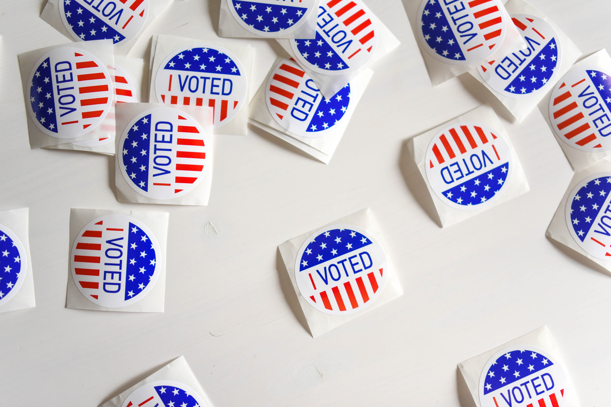
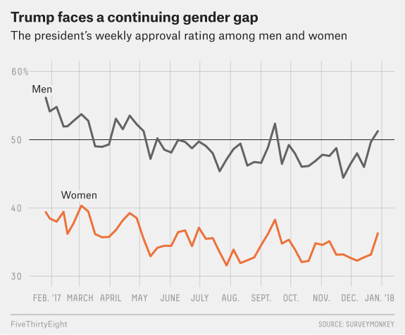
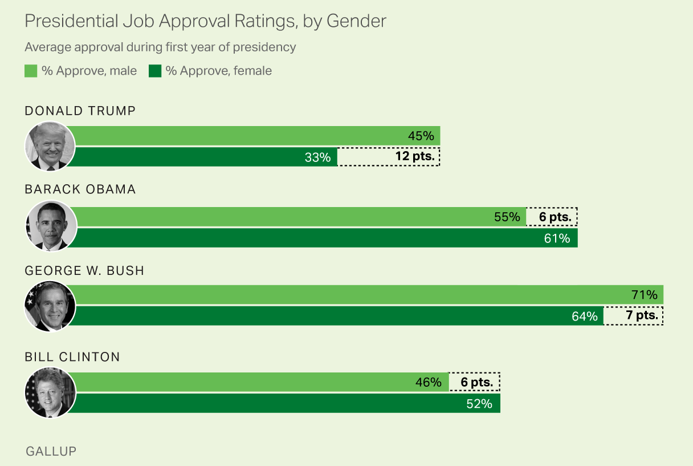

# {visibility="hidden"}

\def\bx{\mathbf{x}}
\def\bg{\mathbf{g}}
\def\bw{\mathbf{w}}
\def\bbeta{\boldsymbol \beta}
\def\bX{\mathbf{X}}
\def\by{\mathbf{y}}
\def\bH{\mathbf{H}}
\def\bI{\mathbf{I}}
\def\bS{\mathbf{S}}
\def\bW{\mathbf{W}}
\def\T{\text{T}}
\def\cov{\mathrm{Cov}}
\def\cor{\mathrm{Corr}}
\def\var{\mathrm{Var}}
\def\E{\mathrm{E}}
\def\bmu{\boldsymbol \mu}
\DeclareMathOperator*{\argmin}{arg\,min}
\def\Trace{\text{Trace}}


```{r}
#| label: pkg
#| include: false
#| eval: true
#| message: false
library(openintro)
library(knitr)
library(kableExtra)
options(digits = 3)
set.seed(1234)
```

```{r, echo=FALSE, message=FALSE, warning=FALSE}
knitr::opts_knit$set(global.par = TRUE)
# options(reindent.spaces = 4)
```

<!-- begin: webr fodder -->



<!-- end: webr fodder -->


<!-- # [Hypothesis Testing]{.orange}{background-image="https://upload.wikimedia.org/wikipedia/commons/4/42/William_Sealy_Gosset.jpg" background-size="cover" background-position="50% 50%" background-color="#447099"} -->

# Inference for Categorical Data

- ### Inference for a Single Proportion
- ### Difference of Two Proportions
- ### Test for Goodness of Fit
- ### Test of Independence


# Categorical Variable, Count and Proportion

## One Categorical Variable with Two Categories

- A categorical variable **Gender** having 2 categories Male and Female.

:::: columns

::: {.column width="50%"}

::: center

<!-- | Subject     | Male | Female | -->
<!-- |:--------:|:--------:|:--------:| -->
<!-- | 1 | x |   |   -->
<!-- | 2 |   | x | -->
<!-- | $\vdots$  | $\vdots$ | $\vdots$  | -->
<!-- | $n$ | x |   | -->

| Subject     | Gender |
|:--------:|:--------:|
| 1 | Male | 
| 2 | Female  | 
| $\vdots$  | $\vdots$ | 
| $n$ | Female | 


:::

<br>

::: center

**One-way frequency/count table**

| $X$     | Count |
|:--------:|:--------:|
| Male   | $y$    |  
| Female | $n-y$ |

:::

:::


::: {.column width="50%"}

```{r, echo=FALSE, out.width="100%"}

```

- The sample male proportion is $y/n$. 

- Goal: **estimate or test gender ratio or the male population proportion**

:::

::::


## Probability Distribution for Count Data: Two Levels

- The number of Male can be viewed as a random variable because the *count $y$ varies from sample to sample*.

::: question
What probability distribution might be appropriate for the count $Y$?
:::

. . .

- $binomial(n, \pi)$ could be a good option for the count data with 2 categories.

  + Fixed number of trials. <span style="color:blue"> (Fixed $n$ subjects) </span>
  
  + Each trial results in one of two outcomes. <span style="color:blue"> (Either $M$ or $F$) </span>
  
  + Trials are independent. <span style="color:blue"> (If sample subjects randomly) </span>
  
. . .

- If the proportion of being in category $M$ is $\pi$, the count $Y$ has $$P(Y = y \mid n, \pi) = \frac{n!}{y!(n-y)!}\pi^{y}(1-\pi)^{n-y}$$

- Our job is to do inference about $\pi$.

<!-- - We'd like to do inference about the president's approval rate (single proportion) or whether male and female's president's approval proportions are different (2 proportions). -->


::: notes

- or in general the count $(Y_M, Y_F)$ has the probability function
$$P(Y_M = y, Y_F = n-y \mid n, \pi) = \frac{n!}{y!(n-y)!}\pi^{y}(1-\pi)^{n-y}$$
- One of our goals in categorical data analysis is to **estimate or test population proportions of categories**, here $M$ and $F$, or $(\pi, 1-\pi)$.

:::


# [Inference for a Single Proportion]{.orange}{background-image="./images/16-infer-cat/karl_pearson.jpg" background-size="cover" background-position="50% 50%" background-color="#447099"}


## Inference About a Single Population Proportion

<!-- - We start with a binomial distribution with $\pi = P(\text{success})$. -->
- **Example: Exit Poll** Suppose we collected data on 1,000 voters in an election with only two candidates: **R** and **D**.

:::: columns

::: {.column width="70%"}

::: center

|Voter | R | D |
|:-----:|:-----:|:-----:|
|1  | x |   |
|2  |   |  x |
| $\vdots$  | $\vdots$ | $\vdots$  |
|1000| x |   |

:::

:::


::: {.column width="30%"}

```{r}

```

:::

::::

<br>

- Based on the data, we want to predict who won the election.


## Poll Example Cont'd

:::: columns

::: {.column width="50%"}

- Let $Y$ be the number of voters voted for **R**.

- Assume $Y \sim binomial(n = 1000, \pi)$.

- $\pi = P(\text{a voter voted for R}) =$ population proportion of all voters voted for R: A **unknown** parameter to be estimated or tested.

- Predict whether or not **R won the election**.

:::


::: {.column width="50%"}

::: center

|Voter | R | D |
|:-----:|:-----:|:-----:|
|1  | x |   |
|2  |   |  x |
| $\vdots$  | $\vdots$ | $\vdots$  |
|1000| x |   |

| Candidate | Count | Proportion
|:--------:|:--------:|:--------:|
| R   | $y$    | $\hat{\pi} = y/n$  
| D   | $n-y$ | $1-\hat{\pi} = 1- \frac{y}{n}$  

:::

:::

::::

::: question
What are $H_0$ and $H_1$?
:::

. . .

- <span style="color:blue"> $\begin{align} &H_0: \pi \le 1/2 \\ &H_1: \pi > 1/2 \text{ (more than half voted for R)} \end{align}$ </span>

<!-- - If we reject $H_0$ in favor of $H_1$ at $\alpha = 0.05$, this would mean that we predict that **R won the election**, but with $P(\text{False Discovery}) = 0.05$. -->


## Hypothesis Testing for $\pi$

- Step 0: Assumptions
  +  <span style="color:blue"> $n\pi_0 \ge 5$ and $n(1-\pi_0) \ge 5$ (the larger, the better) </span>

- Step 1: Null and Alternative Hypothesis
  + <span style="color:blue"> $\begin{align} &H_0: \pi = \pi_0 \\ &H_1: \pi > \pi_0 \text{ or } \pi < \pi_0 \text{ or } \pi \ne \pi_0 \end{align}$ </span>


- Step 2: Set $\alpha$

  <!-- + $\alpha = P(\text{Reject } H_0 \mid H_0 \text{ is true})$ -->
  
  
- Step 3: Test Statistic
  +  <span style="color:blue"> Under $H_0$, $z_{test} = \dfrac{\hat{\pi} - \pi_0}{\sqrt{\frac{\pi_0(1-\pi_0)}{n}}}$  where $\hat{\pi} = \frac{y}{n} =$ sample proportion </span>

. . .

::: alert
The sampling distribution of $\hat{\pi}$ is approximately normal with mean $\pi$ and standard error $\sqrt{\frac{\pi(1-\pi)}{n}}$ if $y_i$ are independent and the assumptions are satisfied.
:::

::: notes
<!-- .question[ -->
<!-- Why the test statistic is a $z$ (standard normal) statistic? -->
<!-- ] -->
:::


## Hypothesis Testing for $\pi$


- Step 4-c: Critical Value $z_{\alpha}$ (one-tailed) or $z_{\alpha/2}$ (two-tailed)

- Step 5-c: Draw a Conclusion Using Critical Value Method
  <!-- + <span style="color:blue">  Reject $H_0$ in favor of $H_1$ if </span> -->
    - <span style="color:blue"> $H_1: \pi > \pi_0$: Reject $H_0$ in favor of $H_1$ if $z > z_{\alpha}$ </span>
    - <span style="color:blue"> $H_1: \pi < \pi_0$: Reject $H_0$ in favor of $H_1$ if $z < -z_{\alpha}$ </span>
    - <span style="color:blue"> $H_1: \pi \ne \pi_0$: Reject $H_0$ in favor of $H_1$ if $|z| > z_{\alpha/2}$ </span>

- Step 6: Restate the Conclusion in Nontechnical Terms, and Address the Original Claim


## Poll Example Cont'd (Hypothesis Testing)

- In an exit poll of 1,000 voters, 520 voted for **R**, one of the two candidates.

- Step 0:<span style="color:blue"> $n\pi_0 = 1000(1/2) = 500 \ge 5$ and $n(1-\pi_0) \ge 5$ </span>

- Step 1: <span style="color:blue"> $\begin{align} &H_0: \pi \le 1/2 \\ &H_1: \pi > 1/2 \end{align}$ </span>

- Step 2: <span style="color:blue"> $\alpha = 0.05$ </span>

- Step 3: <span style="color:blue"> $z_{test} = \frac{\hat{\pi} - \pi_0}{\sqrt{\frac{\pi_0(1-\pi_0)}{n}}} =  \frac{\frac{520}{1000} - 0.5}{\sqrt{\frac{0.5(1-0.5)}{1000}}} = 1.26$ </span>

. . .

- Step 4: <span style="color:blue"> $z_{\alpha} = z_{0.05} = 1.645$ </span>

- Step 5: <span style="color:blue">  Reject $H_0$ in favor of $H_1$ if $z_{test} > z_{\alpha}$. Since $z_{test} < z_{\alpha}$, we do not reject $H_0$.  </span>

- Step 6: <span style="color:blue">  We do not have sufficient evidence to conclude that R won.  </span>

- We make the same conclusion based on $p$-value. 

$$ p\text{-value} = P(Z > 1.26) = 0.1 > 0.05$$

::: notes
Is there a sufficient evidence to conclude at $\alpha = 0.05$ that R won the election?
:::


## Confidence Interval for $\pi$

- Assumptions:  $n\hat{\pi} \ge 5$ and $n(1-\hat{\pi}) \ge 5$

- A $100(1 - \alpha)\%$ confidence interval for $\pi$ is
$$\hat{\pi} \pm z_{\alpha/2}\sqrt{\frac{\pi(1-\pi)}{n}}$$ where $\hat{\pi} = y/n$.

. . .

- $\pi$ is unknown and use the estimate $\hat{\pi}$ instead: $$\hat{\pi} \pm z_{\alpha/2}\sqrt{\frac{\hat{\pi}(1-\hat{\pi})}{n}}$$


::: alert
`r emo::ji('point_right')` No hypothesized value $\pi_0$ in the confidence interval.
:::


## Poll Example Cont'd  (Confidence Interval)

- Assumption: $n\hat{\pi} = 1000(0.52) = 520 \ge 5$ and $n(1-\hat{\pi}) = 480 \ge 5$.

- Estimate the proportion of all voters voted for **R** using 95% confidence interval:

$$\hat{\pi} \pm z_{\alpha/2}\sqrt{\frac{\hat{\pi}(1-\hat{\pi})}{n}} = 0.52 \pm z_{0.025}\sqrt{\frac{0.52(1-0.52)}{1000}} = (0.49, 0.55).$$

. . .

::: midi

```{r}
#| echo: true
#| code-line-numbers: false
# Use alternative = "two.sided" to get CI
prop.test(x = 520, n = 1000, p = 0.5, alternative = "greater", correct = FALSE)
```

:::


# [Difference of Two Proportions]{.orange}{background-image="./images/16-infer-cat/karl_pearson.jpg" background-size="cover" background-position="50% 50%" background-color="#447099"}


## Inference About Two Population Proportions

:::: columns

::: {.column width="50%"}
<br>

::: midi
| | Group 1  (M) | Group 2 (F)
|:-----:|:-----:|:-----:
| trials | $n_1$ | $n_2$
| number of successes | $Y_1$ | $Y_2$ 
| distribution | $binomial(n_1, \pi_1)$ | $binomial(n_2, \pi_2)$ 

- $\pi_1$: Population proportion of success of Group 1
- $\pi_2$: Population proportion of success of Group 2
:::

::: center

|Voter | Gender | Approve |
|:-----:|:-----:|:-----:|
|1  | M | Yes  |
|2  | F  |  Yes |
| $\vdots$  | $\vdots$ | $\vdots$  |
|1000| F | No  |

:::


:::

::: {.column width="50%"}

- Is male's president approval rate $\pi_1$ higher than the female's approval rate $\pi_2$?

```{r, echo=FALSE, out.width="90%"}

```

:::

::::


::: notes
- Comparing two population proportions $\pi_1$ and $\pi_2$.
:::


## Hypothesis Testing for $\pi_1$ and $\pi_2$

- Step 0: Assumptions
  +  <span style="color:blue"> $n_1\hat{\pi}_1 \ge 5$, $n_1(1-\hat{\pi}_1) \ge 5$ and $n_2\hat{\pi}_2 \ge 5$, $n_2(1-\hat{\pi}_2) \ge 5$ </span>
  
- Step 1: Null and Alternative Hypothesis
  + <span style="color:blue"> $\begin{align}  &H_0: \pi_1 = \pi_2 \\ &H_1: \pi_1 > \pi_2 \text{ or } \pi_1 < \pi_2 \text{ or } \pi_1 \ne \pi_2 \end{align}$ </span>

- Step 2: Set $\alpha$

- Step 3: Test Statistic
  +  <span style="color:blue"> $z_{test} = \dfrac{\hat{\pi}_1 - \hat{\pi}_2}{\sqrt{\bar{\pi}(1-\bar{\pi})(\frac{1}{n_1} + \frac{1}{n_2}})}$, $\bar{\pi} = \frac{y_1+y_2}{n_1+n_2}$ is the **pooled** sample proportion estimating $\pi$ </span>
  

::: notes

$z_{test} = \dfrac{\hat{\pi}_1 - \hat{\pi}_2}{\sqrt{\frac{\bar{\pi}(1-\bar{\pi})}{n_1} + \frac{\bar{\pi}(1-\bar{\pi})}{n_2}}} = \dfrac{\hat{\pi}_1 - \hat{\pi}_2}{\sqrt{\bar{\pi}(1-\bar{\pi})(\frac{1}{n_1} + \frac{1}{n_2}})}$, $\bar{\pi} = \frac{y_1+y_2}{n_1+n_2}$ is the pooled sample proportion that is an estimate of $\pi$

:::


## Hypothesis Testing for $\pi_1$ and $\pi_2$

- Step 4-c: Find the Critical Value $z_{\alpha}$ (one-tailed) or $z_{\alpha/2}$ (two-tailed)

- Step 5-c: Draw a Conclusion Using Critical Value Method
  + <span style="color:blue">  Reject $H_0$ in favor of $H_1$ if </span>
    - <span style="color:blue"> $H_1: \pi_1 > \pi_2$: Reject $H_0$ in favor of $H_1$ if $z > z_{\alpha}$ </span>
    - <span style="color:blue"> $H_1: \pi_1 < \pi_2$: Reject $H_0$ in favor of $H_1$ if $z < -z_{\alpha}$ </span>
    - <span style="color:blue"> $H_1: \pi_1 \ne \pi_2$: Reject $H_0$ in favor of $H_1$ if $|z| > z_{\alpha/2}$ </span>
    
- Step 6: Restate the Conclusion in Nontechnical Terms, and Address the Original Claim


## Example: Effectiveness of Learning

:::: columns

::: {.column width="70%"}

A study on 300 students to compare the effectiveness of learning Statistics via online and in-person classes.

- Randomly assign
  + 125 students to the online program
  + the remaining 175 to the in-person program.

:::


::: {.column width="30%"}

```{r}

```

:::

::::

|Exam Results | Online Instruction | In-Person Instruction |
|:-----:|:-----:|:-----:|
|Pass  | 94   | 113 |
|Fail  | 31   | 62  |
|Total | 125  | 175 |

- Is there sufficient evidence to conclude that the online program is more effective than the traditional in-person program at $\alpha=0.05$?


## Example: Effectiveness of Learning Cont'd (Testing)

- Step 1: <span style="color:blue"> $H_0: \pi_1 = \pi_2$ vs. $H_1: \pi_1 > \pi_2$ </span>  
$\pi_1$ $(\pi_2)$ is the population proportion of students passing the exam under the online (in-person) program.

. . .

- Step 0:<span style="color:blue"> $\hat{\pi}_1 = 94/125 = 0.75$ and $\hat{\pi}_2 = 113/175 = 0.65$.  
$n_1\hat{\pi}_1 = 94 > 5$, $n_1(1-\hat{\pi}_1) = 31 > 5$, and $n_2\hat{\pi}_2 = 113 > 5$, $n_2(1-\hat{\pi}_2) = 62 > 5$ </span>

. . .

- Step 2: <span style="color:blue"> $\alpha = 0.05$ </span>

. . .

- Step 3: <span style="color:blue"> $\bar{\pi} = \frac{94+113}{125+175} = 0.69$. $z_{test} = \dfrac{\hat{\pi}_1 - \hat{\pi}_2}{\sqrt{\bar{\pi}(1-\bar{\pi})(\frac{1}{n_1} + \frac{1}{n_2}})} = \frac{0.75 - 0.65}{\sqrt{0.69(1-0.69)(\frac{1}{125} + \frac{1}{175})}} = 1.96$ </span>

. . .

- Step 4: <span style="color:blue"> $z_{\alpha} = z_{0.05} = 1.645$ </span>

. . .

- Step 5: <span style="color:blue">  Reject $H_0$ in favor of $H_1$ if $z_{test} > z_{\alpha}$. Since $z_{test} > z_{\alpha}$, we reject $H_0$.  </span>

. . .

- Step 6: <span style="color:blue">  We have sufficient evidence to conclude that the online program is more effective. </span>

## Confidence Interval for $\pi_1 - \pi_2$ 

- A $100(1 - \alpha)\%$ confidence interval for $\pi_1 - \pi_2$ is 

$$\hat{\pi}_1 - \hat{\pi}_2 \pm z_{\alpha/2}\sqrt{\frac{\hat{\pi}_1(1-\hat{\pi}_1)}{n_1}+\frac{\hat{\pi}_2(1-\hat{\pi}_2)}{n_2}}$$

- Requirements: $n_1\hat{\pi}_1 \ge 5$, $n_1(1-\hat{\pi}_1) \ge 5$ and $n_2\hat{\pi}_2 \ge 5$, $n_2(1-\hat{\pi}_2) \ge 5$


## Example: Effectiveness of Learning Cont'd (CI)

- Want to know how much effective is the online program. 

- Estimate $\pi_1 - \pi_2$ using a $95\%$ confidence interval:

$$\hat{\pi}_1 - \hat{\pi}_2 \pm z_{\alpha/2}\sqrt{\frac{\hat{\pi}_1(1-\hat{\pi}_1)}{n_1}+\frac{\hat{\pi}_2(1-\hat{\pi}_2)}{n_2}}$$

- $z_{0.05/2} = 1.96$

- The 95% confidence interval is

$$0.75 - 0.65 \pm 1.96\sqrt{\frac{(0.75)(1-0.75)}{125} + \frac{(0.65)(1-0.65)}{175}}\\
 = (0.002, 0.210)$$


## Implementation in R

::: midi

```{r}
#| echo: true
#| code-line-numbers: false
#| class-output: my_class500
# Use alternative = "two.sided" to get CI
prop.test(x = c(94, 113), n = c(125, 175), alternative = "greater", correct = FALSE)
```


```{r}
#| echo: true
#| code-line-numbers: false
prop_ci <- prop.test(x = c(94, 113), n = c(125, 175), alternative = "two.sided", correct = FALSE)
prop_ci$conf.int
```

:::


# [Test for Goodness of Fit]{.orange}{background-image="./images/16-infer-cat/karl_pearson.jpg" background-size="cover" background-position="50% 50%" background-color="#447099"}


## Categorical Variable with More Than 2 Categories

:::: columns

::: {.column width="50%"}

- A categorical variable has $k$ categories $A_1, \dots, A_k$.

::: center

<!-- | Subject     | $A_1$ | $A_2$ | $\cdots$ | $\cdots$ | $A_k$|   -->
<!-- |:--------:|:--------:|:--------:|:--------:|:--------:|:--------:| -->
<!-- | 1 | x |   |  |  |   | -->
<!-- | 2 |   | x |  |  |   |  -->
<!-- | 3 |   |  |   |  |  x | -->
<!-- | $\vdots$  |  |   |  |  |   | -->
<!-- | $n$ |   |   |  | x |  | -->


| Subject  | Variable|  
|:--------:|:--------:|
| 1 | $A_2$ |
| 2 | $A_4$  |
| 3 |  $A_1$ |
| 4 |  $A_3$ |
| 5 |  $A_k$ |
| $\vdots$  | $\vdots$ |
| $n$ | $A_3$ |


:::

:::


::: {.column width="50%"}

- With the size $n$, for categories $A_1, \dots , A_k$, their observed count is $O_1, \dots, O_k$, and $\sum_{i=1}^kO_i = n$.

- One-way count table:

::: center

| $A_1$  | $A_2$ | $\cdots$ | $A_k$ | Total |
|:-----:|:-----:|:-----:|:-----:|:-----:|
| $O_1$ | $O_2$   |  $\cdots$ |  $O_k$  | $n$ | 

:::


:::

::::


## Example: More Than 2 Categories

:::: columns

::: {.column width="50%"}

*Are the selected jurors are racially representative of the population?*

- **Idea**: If the jury is representative of the population, the proportions in the sample should reflect the population of eligible jurors, i.e., registered
voters.

:::

::: {.column width="50%"}

```{r}

```

:::

::::

|  | White  | Black | Hispanic | Asian | Total |
|:-----:|:-----:|:-----:|:-----:|:-----:|:-----:|
| Representation in juries | $O_1 = 205$ | $O_2 = 26$   |  $O_3 = 25$ |  $O_4 = 19$  | $n = 275$ | 
| Registered voters | $\pi_1^0 = 0.72$ | $\pi_2^0 = 0.07$   |  $\pi_3^0 = 0.12$ |  $\pi_4^0 = 0.09$  | $1.00$ | 


## Example: More Than 2 Categories


|  | White  | Black | Hispanic | Asian | Total |
|:-----:|:-----:|:-----:|:-----:|:-----:|:-----:|
| Representation in juries | $O_1 = 205$ | $O_2 = 26$   |  $O_3 = 25$ |  $O_4 = 19$  | $n = 275$ | 
| Registered voters | $\pi_1^0 = 0.72$ | $\pi_2^0 = 0.07$   |  $\pi_3^0 = 0.12$ |  $\pi_4^0 = 0.09$  | $1.00$ |


::: {.fragment}

|  | White  | Black | Hispanic | Asian | Total |
|:-----:|:-----:|:-----:|:-----:|:-----:|:-----:|
| Representation in juries | $O_1/n = 0.75$ | $O_2/n = 0.09$   |  $O_3/n = 0.09$ |  $O_4/n = 0.07$  | $1.00$ | 
| Registered voters | $\pi_1^0 = 0.72$ | $\pi_2^0 = 0.07$   |  $\pi_3^0 = 0.12$ |  $\pi_4^0 = 0.09$  | $1.00$ |

:::


<!-- ::: {.fragment} -->

<!-- |  | White  | Black | Hispanic | Asian | Total | -->
<!-- |:-----:|:-----:|:-----:|:-----:|:-----:| -->
<!-- | Representation in juries | $O_1 = 205$ | $O_2 = 26$   |  $O_3 = 25$ |  $O_4 = 19$  | $n = 275$ |  -->
<!-- | Hypothesized expected number | $275*\pi_1 = 198$ | $275*\pi_2 = 19.25$  | $275*\pi_3 = 33$ | $275*\pi_4 = 24.75$ | $n=275$ |  -->

<!-- ::: -->
<!-- **198** | **19.25**   |  **33** | **24.75** | 275 | -->

<!-- | Population Proportion | **0.72** | **0.07** |  **0.12** |  **0.09**  | 1.00 |  -->

<!-- |  | White  | Black | Hispanic | Asian | Total | -->
<!-- |:-----:|:-----:|:-----:|:-----:|:-----:| -->
<!-- | Representation in juries | 0.75 | 0.09   |  0.09 | 0.07  | 1.00 |  -->
<!-- | Registered voters | 0.72 | 0.07   |  0.12 |  0.09  | 1.00 |  -->


::: notes

While the proportions in the juries do not precisely represent the population proportions, it is unclear whether these data provide convincing evidence that the sample is not representative. If the jurors really were randomly sampled from the registered voters, we might expect small differences due to chance. However, unusually large differences may provide convincing evidence that the juries were not representative.

:::

## Example: More Than 2 Categories


|  | White  | Black | Hispanic | Asian | Total |
|:-----:|:-----:|:-----:|:-----:|:-----:|:-----:|
| Representation in juries | $O_1 = 205$ | $O_2 = 26$   |  $O_3 = 25$ |  $O_4 = 19$  | $n = 275$ | 
| Registered voters | $\pi_1^0 = 0.72$ | $\pi_2^0 = 0.07$   |  $\pi_3^0 = 0.12$ |  $\pi_4^0 = 0.09$  | $1.00$ |


::: question

If the individuals are randomly selected to serve on a jury, about how many of the 275 people would we expect to be white? How about Hispanic?

:::


. . .

- About $72\%$ of the population is white, so we would expect about $72\%$ of the jurors to be white: $0.72 \times 275 = 198$.

<!-- - We expect about $12\%$ of the jurors to be Hispanic, which corresponds to about $0.12 \times 275 = 33$ Hispanic jurors. -->


::: {.fragment}

|  | White  | Black | Hispanic | Asian | Total |
|:--------:|:-----:|:-----:|:-----:|:-----:|
| Representation in juries | $O_1 = 205$ | $O_2 = 26$   |  $O_3 = 25$ |  $O_4 = 19$  | $n = 275$ | 
| Hypothesized expected number | $275 \times \pi_1^0 = 198$ | $275 \times \pi_2^0 = 19.25$  | $275 \times \pi_3^0 = 33$ | $275 \times \pi_4^0 = 24.75$ | $n=275$ | 

:::
<!-- **198** | **19.25**   |  **33** | **24.75** | 275 | -->

<!-- | Population Proportion | **0.72** | **0.07** |  **0.12** |  **0.09**  | 1.00 |  -->

<!-- |  | White  | Black | Hispanic | Asian | Total | -->
<!-- |:-----:|:-----:|:-----:|:-----:|:-----:| -->
<!-- | Representation in juries | 0.75 | 0.09   |  0.09 | 0.07  | 1.00 |  -->
<!-- | Registered voters | 0.72 | 0.07   |  0.12 |  0.09  | 1.00 |  -->


## Goodness-of-Fit Test

::: question
Are the proportions (counts) of juries *close enough* to the proportions (counts) of registered voters, so that we are confident saying that the jurors really were *randomly sampled* from the registered voters?
:::

- A **goodness-of-fit test** tests the hypothesis that the observed frequency distribution fits or conforms to some claim distribution.

<!-- ::: question -->

<!-- In the jury example, what is our observed frequency distribution, and what is our claim distribution? -->

<!-- ::: -->


|  | White  | Black | Hispanic | Asian | Total |
|:-----:|:-----:|:-----:|:-----:|:-----:|:-----:|
| Observed Count | $O_1 = 205$ | $O_2 = 26$   |  $O_3 = 25$ |  $O_4 = 19$  | $n = 275$ | 
| Expected Count | $E_1 = 198$ | $E_2 = 19.25$   |  $E_3 = 33$ |  $E_4 = 24.75$  | $n = 275$ |
| Proportion under $H_0$ | $\pi_1^0 = 0.72$ | $\pi_2^0 = 0.07$ |  $\pi_3^0 = 0.12$ |  $\pi_4^0 = 0.09$  | $1.00$ | 

::: notes

|  | White  | Black | Hispanic | Asian | Total |
|:-----:|:-----:|:-----:|:-----:|:-----:|
| **Observed** Count | 205 | 26   |  25 |  19  | 275 | 
| **Expected** Count | **198** | **19.25**   |  **33** | **24.75** | 275 | 
| Population Proportion | **0.72** | **0.07** |  **0.12** |  **0.09**  | 1.00 | 

  + Given a sample of cases that can be classified into several (more than 2) groups, determine if the sample is representative of the general population.
  + Evaluate whether data resemble a particular distribution.
- The sample proportion represented from each race among the 275 jurors was not a precise match for any ethnic group. While some sampling variation is expected, we would expect the sample proportions to be fairly similar to the population proportions if there is no bias on juries.
- We need to test whether the differences are strong enough to provide convincing evidence that the jurors are not a random sample.

:::


## Goodness-of-Fit Test

|  | White  | Black | Hispanic | Asian | Total |
|:-------------:|:-----:|:-----:|:-----:|:-----:|:-----:|
| **Observed** Count | 205 | 26   |  25 |  19  | 275 | 
| **Expected** Count | **198** | **19.25**   |  **33** | **24.75** | 275 | 
| Population Proportion $(H_0)$ | **0.72** | **0.07** |  **0.12** |  **0.09**  | 1.00 |  

<!-- - The sample proportions are similar to the population ones if no bias on juries. -->
- **Observed** Count and **Expected** Count are similar if no bias on juries.

- Test whether the differences are strong enough to provide convincing evidence that the jurors are not a random sample of registered voters.

<span style="color:blue"> $\begin{align} &H_0: \text{No racial bias in who serves on a jury, and } \\ &H_1: \text{There is racial bias in juror selection} \end{align}$ </span>
  
. . .

<span style="color:blue"> $\begin{align} &H_0: \pi_1 = \pi_1^0,  \pi_2 = \pi_2^0, \dots, \pi_k = \pi_k^0\\ &H_1: \pi_i \ne \pi_i^0 \text{ for some } i \end{align}$ </span>


::: notes

- While some sampling variation is expected, we would expect the sample proportions to be similar to the population proportions if there is no bias on juries.

- We need to test whether the differences are strong enough to provide convincing evidence that the jurors are not a random sample of registered voters.

- $\quad\text{the observed counts reflect natural sampling fluctuation.}$

:::


## Goodness-of-Fit Test Statistic

|  | White  | Black | Hispanic | Asian | Total |
|:-----:|:-----:|:-----:|:-----:|:-----:|:-----:|
| Observed Count | $O_1 = 205$ | $O_2 = 26$   |  $O_3 = 25$ |  $O_4 = 19$  | $n = 275$ | 
| Expected Count | $E_1 = 198$ | $E_2 = 19.25$   |  $E_3 = 33$ |  $E_4 = 24.75$  | $n = 275$ |
| Proportion under $H_0$ | $\pi_1^0 = 0.72$ | $\pi_2^0 = 0.07$ |  $\pi_3^0 = 0.12$ |  $\pi_4^0 = 0.09$  | $1.00$ | 


- <span style="color:blue">  Under $H_0$, $\chi^2_{test} = \frac{(O_1 - E_1)^2}{E_1} + \frac{(O_2 - E_2)^2}{E_2} + \cdots + \frac{(O_k - E_k)^2}{E_k}$, $E_i = n\pi_i^0, i = 1, \dots, k$ </span>

- Reject $H_0$ if <span style="color:blue"> $\chi^2_{test} > \chi^2_{\alpha, df}$, $df = k-1$ </span>

- Require each $E_i \ge 5$, $i = 1, \dots, k$.


::: notes

- $\chi^2_{test}$ summarizes how strongly the observed counts tend to deviate from the expected counts or null counts.
- 4720: In the textbook, $E_i \ge 1$ and no more than $20\%$ of the $E_i$s are less than 5. 

:::

## Goodness-of-Fit Test Example

|  | White  | Black | Hispanic | Asian | Total |
|:-----:|:-----:|:-----:|:-----:|:-----:|:-----:|
| Observed Count | $O_1 = 205$ | $O_2 = 26$   |  $O_3 = 25$ |  $O_4 = 19$  | $n = 275$ | 
| Expected Count | $E_1 = 198$ | $E_2 = 19.25$   |  $E_3 = 33$ |  $E_4 = 24.75$  | $n = 275$ |
| Proportion under $H_0$ | $\pi_1^0 = 0.72$ | $\pi_2^0 = 0.07$ |  $\pi_3^0 = 0.12$ |  $\pi_4^0 = 0.09$  | $1.00$ | 

- Under $H_0$, $\chi^2_{test} = \frac{(205 - 198)^2}{198} + \frac{(26 - 19.25)^2}{19.25} + \frac{(25 - 33)^2}{33} + \frac{(19 - 24.75)^2}{24.75} = 5.89$

- $\chi^2_{0.05, 3} = 7.81$.

- Do not reject $H_0$ in favor of $H_1$. 

- The data do not provide convincing evidence of racial bias in the juror selection.


## Goodness-of-Fit Test in R

```{r}
#| echo: true
#| code-line-numbers: false
obs <- c(205, 26, 25, 19)
pi_0 <- c(0.72, 0.07, 0.12, 0.09)

## Use chisq.test() function
chisq.test(x = obs, p = pi_0)
```


::: notes

```{r}
goodness_test <- chisq.test(x=obs, p=pi_0)
goodness_test$expected
goodness_test$statistic
goodness_test$p.value
```

:::


# [Test of Independence]{.orange}{background-image="./images/16-infer-cat/karl_pearson.jpg" background-size="cover" background-position="50% 50%" background-color="#447099"}

## Test of Independence (Contingency Table)

- Have TWO categorical variables, and want to test **whether or not the two variables are independent**.

. . .


:::: columns

<span style="color:blue"> Does the "Opinion on President's Job Performance" depends on "Gender"?  </span>


::: {.column width="55%"}

- **Job performance**: approve, disapprove, no opinion

- **Gender**: male, female

::: midi
|Voter | Gender | Performance |
|:-----:|:-----:|:-----:|
|1  | M | approve  |
|2  | F  |  disapprove |
| $\vdots$  | $\vdots$ | $\vdots$  |
|n| F | disapprove  |
:::

|  | Approve  | Disapprove | No Opinion 
|:-----:|:-----:|:-----:|:-----:|
| **Male** | 18 | 22  |  10 |
| **Female** | 23 | 20 | 12 |

:::


::: {.column width="45%"}


```{r}

```

:::


::::


::: notes

When we consider a two-way table, we often would like to know, are these variables related in any way? That is, are they dependent (versus independent)?

:::


## Test of Independence: Expected Count

- Compute the *expected* count of each cell in the two-way table under the condition that the *two variables __were independent__* with each other.


|  | Approve  | Disapprove | No Opinion | Total | 
|:-----:|:-----:|:-----:|:-----:|:-----:|
| **Male** | 18 (19.52) | 22 (20)  |  10 (10.48) | 50 |
| **Female** | 23 (21.48) | 20 (22) | 12  (11.52)| 55 |
| **Total** | 41 | 42 | 22 | 105 |


. . .

- The expected count for the $i$th row and $j$th column:

$$\text{Expected Count}_{\text{row i; col j}} = \frac{\text{(row i total}) \times (\text{col j total})}{\text{table total}}$$


::: notes

- As test of goodness-of-fit, we want to compute the expected count of each cell in the two-way table under the condition that the two variables were independent with each other.

:::


## Test of Independence Procedure

- Require every $E_{ij} \ge 5$ in the contingency table. 

- <span style="color:blue"> $\begin{align} &H_0: \text{Two variables are independent }\\ &H_1: \text{The two are dependent (associated) } \end{align}$</span>

- $\chi^2_{test} = \sum_{i=1}^r\sum_{j=1}^c\frac{(O_{ij} - E_{ij})^2}{E_{ij}}$, where $r$ is the number of rows and $c$ is the number of columns in the table.

- Reject $H_0$ if $\chi^2_{test} > \chi^2_{\alpha, \, df}$, $df = (r-1)(c-1)$.


::: notes

In the 4720 textbook, every $E_{ij} \ge 1$ and no more than $20\%$ of the $E_{ij}$s less than 5. 

:::


## Test of Independence Example

|  | Approve  | Disapprove | No Opinion | Total | 
|:-----:|:-----:|:-----:|:-----:|:-----:|
| **Male** | 18 (19.52) | 22 (20)  |  10 (10.48) | 50 |
| **Female** | 23 (21.48) | 20 (22) | 12  (11.52)| 55 |
| **Total** | 41 | 42 | 22 | 105 |


- <span style="color:blue"> $\begin{align} &H_0: \text{ Opinion does not depend on gender } \\ &H_1: \text{ Opinion and gender are dependent } \end{align}$</span>

- $\small \chi^2_{test} = \frac{(18 - 19.52)^2}{19.52} + \frac{(22 - 20)^2}{20} + \frac{(10 - 10.48)^2}{10.48} + \frac{(23 - 21.48)^2}{21.48} + \frac{(20 - 22)^2}{22} + \frac{(12 - 11.52)^2}{11.52}= 0.65$

- $\chi^2_{\alpha, df} =\chi^2_{0.05, (2-1)(3-1)} = 5.991$.

- Since $\chi_{test}^2 < \chi^2_{\alpha, df}$, we do not reject $H_0$. 

- We do not conclude that the Opinion on President's Job Performance depends on Gender.

## Test of Independence in R

```{r}
#| echo: !expr c(2:7)
#| code-line-numbers: false
## (4) Test of Independence ## Job Performance Example
(contingency_table <- matrix(c(18, 23, 22, 20, 10, 12), nrow = 2, ncol = 3))

## Using chisq.test() function
(indept_test <- chisq.test(contingency_table))

qchisq(0.05, df = (2 - 1) * (3 - 1), lower.tail = FALSE)  ## critical value

# indept_test$expected; indept_test$statistic; indept_test$p.value
```


## AI Education Research

- Help Marquette to offer AI-related courses, and better teaching using AI!

- <https://carrollu.qualtrics.com/jfe/form/SV_07bFl5NeSI8tIWO>


:::: columns

::: {.column width="50%"}

```{r}
#| out-width: 70%

```

:::


::: {.column width="50%"}

```{r}
#| out-width: 70%

```

:::


::::
