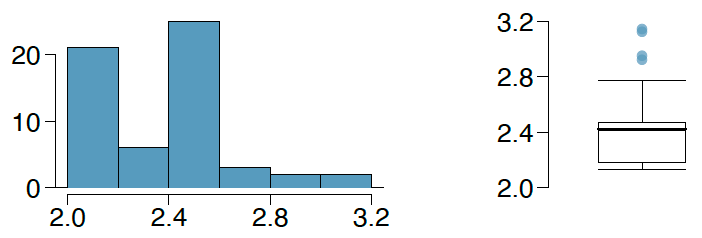
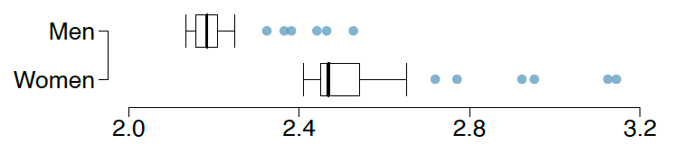

**Marathon winners.** The histogram and box plots below show the distribution of finishing times for male and female winners of the New York Marathon between 1970 and 1999

```{r}
#| echo: false
#| fig-align: center
#| out-width: 60%

```

(a) What features of the distribution are apparent in the histogram and not the box plot? What features are apparent in the box plot but not in the histogram?
(b) What may be the reason for the bimodal distribution? Explain.
(c) Compare the distribution of marathon times for men and women based on the box plot shown below. 

```{r}
#| echo: false
#| fig-align: center
#| out-width: 60%

```

<!-- <br> -->

<!-- **Answer:** -->

```{r}
#| include: false
# (a) From the histogram we can see the the distribution is bimodal. In the box plot the more
# extreme observations, many of which could be considered outliers, are easier to identify.
# (b) Gender may be the reason, it is likely that men and women have different average marathon
# times.
# (c) The median marathon time for men is about 2.2 hrs while it is about 2.5 hrs for women;
# therefore, men are faster on average. The minimum marathon time for men is about 2.1 hrs
# whereas it is about 2.4 hrs for women. The maximum marathon time for men is about 2.5 hrs
# for men whereas it is about 3.1 hrs for women. Both distributions have apparent outliers on
# the high end.
# (d) It appears that marathon times decreased greatly between 1970-1975 and remained somewhat
# steady thereafter. Males consistently had shorter marathon times than females throughout
# the years. From the box plots of males and females, we could tell that males ran faster \on
# average", however, we could not tell that the winning male time for each year was better than
# the winning female time. We also could not tell from the histogram or the box plot that
# marathon times have been decreasing for males and females throughout the years.
```
